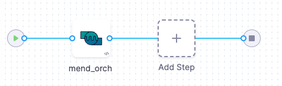

You can scan container images and repositories using [Mend](https://www.mend.io). 


## Before you begin

### Docker-in-Docker requirements

```mdx-code-block
import StoDinDRequirements from '/docs/security-testing-orchestration/sto-techref-category/shared/dind-bg-step.md';
```

<StoDinDRequirements />

### Root access requirements

```mdx-code-block
import StoRootRequirements from '/docs/security-testing-orchestration/sto-techref-category/shared/root-access-requirements.md';
```

<StoRootRequirements />

## Mend step configuration

The recommended workflow is add a Mend step to a Security Tests or CI Build stage and then configure it as described below. 

```mdx-code-block
import StoScannerStepNotes from './shared/step_palette/_sto-palette-notes.md';
```

<StoScannerStepNotes />

### Scan


<a name="scan-mode"></a>

#### Scan Mode

```mdx-code-block
import StoSettingScanMode from './shared/step_palette/_sto-ref-ui-scan-mode.md';
import StoSettingScanModeOrch from './shared/step_palette//_sto-ref-ui-scan-mode-00-orchestrated.md';
import StoSettingScanModeData from './shared/step_palette/_sto-ref-ui-scan-mode-01-dataload.md';
import StoSettingScanModeIngest from './shared/step_palette/_sto-ref-ui-scan-mode-02-ingestonly.md';
```

<StoSettingScanMode />
<StoSettingScanModeOrch />
<StoSettingScanModeData />
<StoSettingScanModeIngest />

#### Scan Configuration

```mdx-code-block
import StoSettingProductConfigName from './shared/step_palette/_sto-ref-ui-product-config-name.md';
```

<StoSettingProductConfigName />


### Target

<a name="target-type"></a>

#### Type

```mdx-code-block
import StoSettingScanType from './shared/step_palette/_sto-ref-ui-scan-type.md';
import StoSettingScanTypeRepo     from './shared/step_palette/_sto-ref-ui-scan-type-00-repo.md';
import StoSettingScanTypeCont     from './shared/step_palette/_sto-ref-ui-scan-type-01-container.md';

```
<a name="scan-type"></a>
<StoSettingScanType />
<StoSettingScanTypeRepo />
<StoSettingScanTypeCont />


#### Name 

```mdx-code-block
import StoSettingProductID from './shared/step_palette/_sto-ref-ui-prod-id.md';
```

<StoSettingProductID />

<a name="target-variant"></a>

#### Variant

```mdx-code-block
import StoSettingTargetVariant from './shared/step_palette/_sto-ref-ui-target-variant.md';
```

<StoSettingTargetVariant  />

#### Workspace (_repository_)

```mdx-code-block
import StoSettingTargetWorkspace from './shared/step_palette/_sto-ref-ui-target-workspace.md';
```

<StoSettingTargetWorkspace  />


### Ingestion File

```mdx-code-block
import StoSettingIngestionFile from './shared/step_palette/_sto-ref-ui-ingestion-file.md';
```

<StoSettingIngestionFile  />

### Authentication

<!-- ============================================================================= -->
<a name="auth-domain"></a>

#### Domain


```mdx-code-block
import StoSettingAuthDomain from './shared/step_palette/_sto-ref-ui-auth-domain.md';
```

<StoSettingAuthDomain />

<!-- ============================================================================= -->
<a name="auth-enforce-ssl"></a>

#### Enforce SSL

```mdx-code-block
import StoSettingProductSSL from './shared/step_palette/_sto-ref-ui-auth-ssl.md';
```

<StoSettingProductSSL />

<!-- ============================================================================= -->
<a name="auth-access-api-version"></a>

#### API Version

```mdx-code-block
import StoSettingApiVersion from './shared/step_palette/_sto-ref-ui-auth-api-version.md';
```

<StoSettingApiVersion />

<!-- ============================================================================= -->
<a name="auth-type"></a>

#### Type

```mdx-code-block
import StoSettingAuthType from './shared/step_palette/_sto-ref-ui-auth-type.md';
```

<StoSettingAuthType />

<!-- ============================================================================= -->

#### Access ID

The user key for your user account. Harness recommends that you use the API key for your Mend organization: in the Mend UI, click the **Account Settings** button in the top right.

You should create a Harness text secret with your encrypted token and reference the secret using the format `<+secrets.getValue("project.container-access-id")>`. For more information, go to [Add and Reference Text Secrets](/docs/platform/secrets/add-use-text-secrets).


<!-- ============================================================================= -->
<a name="auth-access-token"></a>

#### Access Token

The API key for your Mend organization. This step is required if you want to run a scan in an organization _other than_ the default organization for your user account. in the Mend UI, go to **Integration** > **Organization** > **API Key**.

You should create a Harness text secret with your encrypted token and reference the secret using the format `<+secrets.getValue("project.container-access-id")>`. For more information, go to [Add and Reference Text Secrets](/docs/platform/secrets/add-use-text-secrets).

### Scan Tool

<!-- ============================================================================= -->

#### Lookup Type

```mdx-code-block
import StoSettingToolLookupType from './shared/step_palette/_sto-ref-ui-tool-prod-lookup-type.md';
```
<StoSettingToolLookupType  />

#### Project Name

If you're running an orchestrated scan on a code repository, you can use this setting to specify the  specific files to exclude from the scan. By default, a Mend scan includes all files in the code repository. 

This setting corresponds to the [**excludes** configuration parameter](https://docs.mend.io/bundle/unified_agent/page/unified_agent_configuration_parameters.html#General) for the Mend United Agent. 


#### Include 

If you're running an orchestrated scan on a code repository, you can use this setting to specify the  specific files to include in the scan. By default, a Mend scan includes all files in the code repository. 

This setting corresponds to the [**Includes** configuration parameter](https://docs.mend.io/bundle/unified_agent/page/unified_agent_configuration_parameters.html#General) for the Mend United Agent. 

<!-- ============================================================================= -->
<a name="tool-exclude"></a>	

#### Exclude

```mdx-code-block
import StoSettingToolExclude from './shared/step_palette/_sto-ref-ui-tool-exclude.md';
```

<StoSettingToolExclude />

<!-- ============================================================================= -->


#### Project Version

```mdx-code-block
import StoSettingToolProjectVersion from './shared/step_palette/_sto-ref-ui-tool-project-version.md';
```

<a name="product-project-version"></a>
<StoSettingToolProjectVersion />


<!--   Log Level, CLI flags, and Fail on Severity ------------------------------------------------------------------------------------------------- -->


### Log Level, CLI flags, and Fail on Severity

<a name="log-level"></a>

#### Log Level

```mdx-code-block
import StoSettingLogLevel from './shared/step_palette/_sto-ref-ui-log-level.md';
```

<StoSettingLogLevel />


#### Fail on Severity

```mdx-code-block
import StoSettingFailOnSeverity from './shared/step_palette/_sto-ref-ui-fail-on-severity.md';
```
<StoSettingFailOnSeverity />

### Settings

You can add a `tool_args` setting to run the [Unified Agent binary](https://docs.paloaltonetworks.com/prisma/prisma-cloud/prisma-cloud-admin-compute/tools/twistcli_scan_images#) with specific command-line arguments. For example, you can exclude certain files from the scan like this:  `tool_args` = `-excludes **/*javadoc.jar`.


### Additional Configuration

In the **Additional Configuration** settings, you can use the following options:

* [Privileged](/docs/continuous-integration/use-ci/manage-dependencies/background-step-settings#privileged)
* [Image Pull Policy](/docs/continuous-integration/use-ci/manage-dependencies/background-step-settings#image-pull-policy)
* [Run as User](/docs/continuous-integration/use-ci/manage-dependencies/background-step-settings#run-as-user)
* [Set Container Resources](/docs/continuous-integration/use-ci/manage-dependencies/background-step-settings#set-container-resources)


### Advanced settings

In the **Advanced** settings, you can use the following options:

* [Conditional Execution](/docs/platform/pipelines/w_pipeline-steps-reference/step-skip-condition-settings/)
* [Failure Strategy](/docs/platform/pipelines/w_pipeline-steps-reference/step-failure-strategy-settings/)
* [Looping Strategy](/docs/platform/pipelines/looping-strategies-matrix-repeat-and-parallelism/)
* [Policy Enforcement](/docs/platform/governance/Policy-as-code/harness-governance-overview)

## Security step configuration (_deprecated_)

You can set up Mend scans using a Security step: create a CI Build or Security Tests stage, add a Security step, and then add the `setting:value` pairs as specified below.

#### Target and variant

```mdx-code-block
import StoLegacyTargetAndVariant  from './shared/legacy/_sto-ref-legacy-target-and-variant.md';
```

<StoLegacyTargetAndVariant />

#### Mend scan settings

* `product_name` = `whitesource`
* [`policy_type`](/docs/security-testing-orchestration/sto-techref-category/security-step-settings-reference#scanner-categories) = `ingestionOnly`, `dataLoad`, or `orchestratedScan`
* `scan_type` = `container`
* `product_domain` (*optional*) — The default is `https://saas.whitesourcesoftware.com/api`
* `product_access_id`
* `product_access_token`
* `product_include`
* `product_config_name` = `default`
* `product_lookup_type`(*optional*)
- Accepted value(s) when `policy_type` is set to `dataLoad`: 
  - `byName`
	- `byTokens`
- Accepted value(s) when `policy_type` is set to `orchestratedScan`: 
	- `appendToProductByToken`
	- `appendToProductByName`
* `fail_on_severity` - See [Fail on Severity](#fail-on-severity).
		
:::note
You must configure the following settings depending on the product lookup type  — i.e., whether you are using the names or tokens to reference the Mend product:
:::

* `product_product_name`
* `product_project_name`
* `product_project_token`
* `product_project_token`

#### Container scan settings

```mdx-code-block
import StoLegacyContainer from './shared/legacy/_sto-ref-legacy-container.md';
```

<StoLegacyContainer />

#### Ingestion file

```mdx-code-block
import StoLegacyIngest from './shared/legacy/_sto-ref-legacy-ingest.md';
```

<StoLegacyIngest />

## Mend orchestration pipeline example

The following pipeline shows an end-to-end orchestration workflow. The Mend step includes the settings needed to run an orchestrated scan: `access_token`, `domain`, `access_id`, and `product_name`.



```yaml
pipeline:
  projectIdentifier: STO
  orgIdentifier: default
  tags: {}
  properties:
    ci:
      codebase:
        connectorRef: secrets_repo
        build: <+input>
  stages:
    - stage:
        name: mend
        identifier: mend
        type: SecurityTests
        spec:
          cloneCodebase: true
          infrastructure:
            type: KubernetesDirect
            spec:
              connectorRef: myorgdelegate
              namespace: harness-delegate-ng
              automountServiceAccountToken: true
              nodeSelector: {}
              os: Linux
          execution:
            steps:
              - step:
                  type: Mend
                  name: mend_orch
                  identifier: mend_orch
                  spec:
                    mode: orchestration
                    config: default
                    target:
                      name: secrets
                      type: repository
                      variant: master
                    advanced:
                      log:
                        level: debug
                    resources:
                      limits:
                        memory: 1Gi
                    imagePullPolicy: Always
                    auth:
                      access_token: <+secrets.getValue("my-mend-organization-api-key")>
                      domain: https://saas.whitesourcesoftware.com/agent
                      ssl: true
                      access_id: <+secrets.getValue("my-mend-user-key")>
                    tool:
                      product_name: secretsrepo
          caching:
            enabled: false
          sharedPaths:
            - ""
        variables:
          - name: runner_tag
            type: String
            description: ""
            required: false
            value: latest
  identifier: mend_secrets
  name: mend - secrets

```