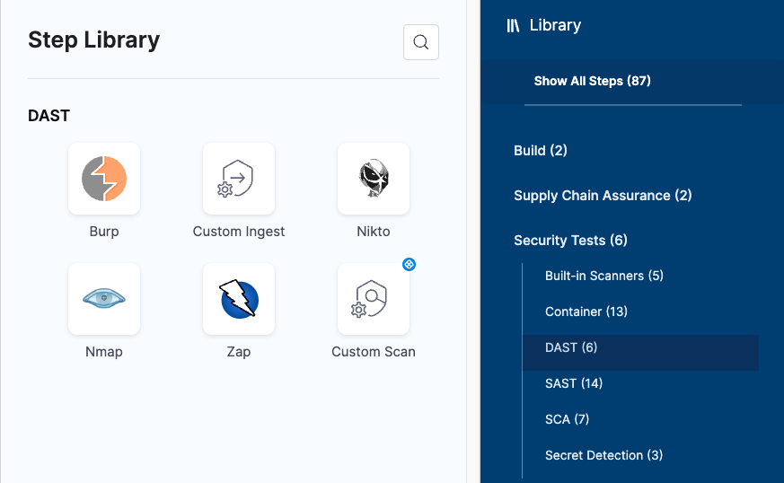
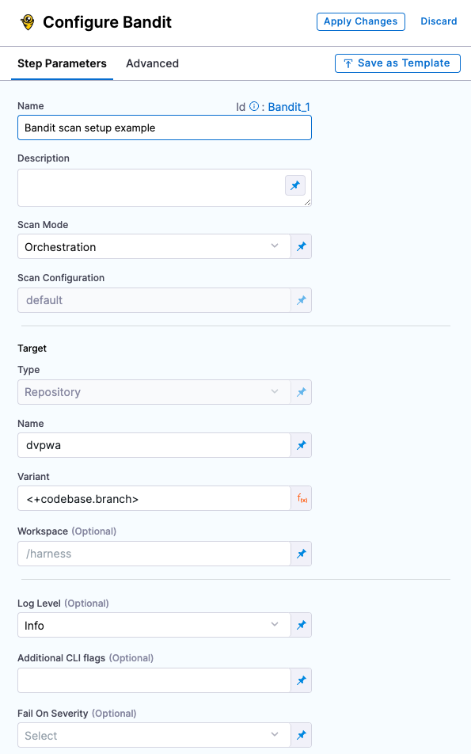

This topic includes the Security step settings for each of the scanner providers supported by Harness.


### Scanner categories

```mdx-code-block
import StoSupportedCategories from './shared/_sto-supported-categories.md';
```

<StoSupportedCategories />


### Data ingestion methods

```mdx-code-block
import StoSupportedMethods from './shared/_sto-supported-methods.md';
```

<StoSupportedMethods />

The scanner, targets, and scan approach combinations are covered in the next section.


### Harness STO scanner support

```mdx-code-block
import StoSupportedScanners from './shared/_sto-supported-scanners.md';
```

<StoSupportedScanners />

### Scanner binaries used in STO container images

```mdx-code-block
import StoSupportedBinaries from './shared/_sto-supported-binaries.md';
```

<StoSupportedBinaries />

### Docker-in-Docker requirements

```mdx-code-block
import StoDinDRequirements from '/docs/security-testing-orchestration/sto-techref-category/shared/dind-bg-step.md';
```

<StoDinDRequirements />

### Root access requirements

```mdx-code-block
import StoRootRequirements from '/docs/security-testing-orchestration/sto-techref-category/shared/root-access-requirements.md';
```

<StoRootRequirements />

### Security steps and scanner templates

The Step library includes a **Security** step for setting up scanners: open the step and configure the scan as a set of key/value pairs under **Settings**. 

Some scanners also have *scanner templates* with UIs that simplify the process of setting up a scanner. 

<details><summary>Step Library with <b>Security</b> step and scanner templates</summary>



</details>

<details><summary><b>Security</b> step configuration</summary>


</details>

<details><summary>Scanner template configuration</summary>



</details>
