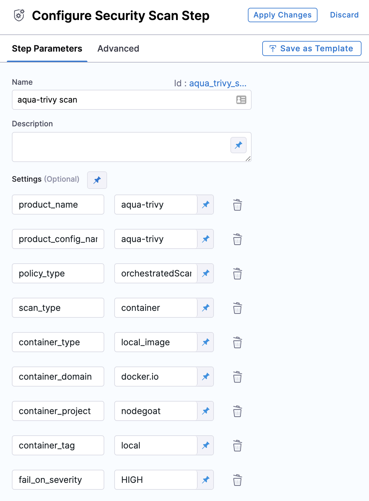

This topic includes the Security step settings for each of the scanner providers supported by Harness.

### Scan Approach Types

Harness Security Testing Orchestration integrates with multiple scanners and targets. Different types of scan approaches can be done on each scanner-target combination:

* **orchestratedScan:** `orchestratedScan` is fully orchestrated. A new scan is orchestrated and the scan results are normalized and compressed by Security Testing Orchestration.
* **ingestionOnly:** `ingestionOnly` is not orchestrated. For a scan that was done previously (or an earlier step in the a Pipeline), the results are presented to Security Testing Orchestration for normalization and compression.
* **dataLoad:** `dataLoad` is partially orchestrated. A previously run scan where the results exist in scan tool vendors SaaS. The data is pulled, normalized, and compressed for Security Testing Orchestration.

The scanner, targets, and scan approach combinations are covered in the next section.

### Scanners, Target Types, and Scan Approach

The following scanners are supported.

|  |  |  |
| --- | --- | --- |
| **Scanner Name** | **Scan Target Type** | **Scan Approach** |
|  [Aqua Trivy](aqua-trivy-scanner-reference.md) | container | orchestratedScan, ingestionOnly |
|  [Image scanning - Amazon ECR](#image-scanning---amazon-ecr) | container | dataLoad |
|  [AWS Security Hub](#aws-security-hub) | container | dataLoad |
|  [Bandit](veracode-scanner-reference.md) | repository | orchestratedScan, ingestionOnly |
|  [Black Duck Open Hub](#black-duck-open-hub) | repository, container | orchestratedScan, ingestionOnly |
|  [Brakeman](#brakeman) | repository | orchestratedScan, ingestionOnly |
|  [Burp](#burp) | instance | ingestionOnly |
|  [Checkmarx](#checkmarx) | repository | orchestratedScan, dataLoad, ingestionOnly |
|  [Data Theorem](#data-theorem) | repository | dataLoad, ingestionOnly |
|  [Docker Content Trust (DCT)](#docker-content-trust-dct) | container | orchestratedScan, ingestionOnly |
|  [Docker Content Trust (clair)](#docker-content-trust-clair) | container | orchestratedScan, ingestionOnly |
|  [External (JSON upload v2)](../use-sto/ingesting-issues-from-other-scanners.md) | container, repository, instance, configuration | ingestionOnly |
|  [Fortify on Demand](#fortify-on-demand) | repository | orchestratedScan, dataLoad, ingestionOnly |
|  [Mend (formerly WhiteSource)](#mend-formerly-whitesource) | repository | orchestratedScan, ingestionOnly |
|  [Metasploit](#metasploit) | instance | orchestratedScan, ingestionOnly |
|  [Nessus](#nessus) | instance | orchestratedScan, ingestionOnly |
|  [Nexus IQ](#nexus-iq) | instance | orchestratedScan, ingestionOnly |
|  [Nikto](#nikto) | instance | orchestratedScan, ingestionOnly |
|  [Nmap ("Network Mapper")](#nmap-network-mapper) | instance | orchestratedScan, ingestionOnly |
|  [OpenVAS](#openvas) | instance | orchestratedScan, ingestionOnly |
|  [OWASP](#owasp) | repository | orchestratedScan, ingestionOnly |
|  [Prisma Cloud (formerly Twistlock)](#prisma-cloud-formerly-twistlock) | container | orchestratedScan, dataLoad, ingestionOnly |
|  [Prowler](#prowler) | repository | orchestratedScan, ingestionOnly |
|  [Qualys Web Application Scanning (WAS)](#qualys-web-application-scanning-was) | instance | ingestionOnly |
|  [Reapsaw](#reapsaw) | repository | ingestionOnly |
|  [ScoutSuite](#scoutsuite) | configuration | ingestionOnly |
|  [ShiftLeft](#shiftleft) | repository | orchestratedScan, dataLoad, ingestionOnly |
|  [Sniper](#sniper) | instance | orchestratedScan, ingestionOnly |
|  [Snyk](#snyk) | repository, container | orchestratedScan (repository only), ingestionOnly |
|  [SonarQube SonarScanner](sonarqube-sonar-scanner-reference.md) | repository | orchestratedScan, dataLoad, ingestionOnly |
|  [Tenable.io](#tenableio) | instance | orchestratedScan, dataLoad, ingestionOnly |
|  [Veracode](veracode-scanner-reference.md) | repository | orchestratedScan, dataLoad, ingestionOnly |
|  [JFrog Xray](#jfrog-xray) | container | ingestionOnly |
|  [Zed Attack Proxy (ZAP)](zap-scanner-reference.md) | instance | orchestratedScan, ingestionOnly |

### Test Targets

The following table specifies where the target to be tested is located.

|  |  |
| --- | --- |
| **Target Name** | **Target Type** |
| azure | repository |
| bitbucket | repository |
| github | repository |
| gitlab | repository |
| local\_image | container |
| docker\_v2 | container |
| jfrog\_artifactory | container |
| aws\_ecr | container |
| website | instance |

### Using Scanner Providers in the Security Step

To use any supported scanner provider in the Harness Security step, you simply need to provide the `setting:value` pairs for the scanner.

For example, here are the `setting:value` pairs for Aqua Trivy:

The Aqua Trivy-specific settings are just `scan_type` and `policy_type`. The rest of the settings are common to all scanners where the `scan_type` is `container`.

The following sections list the `setting:value` pairs for each provider.

### All Scan Types

The following settings apply to all scanners.

* `scan_type`
	+ accepted values: `container`, `repository`, `instance`, `configuration`.

### Repository Scan Type Settings

The following settings apply to all scanners where the `scan_type` is `repository`.

* `repository_project` (required)
* `repository_branch` (required)

### Container Scan Type Settings

The following settings apply to all scanners where the `scan_type` is `containerImage`.

* `container_project` (required)
* `container_tag` (required)
* `container_type`
	+ accepted value(s): `local_image`, `docker_v2`, `jfrog_artifactory`, `aws_ecr`
		- for `container_type` set to `local`
			* `None`
		- for `container_type` set to `docker_v2`
			* `container_access_id`: Username
			* `container_access_token`: Password/Token
		- for `container_type` set to `jfrog_artifactory`
			* `container_access_id`: Username
			* `container_access_token`: Password/Token
		- for `container_type` set to `aws_ecr`
			* `container_access_id`: Username
			* `container_access_token`: Password/Token
			* `container_region`: AWS default region
* `container_domain`

### Instance Scan Type Settings

The following settings apply to all scanners where the `scan_type` is `instance`.

* `instance_identifier` (required)
* `instance_environment` (required)
* `instance_domain`
* `instance_path`
* `instance_protocol`
* `instance_port`
* `instance_type`
	+ accepted value(s): `website`

### Configuration Scan Type Settings

The following settings apply to all scanners where the `scan_type` is `configuration`.

* `configuration_type`
	+ accepted value(s)s: `aws_account`
* `configuration_region`
* `configuration_environment`
* `configuration_access_id`
* `configuration_access_token`

[↑ Scanners](#scanners-target-types-and-scan-approach)

### Aqua Trivy

See [Aqua Trivy Scanner Reference](aqua-trivy-scanner-reference.md)

[↑ Scanners](#scanners-target-types-and-scan-approach)

### Image scanning - Amazon ECR

When `product_name` is set to `aws-ecr`:

* `scan_type` =`container`
* `policy_type`= `dataLoad`
* `product_config_name` =`default`
* `container_project` = The name of the scanned ECR container with the results you want to ingest.
* `container_tag` = The container tag for the given container project.
* `configuration_access_id` = Your AWS Access ID secret
* `configuration_access_token` = Your AWS Access Token secret
* `configuration_region` = The AWS region where the container is located. For example, `us-east-1`
* `container_domain` = URI of the ECR container with the scan results you want to load.

[↑ Scanners](#scanners-target-types-and-scan-approach)

### AWS Security Hub

When `product_name` is set to `aws-security-hub`

* `scan_type`
	+ accepted value(s): `configuration`
* `policy_type`
	+ accepted value(s): `dataLoad`,  `ingestionOnly`
* `product_config_name`
	+ Accepted values(s): `default`

[↑ Scanners](#scanners-target-types-and-scan-approach)

### Bandit

See [Bandit Scanner Reference](bandit-scanner-reference.md).

[↑ Scanners](#scanners-target-types-and-scan-approach)

### Black Duck Open Hub

When `product_name` is set to `blackduckhub`

* `scan_type`
	+ accepted value(s): `repository`, `containerImage`
* `policy_type`
	+ accepted value(s): `orchestratedScan`, `ingestionOnly`
* When `policy_type` is set to `orchestratedScan`
	+ `product_domain`
	+ `product_auth_type`
		- accepted value(s): `usernamePassword`, `apiKey`
	+ `product_access_id`: api username
	+ `product_access_token` api password or api key
	+ `product_api_version`
	+ `product_project_name`
	+ `product_project_version`
* `product_config_name`
	+ Accepted values(s): `default`

[↑ Scanners](#scanners-target-types-and-scan-approach)

### Brakeman

When `product_name` is set to `brakeman`

* `scan_type`
	+ accepted value(s): `repository`
* `policy_type`
	+ accepted value(s): `orchestratedScan`, `ingestionOnly`
* `product_config_name`
	+ Accepted values(s): `default`

[↑ Scanners](#scanners-target-types-and-scan-approach)

### Burp

When `product_name` is set to `burp`

* `scan_type`
	+ accepted value(s): `instance`
* `policy_type`
	+ accepted value(s): `ingestionOnly`
* `product_config_name`
	+ Accepted values(s):
		- `burp-default` (CLI interface uses a Cybric extension)
		- `burp-fast-and-max-depth-of-1` (Form fill disabled and max\_link\_depth=1)
		- `burp-fast-mode` (Turns off automatic form fill)

[↑ Scanners](#scanners-target-types-and-scan-approach)

### Checkmarx

When `product_name` is set to `checkmarx`

* `scan_type`
	+ accepted value(s): `repository`
* `policy_type`
	+ accepted value(s): `orchestratedScan`, `dataLoad`, `ingestionOnly`
* When `policy_type` is set to `orchestratedScan` or `dataLoad`
	+ `product_domain`
	+ `product_access_id`
	+ `product_access_token` — The account password
	+ `product_team_name`
		- accepted value(s): `/<`*`server-name`*`>/<`*`team-name`*`>` for example, `/server1.myorg.org/devOpsEast`
	+ `product_project_name`
* `product_config_name`
	+ Accepted values(s): `default`

[↑ Scanners](#scanners-target-types-and-scan-approach)

### Data Theorem

When `product_name` is set to `data-theorem`

* `scan_type`
	+ accepted value(s): `repository`
* `policy_type`
	+ accepted value(s): `dataLoad`, `ingestionOnly`
* When `policy_type` is set to `dataLoad`
	+ `product_app_id`
	+ `product_access_token`
* `product_config_name`
	+ Accepted values(s): `default`

[↑ Scanners](#scanners-target-types-and-scan-approach)

### Docker Content Trust (DCT)

When `product_name` is set to `docker-content-trust`

* `scan_type`
	+ accepted value(s): `containerImage`
* `policy_type`
	+ accepted value(s): `orchestratedScan`, `ingestionOnly`
* `product_config_name`
	+ Accepted values(s): `default`

[↑ Scanners](#scanners-target-types-and-scan-approach)

### Docker Content Trust (clair)

When `product_name` is set to `docker-content-trust` (clair)

* `scan_type`
	+ accepted value(s): `containerImage`
* `policy_type`
	+ accepted value(s): `orchestratedScan`, `ingestionOnly`
* `product_url`
* `product_access_id`
* `product_access_token`
* `product_config_name`
	+ Accepted values(s): `default`

[↑ Scanners](#scanners-target-types-and-scan-approach)

### External (JSON upload v2)

Go to [Ingesting issues from other scanners](../use-sto/ingesting-issues-from-other-scanners.md).

[↑ Scanners](#scanners-target-types-and-scan-approach)

### Fortify

When `product_name` is set to `fortify`

* `scan_type`
	+ accepted value(s): `repository`
* `policy_type`
	+ accepted value(s): `orchestratedScan`, `ingestionOnly`
* When `policy_type` is set to `orchestratedScan`
	+ `product_license_path`: see `customer_artifacts`
* `product_config_name`
	+ Accepted values(s):
		- `default`

[↑ Scanners](#scanners-target-types-and-scan-approach)

### Fortify on Demand

When `product_name` is set to `fortifyondemand`

* `scan_type`
	+ accepted value(s): `repository`
* `policy_type`
	+ accepted value(s): `orchestratedScan`, `dataLoad`, `ingestionOnly`
* When `policy_type` is set to `orchestratedScan` or `dataLoad`
	+ `product_domain`
	+ `product_access_id`
	+ `product_access_token`
	+ `product_owner_id`
	+ `product_entitlement`
	+ `product_scan_type`
	+ `product_app_name`
	+ `product_release_name`
	+ `product_target_language`
	+ `product_target_language_version`
	+ `product_scan_settings`
		- accepted values: `Custom`, `default`
	+ `product_audit_type`
	+ `product_lookup_type`
		- accepted values: `Dynamic`, `Static`, `Mobile`
	+ `product_data_center`
* `product_config_name`
	+ Accepted values(s):
	+ `sast` ( if `product_lookup_type` = `Static`)
	+ `dast` ( if `product_lookup_type` = `Dynamic`)

[↑ Scanners](#scanners-target-types-and-scan-approach)

### Mend (formerly WhiteSource)

When `product_name` is set to `whitesource`

* `scan_type`
	+ accepted value(s): `repository`
* `policy_type`
	+ accepted value(s): `ingestionOnly`, `dataLoad`, `orchestratedScan`
* When `policy_type` is set to `orchestratedScan`
	+ `product_domain` (*optional*) — The default is `https://saas.whitesourcesoftware.com/api`
	+ `product_access_id`
	+ `product_access_token`
	+ `product_include`
	+ `product_exclude`
	+ `product_lookup_type`(*optional*)
		- Accepted value(s): Not Set, `byName`, `byTokens`, `appendToProductByToken`, `appendToProductByName`, `whitesource-agent`
	+ `product_product_name`
	+ `product_project_name`
	+ `product_product_token`
	+ `product_project_token`
* `dataload`
	+ accepted value(s): `byTokens`, `byNames`
* `orchestratedScan`
	+ accepted value(s): `ppendToProductByToken`, `appendToProductByName`
* `orchestratedScan`
	+ default value(s): `https://saas.whitesourcesoftware.com/api`
* `product_config_name`
	+ Accepted values(s):`default`

[↑ Scanners](#scanners-target-types-and-scan-approach)

### Metasploit

When `product_name` is set to `metasploit`

* `scan_type`
	+ accepted value(s): `instance`
* `policy_type`
	+ accepted value(s): `orchestratedScan`, `ingestionOnly`
* `product_config_name`
	+ Accepted values(s):
		- `metasploit-weak-ssh` (Brute-force test a host for SSH weak ssh/pass)
		- `metasploit-openssl-heartbleed` (Checkhttps (443) for Heartbleed vulerability)
		- `dynamic-by-cve` (Finds and applies Metaspoit module by CVE)

[↑ Scanners](#scanners-target-types-and-scan-approach)

### Nessus

When `product_name` is set to `nessus`

* `scan_type`
	+ accepted value(s): `instance`
* `policy_type`
	+ accepted value(s): `orchestratedScan`, `ingestionOnly`
* When `policy_type` is set to `orchestratedScan`
	+ `product_domain`
	+ `product_access_id`
	+ `product_access_token`
	+ `product_policy_id`
	+ `product_scanner_id`
	+ `product_template_uuid`
* `product_config_name`
	+ Accepted values(s):
		- `nessus-web-application`

[↑ Scanners](#scanners-target-types-and-scan-approach)

### Nexus IQ

When `product_name` is set to `nexusiq`

* `scan_type`
	+ accepted value(s): `repository`
* `policy_type`
	+ accepted value(s): `orchestratedScan`, `ingestionOnly`
* When `policy_type` is set to `orchestratedScan`
	+ `product_domain`
	+ `product_access_id`
	+ `product_access_token`
	+ `product_organization_id`
	+ `product_project_name`
	+ `product_lookup_type`
		- accepted value(s): `byPrivateId`, `byPublicId`
	+ When `product_lookup_type` is set to `byPublicId`
		- product\_public\_id
	+ When `product_lookup_type` is set to `byPrivateId`
		- product\_private\_id
	+ `product_config_name`
		- Accepted values(s): `default`

[↑ Scanners](#scanners-target-types-and-scan-approach)

### Nikto

When `product_name` is set to `nikto`

* `scan_type`
	+ accepted value(s): `instance`
* `policy_type`
	+ accepted value(s): `orchestratedScan`, `ingestionOnly`
* `product_config_name`
	+ Accepted values(s):
		- `default`(Scan the host on port 80)
		- `nikto-full` (Scan the host on ports 80 and 443 with `-Tuning 9`)
		- `nikto-full-web` (Scan the host on ports 80 and 443)

[↑ Scanners](#scanners-target-types-and-scan-approach)

### Nmap ("Network Mapper")

When `product_name` is set to `nmap`

* `scan_type`
	+ accepted value(s): `instance`
* `policy_type`
	+ accepted value(s): `orchestratedScan`, `ingestionOnly`
* `product_config_name`
	+ Accepted values(s):
		- `default`
		- [`firewall-bypass`](https://nmap.org/nsedoc/scripts/firewall-bypass.html)
		- [`unusual-port`](https://nmap.org/nsedoc/scripts/unusual-port.html)
		- [`smb-security-mode`](https://nmap.org/nsedoc/scripts/smb-security-mode.html)
		- [`vuln`](https://nmap.org/nsedoc/categories/vuln.html)
		- [`exploit`](https://nmap.org/nsedoc/categories/exploit.html)

[↑ Scanners](#scanners-target-types-and-scan-approach)

### OpenVAS

When `product_name` is set to `openvas`

* `scan_type`
	+ accepted value(s): `instance`
* `policy_type`
	+ accepted value(s): `orchestratedScan`, `ingestionOnly`
* `product_domain`
* `product_access_id`
* `product_access_token`
* `product_config_name`
	+ Accepted values(s):
		- `host-discovery` (Do a host discovery scan on the network)
		- `network-discovery` (Do a network discovery scan)
		- `full-and-very-deep` (Do a full and very deep discovery scan)
		- `openvas-system-discovery` (Do a system discovery scan on the network)
		- `default`

[↑ Scanners](#scanners-target-types-and-scan-approach)

### OWASP

When `product_name` is set to `owasp`

* `scan_type`
	+ accepted value(s): `repository`
* `policy_type`
	+ accepted value(s): `orchestratedScan`, `ingestionOnly`
* `product_config_name`
	+ Accepted values(s):
		- `default`

[↑ Scanners](#scanners-target-types-and-scan-approach)

### Prisma Cloud (formerly Twistlock)

When `product_name` is set to `twistlock`

* `scan_type`
	+ accepted value(s): `containerImage`
* `policy_type`
	+ accepted value(s): `orchestratedScan`, `dataLoad`, `ingestionOnly`
* When `policy_type` is set to `orchestratedScan` or `dataLoad`
	+ `product_image_name`
	+ `product_domain`
	+ `product_access_id`
	+ `product_access_token`
* `product_config_name`
	+ Accepted values(s):
		- `default`

[↑ Scanners](#scanners-target-types-and-scan-approach)

### Prowler

When `product_name` is set to `prowler`

* `scan_type`
	+ accepted value(s): `configuration`
* `policy_type`
	+ accepted value(s): `orchestratedScan`, `ingestionOnly`
* `product_config_name`
	+ Accepted values(s):
		- `default`, `hipaa`, `gdpr`, `exclude_extras`

[↑ Scanners](#scanners-target-types-and-scan-approach)

### Qualys Web Application Scanning (WAS)

When `product_name` is set to `qualys`

* `scan_type`
	+ accepted value(s): `instance`
* `policy_type`
	+ accepted value(s): `ingestionOnly`
* `product_config_name`
	+ Accepted values(s):
		- `default`

[↑ Scanners](#scanners-target-types-and-scan-approach)

### Reapsaw

When `product_name` is set to `reapsaw`

* `scan_type`
	+ accepted value(s): `repository`
* `policy_type`
	+ accepted value(s): `ingestionOnly`
* `product_config_name`
	+ Accepted values(s):
		- `default`

[↑ Scanners](#scanners-target-types-and-scan-approach)

### ScoutSuite

When `product_name` is set to `scoutsuite` (aws only)

* `scan_type`
	+ accepted value(s): `configuration`
* `policy_type`
	+ accepted value(s): `ingestionOnly`
* `product_config_name`
	+ Accepted values(s): `default`

[↑ Scanners](#scanners-target-types-and-scan-approach)

### ShiftLeft

When `product_name` is set to `shiftleft`

* `scan_type`
	+ accepted value(s): `repository`
* `policy_type`
	+ accepted value(s): `orchestratedScan`, `dataLoad`, `ingestionOnly`
* When `policy_type` is set to `orchestratedScan` or `dataLoad`
	+ `product_access_id`
	+ `product_access_token`
	+ `product_app_name`
	+ `product_target_language`
* `product_config_name`
	+ Accepted values(s):
		- `default`

[↑ Scanners](#scanners-target-types-and-scan-approach)

### Sniper

When `product_name` is set to `sniper`

* `scan_type`
	+ accepted value(s): `instance`
* `policy_type`
	+ accepted value(s): `orchestratedScan`, `ingestionOnly`
* `product_config_name`
	+ Accepted values(s):
		- `default` (Run a basic sniper scan on a target)
		- `web` (Sniper Stealth Mode)
		- `stealth` (Run the web based scan)

[↑ Scanners](#scanners-target-types-and-scan-approach)

### Snyk

When `product_name` is set to `snyk`:

* `scan_type`
	+ accepted value(s): `containerImage`, `repository`
* `policy_type`
	+ accepted value for `containerImage`: `ingestionOnly`
	+ accepted values for `repository`: `orchestratedScan`, `ingestionOnly`
* `product_access_token`
* `product_config_name` = `default`
* `snyk_api` = URL to the Snyk instance, if you're using an on-prem installation.

[↑ Scanners](#scanners-target-types-and-scan-approach)

### SonarQube SonarScanner

Go to [SonarQube SonarScanner Reference.](sonarqube-sonar-scanner-reference.md)

[↑ Scanners](#scanners-target-types-and-scan-approach)

### Tenable.io

When `product_name` is set to `tenableio`

* `scan_type`
	+ accepted value(s): `instance`
* `policy_type`
	+ accepted value(s): `orchestratedScan`, `dataLoad`, `ingestionOnly`
* When `policy_type` is set to `orchestratedScan` or `dataLoad`
	+ `product_domain`
	+ `product_access_id`
	+ `product_access_token`
	+ `product_policy_id`
	+ `product_scanner_id`
	+ `product_template_uuid`
* `product_config_name`
	+ Accepted values(s):
		- `legacy-web-application-scan` (Use legacy nessus scan inside tenableIO)

[↑ Scanners](#scanners-target-types-and-scan-approach)

### Veracode

Go to [Veracode Scanner Reference](veracode-scanner-reference.md).

[↑ Scanners](#scanners-target-types-and-scan-approach)

### JFrog Xray

When `product_name` is set to `xray`

* `scan_type`
	+ accepted value(s): `containerImage`
* `policy_type`
	+ accepted value(s): `ingestionOnly`
* `product_config_name`
	+ Accepted values(s):
		- `default`

[↑ Scanners](#scanners-target-types-and-scan-approach)

### Zed Attack Proxy (ZAP)

Go to [Zed Attack Proxy (ZAP) Scanner Reference](zap-scanner-reference.md).

[↑ Scanners](#scanners-target-types-and-scan-approach)

