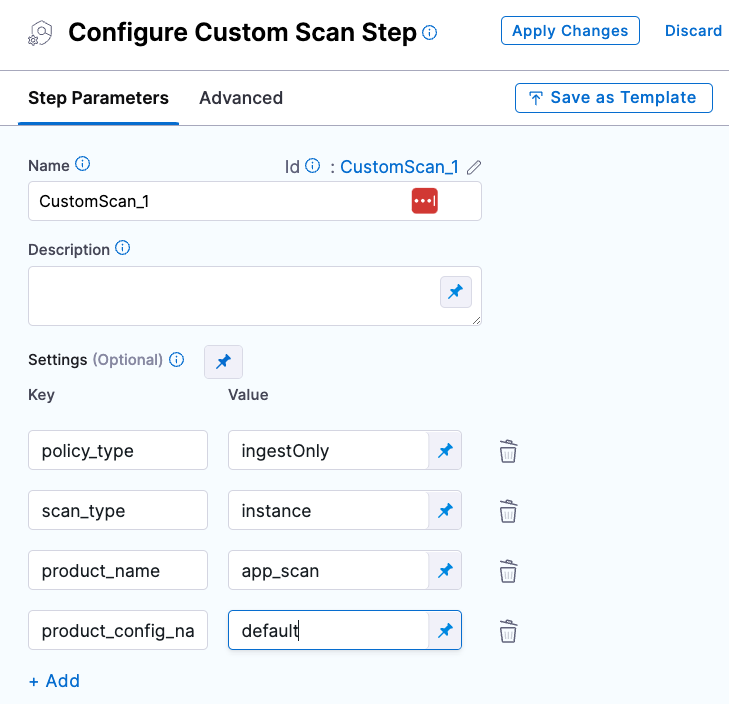

This section describes how to set up each of the external scanners supported by Harness STO.

For more information about STO support, go to [What's supported in STO](/docs/security-testing-orchestration/whats-supported).


## Scanner categories supported by STO

import StoSupportedCategories from './shared/_sto-supported-categories.md';

<StoSupportedCategories />

<!-- 
### Data ingestion methods supported by STO

import StoSupportedMethods from './shared/_sto-supported-methods.md';

<StoSupportedMethods />

The scanner, targets, and scan approach combinations are covered in the next section.

-->

## Scanners supported by STO

import StoSupportedScanners from './shared/_sto-supported-scanners.md';

<StoSupportedScanners />

##  Operating systems and architectures supported by STO

import StoInfraSupport from '/docs/security-testing-orchestration/sto-techref-category/shared/_supported-infrastructures.md';

<StoInfraSupport />


## Ingestion formats supported by STO

import StoSupportedFormats from './shared/_sto-supported-ingestion-formats.md';

<StoSupportedFormats />


## Scanning a Docker image with STO

STO supports two primary ways of scanning a container image; scanning the docker image contained within a Docker-in-Docker background step (requiring privileged mode) or scanning an OCI/Docker archive, which **doesn't need the Docker-in-Docker background step** (this is the recommended approach).


### Scanning an OCI/Docker archive with STO

Scanning an OCI/Docker archive is easier and preferred approach, as it simplifies configuration by removing the need for a Docker-in-Docker background step and reducing security overhead (since privileged mode is not required). STO will automatically scan the OCI/Docker archive without any need for additional DinD configurations.

If you want to force the scanner step **not to use** any Docker-in-Docker(DinD) background step, set the following variable in the Settings section of your step configuration (optional):

- `docker_mode`: `without-docker-in-docker`

This setting is optional and only needed if you want to force the STO to use a specific approach.

The following scanners can perform container scanning without requiring a Docker-in-Docker background step.

import WithoutDinDSupportedScanners from '/docs/security-testing-orchestration/sto-techref-category/shared/_without-dind-supported-scanners.md';

<WithoutDinDSupportedScanners />

### Configuring Docker-in-Docker (DinD) for your pipeline

Here’s how you can set up Docker-in-Docker as a Background step in your pipeline.

import StoDinDRequirements from '/docs/security-testing-orchestration/sto-techref-category/shared/dind-bg-step-setup.md';

<StoDinDRequirements />

For Orchestrated and Extraction scans, you might want to increase the resource limits for your Docker-in-Docker background step. This can speed up your scan times, especially for large scans. For more information, go to [Optimize STO pipelines](/docs/security-testing-orchestration/use-sto/set-up-sto-pipelines/optimize-sto-pipelines).

If you want to force the scanner step to use Docker-in-Docker (DinD) background step, set the following variable in the **Settings** section of your step configuration (optional):

- `docker_mode`: `docker-in-docker`

This setting is optional and only needed if you want to force the STO to use a specific approach.

### Configuring DinD Background step to trust self-signed container registries
When using Docker-in-Docker (DinD) as a background step for scanning container images, the step needs to pull images from your container registry. If your container registry uses a [self-signed certificate](https://en.wikipedia.org/wiki/Self-signed_certificate), the background step will not be able to access it by default. To resolve this issue, you need to add the following command to configure the background step to trust the self-signed container registry.

Following the [DinD configuration](#configuring-docker-in-docker-dind-for-your-pipeline), apply the below settings
1. Set the **Shell** field to **Sh**
2. In the **Command** filed, enter the following command
    <details>
    <summary>Command to configure the background step to trust your container registry.</summary>
        ``` # https://docs.docker.com/engine/security/certificates/

            # This is the domain name where the image is going to be pulled from. For example,
            # registry_domain=example.io
            # registry_domain=localhost:5000

            registry_domain=example.io # replace with the domain of the registry behind the self-signed CA

            # Get all .pem files in the current directory
            pem_files=$(find $HARNESS_SHARED_CERTS_PATH -name "*.pem")

            # Iterate over each .pem file
            mkdir -p /etc/docker/certs.d/${registry_domain}
            touch /etc/docker/certs.d/${registry_domain}/ca.crt
            echo $pem_files
            for pem_file in $pem_files; do
            # Extract the key from the .pem file
            cat $pem_file >> /etc/docker/certs.d/${registry_domain}/ca.crt
            done

            dockerd-entrypoint.sh
        ```
    </details>

## Root access requirements for STO

import StoRootRequirements from '/docs/security-testing-orchestration/sto-techref-category/shared/root-access-requirements-no-dind.md';

<StoRootRequirements />

<!-- 
### Scanner binaries used in STO container images

import StoSupportedBinaries from './shared/_sto-supported-binaries.md';

<StoSupportedBinaries />

-->


## Security steps and scanner templates in STO

The Step library includes a [**Custom Scan**](/docs/security-testing-orchestration/custom-scanning/custom-scan-reference) step for setting up scanners: open the step and configure the scan as a set of key/value pairs under **Settings**. 

Some scanners also have their own steps with simplified UIs that simplify the setup process.

<details>
<summary>Step Library with scanner-specific steps and <b>Custom Scan</b> step</summary>


</details>

<details>
<summary><b>Custom Scan</b> step configuration</summary>



</details>

<details>
<summary>Scanner-specific step configuration</summary>


</details>
