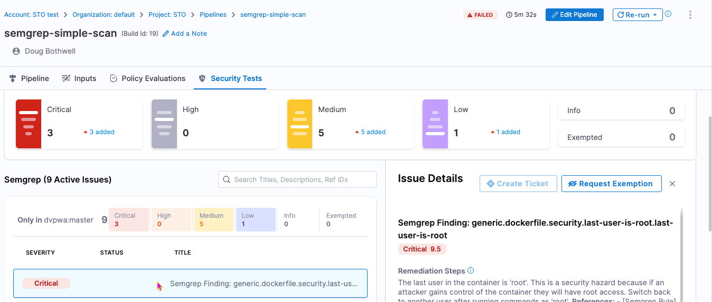

<CTABanner
  buttonText="Learn More"
  title="Continue your learning journey."
  tagline="Take a Security Testing Orchestration certification today!"
  link="/university/sto"
  closable={true}
  target="_self"
/>

This tutorial shows you how to scan your codebases using [Semgrep](https://semgrep.dev), a popular tool for detecting vulnerabilities in application code. Semgrep can scan a [wide variety of languages](https://semgrep.dev/docs/supported-languages/) and includes a [free version](https://semgrep.dev/pricing/) for individuals who want to scan files locally.

In this tutorial, you'll set up a simple pipeline with a Semgrep step running in orchestration mode.


:::info Important notes

- This tutorial uses the free version of Semgrep to run simple SAST scans. More advanced workflows are possible but are outside the scope of this tutorial.

- Semgrep scans use an agent that [uploads data to the Semgrep cloud](https://semgrep.dev/docs/metrics/) by default. Semgrep uses this data to improve the user experience. Therefore this tutorial is not suitable for air-gapped environments.

- This tutorial has the following prerequisites:
  - A [connector](/docs/category/code-repositories) to your Git account (for example, `http://github.com/my-account`)
  - Your connector should use a [Harness text secret](/docs/platform/secrets/add-use-text-secrets) for your Git access token.

:::


## Set up your pipeline

Do the following:

1. Select **Security Testing Orchestration** (left menu, top) > **Pipelines** > **Create a Pipeline**. Enter a name and click **Start**.

2. In the new pipeline, select **Add stage** > **Security**.

   1. Under **Configure Codebase**, select the connector to your Git account.

   2. In **Repository Name**, open the value-type pulldown (right) and select **Runtime Input**.

     <DocImage path={require('./static/sast-semgrep-tutorial/configure-codebase.png')} width="50%" height="50%" title="Configure codebase to specify repository at runtime" />


5. Go to **Infrastructure** and select **Cloud**, **Linux**, and **AMD64** for the infrastructure, OS, and architecture.


## Add the Semgrep  step

1. In **Execution**, click **Add step** and select **Semgrep**.

2. In the Semgrep step, verify that the Scan mode is **Orchestration**.

3. Set [**Fail on Severity**](/docs/security-testing-orchestration/get-started/key-concepts/fail-pipelines-by-severity) to **Medium**.

3. Apply your changes and save the pipeline. 


## Run the pipeline and check your results

1. Run the pipeline: click **Run** (top right). The **Run Pipeline** dialog box appears.

2. Enter the repository and branch to scan.

   When you scan a codebase for the first time, the standard practice is to scan the root branch. This is usually the `main` or `master` branch.

3. Run the pipeline and then wait for the execution to finish.

   If the scan detected any critical vulnerabilities, the pipeline fails with the message `Exited with message: fail_on_severity is set to critical and that threshold was reached.`

   

4. Select **Security Tests** and examine any issues detected by your scan.

   

## Specify the baseline

:::tip

It is [good practice](/docs/security-testing-orchestration/get-started/key-concepts/targets-and-baselines#every-target-needs-a-baseline) to specify a baseline for every target. Defining a baseline makes it easy for developers to drill down into "shift-left" issues in downstream variants and security personnel to drill down into "shift-right" issues in the baseline.

:::

1. Select **Test Targets** (left menu).

2. Select the baseline you want for your target.


## YAML pipeline example

Here's an example of the pipeline you created in this tutorial. If you copy this example, update `YOUR_GIT_CONNECTOR_ID` with your codebase connector.

```yaml
pipeline:
  name: harness_semgrep_tutorial
  identifier: harness_semgrep_tutorial
  projectIdentifier: default
  orgIdentifier: default
  tags: {}
  stages:
    - stage:
        name: scan_codebase
        identifier: scan_codebase
        description: ""
        type: SecurityTests
        spec:
          cloneCodebase: true
          platform:
            os: Linux
            arch: Amd64
          runtime:
            type: Cloud
            spec: {}
          execution:
            steps:
              - step:
                  type: Semgrep
                  name: Semgrep_1
                  identifier: Semgrep_1
                  spec:
                    mode: orchestration
                    config: default
                    target:
                      type: repository
                      detection: auto
                    advanced:
                      log:
                        level: info
                      fail_on_severity: medium
  properties:
    ci:
      codebase:
        connectorRef: YOUR_GIT_CONNECTOR_ID
        repoName: <+input>
        build: <+input>
```
