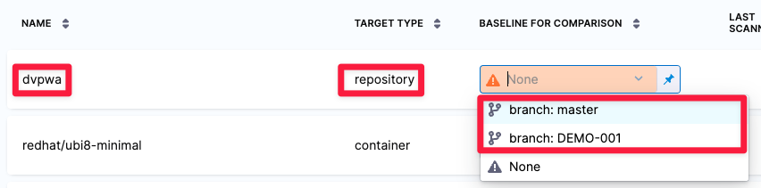

The following settings are required for every Security step:

* `target_name` A user-defined label for the code repository, container, application, or configuration to scan. 
* `variant` A user-defined label for the branch, tag, or other target variant to scan.

:::note

Make sure that you give unique, descriptive names for the target and variant. This makes navigating your scan results in the STO UI much easier. 

:::

You can see the target name, type, and variant in the [Test Targets](/docs/security-testing-orchestration/onboard-sto/key-concepts/targets-and-baselines.md) UI:

For more information, go to [Targets, baselines, and variants in STO](/docs/security-testing-orchestration/onboard-sto/key-concepts/targets-and-baselines).