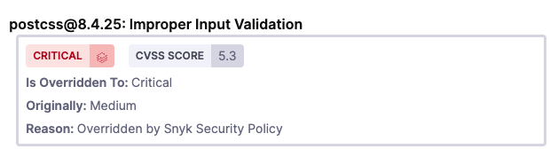
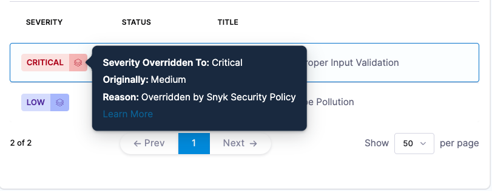
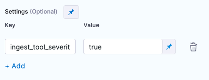
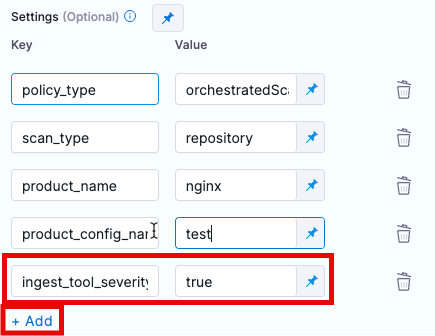

import Tabs from '@theme/Tabs';
import TabItem from '@theme/TabItem';

 
<DocsTag  text="Code repo scanners"  backgroundColor= "#cbe2f9" textColor="#0b5cad" link="/docs/security-testing-orchestration/sto-techref-category/security-step-settings-reference#code-repo-scanners"  />
<DocsTag  text="Artifact scanners" backgroundColor= "#cbe2f9" textColor="#0b5cad" link="/docs/security-testing-orchestration/sto-techref-category/security-step-settings-reference#artifact-scanners"  />
<DocsTag  text="Orchestration" backgroundColor= "#e3cbf9" textColor="#5c0bad" link="/docs/security-testing-orchestration/get-started/key-concepts/run-an-orchestrated-scan-in-sto"  />
<DocsTag  text="Ingestion" backgroundColor= "#e3cbf9" textColor="#5c0bad" link="/docs/security-testing-orchestration/get-started/key-concepts/ingest-scan-results-into-an-sto-pipeline" />
<br/>
<br/>

The Snyk step in Harness STO enables you to perform Snyk [Code](./snyk-code-scanning.md), [Open Source](./snyk-open-source.md), [Container](./snyk-open-source.md), and [IaC](./snyk-iac-scanning.md) scanning in both Orchestration and Ingestion modes of STO. This document will guide you through understanding the fields, configuring them, and providing any necessary information for setting up the step.

## Important notes for running Snyk scans in STO

<!--

You can configure the Snyk step to [show the original CVSS score](#show-the-original-cvss-score-when-snyk-overrode-it) when a Snyk security policy overrode the score for an issue. 

-->

### Root access requirements 

import StoRootRequirements from '/docs/security-testing-orchestration/sto-techref-category/shared/root-access-requirements-no-dind.md';

<StoRootRequirements />


### For more information


import StoMoreInfo from '/docs/security-testing-orchestration/sto-techref-category/shared/_more-information.md';


<StoMoreInfo />


## Snyk step settings for STO

It is recommended to add a Snyk step to the **Security** or **Build** stage and configure it as described below.


### Scan


<a name="scan-mode"></a>

#### Scan Mode


import StoSettingScanMode from '../shared/step_palette/scan/_type.md';

import StoSettingScanModeOrch  from '../shared/step_palette/scan/mode/_orchestration.md';
import StoSettingScanModeIngest from '../shared/step_palette/scan/mode/_ingestion.md';


<!-- StoSettingScanMode / -->
<StoSettingScanModeOrch />
<StoSettingScanModeIngest />

#### Scan Configuration


import StoSettingProductConfigName from '../shared/step_palette/scan/_config-name.md';


<StoSettingProductConfigName />


### Target

<a name="target-type"></a>

#### Type

import StoSettingScanType from '../shared/step_palette/scan/_type.md';

import StoSettingScanTypeRepo from '../shared/step_palette/target/type/_repo.md';
import StoSettingScanTypeCont from '../shared/step_palette/target/type/_image.md';


<a name="scan-type"></a>
<StoSettingScanType />
<StoSettingScanTypeRepo />
<StoSettingScanTypeCont />

#### Target and variant detection 

import StoSettingScanTypeAutodetectRepo from '../shared/step_palette/target/auto-detect/_code-repo.md';
import StoSettingScanTypeAutodetectContainer from '../shared/step_palette/target/auto-detect/_container-image.md';
import StoSettingScanTypeAutodetectNote from '../shared/step_palette/target/auto-detect/_note.md';

<StoSettingScanTypeAutodetectRepo/>
<StoSettingScanTypeAutodetectContainer/>
<StoSettingScanTypeAutodetectNote/>


#### Name 

import StoSettingTargetName from '../shared/step_palette/target/_name.md';

<StoSettingTargetName />

<a name="target-variant"></a>

#### Variant


import StoSettingTargetVariant from '../shared/step_palette/target/_variant.md';


<StoSettingTargetVariant  />

#### Workspace (_repository_)


import StoSettingTargetWorkspace from '../shared/step_palette/target/_workspace.md';


<StoSettingTargetWorkspace  />

### Container image


#### Type

import StoSettingImageType from '../shared/step_palette/image/_type.md';

<StoSettingImageType />


#### Domain

import StoSettingImageDomain from '../shared/step_palette/image/_domain.md';

<StoSettingImageDomain />


#### Name

import StoSettingImageName from '../shared/step_palette/image/_name.md';

<StoSettingImageName />


#### Tag

import StoSettingImageTag from '../shared/step_palette/image/_tag.md';

<StoSettingImageTag />


### Authentication


#### Access Token (_Orchestration scans_)

import StoSettingAuthAccessToken from '../shared/step_palette/auth/_access-token.md';

<StoSettingAuthAccessToken />


### Ingestion File

import StoSettingIngestionFile from '../shared/step_palette/ingest/_file.md';

<StoSettingIngestionFile  />

### Log Level

import StoSettingLogLevel from '../shared/step_palette/all/_log-level.md';

<StoSettingLogLevel />


### Additional CLI flags

<!-- https://harness.atlassian.net/browse/STO-6983 -->
<!-- https://harness.atlassian.net/browse/STO-7003 -->

Use this field to run the [Snyk scanner](https://docs.snyk.io/snyk-cli/cli-commands-and-options-summary) with additional flags such as:

`--all-projects --detection-depth=3`

With these flags, the Snyk step scans recursively down the repository tree to a depth of 3 folders. 

:::caution

- Passing CLI flags is an advanced feature. Some flags might not work in the context of STO. You should test your flags and arguments thoroughly before you use them in your production environment.  

- STO does not support [context-specific arguments](https://docs.snyk.io/snyk-cli/cli-commands-and-options-summary#less-than-context-specific_options-greater-than) or arguments that appear at the end of the command line, such as Maven or Gradle arguments.

:::


### Fail on Severity

import StoSettingFailOnSeverity from '../shared/step_palette/all/_fail-on-severity.md';

<StoSettingFailOnSeverity />

### Settings

import StoSettingSettings from '../shared/step_palette/all/_settings.md';

<StoSettingSettings />


## Show original issue severities overridden by Snyk security policies 

Harness originally will categorize a scan utilizing the CVSS scores that are provided, and using it to categorize vulnerabilities into **Critical, High, Medium, and Low** categories

With the Snyk Step, or a [Custom Scan Step](https://developer.harness.io/docs/security-testing-orchestration/custom-scanning/custom-scan-reference/) utilizing a self installed Snyk runner, you can configure Harness to utilize the severity scores in a [Snyk Enterprise security policy](https://docs.snyk.io/enterprise-configuration/policies/security-policies), and provide an override severity for an issue.  This can be adjusted from your Snyk results, or it can also come from the `snyk` CLI. You can see this information in **Issue Details**.   



Harness will also display the information that the severity was overriden, and the original score, so long as the report follows the Snyk required format



This feature is supported for `snyk container` and `snyk test` JSON output that properly reflects an override.

### Requirement

- [STO Plugin version 1.56.x or higher](https://hub.docker.com/r/harness/sto-plugin/tags)

### JSON Output Format
Please note that the override format must follow the Snyk documented process, such as [in the following Snyk example.](https://docs.snyk.io/supported-languages-package-managers-and-frameworks/c-c++/snyk-cli-for-open-source-c++-scans)

The formatting should contain the following:
- A value, `originalSeverity`, needs to be defined, and should contain the original severity value
- The `severity` value can now be defined with the new severity value.  Below is a portion of an adjusted vulnerability sample:

```
{  
     "vulnerabilities": [
        {
            "id": "SNYK-JS-POSTCSS-5926692",
            "title": "Improper Input Validation",
            "CVSSv3": "CVSS:3.1/AV:N/AC:L/PR:N/UI:N/S:U/C:N/I:L/A:N",
            "credit": [
                "Unknown"
            ],
            "semver": {
                "vulnerable": [
                    "<8.4.31"
                ]
            },
            "exploit": "Not Defined",
            "fixedIn": [
                "8.4.31"
            ],
            "patches": [],
            "insights": {
                "triageAdvice": null
            },
            "language": "js",
            "severity": "critical",
            "originalSeverity": "medium",
            "cvssScore": 5.3,
            "functions": [],
            "malicious": false,
            "isDisputed": false,
            "moduleName": "postcss",
            [...]
        }
    ]
 }
```


### Enable Severity Override
To enable this behavior, add the setting `ingest_tool_severity` and set it to `true` in the Snyk ingestion step or Custom Scan Step. With this setting enabled, the Snyk step processes the relevant data for issues with overridden severities. 

<Tabs>
    <TabItem value="Visual" label="Visual" default>
      Add `ingest_tool_severity` to Snyk step keys
      
      Add `ingest_tool_severity` to Custom Scan step keys
      
      </TabItem>
    <TabItem value="YAML" label="YAML">
          **Snyk Step Declaration**
          ``` yaml
          - step:
              type: Snyk
              spec:
                settings:
                  ingest_tool_severity: "true"
          ```
          **Custom Scan Step Declaration**
          ``` yaml
          - step:
              type: Security
              spec:
                settings:
                  ingest_tool_severity: "true"
          ```
      </TabItem>
</Tabs>


### Additional Configuration

import ScannerRefAdditionalConfigs from '../shared/_additional-config.md';

<ScannerRefAdditionalConfigs />


### Advanced settings

import ScannerRefAdvancedSettings from '../shared/_advanced-settings.md';

<ScannerRefAdvancedSettings />


## Proxy settings

import ProxySettings from '../shared/proxy-settings.md';

<ProxySettings />