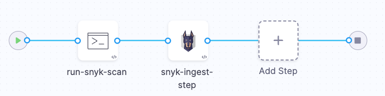

This workflow describes how to ingest Snyk scan results into a Harness pipeline. STO supports the following scan modes for the following Snyk products:

- Snyk Open Source
  - [Snyk Open Source orchestration example](#snyk-open-source-orchestration-example)
  - [Snyk Open Source ingestion example](#snyk-open-source-ingestion-example)
- Snyk Code 
  - [Snyk Code ingestion example](#snyk-code-ingestion-example)
- Snyk Container
  - [Snyk Container ingestion example](#snyk-container-ingestion-example)
- Snyk infrastructure as Code (currently in beta)
  - [Snyk infrastructure as Code ingestion example](#snyk-infrastructure-as-code-ingestion-example)

## Important notes for running Snyk scans in STO

- Snyk Code and Snyk Container scans require a [Snyk API key](https://docs.snyk.io/snyk-api-info/authentication-for-api). You should create a [Harness secret](/docs/platform/secrets/secrets-management/secrets-and-log-sanitization) for your API key.

- For an overview of recommended Snyk workflows, go to [CI/CD adoption and deployment](https://docs.snyk.io/integrations/snyk-ci-cd-integrations/snyk-ci-cd-integration-deployment-and-strategies/ci-cd-adoption-and-deployment) in the Snyk documentation.

- If you're scanning a code repository, note the following:

  - In some cases, you need to build a project before scanning. You can do this in a Run step in your Harness pipeline.

    For specific requirements, go to [Setup requirements for AWS CodePipeline](https://docs.snyk.io/integrations/ci-cd-integrations/aws-codepipeline-integration/setup-requirements-for-aws-codepipeline) in the Snyk documentation. These requirements are applicable to Harness pipelines as well as AWS CodePipeline.

  - Harness recommends that you use [language-specific Snyk container images](https://hub.docker.com/r/snyk/snyk) to run your scans.

  - For complete end-to-end examples, go to:
    - [Scan a repository: orchestration example](#scan-a-repository-orchestration-example)
    - [Scan a repository: ingestion example](#scan-a-repository-ingestion-example)

<!-- removed info on using snyk monitor, see https://harness.atlassian.net/browse/DOC-2718?focusedCommentId=571223 -->

## Snyk Open Source orchestration example

This example uses a Snyk step in orchestration mode, which runs [`snyk test`](https://docs.snyk.io/snyk-cli/cli-commands-and-options-summary#snyk-test) and [snyk monitor](https://docs.snyk.io/snyk-cli/cli-commands-and-options-summary#snyk-monitor) and then ingests the results.


1. Add a [codebase connector](/docs/continuous-integration/use-ci/codebase-configuration/create-and-configure-a-codebase/) that points to the repository you want to scan.

2. Add a Security or Build stage to your pipeline.

<!-- commenting out this step, doesn't look like it's necessary for orchestration scans

3. Go to the Overview tab of the stage. Under **Shared Paths**, enter the following path: `/shared/scan_results`

-->

3. Add a [Snyk security step](/docs/security-testing-orchestration/sto-techref-category/snyk/snyk-scanner-reference) to ingest the results of the scan. In this example, the step is configured as follows:

   1. Scan Mode = **Orchestration**
   2. Target Type = **Repository**
   3. Target Name = (_user-defined_)
   <!-- Variant = [**`<+codebase.branch>`**](/docs/continuous-integration/use-ci/codebase-configuration/built-in-cie-codebase-variables-reference/#codebasebranch) (_runtime expression_) -->
   4. Variant = (_user-defined_)
   5. Access Token = [**`<+secrets.getValue("snyk_api_token")>`**](/docs/platform/secrets/secrets-management/secrets-and-log-sanitization) (_Harness secret_)

4. Apply your changes, then save and run the pipeline.


## Snyk Open Source ingestion example

The following example uses [`snyk test`](https://docs.snyk.io/snyk-cli/commands/test) to scan a .NET repository.

The scan stage in this pipeline has the following steps:

- A Run step installs the build; then it scans the image and saves the output to a shared folder.

- A Snyk step then ingests the output file.


1. Add a [codebase connector](/docs/continuous-integration/use-ci/codebase-configuration/create-and-configure-a-codebase/) to your pipeline that points to the repository you want to scan.

2. Add a Security or Build stage to your pipeline.

3. Go to the **Overview** tab of the stage. Under **Shared Paths**, enter the following path: `/shared/scan_results`.

4. Add a **Run** step that runs the build (if required), scans the repo, and saves the results to the shared folder:

   1. In the Run step **Command** field, add code to build a local image (if required) and save the scan results to the shared folder.

      In this example, we want to scan a .NET repository. The [setup requirements](https://docs.snyk.io/integrations/snyk-ci-cd-integrations/aws-codepipeline-integration/setup-requirements-for-aws-codepipeline) topic says: _Build only required if no packages.config file present._ The repo does not contain this file. Enter the following code in the **Command** field:

      ```bash
      # populates the dotnet dependencies
      dotnet restore SubSolution.sln

      # snyk Snyk Open Source scan
      # https://docs.snyk.io/snyk-cli/commands/test
      snyk  --file=SubSolution.sln  test \
         --sarif-file-output=/shared/scan_results/snyk_scan_results.sarif || true
      snyk monitor --all-projects | true
      ```

   2. For the Run step **Image**, use a [supported Snyk image](https://github.com/snyk/snyk-images#current-images) based on the type of code in your codebase.

   3. In the Run step **Environment Variables** field, under **Optional Configuration**, add a variable to access your Snyk API key:

      `SNYK_TOKEN` = [**`<+secrets.getValue("snyk_api_token")>`**](/docs/platform/secrets/secrets-management/secrets-and-log-sanitization)`

      <!-- 
      Your Run step should now look like this:

      

      -->

   4. In the Run step > **Advanced** tab > **Failure Strategies**, set the Failure Strategy to **Mark as Success**.

      This step is required to ensure that the pipeline proceeds if Snyk finds a vulnerability. Otherwise, the build exits with an error code before STO can ingest the data.

5. Add a [Snyk security step](/docs/security-testing-orchestration/sto-techref-category/snyk/snyk-scanner-reference) to ingest the results of the scan. In this example, the step is configured as follows:

   1. Scan Mode = **Ingestion**
   2. Target Type = **Repository**
   3. Target Name = (_user-defined_)
   <!-- Variant = [**`<+codebase.branch>`**](/docs/continuous-integration/use-ci/codebase-configuration/built-in-cie-codebase-variables-reference/#codebasebranch) (_runtime expression_) -->
   4. Variant = (_user-defined_)
   5. Ingestion = **`/shared/scan_results/snyk_scan_results.sarif`**

6. Apply your changes, then save and run the pipeline.


## Snyk Code ingestion example

The following example uses [`snyk code test`](https://docs.snyk.io/snyk-cli/cli-commands-and-options-summary#snyk-code-test) to scan a .NET repository.

The scan stage in this pipeline has the following steps:

- A Run step installs the build; then it scans the image and saves the output to a shared folder.

- A Snyk step then ingests the output file.


1. Add a [codebase connector](/docs/continuous-integration/use-ci/codebase-configuration/create-and-configure-a-codebase/) to your pipeline that points to the repository you want to scan.

2. Add a Security or Build stage to your pipeline.

3. Go to the **Overview** tab of the stage. Under **Shared Paths**, enter the following path: `/shared/scan_results`.

4. Add a **Run** step that runs the build (if required), scans the repo, and saves the results to the shared folder:

   1. In the Run step **Command** field, add code to build a local image (if required) and save the scan results to the shared folder.

      In this example, we want to scan a .NET repository. The [setup requirements](https://docs.snyk.io/integrations/snyk-ci-cd-integrations/aws-codepipeline-integration/setup-requirements-for-aws-codepipeline) topic says: _Build only required if no packages.config file present._ The repo does not contain this file. Enter the following code in the **Command** field:

      ```bash
      # populates the dotnet dependencies
      dotnet restore SubSolution.sln

      # scan the code repository
      snyk code test \
         --file=SubSolution.sln  \
         --sarif-file-output=/shared/scan_results/snyk_scan_results.sarif || true
      ```

   2. For the Run step **Image**, use a [supported Snyk image](https://github.com/snyk/snyk-images#current-images) based on the type of code in your codebase.

   3. In the Run step **Environment Variables** field, under **Optional Configuration**, add a variable to access your Snyk API key:

      `SNYK_TOKEN` = [**`<+secrets.getValue("snyk_api_token")>`**](/docs/platform/secrets/secrets-management/secrets-and-log-sanitization)`

      <!-- 
      Your Run step should now look like this:

      

      -->

   4. In the Run step > **Advanced** tab > **Failure Strategies**, set the Failure Strategy to **Mark as Success**.

      This step is required to ensure that the pipeline proceeds if Snyk finds a vulnerability. Otherwise, the build exits with an error code before STO can ingest the data.

5. Add a [Snyk security step](/docs/security-testing-orchestration/sto-techref-category/snyk/snyk-scanner-reference) to ingest the results of the scan. In this example, the step is configured as follows:

   1. Scan Mode = **Ingestion**
   2. Target Type = **Repository**
   3. Target Name = (_user-defined_)
   <!-- Variant = [**`<+codebase.branch>`**](/docs/continuous-integration/use-ci/codebase-configuration/built-in-cie-codebase-variables-reference/#codebasebranch) (_runtime expression_) -->
   4. Variant = (_user-defined_)
   5. Ingestion = **`/shared/scan_results/snyk_scan_results.sarif`**

6. Apply your changes, then save and run the pipeline.

## Snyk Container ingestion example

This example uses [`snyk container test`](https://docs.snyk.io/snyk-cli/commands/container-test) to scan a container image. The scan stage consists of two steps:


- A Run step that scans the image and publishes the results to a SARIF file.

- A Snyk step that ingests the scan results.



1. Add a Security or Build stage to your pipeline.

3. Add a **Run** step and set it up as follows:

   1. Container Registry = Select a Docker Hub connector.
   2. Image = `snyk/snyk:docker`
   3. Shell = **Sh**
   4. Command — Enter code to run the scan and save the results to SARIF:

      ```bash
      snyk container test \
          snykgoof/big-goof-1g:100 -d \
          --sarif-file-output=/shared/scan_results/snyk_container_scan.sarif  || true
      ```

      Snyk maintains a set of [snykgoof](https://hub.docker.com/u/snykgoof) repositories that you can use for testing your container-image scanning workflows.

   5. Under **Environment Variables**, add a variable for your Snyk API token. Make sure that you save your token to a [Harness secret](/docs/platform/secrets/add-use-text-secrets/):

      SNYK_TOKEN = [**`<+secrets.getValue("snyk_api_token")>`**](/docs/platform/secrets/secrets-management/secrets-and-log-sanitization)

   6. In the Run step > **Advanced** tab > **Failure Strategies**, set the Failure Strategy to **Mark as Success**.

      This step is required to ensure that the pipeline proceeds if Snyk finds a vulnerability. Otherwise, the build exits with an error code before STO can ingest the data.

4. Add a [Snyk step](/docs/security-testing-orchestration/sto-techref-category/snyk/snyk-scanner-reference) and configure it as follows:

   1. Scan Mode = **Ingestion**
   2. Target Type = **Container Image**
   3. Target Name = (_user-defined_)
   <!-- Variant = [**`<+codebase.branch>`**](/docs/continuous-integration/use-ci/codebase-configuration/built-in-cie-codebase-variables-reference/#codebasebranch) (_runtime expression_) -->
   4. Variant = (_user-defined_)
   5. Ingestion = **`/shared/scan_results/snyk_container_scan.sarif`**

5. Apply your changes, then save and run the pipeline.

## Snyk Infrastructure as Code ingestion example

:::note

Support for Snyk scans of IaC repositories is a beta feature. For more information, contact [Harness Support](mailto:support@harness.io).

:::

The following example uses [`snyk iac test`](https://docs.snyk.io/snyk-cli/commands/iac-test) to scan an IaC code repository.

The scan stage in this pipeline has the following steps:

- A Run step installs the build; then it scans the image and saves the output to a shared folder.

- A Snyk step then ingests the output file.


1. Add a [codebase connector](/docs/continuous-integration/use-ci/codebase-configuration/create-and-configure-a-codebase/) to your pipeline that points to the repository you want to scan.

2. Add a Security or Build stage to your pipeline.

3. Go to the Overview tab of the stage. Under **Shared Paths**, enter the following path: `/shared/scan_results`

4. Add a **Run** step that runs the build (if required), scans the repo, and saves the results to the shared folder:

   1. In the Run step **Command** field, add code to run the scan and save the scan results to the shared folder.

      ```bash
      snyk iac test --sarif --sarif-file-output=/shared/scan_results/snyk_iac.json /harness || true
      cat /shared/scan_results/snyk_iac.json
      ```

   2. For the Run step **Image**, use a [supported Snyk image](https://github.com/snyk/snyk-images#current-images) based on the type of code in your codebase.

   3. In the Run step **Environment Variables** field, under **Optional Configuration**, add a variable to access your Snyk API key:

      `SNYK_TOKEN` = [**`<+secrets.getValue("snyk_api_token")>`**](/docs/platform/secrets/secrets-management/secrets-and-log-sanitization)`

      Your Run step should now look like this:

      

   4. In the Run step > **Advanced** tab > **Failure Strategies**, set the Failure Strategy to **Mark as Success**.

      This step is required to ensure that the pipeline proceeds if Snyk finds a vulnerability. Otherwise, the build exits with an error code before STO can ingest the data.

5. Add a [Snyk security step](/docs/security-testing-orchestration/sto-techref-category/snyk/snyk-scanner-reference) to ingest the results of the scan. In this example, the step is configured as follows:

   1. Scan Mode = **Ingestion**
   2. Target Type = **Repository**
   3. Target Name = (_user-defined_)
   <!-- Variant = [**`<+codebase.branch>`**](/docs/continuous-integration/use-ci/codebase-configuration/built-in-cie-codebase-variables-reference/#codebasebranch) (_runtime expression_) -->
   4. Variant = (_user-defined_)
   5. Ingestion = **`/shared/scan_results/snyk_iac.sarif`**

6. Apply your changes, then save and run the pipeline.

## Snyk pipeline examples

### Snyk Open Source scan pipeline (orchestration)

The following illustrates the [Snyk Open Source orchestration workflow example](#snyk-open-source-orchestration-example) above.

<details>
<summary>YAML pipeline, Snyk Open Source scan, Orchestration mode</summary>

```yaml
pipeline:
  projectIdentifier: STO
  orgIdentifier: default
  tags: \{}
  properties:
    ci:
      codebase:
        connectorRef: CODEBASE_CONNECTOR_snyklabs
        repoName: java-goof
        build: <+input>
  stages:
    - stage:
        name: scan
        identifier: scan
        description: ""
        type: SecurityTests
        spec:
          cloneCodebase: true
          infrastructure:
            type: KubernetesDirect
            spec:
              connectorRef: K8S_DELEGATE_CONNECTOR
              namespace: harness-delegate-ng
              automountServiceAccountToken: true
              nodeSelector: \{}
              os: Linux
          execution:
            steps:
              - step:
                  type: Snyk
                  name: snyk java scan
                  identifier: snyk_java_scan
                  spec:
                    mode: orchestration
                    config: default
                    target:
                      name: snyk-labs-java-goof
                      type: repository
                      variant: main
                    advanced:
                      log:
                        level: debug
                      args:
                        cli: "-d -X"
                    imagePullPolicy: Always
                    auth:
                      access_token: <+secrets.getValue("snyk_api_token")>
  identifier: snyk_orchestration_doc_example
  name: snyk_orchestration_doc_example
```

</details>


### Snyk Open Source scan pipeline (ingestion)

The following illustrates the [Snyk Open Source ingestion workflow example](#snyk-open-source-ingestion-example) above.

<details>
<summary>YAML pipeline, repository scan, Ingestion mode</summary>

```yaml
pipeline:
  projectIdentifier: STO
  orgIdentifier: default
  tags: \{}
  properties:
    ci:
      codebase:
        connectorRef: CODEBASE_CONNECTOR_Subsolution
        repoName: SubSolution
        build: <+input>
  stages:
    - stage:
        name: test
        identifier: test
        type: SecurityTests
        spec:
          cloneCodebase: true
          platform:
            os: Linux
            arch: Amd64
          runtime:
            type: Cloud
            spec: \{}
          execution:
            steps:
              - step:
                  type: Run
                  name: Snyk_Build
                  identifier: Snyk_Build
                  spec:
                    connectorRef: CONTAINER_IMAGE_REGISTRY_CONNECTOR
                    image: snyk/snyk:dotnet
                    shell: Sh
                    command: |

                      # populates the dotnet dependencies
                      dotnet restore SubSolution.sln

                      # snyk Snyk Open Source scan
                      # https://docs.snyk.io/snyk-cli/commands/test
                      snyk --file=SubSolution.sln test \
                          --sarif /harness > /shared/customer_artifacts/snyk_sca.json | true
                      snyk monitor --all-projects | true
                    envVariables:
                      SNYK_TOKEN: <+secrets.getValue("sto-api-token")>
              - step:
                  type: Snyk
                  name: Snyk Snyk Code
                  identifier: Snyk_SAST
                  spec:
                    mode: ingestion
                    config: default
                    target:
                      name: snyk-scan-example-for-docs
                      type: repository
                      variant: master
                    advanced:
                      log:
                        level: info
                    ingestion:
                      file: /shared/scan_results/snyk_scan_results.sarif
          sharedPaths:
            - /shared/scan_results
        variables:
  identifier: snyk_ingestion_doc_example
  name: snyk_ingestion_doc_example
```

</details>


### Snyk Code scan pipeline (ingestion)

The following illustrates the [Snyk Code ingestion workflow example](#snyk-code-ingestion-example) above.

<details>
<summary>YAML pipeline, Snyk Code scan, Ingestion mode</summary>

```yaml
pipeline:
  projectIdentifier: STO
  orgIdentifier: default
  tags: {}
  properties:
    ci:
      codebase:
        connectorRef: Subsolution
        repoName: SubSolution
        build: <+input>
  stages:
    - stage:
        name: test
        identifier: test
        type: SecurityTests
        spec:
          cloneCodebase: true
          execution:
            steps:
              - step:
                  type: Run
                  name: Build
                  identifier: Build
                  spec:
                    connectorRef: DockerNoAuth
                    image: snyk/snyk:dotnet
                    shell: Sh
                    command: |-
                      # populates the dotnet dependencies
                      dotnet restore SubSolution.sln

                      # Snyk Code scan
                      snyk code test --sarif-file-output=/shared/scan-results/snyk_scan.sarif

                      cat /shared/scan-results/snyk_scan.sarif
                    envVariables:
                      SNYK_TOKEN: <+secrets.getValue("snyk_partner_account")>
              - step:
                  type: Snyk
                  name: snyke_code_ingest
                  identifier: snyk_code_ingest
                  spec:
                    mode: ingestion
                    config: default
                    target:
                      type: repository
                      detection: manual
                      name: dbothwell-snyk-lab-test-code
                      variant: master
                    advanced:
                      log:
                        level: debug
                    imagePullPolicy: Always
                    ingestion:
                      file: /shared/scan-results/snyk_scan.sarif
                  when:
                    stageStatus: Success
          sharedPaths:
            - /shared/scan-results/
          infrastructure:
            type: KubernetesDirect
            spec:
              connectorRef: your_sto-delegate_connector_id
              namespace: your_k8s_namespace
              automountServiceAccountToken: true
              nodeSelector: {}
              os: Linux
          slsa_provenance:
            enabled: false
        description: ""
  identifier: snyk_code_test_example
  name: snyk_code_test_example

```

</details>


### Snyk Container scan pipeline (ingestion)

The following illustrates the [Snyk Container ingestion workflow example](#snyk-container-ingestion-example) above.

<details>
<summary>YAML pipeline, container image scan, Ingestion mode</summary>

```yaml
pipeline:
  allowStageExecutions: false
  projectIdentifier: STO
  orgIdentifier: default
  tags: {}
  stages:
    - stage:
        name: scan
        identifier: build
        type: CI
        spec:
          cloneCodebase: false
          infrastructure:
            type: KubernetesDirect
            spec:
              connectorRef: your_delegate_connector_id
              namespace: your_k8s_namespace
              automountServiceAccountToken: true
              nodeSelector: {}
              os: Linux
          sharedPaths:
            - /shared/scan_results/
            - /var/run
          execution:
            steps:
              - step:
                  type: Run
                  name: run-snyk-scan
                  identifier: Run_1
                  spec:
                    connectorRef: DockerHub
                    image: snyk/snyk:docker
                    shell: Sh
                    command: |-
                      # https://docs.snyk.io/snyk-cli/commands/container-test
                      # https://docs.snyk.io/scan-applications/snyk-container/snyk-cli-for-container-security/advanced-snyk-container-cli-usage

                      snyk container test \
                            snykgoof/big-goof-1g:100 -d \
                            --sarif-file-output=/shared/scan_results/snyk_container_test.sarif  || true
                      # cat /shared/scan_results/snyk_container_test.sarif

                      # snyk monitor
                    privileged: false
                    envVariables:
                      SNYK_TOKEN: <+secrets.getValue("snyk_api_token")>
                isAnyParentContainerStepGroup: false
              - step:
                  type: Snyk
                  name: snyk-ingest-step
                  identifier: Snyk_1
                  spec:
                    mode: ingestion
                    config: default
                    target:
                      name: snyk-goof-big-goof
                      type: container
                      variant: "100"
                    advanced:
                      log:
                        level: info
                    settings:
                      runner_tag: develop
                    imagePullPolicy: Always
                    ingestion:
                      file: /shared/scan_results/snyk_container_test.sarif
                  failureStrategies:
                    - onFailure:
                        errors:
                          - AllErrors
                        action:
                          type: Ignore
                  when:
                    stageStatus: Success
          caching:
            enabled: false
            paths: []
        variables:
          - name: runner_tag
            type: String
            value: dev
  identifier: snyk_ingest_image_example_v2
  name: snyk_ingest_image_example_v2

```

</details>

### Snyk Infrastructure as Code scan pipeline (ingestion)

The following illustrates the [IAC workflow example](#snyk-infrastructure-as-code-ingestion-example) above.

<details>
<summary>YAML pipeline, IaC repository scan, Ingestion mode</summary>

```yaml
pipeline:
  allowStageExecutions: false
  projectIdentifier: STO
  orgIdentifier: default
  tags: \{}
  properties:
    ci:
      codebase:
        connectorRef: CODEBASE_CONNECTOR_snyk_terraform_goof
        build: <+input>
  stages:
    - stage:
        name: scan
        identifier: build
        type: CI
        spec:
          cloneCodebase: true
          infrastructure:
            type: KubernetesDirect
            spec:
              connectorRef: K8S_DELEGATE_CONNECTOR
              namespace: harness-delegate-ng
              automountServiceAccountToken: true
              nodeSelector: \{}
              os: Linux
          sharedPaths:
            - /shared/scan_results/
          execution:
            steps:
              - stepGroup:
                  name: Generation
                  identifier: Generation
                  steps:
                    - step:
                        type: Run
                        name: Snyk IaC Run
                        identifier: Run_1
                        spec:
                          connectorRef: CONTAINER_IMAGE_REGISTRY_CONNECTOR
                          image: snyk/snyk:linux
                          shell: Sh
                          command: |

                            # https://docs.snyk.io/snyk-cli/commands/iac-test
                            snyk iac test --sarif --sarif-file-output=/shared/scan_results/snyk_iac.json /harness || true
                            cat /shared/scan_results/snyk_iac.json

                          envVariables:
                            SNYK_TOKEN: <+secrets.getValue("snyk_api_token")>
                      isAnyParentContainerStepGroup: false
                  failureStrategies:
                    - onFailure:
                        errors:
                          - AllErrors
                        action:
                          type: Abort
              - step:
                  type: Snyk
                  name: Snyk ingest
                  identifier: Snyk_1
                  spec:
                    mode: ingestion
                    config: default
                    target:
                      name: snyk/terraform-goof
                      type: repository
                      variant: master
                    advanced:
                      log:
                        level: info
                    settings:
                      runner_tag: develop
                    imagePullPolicy: Always
                    ingestion:
                      file: /shared/scan_results/snyk_iac.json
                  failureStrategies:
                    - onFailure:
                        errors:
                          - AllErrors
                        action:
                          type: Ignore
                  when:
                    stageStatus: Success
        variables:
          - name: runner_tag
            type: String
            value: dev
        failureStrategies:
          - onFailure:
              errors:
                - AllErrors
              action:
                type: Abort
  identifier: IaCv2_Snyk_docexample_Clone
  name: IaCv2 - Snyk - docexample - Clone
```

</details>
