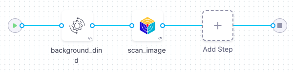
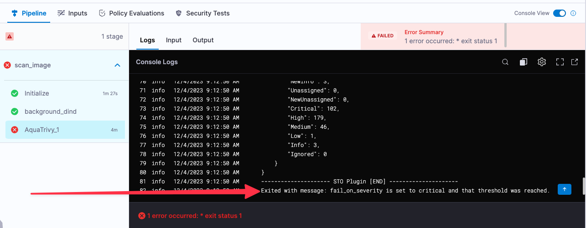

This tutorial shows you how to scan your container images using [Aqua Trivy](https://www.aquasec.com/products/trivy/), a popular open-source scanning tool.

In this tutorial, you'll set up a simple [orchestration workflow](/docs/security-testing-orchestration/get-started/key-concepts/ingest-scan-results-into-an-sto-pipeline) with two steps:

1. A Background step that runs Docker-in-Docker as a service. This is required for any orchestrated or dataload scan of a container image.

2. An Aqua-Trivy step that runs the scan and ingests the results into STO.



:::info Prerequisites

- This tutorial has the following prerequisites:

  - A Harness account and STO module license.
  - You must have a [Security Testing Developer or SecOps role](/docs/security-testing-orchestration/get-started/onboarding-guide/#create-an-sto-pipeline) assigned.
  - A basic understanding of key STO concepts and good practices is highly recommended. Here are some good resources: 
    - [Your first STO pipeline](/docs/security-testing-orchestration/get-started/your-first-sto-pipeline)
    - [Key Concepts in STO](/docs/category/key-concepts-in-sto)
  - A [Harness connector](/docs/platform/connectors/cloud-providers/ref-cloud-providers/docker-registry-connector-settings-reference) to the Docker v2-compliant registry with the image you want to scan. 
    This tutorial uses an [example image on Docker Hub](https://hub.docker.com/r/snyklabs/goof) that contains known vulnerabilities.

:::

## Set up your pipeline

Do the following:

1. Select **Security Testing Orchestration** (left menu, top) > **Pipelines** > **Create a Pipeline**. Enter a name and click **Start**.

2. In the new pipeline, select **Add stage** > **Security**.

3. Set up your stage as follows:

   1. Enter a **Stage Name**.

   2. Disable **Clone Codebase**. You don't need a code repository for this tutorial.


3. In the Pipeline Editor, go to **Infrastructure** and select **Cloud**, **Linux**, and **AMD64** for the infrastructure, OS, and architecture.

   You can also use a Kubernetes or Docker build infrastructure, but these require additional work to set up. For more information, go to [Set up a build infrastructure for STO](/docs/security-testing-orchestration/get-started/onboarding-guide#set-up-a-build-infrastructure-for-sto).

:::note

The following step is required only for Kubernetes or Docker infrastructures. If you're using Harness Cloud, go to [Add the Aqua-Trivy scan step](#add-the-aqua-trivy-scan-step).

:::

## Add a Docker-in-Docker background step

import StoDinDRequirements from '/docs/security-testing-orchestration/sto-techref-category/shared/dind-bg-step.md';

<StoDinDRequirements />

## Add the Aqua-Trivy scan step

import Tabs from '@theme/Tabs';
import TabItem from '@theme/TabItem';

<Tabs>
  <TabItem value="Visual" label="Visual" default>

Add an **Aqua Trivy** step to your pipeline after the DinD background step and configure it as follows:

   1. Scan Mode = **Orchestration**

   2. Target name — Click the Value Selector button on the right side of the input field and select **Runtime Input**.

   3. Target variant — Select **Runtime Input**.

   4. [Container image Type](/docs/security-testing-orchestration/sto-techref-category/trivy/aqua-trivy-scanner-reference#type-1) = **Docker v2**

   5. [Container image Domain](/docs/security-testing-orchestration/sto-techref-category/trivy/aqua-trivy-scanner-reference#domain) = **docker.io**

   6. Container image name — Select **Runtime Input**.

   7. Container image tag — Select **Runtime Input**.

   8. [Fail on Severity](/docs/security-testing-orchestration/sto-techref-category/trivy/aqua-trivy-scanner-reference#fail-on-severity) = **Critical**

</TabItem>
<TabItem value="YAML" label="YAML">

Add an **Aqua Trivy** step to your pipeline after the DinD background step and configure it as follows:

 *  `type:` [`AquaTrivy`](/docs/security-testing-orchestration/sto-techref-category/trivy/aqua-trivy-scanner-reference#security-step-settings-for-aqua-trivy-scans-in-sto-legacy)
   *  `name:` A name for the step.
   *  `identifier:` A unique step ID.
   *  `spec :`
      -  `mode :` [`orchestration`](/docs/security-testing-orchestration/get-started/key-concepts/sto-workflows-overview) In orchestrated mode, the step runs the scan and ingests the results in one step. 
      -  `config: default`
      - `target : ` 
          - `name : <+input>` 
          - `type : container`
          - `variant : <+input>` You will specify the [target name and variant](/docs/security-testing-orchestration/get-started/key-concepts/targets-and-baselines) when you run the pipeline. 
              When scanning a repository, you will generally use the repository name and branch for these fields.
        - `advanced : ` 
          - `log :` 
            - `level : info`
            - [`fail_on_severity`](/docs/security-testing-orchestration/sto-techref-category/trivy/aqua-trivy-scanner-reference#fail-on-severity) `: critical`
        - `privileged: true`
        - `image:`
            - [`type`](/docs/security-testing-orchestration/sto-techref-category/trivy/aqua-trivy-scanner-reference#type-1) `: docker_v2`
            - `name: <+input>` 
            - [`domain`](/docs/security-testing-orchestration/sto-techref-category/trivy/aqua-trivy-scanner-reference#domain) `: docker.io` 
            - `tag: <+input>`

Here's an example:

```yaml
              - step:
                  type: AquaTrivy
                  name: scan_container_image
                  identifier: scan_container_image
                  spec:
                    mode: orchestration
                    config: default
                    target:
                      name: <+input>
                      type: container
                      variant: <+input>
                    advanced:
                      log:
                        level: info
                    privileged: true
                    image:
                      type: docker_v2
                      name: <+input>
                      domain: docker.io
                      tag: <+input>

```

</TabItem>
</Tabs>

## Run the pipeline and check your results

1. In the Pipeline Studio, select **Run** (top right).

2. When prompted, enter your runtime inputs.

   - Under **Target**, enter the [target name and variant](/docs/security-testing-orchestration/get-started/key-concepts/targets-and-baselines).

   - Under **Image**, enter the [image name] and [tag] you want to use. In most cases, you want to use the repository for the target and the branch for the variant. 

   If you're scanning the codebase for the first time, enter the root branch of your repo. This is usually the `main` or `master` branch. 

   If you're scanning the [example image](https://hub.docker.com/r/snyklabs/goof) mentioned above, enter `snyklabs/goof` for the target and image name, and `latest` for the target variant and image tag. 

3. Run the pipeline and then wait for the execution to finish.

   If you used the example image, you'll see that the pipeline failed for an entirely expected reason: you configured the Trivy step to [fail the pipeline](/docs/security-testing-orchestration/get-started/key-concepts/fail-pipelines-by-severity) if the scan detected any critical vulnerabilities. The final log entry for the Semgrep step reads: `Exited with message: fail_on_severity is set to critical and that threshold was reached.`

   

3. Select **Security Tests** and examine any issues detected by your scan.

   

### Specify the baseline

:::tip

It is [good practice](/docs/security-testing-orchestration/get-started/key-concepts/targets-and-baselines#every-target-needs-a-baseline) to specify a baseline for every target. Defining a baseline makes it easy for developers to drill down into "shift-left" issues in downstream variants and security personnel to drill down into "shift-right" issues in the baseline.

:::

1. Select **Test Targets** (left menu).

2. Select the baseline you want for your target.


## YAML pipeline example

Here's an example of the pipeline you created in this tutorial. If you copy this example, replace the placeholder values with appropriate values for your project, organization, and connectors.

```yaml

pipeline:
  name: tutorial-test-container-image-scan-v1
  identifier: tutorialtestcontainerimagescanv1
  projectIdentifier: YOUR_HARNESS_PROJECT_ID
  orgIdentifier: YOUR_HARNESS_ORGANIZATION_ID
  tags: {}
  stages:
    - stage:
        name: scan_image
        identifier: scan_image
        description: ""
        type: SecurityTests
        spec:
          cloneCodebase: false
          platform:
            os: Linux
            arch: Amd64
          runtime:
            type: Cloud
            spec: {}
          execution:
            steps:
              - step:
                  type: Background
                  name: background_dind
                  identifier: background_dind
                  spec:
                    connectorRef: YOUR_IMAGE_REGISTRY_CONNECTOR
                    image: docker:dind
                    shell: Sh
                    entrypoint:
                      - dockerd
              - step:
                  type: AquaTrivy
                  name: scan_image
                  identifier: scan_image
                  spec:
                    mode: orchestration
                    config: default
                    target:
                      name: <+input>
                      type: container
                      variant: <+input>
                    advanced:
                      log:
                        level: info
                      fail_on_severity: critical
                    privileged: true
                    image:
                      type: docker_v2
                      name: <+input>
                      domain: docker.io
                      tag: <+input>
                    sbom:
                      format: spdx-json
          caching:
            enabled: false
            paths: []
          slsa_provenance:
            enabled: false
          sharedPaths:
            - /var/run
```
