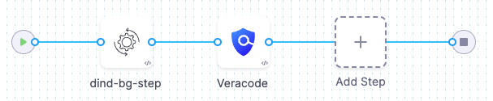

<DocsTag  text="Code repo scanners"  backgroundColor= "#cbe2f9" textColor="#0b5cad" link="/docs/security-testing-orchestration/sto-techref-category/security-step-settings-reference#code-repo-scanners"  />
<DocsTag  text="Orchestration" backgroundColor= "#e3cbf9" textColor="#5c0bad" link="/docs/security-testing-orchestration/get-started/key-concepts/run-an-orchestrated-scan-in-sto"  />
<DocsTag  text="Extraction" backgroundColor= "#e3cbf9" textColor="#5c0bad" link="/docs/security-testing-orchestration/get-started/key-concepts/sto-workflows-overview#extraction-scans-in-sto" />
<DocsTag  text="Ingestion" backgroundColor= "#e3cbf9" textColor="#5c0bad" link="/docs/security-testing-orchestration/get-started/key-concepts/ingest-scan-results-into-an-sto-pipeline" />
<br/>
<br/>

You can scan your code repositories and ingest results from [Veracode](https://docs.veracode.com/).


## Important notes for running Veracode scans in STO 

- Before you can ingest scan results, you must perform all the Veracode prerequisites for the repo that you're scanning. If you're scanning a Java repo, for example, the Veracode documentation outlines the specific packaging and compilation requirements for scanning your Java applications.  

  For specific requirements, go to the [Veracode docs](https://docs.veracode.com) and search for *Veracode Packaging Requirements*.

- You also need access credentials so that STO can communicate with your Veracode instance. Harness recommends using API keys, not usernames and passwords, for your Veracode integrations  

  For instructions, go to the [Veracode docs](https://docs.veracode.com) and search for *Generate Veracode API Credentials*.  

- Harness recommends you create [text secrets](/docs/platform/secrets/add-use-text-secrets) for your authentication credentials — password, API key, API secret key, etc. — and access your secrets using `<+secrets.getValue("my-secret")>`.

<!-- invalid links: The [Veracode - Automated Data Load](https://community.harness.io/t/veracode-automated-data-load/1066) and [Veracode - Activate Scenario](https://community.harness.io/t/veracode-activate-scenario/1067) blog posts include useful information about how to ingest Veracode scan results into Harness. -->


## Workflow descriptions

<details>
<summary>Orchestration/extraction workflows</summary>

import CustomScanWorkflowRepo from './shared/custom-scan/_workflow.md';

<CustomScanWorkflowRepo />

</details>

<details>
<summary>Ingestion workflows</summary>

import CustomScanWorkflowIngest from './shared/custom-scan/_workflow-ingest-only.md';

<CustomScanWorkflowIngest />

</details>

## Custom Scan step settings for Veracode scans

The recommended workflow is to add a Custom Scan step to a Security or Build stage and then configure it as described below.

### Scanner settings

These settings are required for most scanners. For more information, go to the reference for the scanner integration you're setting up.

- [Product name](#product-name)
- [Scan type](#scan-type)
- [Policy type](#policy-type)
- [Product config name](#product-config-name)


#### Product name

The scanner name. This is required for all Custom Scan steps. 

##### Key
```
product_name
```

##### Value

```
veracode
```

#### Scan type

The target type to scan. 

##### Key
```
scan_type
```

##### Value

```
repository
```


#### Policy type

The [scan mode](/docs/security-testing-orchestration/get-started/key-concepts/sto-workflows-overview) to use. 

##### Key
```
policy_type
```

##### Value

```
orchestratedScan
```
```
ingestionOnly
```
```
dataLoad
```

#### Product config name

##### Key
```
product_config_name
```

##### Value

```
default
```

<!-- 
## Required Settings for Veracode scans in STO

To set up a Veracode scan, add a Custom Scan step to your pipeline and add the following settings:

* `product_name` = `veracode`
* `scan_type` = `repository`
* `policy_type` — STO supports the following scan policy types for Veracode:
	+ `orchestratedScan`  — A Custom Scan step in the pipeline runs the scan and ingests the results. This is the easiest to set up and supports scans with default or predefined settings. See [Run an Orchestration Scan in an STO Pipeline](/docs/security-testing-orchestration/orchestrate-and-ingest/run-an-orchestrated-scan-in-sto).
	+ `ingestionOnly` — Run the scan in a Run step, or outside the pipeline, and then ingest the results. This is useful for advanced workflows that address specific security needs. See [Ingest scan results into an STO pipeline](/docs/security-testing-orchestration/orchestrate-and-ingest/ingestion-workflows/ingest-scan-results-into-an-sto-pipeline.md).
	+ `dataLoad` — A Custom Scan step downloads and ingests results from an external scanner.
* `product_config_name` = `default`
* `repository_project` — The name of the repo that gets scanned as shown in the Veracode UI. You use the [Codebase Config object](../../continuous-integration/use-ci/codebase-configuration/create-and-configure-a-codebase.md) in the Harness pipeline to determine the URL of the repo to scan.  
In most cases, this should match the repo name used in your Git provider.
* `repository_branch` — The branch that gets reported in STO for the ingested results. You can specify a hardcoded string or use the runtime variable [`<+codebase.branch>`](/docs/continuous-integration/use-ci/codebase-configuration/built-in-cie-codebase-variables-reference#manual-branch-build-expressions). This sets the branch based on the user input or trigger payload at runtime.  
     In most cases, this field should match the name of Git branch that is getting scanned.
* `fail_on_severity` - See [Fail on Severity](#fail-on-severity).
* `product_auth_type`
	+ `apiKey` — Recommended.  
	Go to the [Veracode docs](https://docs.veracode.com) and search for *Generate Veracode API Credentials*.
	+ `usernamePassword`— Not recommended.
* `product_access_id`
	+ For `usernamePassword` authentication, this is your username.
	+ For `apiKey` authorization, this is your API key.
* `product_access_token`
	+ For `usernamePassword` authentication, this is your password.
	+ For `apiKey` authorization, this is your API Secret key.
* `product_app_id`  — The Veracode GUID, separated with hyphens, for the target application.  

   To determine the App ID, go to the home page for the Veracode app with the results you want to scan. The App ID is the string immediately after the port number in the URL. Thus, for the following app, you would specify `1973759`.  
    
   `https://analysiscenter.veracode.com/auth/index.jsp#HomeAppProfile:88881:1973759` 

   <!-- invalid link: The [Veracode - Automated Data Load](https://community.harness.io/t/veracode-automated-data-load/1066) blog post describes in more detail how you can find your application IDs and project names. -->

### Repository

import StoLegacyRepo from './shared/custom-scan/_repo.md'; 

<StoLegacyRepo />

### Product access

These settings are available to access your Veracode instance when `policy_type` is `orchestratedScan` or `dataLoad`. 

You should [create Harness text secrets](/docs/platform/secrets/add-use-text-secrets) for your encrypted passwords/tokens and reference them using the format `<+secrets.getValue("my-access-token")>`.

#### Product authorization type

##### Key

```
product_auth_type
```

##### Value


```
apiKey
```

Go to the [Veracode docs](https://docs.veracode.com) and search for *Generate Veracode API Credentials*. 

`usernamePassword` is not recommended.

#### Product access Id

##### Key

```
product_access_id
```

##### Value

Your API key.

#### Product access token

##### Key

```
product_access_token
```

##### Value

Your API Secret key.


#### Product application Id

##### Key

```
product_app_id
```

##### Value


To determine the App ID, go to the home page for the Veracode app with the results you want to scan. The App ID is the string immediately after the port number in the URL. Thus, for the following app, you would specify `1973759`.  
    
`https://analysiscenter.veracode.com/auth/index.jsp#HomeAppProfile:88881:1973759` 


###  Ingestion file

import StoLegacyIngest from './shared/custom-scan/_ingestion-file.md'; 

<StoLegacyIngest />


### Fail on Severity

import StoSettingFailOnSeverity from './shared/custom-scan/_fail-on-severity.md';

<StoSettingFailOnSeverity />

## View Veracode policy failures
Veracode policy failures will appear in scan results as `Info` severity issues, with the issue type set to `EXTERNAL_POLICY`. Successfully passed policies will not be included in the scan results.  Additionally, you can apply [OPA policies](/docs/security-testing-orchestration/policies/create-opa-policies) in Harness STO to enforce or manage the policy failures.

## Veracode pipeline example (dataLoad)

The following pipeline example illustrates a dataLoad workflow to ingest data from Veracode. It consists of two steps: 

1. A Background step that runs a Docker-in-Docker service (required if you're using a Custom Scan step to configure your integration). 

2. A [Custom Ingest](/docs/security-testing-orchestration/custom-scanning/custom-scan-reference) step that specifies the information needed to ingest the scan results from the Veracode server.




```yaml

pipeline:
  allowStageExecutions: false
  projectIdentifier: YOUR_PROJECT_ID
  orgIdentifier: YOUR_HARNESS_ORG_ID
  tags: {}
  stages:
    - stage:
        name: scan1
        identifier: build
        type: SecurityTests
        spec:
          cloneCodebase: false
          infrastructure:
            type: KubernetesDirect
            spec:
              connectorRef: YOUR_KUBERNETES_CLUSTER_CONNECTOR_ID
              namespace: YOUR_NAMESPACE
              automountServiceAccountToken: true
              nodeSelector: {}
              os: Linux
          sharedPaths:
            - /var/run
          execution:
            steps:
              - step:
                  type: Background
                  name: dind-bg-step
                  identifier: dindbgstep
                  spec:
                    connectorRef: YOUR_CONTAINER_IMAGE_REGISTRY_CONNECTOR_ID
                    image: docker:dind
                    shell: Sh
                    entrypoint:
                      - dockerd
              - step:
                  type: Security
                  name: Veracode
                  identifier: bandit
                  spec:
                    privileged: true
                    settings:
                      policy_type: dataLoad
                      scan_type: repository
                      repository_project: YOUR_VERACODE_REPOSITORY_PROJECT
                      repository_branch: YOUR_VERACODE_REPOSITORY_BRANCH
                      product_name: veracode
                      product_config_name: veracode-agent
                      product_access_token: <+secrets.getValue("YOUR_VERACODE_TOKEN_SECRET")>
                      product_access_id: <+secrets.getValue("YOUR_VERACODE_ID")>
                      product_app_id: YOUR_VERACODE_PRODUCT_APP_ID
                      product_auth_type: apiKey
                    imagePullPolicy: Always
        variables: []
  identifier: Veracodedataloadexample
  name: Veracode-dataload-example


```