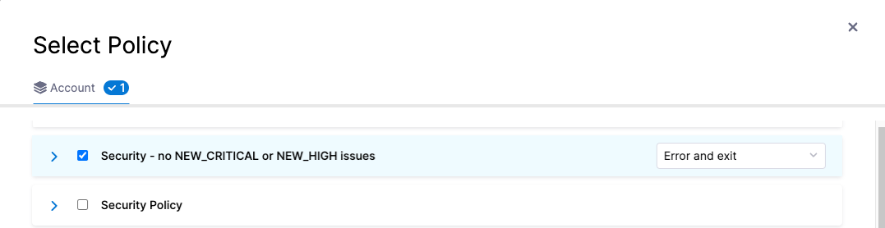
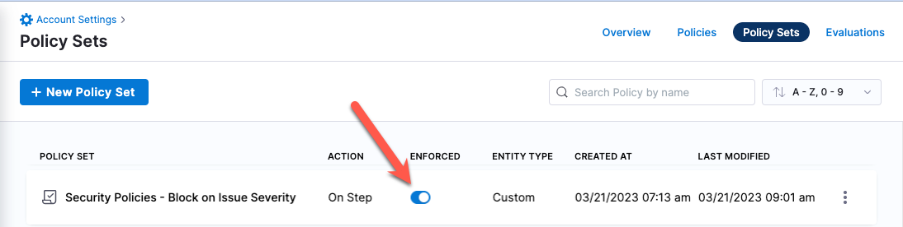

This topic describes two example workflows for setting up automatic notifications based on scan results. 

When you run a scan, the step generates a set of output variables that capture the number of issues detected at each severity level: CRITICAL, HIGH, MEDIUM, and so on. You can [include these variables in automated notifications](#send-notification-emails-with-scan-results), such as emails. You can also [create governance policies that evaluate these variables](#stop-builds-and-generate-notifications-using-governance-policies) and use the results to stop pipeline builds and send automated notifications.


## Send notifications with scan results

In this workflow, you add an Email step that sends a notification whenever the previous scan step finishes successfully. 

1. Add a **Custom** stage to your pipeline immediately after the Build or Security stage that runs the scan.

2. Add an **Email** step to the stage and configure it as follows. Replace `SCAN_STAGE_ID`, `SCAN_STEP_ID`, and `ACCOUNT_ID` with your stage, step, and account IDs. 

```yaml
  - step:
      type: Email
      name: emailOnDetectedIssues
      identifier: emailOnDetectedIssues
      spec:
        to: your.email@your-org.org
        cc: devs@your-org.org
        subject: "STO ALERT: Scan results for <+pipeline.name>"
        body: |- 
             "STO scan of <+pipeline.name> found the following issues:  <br>
             Critical : <+pipeline.stages.SCAN_STAGE_ID.spec.execution.steps.SCAN_STEP_ID.output.outputVariables.CRITICAL> <br>
             New Critical : <+pipeline.stages.SCAN_STAGE_ID.spec.execution.steps.SCAN_STEP_ID.output.outputVariables.NEW_CRITICAL> <br>
             High: <+pipeline.stages.SCAN_STAGE_ID.spec.execution.steps.SCAN_STEP_ID.output.outputVariables.HIGH> <br>
             New High: <+pipeline.stages.SCAN_STAGE_ID.spec.execution.steps.SCAN_STEP_ID.output.outputVariables.NEW_HIGH> <br>
             Medium: <+pipeline.stages.SCAN_STAGE_ID.spec.execution.steps.SCAN_STEP_ID.output.outputVariables.MEDIUM> <br>
             New Medium: <+pipeline.stages.SCAN_STAGE_ID.spec.execution.steps.SCAN_STEP_ID.output.outputVariables.NEW_MEDIUM> <br> 
             See https://app.harness.io/ng/#/account/MY_ACCOUNT_ID/sto/orgs/default/"
      timeout: 1d
```

Now, when the stage with the scan step finishes successfully, the pipeline sends an email like this:

```
"STO scan of sto-notify-test-pipeline found the following issues:
Critical : 0
New Critical : 1
High: 0
New High: 2
Medium: 0
New Medium: 1
See https://app.harness.io/ng/#/account/MY_ACCOUNT_ID/sto/orgs/default/"
```

For more information about pipeline variables and other variables, go to [Built-in and Custom Harness Variables Reference](/docs/platform/Variables-and-Expressions/harness-variables).


## Stop builds and generate notifications using governance policies

:::note
This workflow requires a basic knowledge of governance policies and how to implement them using [Harness Policy as Code](/docs/platform/Policy-as-code/harness-governance-overview) and [Open Policy Agent (OPA)](https://www.openpolicyagent.org/).
:::

In this workflow, you create a simple OPA policy for the pipeline: If the scan detected any NEW_CRITICAL or NEW_HIGH severities, exit the build with an error and send an email. _New-severity_ issues are issues that were found in the scanned target but not the baseline —  or, if the target has no baseline, the previous scan. 


### Create the OPA policy

1. Go to **Account Settings** (left menu) &gt; **Policies**.

2. Click **Policies** (top right) and then **New Policiy**. 

3. Name the policy **Security no NEW_CRITICAL or NEW_HIGH issues**. 

4. In the Edit Policy window, enter the following OPA code: 

   ```
   package pipeline_environment

   deny[sprintf("Scan results can't include any NEW_CRITICAL vulnerabilities '%s'", [input])] {
       input.NEW_CRITICAL != 0 
   }

   deny[sprintf("Scan results can't contain any NEW_HIGH vulnerabilities '%s'", [input])] {
       input.NEW_HIGH != 0 
   }
   ```

5. Click **Save**. 

### Create a policy set

A _policy set_ is a collection of one or more policies. You combine policies into a set and then include it in a Policy step. 

1. In the Policies Overview page, click **Policy Sets** (top right) and then **New Policiy Set**. 

2. Click **New Policy Set**. The Policy Set wizard appears.

3. Overview:

    1. Name = **Security Set - Block on Issue Severity**

    2. Entity type this policy applies to = **Custom**

    3. On what event should the policy be set to = **On Step**. 
   
       These settings allow you to apply the member policies to a specific step, which you'll define below. 

4. Policy evaluation criteria: 
 
   1. Click **Add Policy**.
    
   2. Select the policy you just created and set the pull-down to **Error and Exit**. This is the action to take if any policies in the set are violated. 

     

   3. Click **Apply** to add the policy to the set, then **Finish** to close the Policy Set wizard.

   4. :exclamation: In the **Policy Sets** page, enable  **Enforced** for your new policy set.

      


### Add a step to evaluate your policy against the scan results

Now you will create a Policy step that applies the policy set you just defined against the output variables from the scan. If the scan detected any NEW_CRITICAL or NEW_HIGH issues, the pipeline fails. 

1. Add a **Custom** stage after the stage with the scan step, if you don't have one already. 

2. Add a **Policy** step to the stage.

3. Configure the step as follows:

   1. Entity Type = **Custom**

   2. Policy Set — Add the policy set you just created. 

   3. Payload — Enter the following payload. Make sure that you replace `SCAN_STAGE_ID` and `SCAN_STEP_ID` with the stage and step IDs in your pipeline

      ```json
      {
      "NEW_CRITICAL": <+pipeline.stages.SCAN_STAGE_ID.spec.execution.steps.SCAN_STEP_ID.output.outputVariables.NEW_CRITICAL>, 
      "NEW_HIGH": <+pipeline.stages.SCAN_STAGE_ID.spec.execution.steps.SCAN_STEP_ID.output.outputVariables.NEW_HIGH>
      }
      ```


### Set up email notifications for pipeline failures

You have a Policy that fails the pipeline based on an OPA policy. Now you can configure the stage to send an email notification automatically whenever the pipeline fails. 


1. Click **Notifications** (right-side menu). The New Notification wizard appears.

2. Set up the notification as follows:

     1. Overview page —  Enter a notifcation name such as **Pipeline failed -- NEW_CRITICAL or NEW_HIGH issues detected**.

     2. Pipeline Events page  —  Select **Stage Failed**, for the event that triggers the notification, and the stage that has the Policy step you just created.

     3. Notification Method page  — Specify **Email** for the method and specify the recipient emails. 


## YAML pipeline example

The following pipeline includes both of these notification workflows. For every successful scan, it sends an automated email like this:

```
"STO scan of dbothwell-notify-test v3 found the following issues:
Critical : 1
New Critical : 0
High: 0
New High: 0
Medium: 0
New Medium: 0
See https://app.harness.io/ng/#/account/XXXXXXXXXXXXXXXXXXXXXX/sto/orgs/default/"
```


 If the scan finds any NEW_CRITICAL or NEW_HIGH issues, it stops the build and sends an email like this: 

 ```
 Stage Block_on_New_Critical_and_New_High_issues failed in pipeline notification_examples_pipeline
triggered by D*** B***
Started on Tue Mar 21 16:42:09 GMT 2023 and StageFailed on Tue Mar 21 16:42:11 GMT 2023
Execution URL  https://app.harness.io/ng/#/account/XXXXXXXXXXXXXXXXXXXXXX/sto/orgs/default/projects/myProject/pipelines/stonotifyexample_-_v3/executions/XXXXXXXXXXXXXXXXXXXXXX/pipeline
2s
 ```

Here's the full pipeline. Note that the policy and policy set are referenced, but not defined, in the pipeline itself.

```yaml
pipeline:
  name: sto-notify-example v3
  identifier: stonotifyexample_-_v3
  projectIdentifier: myProject
  orgIdentifier: myorg
  tags: {}
  properties:
    ci:
      codebase:
        connectorRef: MY_GITHUB_CONNECTOR
        build: <+input>
  stages:
    - stage:
        name: banditScanStage
        identifier: banditScanStage
        description: ""
        type: SecurityTests
        spec:
          cloneCodebase: true
          execution:
            steps:
              - step:
                  type: Bandit
                  name: Bandit_1
                  identifier: Bandit_1
                  spec:
                    mode: orchestration
                    config: default
                    target:
                      name: dvpwaScanStep-v3
                      type: repository
                      variant: <+codebase.branch>
                    advanced:
                      log:
                        level: info
          infrastructure:
            type: KubernetesDirect
            spec:
              connectorRef: MY_DELEGATE_CONNECTOR
              namespace: sto-lab
              automountServiceAccountToken: true
              nodeSelector: {}
              os: Linux
    - stage:
        name: Block on New-Critical and New-High issues
        identifier: Block_on_New_Critical_and_New_High_issues
        description: ""
        type: Custom
        spec:
          execution:
            steps:
              - step:
                  type: Email
                  name: emailOnNotification
                  identifier: Email_1
                  spec:
                    to: john.smithh@myorg.org
                    cc: ""
                    subject: "STO ALERT: Issues found in <+pipeline.name>"
                    body: |-
                      "STO scan of <+pipeline.name> found the following issues: <br> 
                       Critical : <+pipeline.stages.banditScanStage.spec.execution.steps.Bandit_1.output.outputVariables.CRITICAL> <br>
                       New Critical : <+pipeline.stages.banditScanStage.spec.execution.steps.Bandit_1.output.outputVariables.NEW_CRITICAL> <br>
                       High: <+pipeline.stages.banditScanStage.spec.execution.steps.Bandit_1.output.outputVariables.HIGH> &#10; <br>
                       New High: <+pipeline.stages.banditScanStage.spec.execution.steps.Bandit_1.output.outputVariables.NEW_HIGH> <br>
                       Medium: <+pipeline.stages.banditScanStage.spec.execution.steps.Bandit_1.output.outputVariables.MEDIUM> <br>
                       New Medium: <+pipeline.stages.banditScanStage.spec.execution.steps.Bandit_1.output.outputVariables.NEW_MEDIUM>  <br>
                       See https://app.harness.io/ng/#/account/MY_ACCOUNT_ID/sto/orgs/default/"
                  timeout: 1d
              - step:
                  type: Policy
                  name: Policy_1
                  identifier: Policy_1
                  spec:
                    policySets:
                      - account.Security_Set_Block_on_Issue_Severity
                    type: Custom
                    policySpec:
                      payload: |-
                        {
                        "NEW_CRITICAL": <+pipeline.stages.banditScanStage.spec.execution.steps.Bandit_1.output.outputVariables.NEW_CRITICAL>, 
                        "NEW_HIGH": <+pipeline.stages.banditScanStage.spec.execution.steps.Bandit_1.output.outputVariables.NEW_HIGH>
                        }
                  timeout: 10m
                  failureStrategies: []
        tags: {}
  notificationRules:
    - name: example sto test
      identifier: example_sto_test
      pipelineEvents:
        - type: StageFailed
          forStages:
            - Block_on_Critical_and_High_issues
      notificationMethod:
        type: Email
        spec:
          userGroups: []
          recipients:
            - john.smithh@myorg.org
      enabled: true

```