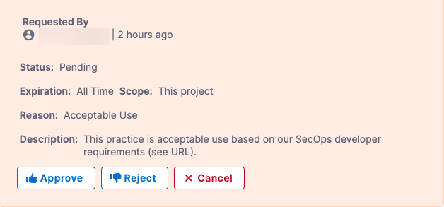

The `fail_on_severity` setting causes a pipeline build to fail if a Security Scan step detects one or more issues with the specified severity (Critical, High, Medium, etc.). Your organization can create "Ignore rules" for specific issues to override this behavior. If an Ignore rule is approved, a build can proceed even if a scan detects that issue.  

:::note 
Developers and SecOps users can request Ignore rules, but only SecOps users can approve them.
::: 

## Before You Begin

This topic assumes that you have the following:

* An STO pipeline as described in [Set up Harness for STO](../onboard-sto/20-set-up-harness-for-sto.md).
* The pipeline has a Security Scan step with a configured `fail_on_severity` setting.
* At least one successful build with a set of detected security issues.  

## Request an Ignore Rule (_Developers or SecOps users_) 
     
1. Go to the Security Tests page for the build: In the Pipeline studio, click **Execution History** (top right) and then go to a successful build.  

2. In the **Security Tests** tab, do the following:
   1. Click in the row to open the **Issue Details** pane. 
   2. Click the **Ignore** button.

      
   
   3. In the **Request to Ignore an Issue** popup, configure the Ignore request as follows:
      1. **Where do you want this issue to be ignored?** (*if available*)
      2. **For how long?** (*if available*)
      3. **Reason this issue should be exempted**
      4. **URL Reference** — Paste the link you copied in the previous request, or add a different link that provides information about the specific issue you want the pipeline to ignore. If your repo already addresses the issue, for example, you can include a link to the relevant code. 
   5. Click **Create Request**. 
  
      
     
3. Send a notification of your exemption request — via email, Slack, Jira, etc. — to your SecOps reviewer. Your notification should include the URL to the Security Tests page with the relevant issue selected.

## Review, Approve, and Reject Ignore Rules (_SecOps users only_)

An Ignore rule, if approved, overrides the default behavior for running a pipeline build:

* If a pipeline includes a Security Tests step, the step scans the specified object and compiles a list of detected issues.
* Each issue has a specified severity: Critical, Major, Minor, etc.
* Each Security Test step should have a `fail_on_severity` setting. If the step detects any issue with the specified severity, the build fails. 
* Each Ignore rule applies to one specific issue. The rule allows the pipeline to proceed even if the scan detects that issue.    

### Review an Ignore Rule 

1. You should receive a notification from a developer that includes a URL to the relevant issue. Go to the URL provided.
 
   The notification URL should point to a Security Tests page in Harness with the issue selected in the **Issue Details** pane on the right. If the relevant issue isn't visible, notify the developer. 

2. Review the exemption request. The **Issue Details** pane includes a high-level summary of the issue, links to relevant documentation, and a list of all locations in the scanned object where the issue was detected. 

 :::note 
 The **Issue Details** pane is comprehensive, but might not include all the information you need. You might want to research the issue further before you approve the request.
 :::

    
          
### Review all Ignore Rules

You can review all Ignore rules in the current project in the **Security Review** page. 

1. Click **Security Tests** (left menu) and then **Security Review** (second-from-left menu).

2. In the Security Review page, click the Approve, Reject, or Delete buttons for individual rules as needed.

   
