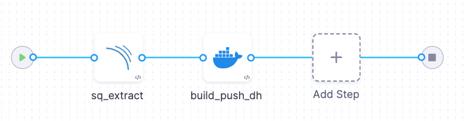

Extraction scans can be useful when you're working with SaaS-based scanners such as[SonarQube](/docs/security-testing-orchestration/sto-techref-category/sonarqube-sonar-scanner-reference) and [Burp Enterprise](/docs/security-testing-orchestration/sto-techref-category/burp-scanner-reference), where you can extract scan results from an API endpoint. 

There most common use cases for Extraction mode are:

1) Extract results from a scan that has already run.

   Suppose you have a scan job defined in your SaaS instance that automatically scans a target whenever it gets updated. In this case, you can use Extraction mode to ingest the latest scan results for that target.

2) Extract results from a custom scan.

   - Orchestration mode is useful if you're running a default scan in the SaaS instance.
   - Extraction mode is useful when you have a custom scan job defined in the SaaS instance. An example pipeline might look something like this:

     1) A Run step sends a request to the scanner API that starts the custom scan.
     2) A scan step, such as SonarQube or Veracode, runs in Extraction mode. When the custom scan finishes, the step extracts the results from the scanner API and correlates, deduplicates, and ingests the results.

### Example workflow: extract results from your SonarScanner SaaS instance

Suppose you have a custom scan job in SonarScanner that runs a scan on a release branch whenever a developer updates it. You have a CI/STO pipeline to generate a container image from that branch, but you want to ensure that the branch doesn't have any critical vulnerabilities first. In this case, you can set up your pipeline like this: 

1. Add a Build stage to your pipeline.

2. Set up your [Codebase](/docs/continuous-integration/use-ci/codebase-configuration/create-and-configure-a-codebase/). 

2. Add a SonarQube step and configure it as follows:

   1. [Scan mode](/docs/security-testing-orchestration/sto-techref-category/sonarqube-sonar-scanner-reference/#scan-configuration) = **Extraction**
   2. [Scan configuration](/docs/security-testing-orchestration/sto-techref-category/sonarqube-sonar-scanner-reference/#scan-configuration) = **Default**
   3. [Target and variant detection](/docs/security-testing-orchestration/sto-techref-category/sonarqube-sonar-scanner-reference/#target-and-variant-detection) = **Manual**
   4. [Target name](/docs/security-testing-orchestration/sto-techref-category/sonarqube-sonar-scanner-reference/#target-and-variant-detection) The scanned repo  
   4. [Target variant](/docs/security-testing-orchestration/sto-techref-category/sonarqube-sonar-scanner-reference/#target-and-variant-detection) The scanned branch
   5. [Domain](//docs/security-testing-orchestration/sto-techref-category/sonarqube-sonar-scanner-reference/#domain) The SonarQube instance URL
   6. [Access token](/docs/security-testing-orchestration/sto-techref-category/sonarqube-sonar-scanner-reference/#access-token) to your SaaS instance
   7. [SonarQube project key](/docs/security-testing-orchestration/sto-techref-category/sonarqube-sonar-scanner-reference/#access-token)

3. Specify your failure criteria for the step using [Fail on Severity](/docs/security-testing-orchestration/get-started/key-concepts/fail-pipelines-by-severity) or [OPA policies](/docs/security-testing-orchestration/use-sto/stop-builds-based-on-scan-results/stop-pipelines-using-opa).

4. Add a [Build and Push](/docs/continuous-integration/use-ci/build-and-upload-artifacts/build-and-push/build-and-push-to-docker-registry) step to build an image and push it to Docker Hub (assuming the scan results don't violate your failure criteria).

<figure>

<figcaption>Example Build stage using SonarQube step in Extraction mode</figcaption>
</figure>

