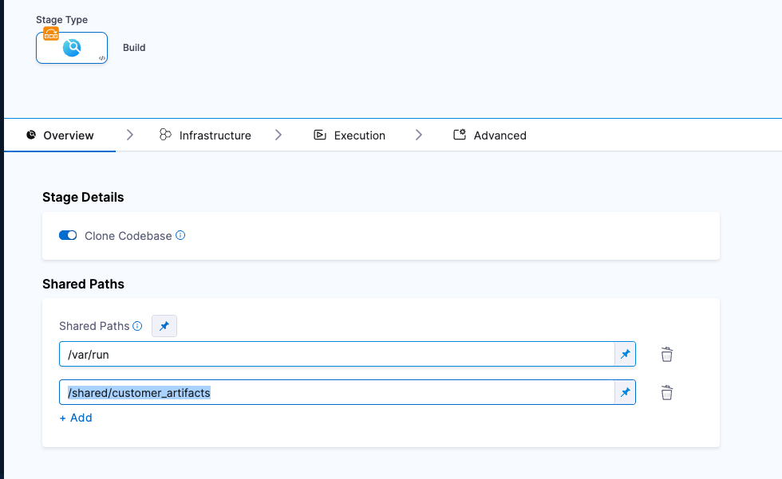

[Static Analysis Results Interchange Format (SARIF)](https://docs.github.com/en/code-security/code-scanning/integrating-with-code-scanning/sarif-support-for-code-scanning) is an open data format supported by many scan tools, especially tools available as GitHub Actions. You can easily ingest SARIF 2.1.0 data from any tool that supports this format. 

The following workflow describes how to set up an ingestion pipeline for any scanner that supports SARIF. 

### Ingestion workflow description

1. In your Harness pipeline, go to the Overview tab of the security stage and enter a shared path such as `/shared/customer_artifacts`.
 
   

2. Publish your scan results to a data file in [SARIF 2.1.0 ](https://docs.oasis-open.org/sarif/sarif/v2.1.0/sarif-v2.1.0.html) format.  

   You might want to set up a Run step to generate your scans automatically whenever the pipeline runs. 
   
   <!-- See [CodeQL Scanner Reference](/docs/security-testing-orchestration/sto-techref-category/codeql-scanner-reference) for an example workflow. -->

3. Copy the SARIF file to the `/shared/customer_artifacts` folder. 

3. Add an ingestion step after the Run step and configure it as follows.

:::note
If you're using a scanner that has a scanner template, use the scanner template to ingest your results. Otherwise use a [Custom Ingest](/docs/security-testing-orchestration/sto-techref-category/custom-ingest-reference) step. 
::: 

### Ingestion settings

#### Target Name 
   
```mdx-code-block
import StoSettingProductID from '../../sto-techref-category/shared/step_palette/_sto-ref-ui-prod-id.md';
```

<StoSettingProductID />

#### Target Variant 
   
```mdx-code-block
import StoSettingTargetVariant from '../../sto-techref-category/shared/step_palette/_sto-ref-ui-target-variant.md';
```

<StoSettingTargetVariant  />


   
#### Ingestion File 

```mdx-code-block
import StoSettingIngestionFile from '../../sto-techref-category/shared/step_palette/_sto-ref-ui-ingestion-file.md';
```

<StoSettingIngestionFile  />


#### Fail on Severity

```mdx-code-block
import StoSettingFailOnSeverity from '../../sto-techref-category/shared/step_palette/_sto-ref-ui-fail-on-severity.md';
```
<StoSettingFailOnSeverity />


### Example workflows

<!-- * [CodeQL Scanner Reference](/docs/security-testing-orchestration/sto-techref-category/codeql-scanner-reference) -->
For example workflows that show how you can ingest SARIF data, go to [Run scans using GitHub Action and Drone Plugin steps](/docs/security-testing-orchestration/use-sto/orchestrate-and-ingest/run-scans-using-github-actions)

