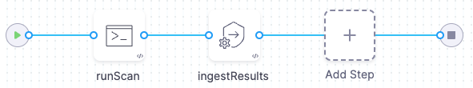

In an ingestion-only workflow, the scan step ingest results generated in a previous step or outside the pipeline. The pipeline then analyzes, deduplicates, and displays the results. Ingestion-only workflows enable you to do the following:

- Ingest results from scanners that don't currently have integrations with Harness STO. 
- Create advanced workflows that aren't possible with orchestrated scans. 
- Run custom scans with advanced settings that address specific security requirements. 
- Ingest results from multiple scans into the same pipeline, aggregate and deduplicate the data, and view all your results in a single pane of glass.

To ingest scan results from outside a Security step, you set up your pipeline as follows:

1. A Run step saves scan results to a shared folder. The step might run the scan locally, download results from an external source, or copy results from the codebase into the shared folder.

2. A [Security step or scanner template](/docs/security-testing-orchestration/sto-techref-category/security-step-settings-reference#security-steps-and-scanner-templates-in-sto) ingests the results from the shared folder. Then it analyzes, deduplicates, and displays the results.

For a complete list of supported scanners, go to [Harness STO scanner support
](/docs/security-testing-orchestration/sto-techref-category/security-step-settings-reference#harness-sto-scanner-support).  

If your scanner isn't listed, you can still ingest your scan results into STO. 

- If your scanner can publish to SARIF format, go to [Ingest SARIF scan results into STO](/docs/security-testing-orchestration/use-sto/orchestrate-and-ingest/ingest-sarif-data). 

- For other scanners, go to [Ingest Results from Custom or Unsupported Scanners](/docs/security-testing-orchestration/use-sto/orchestrate-and-ingest/ingesting-issues-from-other-scanners.md). 

### Example workflows 

Here are some example ingestion-only workflows that target specific use cases:

- [SAST code scans using Semgrep](/tutorials/security-tests/sast-scan-semgrep)
- [Run STO scans using GitHub Action and Drone Plugin steps](/docs/security-testing-orchestration/use-sto/orchestrate-and-ingest/run-scans-using-github-actions)
- [Example workflow: Ingest SARIF data from a Checkmarx GitHub Action scan](/docs/security-testing-orchestration/sto-techref-category/checkmarx-scanner-reference)
- [Create a build-scan-push pipeline (STO only)](/tutorials/security-tests/build-scan-push-sto-only)

### See Also

- [STO ingestion workflows](/docs/security-testing-orchestration/use-sto/orchestrate-and-ingest/sto-workflows-overview)
- [Ingest SARIF scan results into STO](/docs/security-testing-orchestration/use-sto/orchestrate-and-ingest/ingest-sarif-data)
- [Ingest Results from custom or unsupported scanners](./ingesting-issues-from-other-scanners.md)

