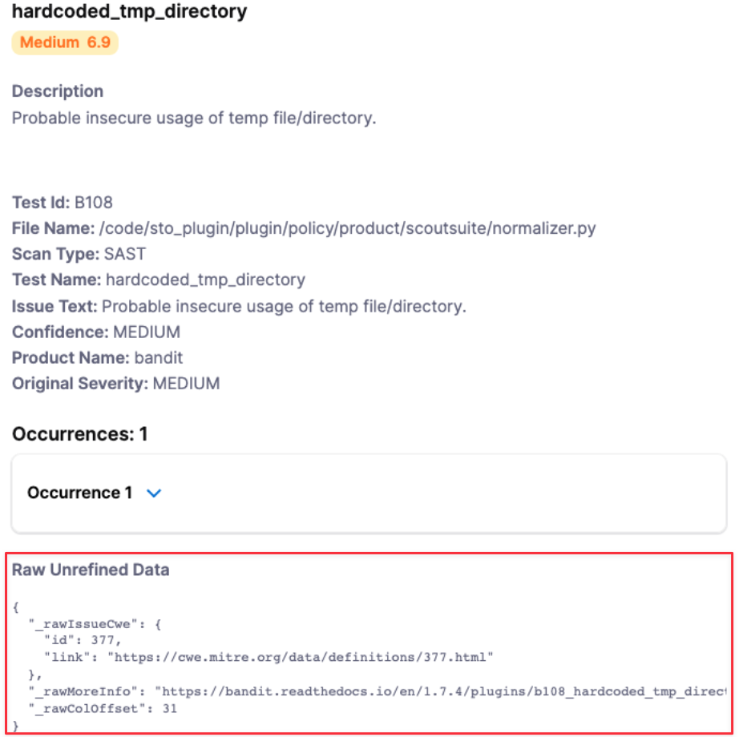
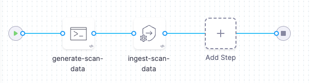

You can ingest custom Issues from any scanning tool. STO supports a generic JSON format for ingesting data from scanners that currently have no integration in STO.

By ingesting your custom Issues, you can benefit from STO's refinement, deduplication, and correlation features. Harness handles your issue data the same way as data from supported scanners.

###  Requirements

* You have a valid STO license and access to the Harness platform.
* You have a JSON file of the issues you want to ingest. The data file must match the [JSON format](#json-data-format-reference) specified below.

### Required Steps

1. In your Harness pipeline, go to the Overview tab of the security stage and enter a shared path such as `/shared/customer_artifacts`.
 
   

2. Generate your issues data in the [required JSON format](#jaon-data-format-reference) described below and then save it in the shared folder.  
  You might want to set up a Run step to generate your scans automatically whenever the pipeline runs. Go to [Ingest Scan Results into an STO Pipeline](ingest-scan-results-into-an-sto-pipeline.md) for an example.

3. Add a **Custom Ingest** step and configure the scanner to ingest the results of the scan. For information about how to configure this step, go to [Custom Ingest settings reference](docs/security-testing-orchestration/sto-techref-category/custom-ingest-reference.md).


###  JSON data format reference

The following example illustrates the required format for your data:

```yaml
{  
   "meta":{  
      "key":[  
         "issueName",  
         "fileName"  
      ],  
      "subproduct":"MyCustomScanner"  
   },  
   "issues":[  
      {  
         "subproduct":"MyCustomScanTool",  
         "issueName":"Cross Site Scripting",  
         "issueDescription":"Lorem ipsum...",  
         "fileName":"homepage-jobs.php",  
         "remediationSteps":"Fix me fast.",  
         "risk":"high",  
         "severity":8,  
         "status":"open",  
         "referenceIdentifiers":[  
            {  
               "type":"cwe",  
               "id":"79"  
            }  
         ]  
      }  
   ]  
}
```

The basic schema includes a `“meta”` section, which requires the following: 

* `“key”`

   The name of the attribute used to deduplicate multiple occurrences of an issue. In the example data file above, `"key"` = `"issueName"`. Thus if the data includes multiple occurrences of an issue with the same `"issueName"`, the pipeline combines these occurrences into one issue. The resulting issue includes a list of all occurrences and the data for each individual occurrence.
   
   The key used for deduplication must be a Harness field. Do not try to deduplicate based on non-Harness fields. 

* `“subproduct”` 

   The scan tool name to apply to the overall issue. 
   
The full JSON takes the form:


```json
"meta":   
     { ... },   
     "issues": [   
        { "issue-1" : "data" },   
        { "issue-2" : "data" },  
        { "issue-3" : "data" }  
}
```


#### **Required fields**

|  |  |  |
| --- | --- | --- |
| **Name** | **Format** | **Description** |
| `issueName` | String | Name of vulnerability, license issue, compliance issue, etc. |
| `issueDescription` | String (long) | Description of vulnerability, license issue, compliance issue, etc. |
| `subProduct` | String | The scan tool name to apply to the individual occurrence of the issue. |
| `severity` | Float | CVSS 3.0 score (a number from 1.0-10.0) |

#### **Recommended fields**


|  |  |  |
| --- | --- | --- |
| **Name** | **Format** | **Description** |
| `confidence` | Float | Derived from the tool output. |
| `cvss` | String (long) | Derived from the tool output. |
| `fileName` | String | Recommended to assist in triaging errors (if present). |
| `host` | String | Recommended to assist in triaging errors (if present). |
| `ip` | String | Recommended to assist in triaging errors (if present). |
| `issueType` | String | Type of issue (e.g. vulnerability, license issue, compliance issue, etc.) |
| `lineNumber` | String | Recommended to assist in triaging errors (if present). |
| `link` | String | Recommended to assist in triaging errors (if present). |
| `port` | Integer | Recommended to assist in triaging errors (if present). |
| `product` | String | Logical metadata field that can be used for tracking of product(s). |
| `project` | String | Logical metadata field that can be used for tracking of project(s) |
| `remediationSteps` | String (long) | Remediation instructions, often provided by the scan tool. |
| `scanSeverity` | String | The severity as reported by the scan tool. |
| `scanStatus` | String | Recommended for measuring scan duration and status. |
| `tags` | String | Logical metadata tags, which can be leveraged to describe asset owners, teams, business units, etc. |
| `url` | String | Recommended to assist in triaging errors (if present). |

#### **Optional fields**

|  |  |  |
| --- | --- | --- |
| **Name** | **Format** | **Description** |
| `author` | String | Logical metadata field designed to track the owner of the scan result. |
| `effort` | String (long) | Logical metadata field designed to gauge the required effort to remediate a vulnerability. |
| `exploitabilityScore` | Float | Derived from the tool output. |
| `imageLayerId` | String | Metadata field to track image layer ID from containers. |
| `imageNamespace` | String | Logical metadata field. |
| `impactScore` | String | Derived from the tool output. |
| `libraryName` | String | Derived from the tool output. |
| `license` | String | Derived from the tool output. |
| `linesOfCodeImpacted` | String | Recommended to assist in triaging errors (if present). |
| `referenceIdentifiers` | Array | An array of Vulnerability identifiers, such as `cve`, `cwe`, etc. Here's an example. Note that the `type` value must be lowercase. &#13; `“referenceIdentifiers”: [     {“type” : “cve”,“id” : “79”},     {"type" : "cwe", "id" : "83"}]`  |


##### Custom fields

You can add custom fields to an issue. The only restriction is that you cannot use any of the [reserved keywords](#reserved-keywords) listed above. To include raw, unrefined data, add the prefix "`_raw`" to the field name. For example, you can add the following "`_raw`" fields to an issue:


```
{  
   "testName":"hardcode_tmp_directory",  
     ......  
   "referenceIdentifiers":[  
      {  
         "type":"cwe",  
         "id":"79"  
      }  
    ],  
   "_rawIssueCwe": {  
     "id" : 377,  
     "link" : "https://cwe.mitre.org/data.definitions/377.html"  
   },  
   "_rawMoreInfo" : "https://bandit.readthedocs.io/en/1.7.4/plugins/b108_hardcoded_tmp_directory.html",  
   "_rawColOffset":31  
}
```
The custom fields will get grouped together at the end of the issue details like this:



#### Reserved Keywords

The following keywords are reserved and cannot be used in your JSON file:

* `alertRulesets`
* `customerId`
* `discoveryIssueId`
* `discoveryRunTime`
* `discoveryTimespan`
* `ignore`
* `ignoreRulesets`
* `jobId`
* `policyId`
* `policyName`
* `refinementVersion`
* `remediationRunTime`
* `remediationTimespan`
* `runTime`
* `scenarioId`
* `severityCode`
* `target`
* `targetId`

## Pipeline example

The following pipeline shows an end-to-end ingestion workflow. The pipeline consist of a Security Tests stage with two steps:

1. A Run step that generates a JSON data file `/shared/customer_artifacts/example.json` in the format described above.

2. A Custom Ingest step that ingests and normalizes the data from `/shared/customer_artifacts/example.json`. 



```yaml
pipeline:
  projectIdentifier: myProject
  orgIdentifier: default
  tags: {}
  stages:
    - stage:
        name: custom-scan-stage
        identifier: customscanstage
        type: SecurityTests
        spec:
          cloneCodebase: false
          execution:
            steps:
              - step:
                  type: Run
                  name: generate-scan-data
                  identifier: Run_1
                  spec:
                    connectorRef: MYDOCKERHUBCONNECTOR
                    image: alpine:latest
                    shell: Sh
                    command: |-
                      cat <<EOF >> /shared/customer_artifacts/example.json
                      {  
                         "meta":{  
                            "key":[  
                               "issueName",  
                               "fileName"  
                            ],  
                            "subproduct":"MyCustomScanner"  
                         },  
                         "issues":[  
                            {  
                               "subproduct":"MyCustomScanTool",  
                               "issueName":"Cross Site Scripting",  
                               "issueDescription":"Lorem ipsum...",  
                               "fileName":"homepage-jobs.php",  
                               "remediationSteps":"Fix me fast.",  
                               "risk":"high",  
                               "severity":8,  
                               "status":"open",  
                               "referenceIdentifiers":[  
                                  {  
                                     "type":"cwe",  
                                     "id":"79"  
                                  }  
                               ]  
                            }  
                         ]  
                      }
                      EOF
                      ls /shared/customer_artifacts
                      cat /shared/customer_artifacts/example.json
              - step:
                  type: CustomIngest
                  name: ingest-scan-data
                  identifier: CustomIngest_1
                  spec:
                    mode: ingestion
                    config: default
                    target:
                      name: external-scanner-test
                      type: repository
                      variant: main
                    advanced:
                      log:
                        level: info
                    ingestion:
                      file: /shared/customer_artifacts/example.json
          sharedPaths:
            - /shared/customer_artifacts
          caching:
            enabled: false
            paths: []
          platform:
            os: Linux
            arch: Amd64
          runtime:
            type: Cloud
            spec: {}
  identifier: custom_ingestion_JSON_test
  name: custom ingestion JSON test
```