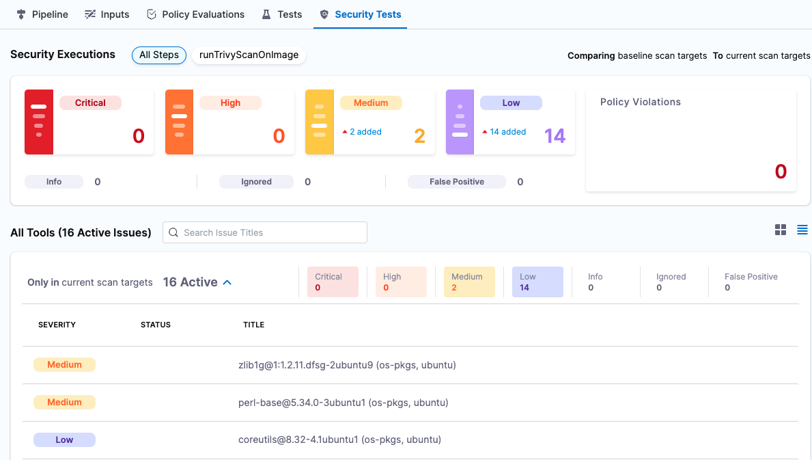

An *orchestrated scan* is a fully automated workflow that scans an object and ingests the results into Harness in one Security step. Orchestrated scans are the easiest to set up and are a great way to get started with STO.

STO supports orchestrated scan for popular open-source scanners such as Aqua-Trivy and Bandit as well as commercial scanners such as SonarQube.

In the following example workflow, you will clone the base pipeline created in [Set up Harness for STO](../../get-started/onboarding-guide.md) and configure it to scan a Docker image using Aqua Trivy.

1. In the Pipeline Studio, go to the project where you create your base pipeline. Click the top-right menu, choose **Clone**, and save the new pipeline as **Trivy Image Scan Orchestrated**.
2. In your new pipeline, go to **securityTestStage** and open the **banditScan** step.
3. Rename the step to **ScanContainerImage**.

### Settings for orchestrated scans in STO

Orchestrated scan settings generall fall into two categories: information about the scan operation, and information about the object to scan.

Specify the following:

1. The scanner to use: `product_name` = `aqua-trivy`
2. The scanner settings to use: `product_config_name` = `aqua-trivy`
3. The scan type: `policy_type` = `orchestratedScan`

### Scanned object settings for orchestrated scans in STO

Now you can specify the object to scan. In this example, you'll scan an image on Docker Hub based on the [DVPWA](https://github.com/anxolerd/dvpwa) GitHub project. Specify the following:

1. The object type to scan: `scan_type` = `container`
2. The type of container to scan — in this case, we're scanning a Docker v2 image: `container_type` = `docker_v2`
3. The registry domain that hosts the image: `container_domain` = `docker.io`
4. The image to pull (`container_project` setting).  
This is based on the image you would specify using the `docker pull` command. In this example, you will scan the latest [ubuntu image](https://hub.docker.com/_/ubuntu/tags). The command to pull this is:  
`docker pull ubuntu:latest`  
 Therefore, specify: `container_project` = `ubuntu`
5. The image tag. In this case, enter: `container_tag` = `latest`

### Save the pipeline and run the orchstrated scan

Now that you've set up the Security step with the previous settings, you can save and run the pipeline. When the pipeline finishes, click **Security Tests** to view the results.

### See Also

* [STO Ingestion Workflows](./sto-workflows-overview.md)
* [Ingest Scan Results into an STO Pipeline](ingest-scan-results-into-an-sto-pipeline.md)
* [Security Step Settings Reference](../../sto-techref-category/security-step-settings-reference.md)

