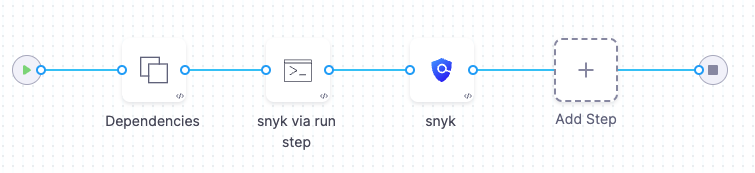
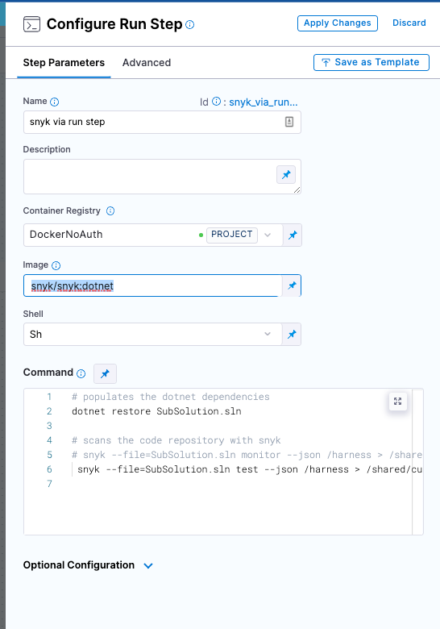

This workflow describes how to ingest Snyk scan results into a Harness pipeline. STO supports the following scan approaches for the following Snyk products:
* Snyk Open Source ([orchestratedScan](./run-an-orchestrated-scan-in-sto.md), [ingestionOnly](./ingest-scan-results-into-an-sto-pipeline.md))
* Snyk Code ([ingestionOnly](./ingest-scan-results-into-an-sto-pipeline.md))
* Snyk Container ([ingestionOnly](./ingest-scan-results-into-an-sto-pipeline.md))

### Important notes

* You must have a [Snyk API key](https://docs.snyk.io/snyk-api-info/authentication-for-api) to run Snyk scans. You should also create a [Harness secret](/docs/platform/secrets/secrets-management/secrets-and-log-sanitization) for your API key.

* This workflow assumes you're familiar with the following:

  * [Set up Harness for STO](../../get-started/onboarding-guide.md) 
  * [Ingest Scan Results into an STO Pipeline](ingest-scan-results-into-an-sto-pipeline.md) 
  * [Setup requirements for AWS CodePipeline](https://docs.snyk.io/integrations/ci-cd-integrations/aws-codepipeline-integration/setup-requirements-for-aws-codepipeline)
  
    Check this page in the Snyk docs to see if you need to build the project before scanning. These requirements are applicable to Harness pipelines as well as AWS CodePipeline.  

### Workflow Example

The following example describes how to scan a local .NET image built using Mavan. A Run step installs the build; then it scans the image and saves the output to a shared folder. A Security step then ingests the output file.



1. In your Harness pipeline, go to the Overview tab of the Security stage. Under **Shared Paths**, enter a shared path such as `/shared/customer_artifacts`.

2. Add a Run step that runs the build (if required) and saves the results to the shared folder:

3. For the Run step **Image**, use a [supported Snyk image](https://github.com/snyk/snyk-images#current-images) based on the type of code in your codebase.  

4. In the Run step **Command** field, add code to build a local image (if required) and save the scan results to the shared folder.  
 
   You can run a scan in this step or copy results from an external scan. In either case, the results file needs to be in the `/shared/customer_artifacts/` folder where the Security step can access it.  
 
   In this example, the Run step  populates the DotNet dependencies, scans the code repository with Snyk, and saves the output to `/shared/customer_artifacts/SubSolution.json`.   

   ```
   dotnet restore SubSolution.sln
   snyk --file=SubSolution.sln test --json /harness > /shared/customer_artifacts/SubSolution.json
   ```

5. In the Run step **Environment Variables** field, under **Optional Configuration**, add a variable to access your Snyk API key:
 
   `SNYK_TOKEN` = `<+secrets.getValue("snyk_api_token")>`  
   
   Your Run step should now look like this:
   
   
 
6. In the Run step > **Advanced** tab > **Failure Strategies**, set the Failure Strategy to **Mark as Success**. 
 
   This step is required to ensure that the pipeline proceeds if Snyk finds a vulnerability. Otherwise the build will exit with a error code before STO can ingest the data.
   
7. Add a Security step and [configure the scanner](../../sto-techref-category/security-step-settings-reference#snyk) to ingest the results of the scan. In this example, the step is configured as follows:  
   ```yaml
    - step:
      type: Security
      name: snyk
      identifier: snyk
      spec:
        privileged: true
        settings:
          policy_type: ingestionOnly
          scan_type: repository
          product_name: snyk
          product_config_name: default
          repository_project: SubSolution
          repository_branch: <+codebase.branch>-<+codebase.tag>
          customer_artifacts_path: /shared/customer_artifacts
          manual_upload_filename: SubSolution.json
        imagePullPolicy: Always
   ```     

<!--  
### YAML pipeline example

The following illustrates an end-to-end pipeline for building and scanning a .NET image.

```yaml 
pipeline:
  allowStageExecutions: false
  projectIdentifier: myProject
  orgIdentifier: myOrg
  identifier: snykcodeingestion
  name: snyk-code-ingestion
  tags: {}
  properties:
    ci:
      codebase:
        connectorRef: OWASPNodeGoat
        repoName: NodeGoat
        build: <+input>
  stages:
    - stage:
        name: build
        identifier: build
        type: CI
        spec:
          cloneCodebase: true
          infrastructure:
            type: KubernetesDirect
            spec:
              connectorRef: stodelegate
              namespace: harness-delegate-ng
              automountServiceAccountToken: true
              nodeSelector: {}
              os: Linux
          sharedPaths:
            - /var/run
            - /shared/customer_artifacts/
          execution:
            steps:
              - step:
                  type: Run
                  name: snyk via run step
                  identifier: snyk_via_run_step
                  spec:
                    connectorRef: DockerNoAuth
                    image: snyk/snyk:dotnet
                    shell: Sh
                    command: |-

                      # scans the code repository with snyk
                      snyk code test /harness --json-file-output=/shared/customer_artifacts/snyk.json

                      cat /shared/customer_artifacts/snyk.json
                    envVariables:
                      SNYK_TOKEN: <+secrets.getValue("snyk_api_token")>
                  when:
                    stageStatus: Success
                  failureStrategies:
                    - onFailure:
                        errors:
                          - AllErrors
                        action:
                          type: MarkAsSuccess
              - step:
                  type: Security
                  name: snyk
                  identifier: snyk
                  spec:
                    privileged: true
                    settings:
                      policy_type: ingestionOnly
                      scan_type: repository
                      product_name: snyk
                      product_config_name: default
                      repository_project: SubSolution
                      repository_branch: <+codebase.branch>-<+codebase.tag>
                      customer_artifacts_path: /shared/customer_artifacts
                      manual_upload_filename: snyk.json
                    imagePullPolicy: Always
                    resources:
                      limits:
                        memory: 4096Mi
                        cpu: 1000m
                  description: snyk2
                  failureStrategies: []
        variables:
          - name: runner_tag
            type: String
            value: dev

```
--> 


