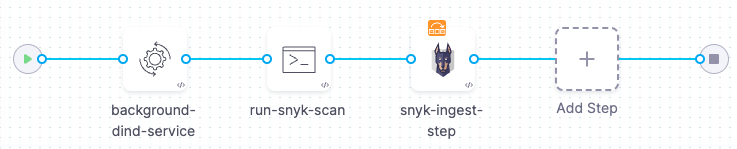

This workflow describes how to ingest Snyk scan results into a Harness pipeline. STO supports the following scan approaches for the following Snyk products:
* Snyk Open Source ([orchestratedScan](./run-an-orchestrated-scan-in-sto.md), [ingestionOnly](./ingest-scan-results-into-an-sto-pipeline.md))
* Snyk Code ([ingestionOnly](./ingest-scan-results-into-an-sto-pipeline.md))
* Snyk Container ([ingestionOnly](./ingest-scan-results-into-an-sto-pipeline.md))

## Important notes

* Snyk Code and Snyk Container scans require a [Snyk API key](https://docs.snyk.io/snyk-api-info/authentication-for-api). You should also create a [Harness secret](/docs/platform/secrets/secrets-management/secrets-and-log-sanitization) for your API key.

* For an overview of recommended Snyk workflows, go to [CI/CD adoption and deployment](https://docs.snyk.io/integrations/snyk-ci-cd-integrations/snyk-ci-cd-integration-deployment-and-strategies/ci-cd-adoption-and-deployment) in the Snyk documentation.

* Snyk recommends running [`snyk monitor`](https://docs.snyk.io/snyk-cli/commands/monitor) with container 

* If you're scanning a code repository, note the following:

  - In some cases, you need to build a project before scanning. You can do this in a Run step in your Harness pipeline. 
  
    For specific requirements, go to  [Setup requirements for AWS CodePipeline](https://docs.snyk.io/integrations/ci-cd-integrations/aws-codepipeline-integration/setup-requirements-for-aws-codepipeline) in the Snyk documentation. These requirements are applicable to Harness pipelines as well as AWS CodePipeline.  

  - Harness recommends that you use [language-specific Snyk container images](https://hub.docker.com/r/snyk/snyk) to run your scans. 

  - Go to [Scan a repository: workflow example](#scan-a-repository-workflow-example) below.

* If you're scanning a container image, note the following:

  - Container image scans require Docker-in-Docker running in Privileged mode as a background service.
  
  - Snyk recommends running [`snyk monitor`](https://docs.snyk.io/snyk-cli/commands/monitor) with container scans. When you run this command, the following happens:

    - The local scanner uploads a `requirements.txt` file to your Snyk instance. This file contains details about the most recent scan. 
    - The Snyk instance creates a project that corresponds to the Harness pipeline. 
    - Once the project is created, the Snyk instance runs a daily scan of the container and notifies you of any new vulnerabilities. 
    - Every time you run a new scan in the STO pipeline, the local scanner sends a new `requirements.txt` file to your Snyk instance.

## Scan a repository: workflow example

The following example describes how to use [`snyk test`](https://docs.snyk.io/snyk-cli/commands/test) to scan a local .NET image built using Nuget. 

The scan stage in this pipeline has the following steps:

- A Run step installs the build; then it scans the image and saves the output to a shared folder. 

- A Snyk step then ingests the output file.


1. Add a [codebase connector](/docs/continuous-integration/use-ci/codebase-configuration/create-and-configure-a-codebase/) to your pipeline that points to the repository you want to scan. 

2. Add a Security Tests or Build stage to your pipeline

3. Go to the Overview tab of the stage. Under **Shared Paths**, enter the following path: `/shared/customer_artifacts`

4. Add a **Run** step that runs the build (if required), scans the repo, and saves the results to the shared folder:
        
   1. In the Run step **Command** field, add code to build a local image (if required) and save the scan results to the shared folder. 
      
      In this example, we want to scan a .NET repository. The [setup requirements](https://docs.snyk.io/integrations/snyk-ci-cd-integrations/aws-codepipeline-integration/setup-requirements-for-aws-codepipeline) topic says: _Build only required if no packages.config file present._ The repo does not contain this file.  Given this, we enter the following code in the **Command** field:

      ```bash
      # Populates the dotnet dependencies
      dotnet restore SubSolution.sln

      # snyk SCA scan
      # Use <+codebase.branch> to specify branch to scan at runtime
      # Harness recommends that you always save the scan results to a SARIF file 
      snyk --file=SubSolution.sln test \
         --target_reference  <+codebase.branch> \
         --sarif-file-output=/shared/customer_artifacts/snyk_sca.sarif | true
      ``` 

   2. For the Run step **Image**, use a [supported Snyk image](https://github.com/snyk/snyk-images#current-images) based on the type of code in your codebase.  
 
   3. In the Run step **Environment Variables** field, under **Optional Configuration**, add a variable to access your Snyk API key:
 
      `SNYK_TOKEN` = `<+secrets.getValue("snyk_api_token")>`  
      
      Your Run step should now look like this:
      
      
 
   4. In the Run step > **Advanced** tab > **Failure Strategies**, set the Failure Strategy to **Mark as Success**. 
 
      This step is required to ensure that the pipeline proceeds if Snyk finds a vulnerability. Otherwise the build will exit with a error code before STO can ingest the data.
   
5. Add a [Snyk security step](/docs/security-testing-orchestration/sto-techref-category/snyk-scanner-reference) to ingest the results of the scan. In this example, the step is configured as follows:  

   1. Scan Mode = **Ingestion**
   2. Target Type = **Repository**
   3. Target Name = (_user-defined_)
   4. Variant = **`<+codebase.branch>`** (_runtime expression_)
   5. Ingestion =  **`/shared/customer_artifacts/snyk_sca.sarif`**    

6. Apply your changes, then save and run the pipeline. 

### Snyk repository scan: pipeline example

The following illustrates an end-to-end pipeline for building and scanning a .NET image.

```yaml 

pipeline:
  projectIdentifier: STO
  orgIdentifier: default
  tags: {}
  properties:
    ci:
      codebase:
        connectorRef: Subsolution
        repoName: SubSolution
        build: <+input>
  stages:
    - stage:
        name: test
        identifier: test
        type: SecurityTests
        spec:
          cloneCodebase: true
          platform:
            os: Linux
            arch: Amd64
          runtime:
            type: Cloud
            spec: {}
          execution:
            steps:
              - step:
                  type: Run
                  name: Build
                  identifier: Build
                  spec:
                    connectorRef: account.harnessImage
                    image: snyk/snyk:dotnet
                    shell: Sh
                    command: |
                      # populates the dotnet dependencies
                      dotnet restore SubSolution.sln

                      # snyk SCA scan
                      snyk --file=SubSolution.sln test \
                         --target_reference  <+codebase.branch> \
                         --sarif-file-output=/shared/customer_artifacts/snyk_sca.sarif | true
                    envVariables:
                      SNYK_TOKEN: <+secrets.getValue("sergeysnyktoken")>
              - step:
                  type: Snyk
                  name: Snyk SCA
                  identifier: Snyk_SCA
                  spec:
                    mode: ingestion
                    config: default
                    target:
                      name: snyk-scan-example-for-docs
                      type: repository
                      variant: <+codebase.branch>
                    advanced:
                      log:
                        level: info
                    ingestion:
                      file: /shared/customer_artifacts/snyk_sca.sarif
          sharedPaths:
            - /shared/customer_artifacts
        variables:
  identifier: sergeysnyklabdbothwell
  name: sergey-snyk-lab-dbothwell

```

## Scan a container image: workflow example

In this example, we run the [`snyk container test`](https://docs.snyk.io/snyk-cli/commands/container-test) command to scan a container image. The scan stage consists of three steps:

- A Background step that runs Docker-in-Docker as a background service in Privileged mode (required when scanning a container image).

- A Run step that scans the image and publishes the results to a SARIF file.

- A Snyk step that ingests the scan results. 



1. Add a Security Tests or Build stage to your pipeline.

2. Add a **Background** step to the stage and set it up as follows: 

   1. Dependency Name = `dind`
   2. Container Registry = The Docker connector to download the DinD image. If you don't have one defined, go to [Docker connector settings reference](/docs/platform/Connectors/Cloud-providers/ref-cloud-providers/docker-registry-connector-settings-reference).
   3. Image = `docker:dind`
   4. Under **Optional Configuration**, select the **Privileged** checkbox.

3. Add a **Run** step and set it up as follows:

   1. Container Registry = Select a Docker Hub connector.
   2. Image = `snyk/snyk:docker`
   3. Shell = **Sh**
   4. Command — Enter code to run the scan and save the results to SARIF:

      ```bash
      snyk container test \
          snykgoof/big-goof-1g:100 -d \
          --sarif-file-output=/shared/customer_artifacts/snyk_code_test.sarif  || true
      ```
      Snyk maintains a set of [snykgoof](https://hub.docker.com/u/snykgoof) repositories that you can use for testing your container-image scanning workflows.

   5. Under **Optional Configuration**, select the **Privileged** option. 

   6. Under **Environment Variables**, add a variable for your Snyk API token. Make sure that you save your token to a [Harness secret](/docs/platform/secrets/add-use-text-secrets/):
      
      SNYK_TOKEN = `<+secrets.getValue("snyk_api_token")>`  

   7. In the Run step > **Advanced** tab > **Failure Strategies**, set the Failure Strategy to **Mark as Success**. 
 
      This step is required to ensure that the pipeline proceeds if Snyk finds a vulnerability. Otherwise the build will exit with a error code before STO can ingest the data.
    
4. Add a [Snyk step](/docs/security-testing-orchestration/sto-techref-category/snyk-scanner-reference)

   1. Scan Mode = **Ingestion**
   2. Target Type = **Container Image**
   3. Target Name = (_user-defined_)
   4. Variant = (_runtime expression_)
   5. Ingestion =  **`/shared/customer_artifacts/snyk_sca.sarif`**    

5. Apply your changes, then save and run the pipeline.

### Snyk container image scan: pipeline example

```yaml

pipeline:
  allowStageExecutions: false
  projectIdentifier: STO
  orgIdentifier: default
  tags: {}
  stages:
    - stage:
        name: scan
        identifier: build
        type: CI
        spec:
          cloneCodebase: false
          infrastructure:
            type: KubernetesDirect
            spec:
              connectorRef: stoqadelegate
              namespace: harness-qa-delegate
              automountServiceAccountToken: true
              nodeSelector: {}
              os: Linux
          sharedPaths:
            - /shared/customer_artifacts/
            - /var/run
          execution:
            steps:
              - step:
                  type: Background
                  name: background-dind-service
                  identifier: Background_1
                  spec:
                    connectorRef: dbothwelldocker
                    image: docker:dind
                    shell: Sh
                    privileged: true
              - step:
                  type: Run
                  name: run-snyk-scan
                  identifier: Run_1
                  spec:
                    connectorRef: DockerHub
                    image: snyk/snyk:docker
                    shell: Sh
                    command: |
                      # https://docs.snyk.io/snyk-cli/commands/container-test
                      # https://docs.snyk.io/scan-applications/snyk-container/snyk-cli-for-container-security/advanced-snyk-container-cli-usage

                      snyk container test \
                            snykgoof/big-goof-1g:100 -d \
                            --sarif-file-output=/shared/customer_artifacts/snyk_code_test.sarif  || true
                      # cat /shared/customer_artifacts/snyk_code_test.sarif

                      # snyk monitor
                    privileged: true
                    envVariables:
                      SNYK_TOKEN: <+secrets.getValue("snyk_api_token")>
                isAnyParentContainerStepGroup: false
              - step:
                  type: Snyk
                  name: snyk-ingest-step
                  identifier: Snyk_1
                  spec:
                    mode: ingestion
                    config: default
                    target:
                      name: snyk-goof-big-goof
                      type: container
                      variant: "100"
                    advanced:
                      log:
                        level: info
                    settings:
                      runner_tag: develop
                    imagePullPolicy: Always
                    ingestion:
                      file: /shared/customer_artifacts/snyk_code_test.sarif
                  failureStrategies:
                    - onFailure:
                        errors:
                          - AllErrors
                        action:
                          type: Ignore
                  when:
                    stageStatus: Success
          caching:
            enabled: false
            paths: []
        variables:
          - name: runner_tag
            type: String
            value: dev
  identifier: snyk_ingest_image_docexample
  name: "snyk - ingest - image - docexample "


```
  


