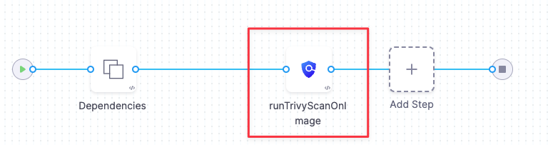
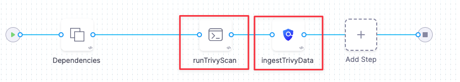

STO supports three different workflows to ingest scan results into a pipeline:

* [Orchestrated workflows](#orchestrated_workflows) — A Security step runs a scan with predefined settings and ingests the results.  
This is the simplest method to implement. STO supports orchestrated scans for Trivy, Bandit, SonarQube, and other popular tools.
* [Ingestion-Only workflows](#ingestion-only-workflows) — Run a scan in a Run step, or outside the pipeline, and save in a shared folder. A Security step then ingests the results.  
This provides the most flexibility. You can ingest results from highly targeted scan that address specific use case. You can also ingest results from scanners that currently have no STO integration.
* [Data-Load workflows](#data-load-workflows) — A Security step downloads and ingests results from an external scanner.  
This workflow is supported for scanners that provide methods for transferring data programmatically.

### Orchestrated Workflows in STO

You can set up a fully orchestrated workflow in a one Security step. The runs the scans and ingests the detected issues. This is the easiest workflow to implement and is good for running scans with default settings.

To set up an orchestrated scan, you specify the following information:

* The scan tool and settings.
* Access credentials to access the object to scan (if the object is remote).
* Information about the object to scan. This information depends on the object type:
	+ Container image — image type, domain, owner, project, and tag.
	+ Code repo — project and branch
	+ Instance (website) — identifier, environment, domain, path, protocol, port

For an example of the setup workflow, go to [Run an Orchestrated Scan in an STO Pipeline](run-an-orchestrated-scan-in-sto.md). This topic describes how to scan a container image using [Aqua Trivy](../../sto-techref-category/aqua-trivy-scanner-reference.md). The **runTrivyScanOnImage** step specifies all the information needed to scan the object:

* The scanner and scan settings
* The object to scan: in this case, a Docker Hub image. This step also specifies the domain, project, and tag.
  

### Ingestion-Only workflows in STO

Ingestion-only workflows enable you ingest data from advanced scans with custom settings, and also from scanners that do not currently have STO integrations. Ingestion-only workflows provide the most flexibility and robustness, but can also require the most work to set up.

An Ingestion-only workflow requires at least two steps:

* A **Run step** saves the scan data to a shared folder. The Run step might run a scan locally or download scan results from an external tool.
* A **Security step** ingests the data from the shared folder.

For an example of the setup workflow, go to [Ingest Scan Results into an STO Pipeline](/docs/security-testing-orchestration/use-sto/orchestrate-and-ingest/ingest-scan-results-into-an-sto-pipeline.md). This topic describes how to scan a container image using [Aqua Trivy](../../sto-techref-category/aqua-trivy-scanner-reference.md). The pipeline works like this:

* The Run step runs a Trivy scan on an image and outputs the results to a local shared folder.  
Running the scanner outside of the Security step enables you to customize the scan settings rather than using a predefined settings profile.
* The Security step ingests the results. To implement this, you specify the following information in the step:
	+ The scanner and scan settings
	+ The path and filename of the results data file
	+ Information about the scan and the scanned object: the object type and the container project and tag
	  

### Data-Load workflows in STO

Data-load scans are a sub-category of orchestrated scans. Instead of running a scan, the Security step pulls issues from an external source. In this case, you configure the Security Step to download from the external tool rather than running an orchestrated scan. This workflow is supported for scanners such as Veracode that support downloading results via an API endpoint.

### See Also

* [Run an Orchestrated Scan in an STO Pipeline](run-an-orchestrated-scan-in-sto.md)
* [Ingest Scan Results into an STO Pipeline](ingest-scan-results-into-an-sto-pipeline.md)
* [Security Step Settings Reference](../../sto-techref-category/security-step-settings-reference.md)

