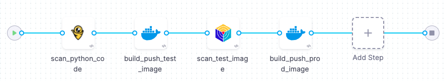

import Tabs from '@theme/Tabs';
import TabItem from '@theme/TabItem';

<CTABanner
  buttonText="Learn More"
  title="Continue your learning journey."
  tagline="Take a Security Testing Orchestration certification today!"
  link="/university/sto"
  closable={true}
  target="_self"
/>

In this tutorial, you'll create an end-to-end pipeline that uses STO and CI steps to build an image and pushes it to Docker Hub _only_ if the codebase and image contain no critical vulnerabilties. This pipeline uses two popular open-source tools:

- [Bandit](https://bandit.readthedocs.io/en/latest), for scanning Python repositories.

- [Aqua Trivy](https://www.aquasec.com/products/trivy/), for scanning container images.

You can copy/paste the [YAML pipeline example below](#yaml-pipeline-example) into Harness and update it with your own connectors. When you run the pipeline, you can specify your repository, branch, image, and tag. 

The following steps describe the workflow:

1. An STO Bandit step scans the codebase and ingests the scan results.

2. If the code has no critical vulnerabilities, a CI Build and Push step builds a test image and pushes it to Docker Hub.

3. An Aqua Trivy step scans the image and ingests the results.

4. If the image has no critical vulnerabilities, another Build and Push step pushes a prod image to Docker Hub.



For a full step-by-step description of how to create this pipeline manually, go to [Build-scan-push pipeline (STO and CI)](/docs/security-testing-orchestration/use-sto/set-up-sto-pipelines/build-scan-push-sto-ci).

:::info Prerequisites

- This tutorial has the following prerequisites:

  - Harness STO and CI module licenses.
  - You must have a [Security Testing Developer or SecOps role](/docs/security-testing-orchestration/get-started/onboarding-guide/#create-an-sto-pipeline) assigned.
  - GitHub requirements:
    - A GitHub account and access token.
    - A [GitHub connector](/docs/platform/connectors/code-repositories/ref-source-repo-provider/git-hub-connector-settings-reference) that specifies your account (`http://github.com/my-account`) but not a specific repository (`http://github.com/my-account/my-repository`).
    - This tutorial uses the [dvpwa repository](https://github.com/GitHubGoneMad/dvpwa) as an example. The simplest setup is to fork this repository into your GitHub account.
  - Docker requirements:
    - A Docker Hub account and access token.
    - A [Docker connector](/docs/platform/connectors/cloud-providers/ref-cloud-providers/docker-registry-connector-settings-reference/) is required to push the image.
  - Your GitHub and Docker Hub access tokens must be stored as [Harness secrets](/docs/platform/secrets/add-use-text-secrets).

:::


## Create the pipeline

1. Select **Security Testing Orchestration** (left menu) > **Pipelines** > **Create a Pipeline**. 

2. Name the pipeline: **build-scan-push-tutorial**.

3. In the new pipeline, select **YAML** to go to the YAML editor. 

4. Replace the existing YAML with the [YAML pipeline example](#yaml-pipeline-example) below.

5. Select **Visual** to return to the visual editor.

6. Select **Codebase** (right menu) and configure the codebase as follows:

   1. **Connector** — Select your GitHub connector.

   2. **Repository Name**  — Click the type selector (right) and select **Runtime input**.

   <DocImage path={require('./static/sto-tutorial-yaml/set-up-codebase.png')} width="40%" height="40%" />

7. Go to the **build_scan_test_image** and **build_scan_prod_image** steps. Select your Docker Hub connector in **Docker Connector**. 

8. Save the pipeline. 

## Run the pipeline

1. Click **Run**.

2. In **Run Pipeline**, enter the following inputs:

    - Codebase 
      - Repository Name = **dvpwa**
      - Branch Name = **main**
    - Stage: build_scan_push_with_ci
      - GITHUB_REPO = **dvpwa**
      - GITHUB_BRANCH = **main**
      - DOCKERHUB_REPO = The Docker Hub repo where you want to push your images
      - DOCKER_IMAGE_LABEL = **stobuildscanpushtutorial**
      - DOCKER_IMAGE_TAG = **latest**

3. Click **Save as New Input Set** and enter **tutorial-test**. This enables you to reuse these settings when you run the pipeline again. 

4. Run the pipeline. When the pipeline finishes, you should see the new images in your Docker Hub repository. 

      <DocImage path={require('./static/sto-tutorial-yaml/images-in-dockerhub-repo.png')} width="60%" height="60%" />

5. When the pipeline finishes, go to [**Security Tests**](/docs/security-testing-orchestration/use-sto/view-and-troubleshoot-vulnerabilities/view-scan-results). You can now see all the issues detected in the code (**dvpwa**) and the image (**_your_dockerhub_repo_/stobuildscanpushtutorial**).

    <DocImage path={require('./static/sto-tutorial-yaml/tutorial-results-in-security-tests.png')} width="60%" height="60%" />


## Enable Fail on Severity

Now you have a complete build-scan-push pipeline with steps to scan the code repository and a test build of the image. The final step is to set Fail on Severity for these two steps so that they block the pipeline if any critical issues are detected.

1. Go to the **scan_test_image** step and set Fail on Severity to **Critical**. Apply the changes and save the pipeline.

2. Run the pipeline again. The Aqua Trivy test now fails:

   `Exited with message: fail_on_severity is set to critical and that threshold was reached.`

3. Go to the **scan_python_code** step and set Fail on Severity to **Critical**. Apply the changes and save the pipeline.

4. Run the pipeline. The Bandit test now fails:

   `Exited with message: fail_on_severity is set to critical and that threshold was reached.`

Congratulations! You now have a pipeline that will push a production image ONLY if there are no critical vulnerabilities in the code or the image. 

## YAML pipeline example

Copy and paste this pipeline into the YAML editor and then update it as described in [Create the pipeline](#create-the-pipeline).

```yaml

pipeline:
  name: sto-build-scan-push-tutorial
  identifier: stobuildscanpushtutorial
  projectIdentifier: default
  orgIdentifier: default
  tags: {}
  properties:
    ci:
      codebase:
        connectorRef: YOUR_GITHUB_CONNECTOR
        repoName: <+input>
        build: <+input>
  stages:
    - stage:
        name: build_scan_push_with_ci
        identifier: build_scan_push_with_ci
        description: ""
        type: CI
        spec:
          cloneCodebase: true
          platform:
            os: Linux
            arch: Amd64
          runtime:
            type: Cloud
            spec: {}
          execution:
            steps:
              - step:
                  type: Bandit
                  name: scan_python_code
                  identifier: scan_python_code
                  spec:
                    mode: orchestration
                    config: default
                    target:
                      name: <+stage.variables.GITHUB_REPO>
                      type: repository
                      variant: <+stage.variables.GITHUB_BRANCH>
                    advanced:
                      log:
                        level: info
              - step:
                  type: BuildAndPushDockerRegistry
                  name: build_push_test_image
                  identifier: build_push_test_image
                  spec:
                    connectorRef: YOUR_DOCKERHUB_CONNECTOR
                    repo: <+stage.variables.DOCKERHUB_REPO>/<+stage.variables.DOCKER_IMAGE_LABEL>
                    tags:
                      - scantest-DONOTUSE-<+pipeline.sequenceId>
              - step:
                  type: AquaTrivy
                  name: scan_test_image
                  identifier: scan_test_image
                  spec:
                    mode: orchestration
                    config: default
                    target:
                      name: <+stage.variables.DOCKERHUB_REPO>/<+stage.variables.DOCKER_IMAGE_LABEL>
                      type: container
                      variant: scantest-DONOTUSE-<+pipeline.sequenceId>
                    advanced:
                      log:
                        level: info
                    privileged: true
                    image:
                      type: docker_v2
                      name: <+stage.variables.DOCKERHUB_REPO>/<+stage.variables.DOCKER_IMAGE_LABEL>
                      domain: docker.io
                      tag: scantest-DONOTUSE-<+pipeline.sequenceId>
                    sbom:
                      format: spdx-json
              - step:
                  type: BuildAndPushDockerRegistry
                  name: build_push_prod_image
                  identifier: build_push_prod_image
                  spec:
                    connectorRef: YOUR_DOCKERHUB_CONNECTOR
                    repo: <+stage.variables.DOCKERHUB_REPO>/<+stage.variables.DOCKER_IMAGE_LABEL>
                    tags:
                      - <+stage.variables.DOCKER_IMAGE_TAG>
        timeout: 30m
        variables:
          - name: GITHUB_REPO
            type: String
            description: ""
            required: true
            value: <+input>
          - name: GITHUB_BRANCH
            type: String
            description: ""
            required: true
            value: <+input>
          - name: DOCKERHUB_REPO
            type: String
            description: ""
            required: true
            value: <+input>
          - name: DOCKER_IMAGE_LABEL
            type: String
            description: ""
            required: true
            value: <+input>
          - name: DOCKER_IMAGE_TAG
            type: String
            description: ""
            required: true
            value: <+input>


```
