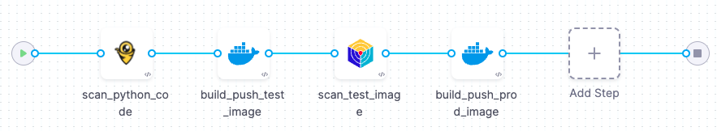

import Tabs from '@theme/Tabs';
import TabItem from '@theme/TabItem';

<CTABanner
  buttonText="Learn More"
  title="Continue your learning journey."
  tagline="Take a Security Testing Orchestration certification today!"
  link="/university/sto"
  closable={true}
  target="_self"
/>

This topic describes how to create an end-to-end pipeline that uses STO and CI steps to build an image and pushes it to Docker Hub _only_ if the codebase and image contain no critical vulnerabilties. This pipeline uses two popular open-source tools:

- [Bandit](https://bandit.readthedocs.io/en/latest), for scanning Python code.

- [Aqua Trivy](https://www.aquasec.com/products/trivy/), for scanning container images.

You can copy/paste the [YAML pipeline example below](#yaml-pipeline-example) into Harness and update it with your own infrastructure, connectors, and access tokens.

The following steps describe the workflow:

1. An STO Bandit step scans the codebase and ingests the scan results.

2. If the code has no critical vulnerabilities, a CI Build and Push step builds a test image and pushes it to Docker Hub.

3. An Aqua Trivy step scans the image and ingests the results.

4. If the image has no critical vulnerabilities, another Build and Push step pushes a prod image to Docker Hub.



:::info Prerequisites

- This workflow has the following prerequisites:

  - Harness STO and CI module licenses.
  - You must have a [Security Testing Developer or SecOps role](/docs/security-testing-orchestration/get-started/onboarding-guide/#create-an-sto-pipeline) assigned.
  - A basic understanding of key STO concepts and good practices is recommended. [Your first STO pipeline](/docs/security-testing-orchestration/get-started/your-first-sto-pipeline) is a good introduction.
  - GitHub requirements:

    - A GitHub account and access token.
    - A [GitHub connector](/docs/platform/connectors/code-repositories/ref-source-repo-provider/git-hub-connector-settings-reference) that specifies your account (`http://github.com/my-account`) but not a specific repository (`http://github.com/my-account/my-repository`).
    - Your GitHub account should include a repository with Python code. The repo should also include a Dockerfile for creating an image.

      This workflow uses the [dvpwa repository](https://github.com/williamwissemann/dvpwa) as an example. The simplest setup is to fork this repository into your GitHub account.

  - Docker requirements:
    - A Docker Hub account and access token.
    - A [Docker connector](/docs/platform/connectors/cloud-providers/ref-cloud-providers/docker-registry-connector-settings-reference/) is required to push the image.
  - Your GitHub and Docker Hub access tokens must be stored as [Harness secrets](/docs/platform/secrets/add-use-text-secrets).

:::

## Set up your codebase

This workflow uses <a href="https://bandit.readthedocs.io/en/latest/">Bandit</a> to scan the target repository <a href="https://github.com/williamwissemann/dvpwa">https://github.com/williamwissemann/dvpwa</a> (specified in the <a  href="/docs/continuous-integration/use-ci/codebase-configuration/create-and-configure-a-codebase/">Codebase</a> for this pipeline).

1. Fork the following example repository into your GitHub account. This is a Python repo with known vulnerabilities: https://github.com/williamwissemann/dvpwa.

2. If you don't have a GitHub connector, do the following:

   1. In your Harness project, select **Project Setup** > **Connectors**.
   2. Select **New Connector**, then select **Code Repositories** > **GitHub**.
   3. Set the [GitHub connector settings](/docs/platform/connectors/code-repositories/ref-source-repo-provider/git-hub-connector-settings-reference) as appropriate.
      - Use **Account** for the [URL type](/docs/platform/connectors/code-repositories/ref-source-repo-provider/git-hub-connector-settings-reference/#url-type).
      - This workflow uses Harness Cloud, so select **Connect through Harness Platform** when prompted for the connectivity mode.

## Set up your pipeline

Do the following:

1. Select **Security Testing Orchestration** (left menu, top) > **Pipelines** > **Create a Pipeline**. Enter a name and click **Start**.

2. In the new pipeline, select **Add stage** > **Build**.

3. Set up your stage as follows:

   1. Enter a **Stage Name**.

   2. Select **Third-party Git provider** and then select your GitHub connector.

   3. For **Repository Name**, click the type selector ("tack" button on the right) and then select **Runtime Expression**.

5. Expand **Overview** > **Advanced** and add the following stage variables.

   You'll be specifying runtime inputs for some of these variables. This enables you to specify the code repo, branch, image label, and image tag, and other variables at runtime.

   - `GITHUB_USERNAME` — Select **Secret** as the type and enter your GitHub login name.

   - `GITHUB_REPO` — Select **String** for the type and **Runtime Input** for the value (click the "tack button" to the right of the value field).

   - `GITHUB_BRANCH` — Select **String** and **Runtime Input**.

   - `DOCKERHUB_USERNAME` — Select **String** as the type and enter your DockerHub login name.

   - `DOCKER_IMAGE_LABEL` — Select **String** and **Runtime Input**.

   - `DOCKER_IMAGE_TAG` — Select **String** and **Runtime Input**.

6. In the Pipeline Editor, go to **Infrastructure** and select **Cloud**, **Linux**, and **AMD64** for the infrastructure, OS, and architecture.

   You can also use a Kubernetes or Docker build infrastructure, but these require additional work to set up. For more information, go to [Set up a build infrastructure for STO](/docs/security-testing-orchestration/get-started/onboarding-guide#set-up-a-build-infrastructure-for-sto).

:::note

The following step is required for Kubernetes or Docker infrastructures only. If you're using Harness Cloud, go to [Scan the code](#scan-the-code).

:::

### Add a Docker-in-Docker background step

import StoDinDRequirements from '/docs/security-testing-orchestration/sto-techref-category/shared/dind-bg-step.md';

<StoDinDRequirements />

## Scan the code

import set_up_harness_26 from '/docs/security-testing-orchestration/use-sto/set-up-sto-pipelines/build-scan-push-workflows/static/sbsp-sto-ci/configure-bandit-step.png'

<Tabs>
<TabItem value="Visual" label="Visual" default>

1. In the Pipeline Studio, go to **Execution** and add a **Bandit** step to your pipeline.

2. Configure the step as follows:

   1. Scan Mode = **Orchestration**

   2. Target name — Click the value-type selector (tack button to the right of the input field) and select **Expression**. Then enter the following expression: `<+stage.variables.GITHUB_REPO>`

   3. Target variant — Select **Expression** as the value type and enter the following: `<+stage.variables.GITHUB_BRANCH>`

      When scanning a code repo, you generally want to specify the repo name and branch for the target.

:::info

In most cases, you want to set the [Fail on Severity](/docs/security-testing-orchestration/exemptions/exemption-workflows) when you add a scan step to your pipeline. In this workflow, you're setting the first of two scan steps. In this case, you can keep **Fail on Severity** set to **None** and set it after you finish setting up and testing your pipeline.

:::

</TabItem>
<TabItem value="YAML" label="YAML">

- `type:` [`Bandit`](/docs/security-testing-orchestration/sto-techref-category/bandit-scanner-reference)
- `name:` A name for the step.
- `identifier:` A unique step ID.
- `spec :`
  - `mode :` [`orchestration`](/docs/security-testing-orchestration/get-started/key-concepts/sto-workflows-overview) In orchestrated mode, the step runs the scan and ingests the results in one step.
  - `config: default`
    - `target : `
      - `name : <+stage.variables.GITHUB_REPO>`
      - `type : repository`
      - `variant : <+stage.variables.GITHUB_BRANCH>` You will specify the [target name and variant](/docs/security-testing-orchestration/get-started/key-concepts/targets-and-baselines) when you run the pipeline.
        When scanning a repository, you will generally use the repository name and branch for these fields.
    - `advanced : `
      - `log :`
        - `level : info`

:::info

In most cases, you want to set the [fail_on_severity](/docs/security-testing-orchestration/exemptions/exemption-workflows) when you add a scan step to your pipeline. In this workflow, you're setting the first of two scan steps. In this case, you can leave `fail_on_severity` at `none` and set it after your set up and test your pipeline.

:::

Here's a YAML example:

```yaml
steps:
  - step:
      type: Bandit
      name: bandit_scan_orchestrated
      identifier: bandit_scan_orchestrated
      spec:
        mode: orchestration
        config: default
        target:
          name: <+stage.variables.GITHUB_REPO>
          type: repository
          variant: <+stage.variables.GITHUB_BRANCH>
        advanced:
          log:
            level: info
```

</TabItem>
</Tabs>

### Analyze the results

At this point, you might want to run a scan and view the detected issues.

1. Select **Save**, and then select **Run**.
2. In Run Pipeline, enter the repository and target settings you want to use. If you're using the [dvpwa repository](https://github.com/williamwissemann/dvpwa), enter the following:

   1. Under Codebase:
      - Repository name : **dvpwa**
      - Branch name : **master**
   2. Under Stage:
      - Target name : **dvpwa** (= the repo name)
      - Target variant : **master** (= the branch name)

3. Run the pipeline. When the execution finishes, select [**Security Tests**](/docs/security-testing-orchestration/dashboards/view-scan-results) to view the scan results.

## Build and push a test image

Harness CI includes a set of [**Build and Push** steps](/docs/category/build-push-upload-download) that take a code repo with a Dockerfile, build a container image, and push it to an artifact repository.

You'll now add one of these steps to build and push to your Docker Hub account.

<Tabs>
<TabItem value="Visual" label="Visual" default>

1. Add a **Build and Push to Docker Registry** step after the Bandit step.

2. Configure the step as follows:

   1. Name = **build_push_test_image**

   2. Docker Connector — Select your Docker Hub connector.

   3. Docker Repository — Select **Expression** for the value type, then enter the following:

      `<+stage.variables.DOCKERHUB_USERNAME>/<+stage.variables.DOCKER_IMAGE_LABEL>`

   4. Tags— Select **Expression** for the value type, then enter the following:

      `<+stage.variables.DOCKER_IMAGE_TAG>-scantest-DONOTUSE`

</TabItem>
<TabItem value="YAML" label="YAML">

Add a **Build and Push to Docker Registry** step after the Bandit step and configure it as follows:

- `type:` [`BuildAndPushDockerRegistry`](/docs/continuous-integration/use-ci/build-and-upload-artifacts/build-and-push/build-and-push-to-docker-registry)
- `name: build_push_test_image`
- `identifier:` A unique step ID.
- `spec :`
  - `connectorRef : YOUR_DOCKERHUB_CONNECTOR`
  - `repo : <+stage.variables.DOCKERHUB_USERNAME>/<+stage.variables.DOCKER_IMAGE_LABEL>`
  - `type : container`
  - `variant : <+stage.variables.DOCKER_IMAGE_TAG>-scantest-DONOTUSE`

Here's an example:

```yaml
- step:
    type: BuildAndPushDockerRegistry
    name: build_push_test_image
    identifier: build_push_test_image
    spec:
    connectorRef: YOUR_IMAGE_REGISTRY_CONNECTOR
    repo: <+stage.variables.DOCKERHUB_USERNAME>/<+stage.variables.DOCKER_IMAGE_LABEL>
    tags:
      - <+stage.variables.DOCKER_IMAGE_TAG>-scantest-DONOTUSE
```

</TabItem>
</Tabs>

## Scan the test image

<Tabs>
<TabItem value="Visual" label="Visual" default>

Add an **Aqua Trivy** step to your pipeline after the build step and configure it as follows:

1.  Scan Mode = [**Orchestration**](/docs/security-testing-orchestration/get-started/key-concepts/sto-workflows-overview) In orchestrated mode, the step runs the scan and ingests the results in one step.

2.  Target name — Click the "tack" button on the right side of the input field and select **Expression**. Then enter the following expression: `<+stage.variables.DOCKERHUB_USERNAME>/<+stage.variables.DOCKER_IMAGE_LABEL>`

3.  Target variant — Select **Expression** for the value type, then enter the following expression: `<+stage.variables.DOCKER_IMAGE_TAG>-scantest-DONOTUSE`

4.  [Container image Type](/docs/security-testing-orchestration/sto-techref-category/trivy/aqua-trivy-scanner-reference#type-1) = **V2**

5.  [Domain](/docs/security-testing-orchestration/sto-techref-category/trivy/aqua-trivy-scanner-reference#domain) = `docker.io`

6.  Container image name — Select **Expression** for the value type, then enter the following expression: `<+stage.variables.DOCKERHUB_USERNAME>/<+stage.variables.DOCKER_IMAGE_LABEL>`

7.  Container image tag — Select **Expression** for the value type, then enter the following expression: `<+stage.variables.DOCKER_IMAGE_TAG>`

8.  [Fail on Severity](/docs/security-testing-orchestration/sto-techref-category/trivy/aqua-trivy-scanner-reference#fail-on-severity) = **Critical**

</TabItem>
<TabItem value="YAML" label="YAML">

Add an **Aqua Trivy** step to your pipeline after the build step and configure it as follows:

- `type:` [`AquaTrivy`](/docs/security-testing-orchestration/sto-techref-category/trivy/aqua-trivy-scanner-reference#security-step-settings-for-aqua-trivy-scans-in-sto-legacy)
- `name:` A name for the step.
- `identifier:` A unique step ID.
- `spec :`
  - `mode :` [`orchestration`](/docs/security-testing-orchestration/get-started/key-concepts/sto-workflows-overview) In orchestrated mode, the step runs the scan and ingests the results in one step.
  - `config: default`
  - `target : `
    - `name : <+stage.variables.DOCKERHUB_USERNAME>/<+stage.variables.DOCKER_IMAGE_LABEL>`
    - `type : container`
    - `variant : <+stage.variables.DOCKER_IMAGE_TAG>` When scanning an image, you generally use the image label and tag for the [target name and variant](/docs/security-testing-orchestration/get-started/key-concepts/targets-and-baselines) .
    - `advanced : `
      - `log :`
        - `level : info`
        - [`fail_on_severity`](/docs/security-testing-orchestration/sto-techref-category/trivy/aqua-trivy-scanner-reference#fail-on-severity) `: critical`
    - `privileged: true`
    - `image:`
      - [`type`](/docs/security-testing-orchestration/sto-techref-category/trivy/aqua-trivy-scanner-reference#type-1) `: docker_v2`
      - `name: <+stage.variables.DOCKERHUB_USERNAME>/<+stage.variables.DOCKER_IMAGE_LABEL>`
      - `access_token: <+secrets.getValue("YOUR_DOCKERHUB_ACCESS_TOKEN")`
      - `domain: docker.io`
      - `tag: <+stage.variables.DOCKER_IMAGE_TAG>-scantest-DONOTUSE`

Here's an example:

```yaml
- step:
    type: AquaTrivy
    name: scan_test_image
    identifier: scan_test_image
    spec:
      mode: orchestration
      config: default
      target:
        name: <+stage.variables.DOCKERHUB_USERNAME>/<+stage.variables.DOCKER_IMAGE_LABEL>
        type: container
        variant: <+stage.variables.DOCKER_IMAGE_TAG><+pipeline.sequenceId>-scantest-DONOTUSE
      advanced:
        log:
          level: info
      privileged: true
      image:
        type: docker_v2
        name: <+stage.variables.DOCKERHUB_USERNAME>/<+stage.variables.DOCKER_IMAGE_LABEL>
        domain: docker.io
        access_token: <+secrets.getValue("YOUR_DOCKERHUB_ACCESS_TOKEN")
        tag: <+stage.variables.DOCKER_IMAGE_TAG><+sequenceID>-scantest-DONOTUSE
      sbom:
        format: spdx-json
```

</TabItem>
</Tabs>

### Run the pipeline and verify your results

This is a good time to run your pipeline and verify that it can scan the image.

1. Click **Run** and set the GitHub and Docker variables.

   If you forked the [dvpwa repository](https://github.com/williamwissemann/dvpwa) repo into your GitHub account and want to use that, set the fields like this:

   - `GITHUB_REPO` = **dvpwa**
   - `GITHUB_BRANCH`= **master**
   - `DOCKER_IMAGE_LABEL` = **dvpwa**
   - `DOCKER_IMAGE_TAG` = **1.**

   With this setup, you'll build and push an image with a tag that looks like this: `1.x-scantest-DONOTUSE`

   :::tip

   [Input sets](/docs/platform/pipelines/input-sets/) enable you to reuse a single pipeline for multiple scenarios. You can define each scenario in an input set and then select the relevant input set at runtime. To save these inputs, click **Save as New Input Set**.

   :::

2. Click **Run Pipeline** and view the results in [**Security Tests**](/docs/security-testing-orchestration/dashboards/view-scan-results).

## Build and push the prod image

Assuming that the Trivy scan detected no critical vulnerabilities, you can now build and push a prod version of your image to Docker Hub. This step is identical to the previous [test image step](#build-and-push-a-test-image), except for the image tag: the test image tag is `1.x-scantest-DONOTUSE` and the prod image tag is `1.x`.

<Tabs>
<TabItem value="Visual" label="Visual" default>

1. Add a **Build and Push to Docker Registry** step after the Semgrep ingest step.

2. Configure the step as follows:

   1. Name = **build_push_test_image**

   2. Docker Connector — Select your Docker Hub connector.

   3. Container image name — Select **Expression** for the value type, then enter the following expression: `<+stage.variables.DOCKERHUB_USERNAME>/<+stage.variables.DOCKER_IMAGE_LABEL>`

   4. Container image tag — Select **Expression** for the value type, then enter the following expression: `<+stage.variables.DOCKER_IMAGE_TAG><+pipeline.sequenceID>`

</TabItem>
<TabItem value="YAML" label="YAML">

Add a **Build and Push to Docker Registry** step after the Bandit step and configure it as follows:

- `type:` [`BuildAndPushDockerRegistry`](/docs/continuous-integration/use-ci/build-and-upload-artifacts/build-and-push/build-and-push-to-docker-registry)
- `name: build_push_test_image`
- `identifier:` A unique step ID.
- `spec :`
  - `connectorRef : YOUR_DOCKERHUB_CONNECTOR`
  - `repo : <+stage.variables.DOCKERHUB_USERNAME>/<+stage.variables.DOCKER_IMAGE_LABEL>`
  - `type : container`
  - `tags : `
    - `<+stage.variables.DOCKER_IMAGE_TAG><+sequenceID>`

Here's an example:

```yaml
- step:
    type: BuildAndPushDockerRegistry
    name: build_push_test_image
    identifier: BuildAndPushDockerRegistry_1
    spec:
    connectorRef: YOUR_IMAGE_REGISTRY_CONNECTOR
    repo: <+stage.variables.DOCKERHUB_USERNAME>/<+stage.variables.DOCKER_IMAGE_LABEL>
    tags:
      - <+sequenceID>
```

</TabItem>
</Tabs>

## YAML pipeline example

Here's an example of the pipeline you created in this workflow. If you copy this example, replace the placeholder values with appropriate values for your project, organization, connectors, and access token.

```yaml
pipeline:
  name: sto-ci-workflow-test
  identifier: stociworkflowtest
  projectIdentifier: YOUR_HARNESS_PROJECT_ID
  orgIdentifier: YOUR_HARNESS_ORGANIZATION_ID
  tags: {}
  properties:
    ci:
      codebase:
        connectorRef: YOUR_CODEBASE_CONNECTOR_ID
        repoName: <+input>
        build: <+input>
  stages:
    - stage:
        name: build_scan_push_with_ci
        identifier: build_scan_push_with_ci
        description: ""
        type: CI
        spec:
          cloneCodebase: true
          platform:
            os: Linux
            arch: Amd64
          runtime:
            type: Cloud
            spec: {}
          execution:
            steps:
              - step:
                  type: Bandit
                  name: scan_python_code
                  identifier: scan_python_code
                  spec:
                    mode: orchestration
                    config: default
                    target:
                      name: <+stage.variables.GITHUB_REPO>
                      type: repository
                      variant: <+stage.variables.GITHUB_BRANCH>
                    advanced:
                      log:
                        level: info
              - step:
                  type: BuildAndPushDockerRegistry
                  name: build_push_test_image
                  identifier: build_push_test_image
                  spec:
                    connectorRef: YOUR_IMAGE_REGISTRY_CONNECTOR
                    repo: <+stage.variables.DOCKERHUB_USERNAME>/<+stage.variables.DOCKER_IMAGE_LABEL>
                    tags:
                      - <+stage.variables.DOCKER_IMAGE_TAG><+pipeline.sequenceId>-scantest-DONOTUSE
              - step:
                  type: AquaTrivy
                  name: scan_test_image
                  identifier: scan_test_image
                  spec:
                    mode: orchestration
                    config: default
                    target:
                      name: <+stage.variables.DOCKERHUB_USERNAME>/<+stage.variables.DOCKER_IMAGE_LABEL>
                      type: container
                      variant: <+stage.variables.DOCKER_IMAGE_TAG><+pipeline.sequenceId>
                    advanced:
                      log:
                        level: info
                    privileged: true
                    image:
                      type: docker_v2
                      name: <+stage.variables.DOCKERHUB_USERNAME>/<+stage.variables.DOCKER_IMAGE_LABEL>
                      domain: docker.io
                      access_token: <+secrets.getValue("YOUR_IMAGE_REGISTRY_ACCESS_TOKEN")
                      tag: <+stage.variables.DOCKER_IMAGE_TAG><+pipeline.sequenceId>-scantest-DONOTUSE
                    sbom:
                      format: spdx-json
              - step:
                  type: BuildAndPushDockerRegistry
                  name: build_push_prod_image
                  identifier: build_push_prod_image
                  spec:
                    connectorRef: YOUR_IMAGE_REGISTRY_CONNECTOR
                    repo: <+stage.variables.DOCKERHUB_USERNAME>/<+stage.variables.DOCKER_IMAGE_LABEL>
                    tags:
                      - <+stage.variables.DOCKER_IMAGE_TAG><+pipeline.sequenceId>
        timeout: 30m
        variables:
          - name: GITHUB_REPO
            type: String
            description: ""
            required: true
            value: <+input>
          - name: GITHUB_BRANCH
            type: String
            description: ""
            required: false
            value: <+input>
          - name: DOCKERHUB_USERNAME
            type: String
            description: ""
            required: false
            value: myusername
          - name: _IMAGE_LABEL
            type: String
            description: ""
            required: false
            value: <+input>
          - name: DOCKER_IMAGE_TAG
            type: String
            description: ""
            required: false
            value: <+input>
```
