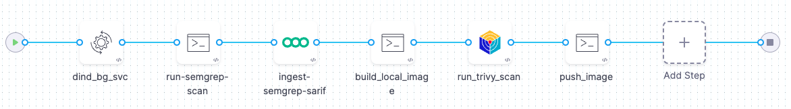

import Tabs from '@theme/Tabs';
import TabItem from '@theme/TabItem';

<CTABanner
  buttonText="Learn More"
  title="Continue your learning journey."
  tagline="Take a Security Testing Orchestration certification today!"
  link="/university/sto"
  closable={true}
  target="_self"
/>

This topic describes how to create an end-to-end pipeline that builds an image and pushes it to Docker Hub _only_ if the codebase and image contain no critical vulnerabilties. This pipeline uses two free tools:

- [Semgrep](https://semgrep.dev), a popular [SAST](https://www.gartner.com/en/information-technology/glossary/static-application-security-testing-sast) tool for detecting vulnerabilities in application code. Semgrep can scan a [wide variety of languages](https://semgrep.dev/docs/supported-languages/) and includes a [free version](https://semgrep.dev/pricing/) for individuals who want to scan files locally.

- [Aqua Trivy](https://www.aquasec.com/products/trivy/), a popular open-source tool for scanning container images.

Once you complete this workflow, you'll have a complete end-to-end pipeline that you can easily adapt to a wide variety of use cases. You can also copy/paste the [YAML pipeline example below](#yaml-pipeline-example) into Harness and update it with your own infrastructure, connectors, and access tokens.

The following steps describe the workflow:

1. A Run step scans the codebase using Semgrep and saves the results to a [SARIF](/docs/security-testing-orchestration/custom-scanning/ingest-sarif-data) file.

2. A Semgrep step ingests the scan results ([ingestion-only workflow](/docs/security-testing-orchestration/get-started/key-concepts/ingest-scan-results-into-an-sto-pipeline)).

3. If the code has no critical vulnerabilities, another Run steps builds the image.

4. An Aqua Trivy step scans the image and ingests the results ([orchestration workflow](/docs/security-testing-orchestration/get-started/key-concepts/run-an-orchestrated-scan-in-sto)).

5. If the image has no critical vulnerabilities, another Run step pushes the image to Docker Hub.



:::info Prerequisites

- This workflow has the following prerequisites:

  - A Harness account and STO module license.
  - You must have a [Security Testing Developer or SecOps role](/docs/security-testing-orchestration/get-started/onboarding-guide/#create-an-sto-pipeline) assigned.
  - A basic understanding of key STO concepts and good practices is recommended. This workflow builds on the [SAST code scans using Semgrep](/docs/security-testing-orchestration/sto-techref-category/semgrep/sast-scan-semgrep) and [Container image scans with Aqua Trivy](../../../sto-techref-category/trivy/container-scan-aqua-trivy) workflows.
  - A Semgrep account login and access token. For specific instructions, go to [Getting started from the CLI](https://github.com/semgrep/semgrep#option-2-getting-started-from-the-cli) in the README on GitHub.
  - GitHub requirements — This workflow assumes you have the following:

    - A GitHub account and access token.
    - A [GitHub connector](/docs/platform/connectors/code-repositories/ref-source-repo-provider/git-hub-connector-settings-reference) that specifies your account (`http://github.com/my-account`) but not a specific repository (`http://github.com/my-account/my-repository`).
    - Your GitHub account should include a repository with code in a [language supported by Semgrep](https://semgrep.dev/docs/supported-languages/) such as Python or NodeJS. The repo should also include a Dockerfile for creating an image.

      This workflow uses the [dvpwa repository](https://github.com/williamwissemann/dvpwa) as an example. The simplest setup is to fork this repository into your GitHub account.

  - Docker requirements — The last step in this pipeline pushes the built image to your image registry. To do this step, you must have the following:
    - A Docker Hub account and access token.
    - A [Docker connector](/docs/platform/connectors/cloud-providers/ref-cloud-providers/docker-registry-connector-settings-reference/) is required to push the image.
  - Your Semgrep, GitHub, and Docker Hub access tokens must be stored as [Harness secrets](/docs/platform/secrets/add-use-text-secrets).

:::

## Set up your pipeline

Do the following:

1. Select **Security Testing Orchestration** (left menu, top) > **Pipelines** > **Create a Pipeline**. Enter a name and click **Start**.

2. In the new pipeline, select **Add stage** > **Security**.

3. Set up your stage as follows:

   1. Enter a **Stage Name**.

   2. Disable **Clone Codebase**. You will add a Run step to clone the codebase later.

4. In the Pipeline Editor, go to **Overview** and add the following shared path:

   - `/shared/customer-artifacts` You'll use this shared folder to store the code repo so that all steps can access it.

5. Go to **Overview** and add the following **Shared Path**: `/shared/scan_results`

6. Expand **Overview** > **Advanced** and add the following stage variables.

   You'll be specifying runtime inputs for some of these variables. This enables you to specify the code repo, branch, image label, and image tag, and other variables at runtime.

   - `GITHUB_USERNAME` — Select **Secret** as the type and enter your GitHub login name.

   - `GITHUB_PAT` — Select **Secret** as the type and then select the Harness secret for your GitHub access token.

   - `GITHUB_REPO` — Select **String** for the type and **Runtime Input** for the value (click the "tack button" to the right of the value field).

   - `GITHUB_BRANCH` — Select **String** and **Runtime Input**.

   - `DOCKERHUB_USERNAME` — Select **String** as the type and enter your DockerHub login name.

   - `DOCKERHUB_PAT` — Select **Secret** as the type and then select the Harness secret for your Docker Hub access token.

   - `DOCKER_IMAGE_LABEL` — Select **String** and **Runtime Input**.

   - `DOCKER_IMAGE_TAG` — Select **String** and **Runtime Input**.

6. In the Pipeline Editor, go to **Infrastructure** and select **Cloud**, **Linux**, and **AMD64** for the infrastructure, OS, and architecture.

   You can also use a Kubernetes or Docker build infrastructure, but these require additional work to set up. For more information, go to [Set up a build infrastructure for STO](/docs/security-testing-orchestration/get-started/onboarding-guide#set-up-a-build-infrastructure-for-sto).

:::note

The following step is required for Kubernetes or Docker infrastructures only. If you're using Harness Cloud, go to [Add the codebase scan step](#add-the-codebase-scan-step).

:::

### Add a Docker-in-Docker background step

import StoDinDRequirements from '/docs/security-testing-orchestration/sto-techref-category/shared/dind-bg-step.md';

<StoDinDRequirements />

## Add the codebase scan step

Now you will add a step that runs a scan using the local Semgrep container image maintained by Harness.

<Tabs>
<TabItem value="Visual" label="Visual" default>

1. Go to **Execution** and add a **Run** step.

2. Configure the step as follows:

   1. Name = **run_semgrep_scan**

   2. Command =

      ```shell

      # install git
      apk add git
      git --version

      #  clone repo, cd to local clone, check out branch
      cd /shared/scan_results
      git clone https://github.com/<+stage.variables.GITHUB_USERNAME>/<+stage.variables.GITHUB_REPO>
      cd /shared/scan_results/<+stage.variables.GITHUB_REPO>
      git checkout <+stage.variables.GITHUB_BRANCH>

      # run semgrep scan, save results to SARIF file
      semgrep --sarif --config auto -o /shared/scan_results/semgrep.sarif

      ```

   3. Open **Optional Configuration** and set the following options:

      1. Container Registry — When prompted, select **Account** and then [**`Harness Docker Connector`**](/docs/platform/connectors/artifact-repositories/connect-to-harness-container-image-registry-using-docker-connector). The step uses this connector to download the scanner image.

      2. Image = **returntocorp/semgrep**

      3. Add the following environment variable:

         - Key : `SEMGREP_APP_TOKEN`
         - Value : Click the type selector (right), set the value type to **Expression**, and enter the value `<+secrets.getValue("YOUR_SEMGREP_TOKEN_SECRET")>`.

           

</TabItem>
<TabItem value="YAML" label="YAML">

Add a `Run` step to your `SecurityTests` stage and configure it as follows:

- `type:` [`Run`](/docs/continuous-integration/use-ci/run-step-settings)
- `name:` A name for the step.
- `identifier:` A unique step ID.
- `spec :`

  - `connectorRef : account.HarnessImage`

    This is a connector to the [Harness image registry](/docs/platform/connectors/artifact-repositories/connect-to-harness-container-image-registry-using-docker-connector). The step uses this connector to download the scanner image.

  - `image : returntocorp/semgrep`
  - `shell : Sh`
  - `command : |- `

    ```shell

    # install git
    apk add git
    git --version

    #  clone repo, cd to local clone, check out branch
    cd /shared/scan_results
    git clone https://github.com/<+stage.variables.GITHUB_USERNAME>/<+stage.variables.GITHUB_REPO>
    cd /shared/scan_results/<+stage.variables.GITHUB_REPO>
    git checkout <+stage.variables.GITHUB_BRANCH>

    # run semgrep scan, save results to SARIF file
    semgrep --sarif --config auto -o /shared/scan_results/semgrep.sarif

    ```

  - `envVariables:`
    - `SEMGREP_APP_TOKEN: <+secrets.getValue("YOUR_SEMGREP_TOKEN_SECRET")>`

Here's an example:

```yaml
- step:
    type: Run
    name: run-semgrep-scan
    identifier: Run_1
    spec:
      connectorRef: account.harnessImage
      image: returntocorp/semgrep
      shell: Sh
      command: |-
        # install git
        apk add git
        git --version

        # clone repo into shared folder, cd to local clone, check out branch
        cd /shared/scan_results
        git clone https://github.com/<+stage.variables.GITHUB_USERNAME>/<+stage.variables.GITHUB_REPO>
        cd /shared/scan_results/<+stage.variables.GITHUB_REPO>
        git checkout <+stage.variables.GITHUB_BRANCH>

        # run semgrep scan, save results to SARIF file
        semgrep --sarif --config auto -o /shared/scan_results/semgrep.sarif 

        # cat /shared/scan_results/semgrep.sarif
      envVariables:
        SEMGREP_APP_TOKEN: <+secrets.getValue("semgrepkey")>
```

</TabItem>
</Tabs>

## Add the Semgrep ingest step

Now that you've added a step to run the scan, it's a simple matter to ingest it into your pipeline. Harness provides a set of customized steps for popular scanners such as Semgrep.

:::note

It's generally good practice to set the [fail_on_severity](/docs/security-testing-orchestration/get-started/key-concepts/fail-pipelines-by-severity) for every scan step. Leave this setting at **None** for now so you can run and test the entire-end-to-end workflow.

:::

<Tabs>
<TabItem value="Visual" label="Visual" default>

1. In **Execution**, add a **Semgrep** step after your **Run** step.

2. Configure the step as follows:

   1. Name = `ingest_semgrep_data`

   2. Type = **Repository**

   3. Under Target:

      1. Name = Select **Runtime Input** as the value type.

      2. Variant = Select **Runtime Input** as the value type.

   4. Ingestion File = `/shared/scan_results/semgrep.sarif`

   <!--

   5. [Fail on Severity](/docs/security-testing-orchestration/get-started/key-concepts/fail-pipelines-by-severity) = **Critical**

   -->

</TabItem>
<TabItem value="YAML" label="YAML">

Add a step after the `Run` step and configure it as follows:

- `type:` [`Semgrep`](/docs/security-testing-orchestration/sto-techref-category/semgrep/semgrep-scanner-reference)
  - `name:` A name for the step.
  - `identifier:` A unique step ID.
  - `spec :`
    - `mode :` [`ingestion`](/docs/security-testing-orchestration/get-started/key-concepts/ingest-scan-results-into-an-sto-pipeline)
    - `config: default`
      - `target : `
        - `name : <+stage.variables.GITHUB_REPO>`
        - `type : repository`
        - `variant : <+stage.variables.GITHUB_BRANCH>`
          When scanning a repository, you will generally use the repository name and branch for the [target name and variant](/docs/security-testing-orchestration/get-started/key-concepts/targets-and-baselines).
      - `advanced : `
        - `log :`
          - `level : info`
          - [`fail_on_severity`](/docs/security-testing-orchestration/get-started/key-concepts/fail-pipelines-by-severity) ` : none`
      - `ingestion : `
        - `file : /shared/scan_results/semgrep.sarif`

Here's a YAML example:

```yaml
- step:
    type: Semgrep
    name: ingest_semgrep_data
    identifier: ingest_semgrep_data
    spec:
      mode: ingestion
      config: default
      target:
        name: <+stage.variables.GITHUB_REPO>
        type: repository
        variant: <+stage.variables.GITHUB_BRANCH>
      advanced:
        log:
          level: debug
        fail_on_severity: critical
      ingestion:
        file: /shared/scan_results/semgrep.sarif
```

</TabItem>
</Tabs>

### Run the pipeline and verify your results

This is a good time to run your pipeline and verify that it can scan the repo and ingest the results correctly.

1. Click **Run** and set the `GITHUB_REPO` and `GITHUB_BRANCH` variables. (You don't need to set the image variables.)

   If you forked the [dvpwa repository](https://github.com/williamwissemann/dvpwa) repo into your GitHub account and want to use that, set the fields like this:

   - `GITHUB_REPO` = **dvpwa**
   - `GITHUB_BRANCH`= **master**

2. Click **Run Pipeline** and wait for the execution to finish. You can then view your scan results in [**Security Tests**](/docs/security-testing-orchestration/dashboards/view-scan-results).

## Add the image build step

Assuming that the Semgrep scanner detected no critical vulnerabilities, the next step is to build a local image using the `Dockerfile` in your codebase.

<Tabs>
<TabItem value="Visual" label="Visual" default>

1. Add a **Run** step after the Semgrep ingest step.

2. Configure the step as follows:

   1. Name = **build_local_image**

   2. Command =

      ```bash

      # wait until the dind service is available
      while ! docker ps ;do
      echo "Docker not available yet"
      done
      echo "Docker service is ready"
      docker ps

      # cd to the repo and build/tag the local image
      cd /shared/scan_results/<+stage.variables.GITHUB_REPO>
      docker login \
             --username="<+stage.variables.DOCKERHUB_USERNAME>" \
             --password="<+stage.variables.DOCKERHUB_PAT>" \
      docker build -t <+stage.variables.DOCKER_IMAGE_LABEL> . \
      docker tag \
           <+stage.variables.DOCKER_IMAGE_LABEL> \
           <+stage.variables.DOCKERHUB_USERNAME>/<+stage.variables.DOCKER_IMAGE_LABEL>:<+stage.variables.DOCKER_IMAGE_TAG>

      ```

   3. Open **Optional Configuration** and set the following options:

      1. Container Registry — When prompted, select **Account** and then your Docker Hub connector.

      2. Image = **docker**

</TabItem>
<TabItem value="YAML" label="YAML">

Add a `Run` step and configure it as follows:

- `type:` [`Run`](/docs/continuous-integration/use-ci/run-step-settings)
- `name:` A name for the step.
- `identifier:` A unique step ID.
- `spec :`

  - `connectorRef : YOUR_DOCKERHUB_CONNECTOR`
  - `image : returntocorp/semgrep`
  - `shell : Sh`
  - `command : |- `

    ```shell

       # install git
       apk add git
       git --version

       #  clone repo, cd to local clone, check out branch
       cd /shared/scan_results
       git clone https://github.com/<+stage.variables.GITHUB_USERNAME>/<+stage.variables.GITHUB_REPO>
       cd /shared/scan_results/<+stage.variables.GITHUB_REPO>
       git checkout <+stage.variables.GITHUB_BRANCH>

       # run semgrep scan, save results to SARIF file
       semgrep --sarif --config auto -o /shared/scan_results/semgrep.sarif 

    ```

  - `envVariables:`
    - `SEMGREP_APP_TOKEN: <+secrets.getValue("YOUR_SEMGREP_TOKEN_SECRET")>`

Here's an example:

```yaml
- step:
    type: Run
    name: build_local_image
    identifier: build_local_image
    spec:
      connectorRef: YOUR_IMAGE_REGISTRY_CONNECTOR
      image: docker
      shell: Sh
      command: |-
        # wait until the docker service is available
        while ! docker ps ;do
          echo "Docker not available yet"
        done
        echo "Docker service is ready"


        # build and tag the local image
        cd /shared/scan_results/<+stage.variables.GITHUB_REPO>
        docker login --username="<+stage.variables.DOCKERHUB_USERNAME>" --password="<+stage.variables.DOCKERHUB_PAT>" 
        docker build -t <+stage.variables.DOCKER_IMAGE_LABEL> .
        docker tag <+stage.variables.DOCKER_IMAGE_LABEL> <+stage.variables.DOCKERHUB_USERNAME>/<+stage.variables.DOCKER_IMAGE_LABEL>:<+stage.variables.DOCKER_IMAGE_TAG>

        docker image ls
      privileged: true
```

</TabItem>
</Tabs>

## Add the Aqua-Trivy scan/ingest step

<Tabs>
  <TabItem value="Visual" label="Visual" default>

Add an **Aqua Trivy** step to your pipeline after the build step and configure it as follows:

1.  Scan Mode = [**Orchestration**](/docs/security-testing-orchestration/get-started/key-concepts/sto-workflows-overview) In orchestrated mode, the step runs the scan and ingests the results in one step.

2.  Target name — Click the "tack" button on the right side of the input field and select **Expression**. Then enter the following expression: `<+stage.variables.DOCKERHUB_USERNAME>/<+stage.variables.DOCKER_IMAGE_LABEL>`

3.  Target variant — Select **Expression** for the value type, then enter the following expression: `<+stage.variables.DOCKER_IMAGE_TAG>`

4.  [Container image Type](/docs/security-testing-orchestration/sto-techref-category/trivy/aqua-trivy-scanner-reference#type-1) = **Local Image**

5.  Container image name — Select **Expression** for the value type, then enter the following expression: `<+stage.variables.DOCKERHUB_USERNAME>/<+stage.variables.DOCKER_IMAGE_LABEL>`

6.  Container image tag — Select **Expression** for the value type, then enter the following expression: `<+stage.variables.DOCKER_IMAGE_TAG>`

7.  [Fail on Severity](/docs/security-testing-orchestration/sto-techref-category/trivy/aqua-trivy-scanner-reference#fail-on-severity) = **None**

</TabItem>
<TabItem value="YAML" label="YAML">

Add an **Aqua Trivy** step to your pipeline after the build step and configure it as follows:

- `type:` [`AquaTrivy`](/docs/security-testing-orchestration/sto-techref-category/trivy/aqua-trivy-scanner-reference#security-step-settings-for-aqua-trivy-scans-in-sto-legacy)
- `name:` A name for the step.
- `identifier:` A unique step ID.
- `spec :`
  - `mode :` [`orchestration`](/docs/security-testing-orchestration/get-started/key-concepts/sto-workflows-overview) In orchestrated mode, the step runs the scan and ingests the results in one step.
  - `config: default`
  - `target : `
    - `name : <+stage.variables.DOCKERHUB_USERNAME>/<+stage.variables.DOCKER_IMAGE_LABEL>`
    - `type : container`
    - `variant : <+stage.variables.DOCKER_IMAGE_TAG>` When scanning an image, you generally use the image label and tag for the [target name and variant](/docs/security-testing-orchestration/get-started/key-concepts/targets-and-baselines) .
    - `advanced : `
      - `log :`
        - `level : info`
        - [`fail_on_severity`](/docs/security-testing-orchestration/sto-techref-category/trivy/aqua-trivy-scanner-reference#fail-on-severity) `: critical`
    - `privileged: true`
    - `image:`
      - [`type`](/docs/security-testing-orchestration/sto-techref-category/trivy/aqua-trivy-scanner-reference#type-1) `: local_image`
      - `name: <+stage.variables.DOCKERHUB_USERNAME>/<+stage.variables.DOCKER_IMAGE_LABEL>`
      - `tag: <+stage.variables.DOCKER_IMAGE_TAG>`

Here's an example:

```yaml
- step:
    type: AquaTrivy
    name: run_trivy_scan
    identifier: AquaTrivy_1
    spec:
      mode: orchestration
      config: default
      target:
        name: <+stage.variables.DOCKERHUB_USERNAME>/<+stage.variables.DOCKER_IMAGE_LABEL>
        type: container
        variant: <+stage.variables.DOCKER_IMAGE_TAG>
      advanced:
        log:
        level: info
        fail_on_severity: critical
      privileged: true
      image:
        type: local_image
        name: <+stage.variables.DOCKERHUB_USERNAME>/<+stage.variables.DOCKER_IMAGE_LABEL>
        tag: <+stage.variables.DOCKER_IMAGE_TAG>
```

</TabItem>
</Tabs>

### Run the pipeline and verify your results

This is a good time to run your pipeline and verify that it can scan the repo and ingest the results correctly.

1. Click **Run** and set the GitHub and Docker variables. (You don't need to set the image variables.)

   If you forked the [dvpwa repository](https://github.com/williamwissemann/dvpwa) repo into your GitHub account and want to use that, set the fields like this:

   - `GITHUB_REPO` = **dvpwa**
   - `GITHUB_BRANCH`= **master**
   - `DOCKER_IMAGE_LABEL` = **dvpwa**
   - `DOCKER_IMAGE_TAG`= **master-scantest-DONOTUSE**

   :::tip

   [Input sets](/docs/platform/pipelines/input-sets/) enable you to reuse a single pipeline for multiple scenarios. You can define each scenario in an input set and then select the relevant input setat runtime. To save these inputs, click **Save as New Input Set**.

   :::

2. Click **Run Pipeline** and wait for the execution to finish. You can then view your scan results, for both the repo and the image, in [**Security Tests**](/docs/security-testing-orchestration/dashboards/view-scan-results).

## Add the image push step

Assuming that the Aqua Trivy scanner detected no critical vulnerabilities, you can now push your new image to Docker Hub.

<Tabs>
<TabItem value="Visual" label="Visual" default>

1. Add a **Run** step after the Aqua Trivy scan/ingest step.

2. Configure the step as follows:

   1. Name = **push_image**

   2. Command =

      ```bash

      # if the image passed the scan,
      # push it to the image registry
      docker login --username="<+stage.variables.DOCKERHUB_USERNAME>" --password="<+stage.variables.DOCKERHUB_PAT>"
      docker push <+stage.variables.DOCKERHUB_USERNAME>/<+stage.variables.DOCKER_IMAGE_LABEL>:<+stage.variables.DOCKER_IMAGE_TAG>

      ```

   3. Open **Optional Configuration** and set the following options:

      1. Container Registry — Select your Docker Hub connector.

      2. Image = **docker**

</TabItem>
<TabItem value="YAML" label="YAML">

Add a `Run` step after the Bandit scan step and configure it as follows:

- `type:` [`Run`](/docs/continuous-integration/use-ci/run-step-settings)
- `name:` A name for the step.
- `identifier:` A unique step ID.
- `spec :`

  - `connectorRef : MY_DOCKERHUB_CONNECTOR`
  - `image : docker`
  - `shell : Sh`
  - `command : |- `

    ```bash

    # if the image passed the scan,
    # push it to the image registry
    docker login --username="<+stage.variables.DOCKERHUB_USERNAME>" --password="<+stage.variables.DOCKERHUB_PAT>"
    docker push <+stage.variables.DOCKERHUB_USERNAME>/<+stage.variables.DOCKER_IMAGE_LABEL>:<+stage.variables.DOCKER_IMAGE_TAG>

    ```

Here's an example:

```yaml
- step:
    type: Run
    name: push_image
    identifier: push_image
    spec:
      connectorRef: YOUR_IMAGE_REGISTRY_CONNECTOR
      image: docker
      shell: Sh
      command: |-
        # if the image passed the scan,
        # push it to the image registry
        docker login --username="<+stage.variables.DOCKERHUB_USERNAME>" --password="<+stage.variables.DOCKERHUB_PAT>" 
        docker push <+stage.variables.DOCKERHUB_USERNAME>/<+stage.variables.DOCKER_IMAGE_LABEL>:<+stage.variables.DOCKER_IMAGE_TAG>
```

</TabItem>
</Tabs>

## YAML pipeline example

Here's an example of the pipeline you created in this workflow. If you copy this example, replace the placeholder values with appropriate values for your project, organization, and connectors.

```yaml
pipeline:
  projectIdentifier: YOUR_HARNESS_PROJECT_ID
  orgIdentifier: YOUR_HARNESS_ORGANIZATION_ID
  tags: {}
  stages:
    - stage:
        name: scan_codebase
        identifier: scan_codebase
        type: SecurityTests
        spec:
          cloneCodebase: false
          execution:
            steps:
              - step:
                  type: Run
                  name: run-semgrep-scan
                  identifier: Run_1
                  spec:
                    connectorRef: YOUR_IMAGE_REGISTRY_CONNECTOR
                    image: returntocorp/semgrep
                    shell: Sh
                    command: |-
                      # install git, clone the code repo, and cd to the local clone
                      apk add git
                      git --version
                      cd /shared/scan_results
                      git clone https://github.com/<+stage.variables.GITHUB_USERNAME>/<+stage.variables.GITHUB_REPO>
                      cd /shared/scan_results/<+stage.variables.GITHUB_REPO>

                      git checkout <+stage.variables.GITHUB_BRANCH>
                      semgrep --sarif --config auto -o /shared/scan_results/semgrep.sarif 
                      # cat /shared/scan_results/semgrep.sarif
                    envVariables:
                      SEMGREP_APP_TOKEN: <+secrets.getValue("semgrepkey")>
                    resources:
                      limits:
                        memory: 4096M
              - step:
                  type: Semgrep
                  name: ingest-semgrep-sarif
                  identifier: Semgrep_1
                  spec:
                    mode: ingestion
                    config: default
                    target:
                      name: <+stage.variables.GITHUB_REPO>
                      type: repository
                      variant: <+stage.variables.GITHUB_BRANCH>
                    advanced:
                      log:
                        level: info
                      fail_on_severity: critical
                    ingestion:
                      file: /shared/scan_results/semgrep.sarif
              - step:
                  type: Run
                  name: build_local_image
                  identifier: build_local_image
                  spec:
                    connectorRef: YOUR_IMAGE_REGISTRY_CONNECTOR
                    image: docker
                    shell: Sh
                    command: |-
                      # wait until the dind service is available
                      while ! docker ps ;do
                        echo "Docker not available yet"
                      done
                      echo "Docker service is ready"
                      docker ps

                      # build and tag the local image
                      cd /shared/scan_results/<+stage.variables.GITHUB_REPO>

                      docker login --username="<+stage.variables.DOCKERHUB_USERNAME>" --password="<+stage.variables.DOCKERHUB_PAT>" 
                      docker build -t <+stage.variables.DOCKER_IMAGE_LABEL> .
                      docker tag <+stage.variables.DOCKER_IMAGE_LABEL> <+stage.variables.DOCKERHUB_USERNAME>/<+stage.variables.DOCKER_IMAGE_LABEL>:<+stage.variables.DOCKER_IMAGE_TAG>

                      docker image ls
                    privileged: false
              - step:
                  type: AquaTrivy
                  name: run_trivy_scan
                  identifier: AquaTrivy_1
                  spec:
                    mode: orchestration
                    config: default
                    target:
                      name: <+stage.variables.DOCKERHUB_USERNAME>/<+stage.variables.DOCKER_IMAGE_LABEL>
                      type: container
                      variant: <+stage.variables.DOCKER_IMAGE_TAG>
                    advanced:
                      log:
                        level: info
                      fail_on_severity: critical
                    privileged: true
                    image:
                      type: local_image
                      name: <+stage.variables.DOCKERHUB_USERNAME>/<+stage.variables.DOCKER_IMAGE_LABEL>
                      tag: <+stage.variables.DOCKER_IMAGE_TAG>
                    sbom:
                      format: spdx-json
              - step:
                  type: Run
                  name: push_image
                  identifier: push_image
                  spec:
                    connectorRef: YOUR_IMAGE_REGISTRY_CONNECTOR
                    image: docker
                    shell: Sh
                    command: |-
                      # if the image passed the scan,
                      # push it to the image registry
                      docker login --username="<+stage.variables.DOCKERHUB_USERNAME>" --password="<+stage.variables.DOCKERHUB_PAT>" 
                      docker push <+stage.variables.DOCKERHUB_USERNAME>/<+stage.variables.DOCKER_IMAGE_LABEL>:<+stage.variables.DOCKER_IMAGE_TAG>
                    privileged: true
          sharedPaths:
            - /var/run
            - /shared/scan_results
          caching:
            enabled: false
            paths: []
          slsa_provenance:
            enabled: false
          platform:
            os: Linux
            arch: Amd64
          runtime:
            type: Cloud
            spec: {}
        variables:
          - name: GITHUB_USERNAME
            type: String
            description: ""
            value: mygithubusername
          - name: GITHUB_PAT
            type: Secret
            description: ""
            value: mygithubpatstosecret
          - name: GITHUB_REPO
            type: String
            description: ""
            value: <+input>
          - name: GITHUB_BRANCH
            type: String
            description: ""
            required: false
            value: <+input>
          - name: DOCKERHUB_USERNAME
            type: String
            description: ""
            value: mydockerhubusername
          - name: DOCKERHUB_PAT
            type: Secret
            description: ""
            value: mydockerhubpat
          - name: DOCKER_IMAGE_LABEL
            type: String
            description: ""
            value: <+input>
          - name: DOCKER_IMAGE_TAG
            type: String
            description: ""
            required: false
            value: <+input>
        description: ""
        timeout: 10m
  notificationRules: []
  identifier: v5_sbsp_workflow
  name: v5_sbsp_workflow
```
