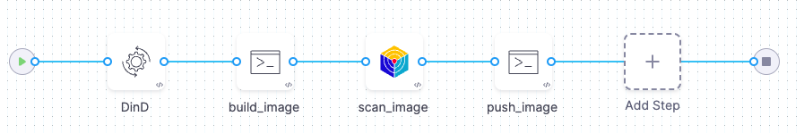
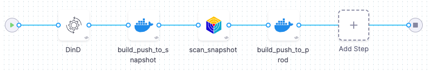
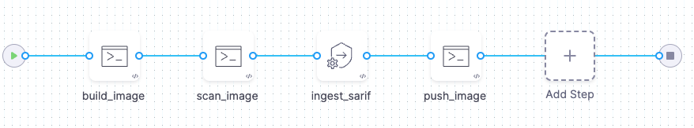
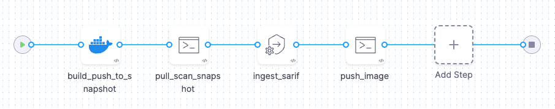

You generally want to scan any container images you build and then push them to your production registry _only_ if the scan did not detect any serious vulnerabilities.

The following workflows provide some examples of you can set up pipelines to automate security checks for your images.

## Build/scan/push with Docker-in-Docker

This workflow is useful if you can use Docker-in-Docker and don't have a CI license. For a hands-on example of how to implement this, go to [(STO license) Create a build-scan-push pipeline ](/docs/security-testing-orchestration/use-sto/set-up-sto-pipelines/build-scan-push-workflows/build-scan-push-sto-only).

1. Add a [Docker-in-Docker background step](/docs/security-testing-orchestration/sto-techref-category/security-step-settings-reference#configuring-docker-in-docker-dind-for-your-pipeline) to your pipeline.

2. Add a [Run step](/docs/continuous-integration/use-ci/run-step-settings) to build a local copy of the container image.

3. Add a [Security Tests step](/docs/security-testing-orchestration/sto-techref-category/security-step-settings-reference) to scan the snapshot image and ingest the results.

   If the scan results meet or exceed the [Fail on Severity](/docs/security-testing-orchestration/get-started/key-concepts/fail-pipelines-by-severity) threshold, the  pipeline fails.

5. Add a Run step that pushes the local image to your production container registry.

<figure>



<figcaption>Example build/scan/push pipeline using Run steps and Docker-in-Docker</figcaption>
</figure>

<details>
<summary>Example build/scan/push pipeline using Docker-in-Docker</summary>

```yaml

pipeline:
  projectIdentifier: jsmithstosandbox
  orgIdentifier: default
  identifier: buildscanpushwithdind
  name: build_scan_push_with_dind
  tags: {}
  stages:
    - stage:
        name: build
        identifier: build
        type: SecurityTests
        spec:
          cloneCodebase: false
          execution:
            steps:
              - step:
                  type: Background
                  name: DinD
                  identifier: Background
                  spec:
                    connectorRef: YOUR_CONTAINER_IMAGE_REGISTRY_CONNECTOR_ID
                    image: docker:dind
                    shell: Sh
                    privileged: true
                    entrypoint:
                      - dockerd
              - step:
                  type: Run
                  name: build_image
                  identifier: build_image
                  spec:
                    connectorRef: YOUR_CONTAINER_IMAGE_REGISTRY_CONNECTOR_ID
                    image: docker
                    shell: Sh
                    command: |-

                      # wait until the dind service is available
                      while ! docker ps ;do
                            echo "Docker not available yet"
                      done
                      echo "Docker service is ready"

                      # install git, clone the code repo, and cd to the local clone
                      apk add git
                      git --version
                      git clone https://github.com/<+stage.variables.GITHUB_USERNAME>/<+stage.variables.GITHUB_REPO>
                      cd <+stage.variables.GITHUB_REPO>

                      # build and tag the local image
                      docker login --username="<+stage.variables.DOCKERHUB_USERNAME>" --password="<+stage.variables.DOCKERHUB_PAT>" 
                      docker build -t <+stage.variables.DOCKER_IMAGE_LABEL> .
                      docker tag <+stage.variables.DOCKER_IMAGE_LABEL> <+stage.variables.DOCKERHUB_USERNAME>/<+stage.variables.DOCKER_IMAGE_LABEL>:bsp-<+pipeline.sequenceId>

                    privileged: true
              - step:
                  type: AquaTrivy
                  name: scan_image
                  identifier: scan_image
                  spec:
                    mode: orchestration
                    config: default
                    target:
                      name: <+stage.variables.DOCKERHUB_USERNAME>/<+stage.variables.DOCKER_IMAGE_LABEL>
                      type: container
                      variant: bsp-<+pipeline.sequenceId>
                    advanced:
                      log:
                        level: debug
                      fail_on_severity: none
                    privileged: true
                    image:
                      type: local_image
                      name: <+stage.variables.DOCKERHUB_USERNAME>/<+stage.variables.DOCKER_IMAGE_LABEL>
                      access_id: <+stage.variables.DOCKERHUB_USERNAME>
                      access_token: <+stage.variables.DOCKERHUB_PAT>
                      tag: bsp-<+pipeline.sequenceId>
              - step:
                  type: Run
                  name: push_image
                  identifier: push_image
                  spec:
                    connectorRef: CONTAINER_IMAGE_REGISTRY_CONNECTOR
                    image: docker
                    shell: Sh
                    command: |-

                      # if the image passed the scan,
                      # push it to the image registry
                      docker login --username="<+stage.variables.DOCKERHUB_USERNAME>" --password="<+stage.variables.DOCKERHUB_PAT>" 
                      docker push <+stage.variables.DOCKERHUB_USERNAME>/<+stage.variables.DOCKER_IMAGE_LABEL>:bsp-<+pipeline.sequenceId>
                    privileged: true
          sharedPaths:
            - /var/run
            - /var/lib/docker
          platform:
            os: Linux
            arch: Amd64
          runtime:
            type: Cloud
            spec: {}
          slsa_provenance:
            enabled: false
        variables:
          - name: DOCKERHUB_USERNAME
            type: String
            description: ""
            value: janesmith
          - name: DOCKERHUB_PAT
            type: Secret
            description: ""
            value: jsmith-dockerhub-pat
          - name: GITHUB_USERNAME
            type: String
            description: ""
            value: jane-smith
          - name: GITHUB_REPO
            type: String
            description: ""
            value: codebaseAlpha
          - name: GITHUB_PAT
            type: Secret
            description: ""
            value: jsmith-github-pat
          - name: DOCKER_IMAGE_LABEL
            type: String
            description: ""
            value: myalphaservice
        description: ""
```

</details>

## Build/scan/push with CI and Docker-in-Docker

This workflow is useful if you can use Docker-in-Docker and have a CI license. For a hands-on example of how to implement this, go to [Create a build-scan-push pipeline (STO and CI)](/docs/security-testing-orchestration/use-sto/set-up-sto-pipelines/build-scan-push-workflows/build-scan-push-sto-ci).

1. Add a [Docker-in-Docker background step](/docs/security-testing-orchestration/sto-techref-category/security-step-settings-reference#configuring-docker-in-docker-dind-for-your-pipeline) to your pipeline.

2. Add a [CI Build and Push step](/docs/category/build-push-upload-download) to build and push your image with a snapshot tag such as`image:snapshot-donotuse-<+pipeline.executionId>`.

3. Add a [Security Tests step](/docs/security-testing-orchestration/sto-techref-category/security-step-settings-reference) to scan the snapshot image.

   If the scan results meet or exceed the [Fail on Severity](/docs/security-testing-orchestration/get-started/key-concepts/fail-pipelines-by-severity) threshold, the  pipeline fails.

4. Add a second CI Build and Push step to build and push your image with a release tag such as`image:<+pipeline.executionId>`.

<figure>



<figcaption>Example build/scan/push pipeline using CI and Docker-in-Docker</figcaption>
</figure>

<details>
<summary>Example build/scan/push pipeline using CI and Docker-in-Docker</summary>

```yaml

pipeline:
  projectIdentifier: STO
  orgIdentifier: default
  tags: {}
  identifier: buildscanpushciexamplev2
  name: build-scan-push-ci-example-v2
  properties:
    ci:
      codebase:
        connectorRef: YOUR_CODE_REPO_CONNECTOR_ID
        repoName: codebasealpha
        build: <+input>
  stages:
    - stage:
        name: build
        identifier: build
        type: CI
        spec:
          cloneCodebase: true
          execution:
            steps:
              - step:
                  type: Background
                  name: DinD
                  identifier: Background
                  spec:
                    connectorRef: YOUR_CONTAINER_IMAGE_REGISTRY_CONNECTOR_ID
                    image: docker:dind
                    shell: Sh
                    privileged: true
                    entrypoint:
                      - dockerd
              - step:
                  type: BuildAndPushDockerRegistry
                  name: build_push_to_snapshot
                  identifier: build_push_to_snapshot
                  spec:
                    connectorRef: YOUR_CONTAINER_IMAGE_REGISTRY_CONNECTOR_ID
                    repo: <+stage.variables.DOCKERHUB_USERNAME>/<+stage.variables.DOCKER_IMAGE_LABEL>
                    tags:
                      - <+stage.variables.SNAPSHOT_TAG>
              - step:
                  type: AquaTrivy
                  name: scan_snapshot
                  identifier: AquaTrivy_1
                  spec:
                    mode: orchestration
                    config: default
                    target:
                      name: +stage.variables.DOCKERHUB_USERNAME>/<+stage.variables.DOCKER_IMAGE_LABEL>
                      type: container
                      variant: <+stage.variables.SNAPSHOT_TAG>
                    advanced:
                      log:
                        level: debug
                    privileged: true
                    image:
                      type: local_image
                      name: <+stage.variables.DOCKERHUB_USERNAME>/<+stage.variables.DOCKER_IMAGE_LABEL>
                      tag: <+stage.variables.SNAPSHOT_TAG>
              - step:
                  type: BuildAndPushDockerRegistry
                  name: build_push_to_prod
                  identifier: build_push_to_prod
                  spec:
                    connectorRef: YOUR_CONTAINER_IMAGE_REGISTRY_CONNECTOR_ID
                    repo: <+stage.variables.DOCKERHUB_USERNAME>/<+stage.variables.DOCKER_IMAGE_LABEL>
                    tags:
                      - <+pipeline.sequenceId>
            "":
              type: BuildAndPushDockerRegistry
              name: build_and_push_prod
              identifier: build_and_push_prod
              spec:
                connectorRef: YOUR_CONTAINER_IMAGE_REGISTRY_CONNECTOR_ID
                repo: <+stage.variables.DOCKERHUB_USERNAME>/<+stage.variables.DOCKER_IMAGE_LABEL>
                tags:
                  - <+stage.variables.SNAPSHOT_TAG>
          sharedPaths:
            - /var/run
            - /var/lib/docker
          slsa_provenance:
            enabled: false
          infrastructure:
            type: KubernetesDirect
            spec:
              connectorRef: YOUR_KUBERNETES_CLUSTER_CONNECTOR_ID
              namespace: YOUR_NAMESPACE
              automountServiceAccountToken: true
              nodeSelector: {}
              os: Linux
        variables:
          - name: DOCKERHUB_USERNAME
            type: String
            description: ""
            value: jsmith
          - name: DOCKERHUB_PAT
            type: Secret
            description: ""
            value: jsmithdockerhubpat
          - name: GITHUB_USERNAME
            type: String
            description: ""
            value: jane-smith
          - name: GITHUB_REPO
            type: String
            description: ""
            value: codebaseAlpha
          - name: GITHUB_PAT
            type: Secret
            description: ""
            value: account.janesmithgithubpatsto
          - name: DOCKER_IMAGE_LABEL
            type: String
            description: ""
            value: myalphaservice
          - name: SNAPSHOT_TAG
            type: String
            description: ""
            required: false
            value: scantest-donotuse
        description: ""
```

</details>

## Build/scan/push with Kaniko

This workflow is useful if you don't have a CI license and want to use [Kaniko](https://github.com/GoogleContainerTools/kaniko) (which doesn't require Privileged mode) instead of a Docker-in-Docker background step. 

1. In the Security stage overview, under **Shared Paths**, add a path on the stage volume where you can share the image TAR across steps.

2. Use a [Run step](/docs/continuous-integration/use-ci/run-step-settings) to build a local copy of the container image. The step should also save the TAR of the image to the shared path on the stage volume.

3. Use a Run step to run a manual scan of the local image.

4. Add a [Security Tests step](/docs/security-testing-orchestration/sto-techref-category/security-step-settings-reference#harness-sto-scanner-support) to [ingest](/docs/security-testing-orchestration/get-started/key-concepts/ingest-scan-results-into-an-sto-pipeline) your scan data.

   If the scan results meet or exceed the [Fail on Severity](/docs/security-testing-orchestration/get-started/key-concepts/fail-pipelines-by-severity) threshold, the pipeline fails.

5. Set up a Run step that uses kaniko to push the TAR file of the image to your production image registry.

<figure>



<figcaption>Example build/scan/push pipeline using kaniko</figcaption>
</figure>

## Build/scan/push with CI and skopeo

This workflow is useful if you have a CI license and want to use [skopeo](https://github.com/containers/skopeo) (which doesn't require Privileged mode) instead of a Docker-in-Docker background step.

1. In the Security stage overview, under **Shared Paths**, add a path on the stage volume where you can share the image TAR across steps.

2. Use a CI [Build and Push step](/docs/category/build-push-upload-download) to build and push your image with a snapshot tag such as`image:snapshot-<+pipeline.executionId>`.

3. Use a [Run step](/docs/continuous-integration/use-ci/run-step-settings) that uses skopeo to pull the image TAR to your shared path.

4. Use a Run step to scan the local image TAR.

5. Add a [Security Tests step](/docs/security-testing-orchestration/sto-techref-category/security-step-settings-reference#harness-sto-scanner-support) to [ingest](/docs/security-testing-orchestration/get-started/key-concepts/ingest-scan-results-into-an-sto-pipeline) your scan data.

   If the scan results meet or exceed the [Fail on Severity](/docs/security-testing-orchestration/get-started/key-concepts/fail-pipelines-by-severity) threshold, the pipeline fails.

6. Add a Run step that uses skopeo to push the image TAR (with an official tag) from the shared path to the container image registry.

<figure>



<figcaption>Example build/scan/push pipeline using CI and skopeo</figcaption>
</figure>
