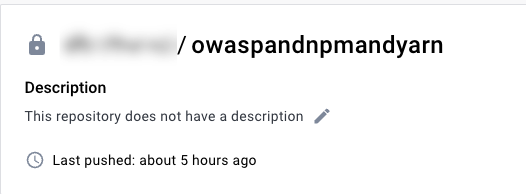

import Tabs from '@theme/Tabs';
import TabItem from '@theme/TabItem';

Harness maintains a [set of public scanner images](https://console.cloud.google.com/gcr/images/gcr-prod/global/harness?tab=vulnz) for popular tools such as Semgrep, OWASP, SonarQube, Snyk, and Veracode. Harness seeks to  keep these images as small and as lightweight as possible, and to minimize the number of vulnerabilities in each image. This means that you might want to extend an image with additional layers to scan a specific type of target. You can easily add packages such as Node, Ruby, and Maven to a scanner image and then run the custom container in STO. 

### Important notes

- This topic assumes that you are familiar with containerization, Dockerfiles, and [best practices](https://docs.docker.com/develop/develop-images/dockerfile_best-practices/) for building container images. 

- Harness supports the CI and STO images in the [Harness project on GCR](https://console.cloud.google.com/gcr/images/gcr-prod/global/harness). You can extend these images to support your own uses cases, but custom images are not supported by Harness. 

- Harness recommends that you add only the packages and files required for your specific use case, and that you thoroughly test and scan your custom images for vulnerabilities and other issues before you deploy them in your production environment.   

- Harness [updates its public CI and STO images](/docs/security-testing-orchestration/use-sto/set-up-sto-pipelines/sto-images) every two weeks. It is good practice to rebuild your custom images every month to use the most recent base images. 

## Workflow description

The following steps describe the general workflow. 

1. Create a Dockerfile that specifies the base Harness image and the packages and files that you want to.

2. Build your custom image and push it to your image registry.

2. In your pipeline, add a Run step that uses your customized image to scan the target and save the results in a shared folder. 

3. Add a Security or Security Test step to ingest the results. 

## Hands-on example: add Yarn and PNPM to an OWASP image

Suppose you're a security engineer and you want to start using STO and [OWASP Dependency Check](https://owasp.org/www-project-dependency-check/) to scan and validate the code repositories maintained by your organization. One development team uses [Yarn](https://yarnpkg.com/) and another team uses [PNPM](https://pnpm.io/). Your initial scans are failing because the base image doesn't include these packages. 

The following steps illustrate how to create an OWASP image that you can use to scan repositories that use Yarn AND repositories that use PNPM. (OWASP assumes that a scanned repo uses one package manager only. A scan will fail if the repo includes files associated with different managers.) 


### Extend the base image with Yarn and PNPM

The first step is to create a Dockerfile that adds these packages to the OWASP base image.

<details>

<summary>Dockerfile example</summary>

``` 
# STEP 1 
# Specify the base STO scanner image
# For a list of all images in the Harness Container Registry, run the following:
#     curl -X  GET https://app.harness.io/registry/_catalog

FROM harness/owasp-dependency-check-job-runner:latest as scanner

RUN apt-get update && apt-get install -y \
  ca-certificates \
  curl


# STEP 2
# Add the packages and files you need to the image

# Install sudo
RUN apt install sudo

# Install npm
# https://askubuntu.com/questions/720784/how-to-install-latest-node-inside-a-docker-container
RUN apt update
RUN printf 'y\n1\n\1n' | apt install nodejs
RUN apt install -y npm

# Make sure Node is up-to-date
# https://askubuntu.com/questions/426750/how-can-i-update-my-nodejs-to-the-latest-version
RUN sudo npm cache clean -f
RUN sudo npm install -y -g n
RUN sudo n stable


# Install yarn
# https://linuxize.com/post/how-to-install-yarn-on-ubuntu-20-04/
RUN curl -o- -L https://yarnpkg.com/install.sh | bash
RUN sudo apt install yarn -y
ENV PATH="/root/.yarn/bin:$PATH"

# Install pnpm
# https://vsys.host/how-to/how-to-install-pnpm-on-ubuntu-22-04
# https://github.com/pnpm/pnpm/issues/5103
RUN SHELL="bash:$SHELL"
RUN wget -qO- https://get.pnpm.io/install.sh | ENV="$HOME/.bashrc" SHELL="$(which bash)" bash -
RUN npm install -g pnpm
ENV PATH="~/.local/share/pnpm:$PATH"

```
</details>


### Build and push the customized image

Once you're satisfied with the customized image, you can push it to your image registry. 




### Add a shared folder to the pipeline stage

Now you're ready to set up your pipeline. First, you add a shared path to the stage for the scan results. This is a standard good practice for [ingestion workflows](/docs/security-testing-orchestration/sto-techref-category/snyk/snyk-open-source#snyk-open-source-scan---ingestion-mode). 

<Tabs>
    <TabItem value="Visual" label="Visual" default>

    1. In your Harness pipeline, go to the stage where you want to run the scan.

    2. Select **Overview** and then add a shared path such as `/shared/scan_results`.

        <DocImage path={require('./static/custom-image-shared-path.png')} width="50%" height="50%" title="Add shared path for scan results" /> 

    </TabItem>

    <TabItem value="YAML" label="YAML">

     Go to the stage where you want to run the scan. Then add a shared path as shown in the following YAML.

    ``` yaml
    - stage:
        name: owasp-scan
        identifier: owaspscanwithbinaries
        description: ""
        type: SecurityTests
        spec:
          sharedPaths:
            - /shared/scan_results

    ```

</TabItem>

</Tabs>


### Add a Run step to scan the target with the custom image

Now add a Run step that pulls your custom image, runs the `dependency-check` binary on the specified target, and saves the scan results to the shared folder you created.

<Tabs>
    <TabItem value="Visual" label="Visual" default>

    Add a **Run** step and configure it as follows:
 
       1. **Optional Configuration** > **Container Registry**: A connector to the registry where you stored your custom OWASP image. 

       2. **Optional Configuration** > **Image**: Your custom image name and tag, such as `myimageregistry/owaspcustom:latest`

       3. **Command**: The [`dependency-check`](https://jeremylong.github.io/DependencyCheck/dependency-check-cli/arguments.html) CLI command and arguments, as well as any other commands you want to run. 
       
          The following `dependency-check` arguments are required in this case:
             
             - `--scan /harness` 
             - `--format JSON`
             - `--out <scan_results_output_path_and_filename>`
             - `--yarn <path_to_yarn> `
             - `--pnpm <path_to_pnpm> `

          Here's an example:

          ```yaml
          
           command: |-
                yarn --version
                pnpm --version 
                /app/dependency-check/bin/dependency-check.sh \
                   --yarn /root/.yarn/bin/yarn \
                   --pnpm /usr/local/bin/pnpm \
                   --scan /harness \
                   --format JSON  \ 
                   --out /shared/scan_results/owasp.json 

          ```

          
          <DocImage path={require('./static/custom-image-run-step.png')} width="50%" height="50%" title="Add Run step for custom image" /> 

    </TabItem>

    <TabItem value="YAML" label="YAML">

    Add a `Run` step and configure it as follows:
 
       1. `connectorRef:` A connector to the registry where you stored your custom OWASP image. 

       2. `image:` Your custom image name and tag, such as `myimageregistry/owaspcustom:latest`.

       3. `command:` The [`dependency-check`](https://jeremylong.github.io/DependencyCheck/dependency-check-cli/arguments.html) CLI command and arguments, as well as any other commands you want to run. 
       
          The following `dependency-check` arguments are required in this case:
             
             - `--scan /harness` 
             - `--format JSON`
             - `--out <scan_results_output_path_and_filename>`
             - `--yarn <path_to_yarn> `
             - `--pnpm <path_to_pnpm> `

     Here's an example:

        ```yaml
        
        - step:
            type: Run
            name: owasp-scan-with-binaries
            identifier: owasp-scan-with-binaries
            spec:
            connectorRef: YOUR_IMAGE_REGISTRY_CONNECTOR_ID
            image: YOUR_IMAGE_REGISTRY_NAME/owaspandnpmandyarn:latest
            shell: Sh
            command: |-
                yarn --version
                pnpm --version
                /app/dependency-check/bin/dependency-check.sh \
                    --yarn /root/.yarn/bin/yarn \
                    --pnpm /usr/local/bin/pnpm \
                    --scan /harness \
                    --prettyPrint \
                    --format JSON  \
                    --out /shared/scan_results/output.json 
            imagePullPolicy: Always

        ```

</TabItem>
</Tabs>


### Add an OWASP ingest step

Finally, add an **OWASP** step to ingest the scan results from the shared folder.

<Tabs>
    <TabItem value="Visual" label="Visual" default>

    Set the **Scan Mode** to **Ingestion** and specify the **Ingestion File** in your shared folder. 

    <DocImage path={require('./static/custom-image-ingestion-step.png')} width="40%" height="40%" title="OWASP step using Ingestion mode" />  

    </TabItem>


    <TabItem value="YAML" label="YAML">

        Set the `mode:` to `ingestion` and specify the `ingestion : file` in your shared folder.

        ``` yaml

            - step:
                type: Owasp
                name: owasp_ingest_results
                identifier: Owasp_2
                spec:
                mode: ingestion
                config: default
                target:
                    type: repository
                    detection: auto
                advanced:
                    log:
                    level: info
                ingestion:
                    file: /shared/scan_results/output.json


        ```

    </TabItem>

</Tabs>

### Example pipeline

This example pipeline has three steps.

- `owasp_scan_oob` and `owasp_scan_with_binaries` run in parallel:

  - `owasp_scan_oob` uses the [OWASP Dependency-Check step](/docs/security-testing-orchestration/sto-techref-category/owasp-scanner-reference) out-of-the box in orchestration mode. The step fails when trying to scan a repository with Yarn or PNPM because it doesn't have the required binaries. This step has a failure strategy to ignore all errors so it doesn't stop the pipeline.

  - `owasp_scan_with_binaries` uses the [custom OWASP image](#extend-the-base-image-with-yarn-and-pnpm) that includes the binaries required to scan Yarn and PNPM repositories.

- `owasp_ingest_results` uses the [OWASP Dependency-Check step](/docs/security-testing-orchestration/sto-techref-category/owasp-scanner-reference) to ingest the scan results that `owasp_scan_with_binaries` published to the shared folder.

    <DocImage path={require('./static/owasp-with-yarn-and-npm-example-pipeline.png')}  title="Example pipeline with out-of-the-box OWASP orchestration step (fails) and Run step with custom OWASP image (succeeds)" /> 


If you copy this example, replace the placeholder values with appropriate values for your [code repo connector](/docs/continuous-integration/use-ci/codebase-configuration/create-and-configure-a-codebase/#code-repo-connectors), [image registry connector](/docs/category/cloud-platform-connectors-reference/), and other applicable values. Depending on your project and organization, you might also need to replace `projectIdentifier` and `orgIdentifier`.

<details>
<summary>Example pipeline YAML</summary>

```yaml
pipeline:
  projectIdentifier: default
  orgIdentifier: default
  identifier: owaspyarnpnpmtestFINAL
  name: owasp-yarn-pnpm-test-FINAL
  tags: {}
  stages:
    - stage:
        name: owasp-scan
        identifier: owaspscan
        description: ""
        type: SecurityTests
        spec:
          cloneCodebase: true
          caching:
            enabled: true
            paths: []
          platform:
            os: Linux
            arch: Amd64
          runtime:
            type: Cloud
            spec: {}
          execution:
            steps:
              - parallel:
                  - step:
                      type: Owasp
                      name: owasp_scan_oob
                      identifier: Owasp_1
                      spec:
                        mode: orchestration
                        config: default
                        target:
                          type: repository
                          detection: auto
                        advanced:
                          log:
                            level: info
                          args:
                            cli: "--yarn /yarndir/yarn-v1.22.19/bin/yarn --log /yarndir/log.log"
                      failureStrategies:
                        - onFailure:
                            errors:
                              - AllErrors
                            action:
                              type: Ignore
                  - step:
                      type: Run
                      name: owasp-scan-with-binaries
                      identifier: Run_1
                      spec:
                        connectorRef: YOUR_IMAGE_REGISTRY_CONNECTOR_ID
                        image: YOUR_IMAGE_REGISTRY_NAME/YOUR_IMAGE_NAME:YOUR_IMAGE_TAG
                        shell: Sh
                        command: |-
                          yarn --version
                          pnpm --version
                          /app/dependency-check/bin/dependency-check.sh \
                               --yarn /root/.yarn/bin/yarn \
                               --pnpm /usr/local/bin/pnpm \
                               --scan /harness \
                               --prettyPrint \
                               --format JSON  \
                               --out /shared/scan_results/output.json 
                               # --project owasp_scan_with_yarn_and_pnpm
                               # --disableNodeAudit \     
                               # --enableExperimental \
                               # --noupdate\
                          # echo "SCAN RESULTS FILE ============================"
                          # cat /shared/scan_results/output.json
                        imagePullPolicy: Always
              - step:
                  type: Owasp
                  name: owasp_ingest_results
                  identifier: owasp_ingest_results
                  spec:
                    mode: ingestion
                    config: default
                    target:
                      type: repository
                      detection: auto
                    advanced:
                      log:
                        level: info
                    ingestion:
                      file: /shared/scan_results/output.json
          sharedPaths:
            - /shared/scan_results
            - /yarndir
          slsa_provenance:
            enabled: false
        failureStrategies:
          - onFailure:
              errors:
                - AllErrors
              action:
                type: Ignore
  properties:
    ci:
      codebase:
        connectorRef: YOUR_CODE_REPOSITORY_CONNECTOR_ID
        repoName: <+input>
        build: <+input>

```
</details>
