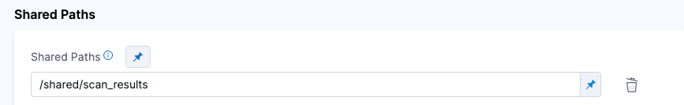

import Tabs from '@theme/Tabs';
import TabItem from '@theme/TabItem';

Harness maintains a [set of scan images](https://console.cloud.google.com/gcr/images/gcr-prod/global/harness?tab=vulnz) for popular tools such as Semgrep, OWASP, SonarQube, Snyk, and Veracode. Harness seeks to  keep these images as small and as lightweight as possible, and to minimize the number of vulnerabilities in each image. This means that you might want to extend an image with additional layers to scan a specific type of target. You can easily add packages such as Node, Ruby, and Maven to a scanner image and then run the image in STO. 

### Important notes

- This topic assumes that you are familiar with containerization, Dockerfiles, and [best practices]](https://docs.docker.com/develop/develop-images/dockerfile_best-practices/) for building container images. 

- Harness supports the CI and STO images in the [Harness project on GCR](https://console.cloud.google.com/gcr/images/gcr-prod/global/harness). You can extend these images to support your own uses cases, but custom images are not supported by Harness. 

- Harness recommends that you add the only the required packages/files to your custom images, and that you thoroughly test and scan these images for vulnerabilities before you deploy them in your production environment.   

## Workflow description

The following steps describe the general workflow. 

1. Create a Dockerfile that specifies the base Harness image and the packages and files that you want to.

2. Build your custom image and push it to your image registry.

2. In your pipeline, add a Run step that uses your customized image to scan the target and save the results in a shared folder. 

3. Add a Security or Security Test step to ingest the results. 

## Hands-on example: add yarn and pnpm to an OWASP image

In this example, a security engineer wants to start using STO and [OWASP Dependency Check](https://owasp.org/www-project-dependency-check/) to scan and validate the code repositories maintained by her organization. One development team uses [Yarn](https://yarnpkg.com/) and another team uses [PNPM](https://pnpm.io/). Her scans are failing because the base OWASP image doesn't include these packages.   

### Extend the base image with the required packages

First she creates a Docker file that adds these packages to the OWASP base image.

<details>

<summary>Dockerfile example</summary>

``` 
# STEP 1 
# Specify the STO scanner image where you want to add your certificates
# For a list of all images in the Harness Container Registry, run the following:
#     curl -X  GET https://app.harness.io/registry/_catalog

FROM harness/owasp-dependency-check-job-runner:latest as scanner

RUN apt-get update && apt-get install -y \
  ca-certificates \
  curl


# STEP 2
# Add the packages and files you need to the image

# Install sudo
RUN apt install sudo

# Install npm
# https://askubuntu.com/questions/720784/how-to-install-latest-node-inside-a-docker-container
RUN apt update
RUN printf 'y\n1\n\1n' | apt install nodejs
RUN apt install -y npm

# Make sure Node is up-to-date
# https://askubuntu.com/questions/426750/how-can-i-update-my-nodejs-to-the-latest-version
RUN sudo npm cache clean -f
RUN sudo npm install -y -g n
RUN sudo n stable


# Install yarn
# https://linuxize.com/post/how-to-install-yarn-on-ubuntu-20-04/
RUN curl -o- -L https://yarnpkg.com/install.sh | bash
RUN sudo apt install yarn -y
ENV PATH="/root/.yarn/bin:$PATH"

# Install pnpm
# https://vsys.host/how-to/how-to-install-pnpm-on-ubuntu-22-04
# https://github.com/pnpm/pnpm/issues/5103
RUN SHELL="bash:$SHELL"
RUN wget -qO- https://get.pnpm.io/install.sh | ENV="$HOME/.bashrc" SHELL="$(which bash)" bash -
RUN npm install -g pnpm
ENV PATH="~/.local/share/pnpm:$PATH"

```
</details>

### Build and push the customized image

Once she's satisfied with the customized image, she pushes it to her image registry. 


### Add a shared folder to the pipeline stage

Now she's ready to set up her pipeline. First she goes to the stage where she wants to run the scan and adds a shared path for the scan results. This is a standard good practice for [ingestion workflows](/docs/security-testing-orchestration/sto-techref-category/snyk/snyk-scans#snyk-open-source-ingestion-example). 

<Tabs>
    <TabItem value="Visual" label="Visual" default>

    

    </TabItem>

    <TabItem value="YAML" label="YAML">

    ``` yaml
    - stage:
        name: owasp-scan-with-binaries
        identifier: owaspscanwithbinaries
        description: ""
        type: SecurityTests
        spec:
          sharedPaths:
            - /shared/scan_results

    ```

</TabItem>
</Tabs>


### Add a Run step to scan the target with the custom image

She then adds a Run step that pulls the custom image and runs the `dependency-check` binary on the specified target.

<Tabs>
    <TabItem value="Visual" label="Visual" default>

     <DocImage path={require('./static/custom-image-run-step.png')} width="50%" height="50%" title="Add Run step for custom image" /> 

    </TabItem>

    <TabItem value="YAML" label="YAML">

    ``` yaml
    - step:
        type: Run
        name: owasp-scan-with-binaries
        identifier: Run_1
        spec:
        connectorRef: dbothwelldockerhubhc
        image: dbothwell/owaspandnpmandyarn:latest
        shell: Sh
        command: |-
            which pnpm
            /app/dependency-check/bin/dependency-check.sh \
               --disableNodeAudit \
               --project owasp_nodegoat_ci \
               --yarn /root/.yarn/bin/yarn \
               --enableExperimental \
               --pnpm /usr/local/bin/pnpm \
               --prettyPrint --format JSON  -n --scan /harness --out /shared/scan_results/output.json 
            echo "SCAN RESULTS FILE ============================"
            cat /shared/scan_results/output.json
        imagePullPolicy: Always

    ```

</TabItem>
</Tabs>

### Add an ingest step

Finally, she adds an OWASP step to ingest the results from the shared folder.

<Tabs>
    <TabItem value="Visual" label="Visual" default>

    <DocImage path={require('./static/custom-image-ingestion-step.png')} width="40%" height="40%" title="OWASP step using Ingestion mode" />  

    </TabItem>

    <TabItem value="YAML" label="YAML">

    ``` yaml

        - step:
            type: Owasp
            name: owasp_ingest_results
            identifier: Owasp_2
            spec:
            mode: ingestion
            config: default
            target:
                type: repository
                detection: auto
            advanced:
                log:
                level: info
            ingestion:
                file: /shared/scan_results/output.json


    ```

</TabItem>
</Tabs>