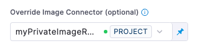

Harness maintains its own set of scan images for [STO-supported scanners](/docs/security-testing-orchestration/sto-techref-category/security-step-settings-reference.md#scanners-target-types-and-scan-approach). By default, a Harness pipeline build pulls scan images from Docker Hub.

This topic describes how to override the default behavior and use a private registry instead. You can download the scan images you need, perform your own security checks on the images, upload them to a private registry, and then set up your STO steps to download images from this registry. 

The following steps describe the high-level workflow:
1. [Create STO scanner images with your own SSL certificates (optional)](#create-sto-scanner-images-with-your-own-ssl-certificates-optional)
2. [Create a connector to your private registry](#create-a-connector-to-your-private-registry)
3. [Configure the pipeline to download images from your registry](#configure-the-pipeline-to-download-images-from-your-registry)
   * [Scanner template setup](#scanner-template-setup)
   * [Security step setup](#security-step-setup)

## Create STO scanner images with your own SSL certificates (optional)

Harness STO supports [three workflows](/docs/security-testing-orchestration/use-sto/set-up-sto-pipelines/add-custom-certs/ssl-setup-in-sto#supported-workflows-for-adding-custom-ssl-certificates) for running scans with custom certificates.

In this workflow, you set up your STO scan images and pipelines to run scans as non-root and establish trust for your own proxies using self-signed certificates. This workflow supports any STO-compatible scanner that can run natively without root access. This workflow also supports build environments that use a self-signed proxy server between the Harness Delegate and Harness Manager.

:::note
Running container image scans as a non-root user is not currently supported.
:::

1. Save a copy of the following Dockerfile into a folder along with the certificates you want to copy to the image.

2. Update the `FROM`, `COPY`, and `USER` commands as described in the Dockerfile comments.

3. Build the new image and then publish it to your private registry.

4. Update the scan step in your pipeline as follows:

   1. Update the **Image** setting to point to the new image in your registry.
   2. If you specified a `USER` in your Dockerfile, set the **Run as User** (`runAsUser`) setting to the user you specified in your Dockerfile.

<details><summary>Dockerfile template for adding certificates to an STO scanner image</summary>

``` bash
# STEP 1 
# Specify the STO scanner image where you want to add your certificates
# For a list of all images in the Harness Container Registry, run the following:
#     curl -X  GET https://app.harness.io/registry/_catalog
FROM harness/twistlock-job-runner:latest as scanner

# FYI Root access is required to load and trust certificates
USER root

# STEP 2 
# Copy your certificates to the engine
# You can copy multiple ca from completely different paths into SHARE_CA_PATH
COPY ./CERTIFICATE_1.pem ../another-folder/CERTIFICATE_2.pem /shared/customer_artifacts/certificates/


# FYI establishes trust for certificates in Python and the OS 
RUN sto_plugin --trust-certs
# Optional: To trust certificates for Java for tools such as
# - Black Duck Hub
# - Checkmarx
# - Sonarqube
# - Veracode
# - NexusIQ
# RUN sh /bin/setup.sh 

# STEP 3 (optional)
# Create a user and assume limited permission user
# If you set this, you need to add runAsUser setting in the scan step
#     i.e., runAsUser: "1000"
USER 1000

```

</details>

## Create a connector to your private registry

You need a Docker connector that points to your private container registry. For more information, go to [Docker Connector Settings Reference](/docs/platform/connectors/cloud-providers/ref-cloud-providers/docker-registry-connector-settings-reference/).

## Configure the pipeline to download images from your registry

1. Download the scan images you need, test and validate the images, and store them in your private registry. 

   :::note
   
   Do not change the image names in your private registry. The image names must match the names specified by Harness.

   :::

   Harness maintains a Container Image Registry that is dedicated exclusively to hosting Harness-supported images. You can download your scan images from this registry instead of Docker Hub. To view the list of images in this registry, enter the following command:
   ```
   curl -X  GET https://app.harness.io/registry/_catalog
   ```
   You can also [set up your CI pipelines](/docs/platform/connectors/artifact-repositories/connect-to-harness-container-image-registry-using-docker-connector) to download build images from this registry instead of Docker Hub.

2. Set up your pipeline to download the images from your private registry, based on the type of step you're using to run your scans:

   - [Scanner template step](#scanner-template-setup)
   - [Security step](#security-step-setup)

### Scanner template setup

Do the following if you're using a scanner template rather than a generic **Security** step. A scanner template is a **Security Test** step with a scanner-specific UI, such as [**Black Duck Hub**](/docs/security-testing-orchestration/sto-techref-category/black-duck-hub-scanner-reference), [**CodeQL**](/docs/security-testing-orchestration/sto-techref-category/codeql-scanner-reference#codeql-step-settings-for-sto-scans), and [**Snyk**](/docs/security-testing-orchestration/sto-techref-category/snyk/snyk-scanner-reference#snyk-step-configuration).

1. In the stage where you're setting up the scanner template, go to the **Infrastructure** tab. 

2. Under **Advanced**, go to **Override Image Connector (optional)** and select the connector to your private registry. You might need to scroll down to see this option.

   


3. If you specified a `USER` in the Dockerfile for your scan image, configure the scan step to run as the user:

   1. Open the scanner step and expand **Additional Configuration**. 
   
   2. Set the **Run as User** (`runAsUser`) setting to the user you specified in your Dockerfile.

### Security step setup 

Do the following if you're using a generic **Security** step for you scan:

1. Open the **Security** step and add these settings: 

   * `runner_registry_domain`  —  The URL of the Docker registry where the images are stored. 
     
     The supported format is `<_domain_>/<_directory_>` (such as, `app.harness.io/registry`). 
     
     Do not include the scheme (such as `http://` or `https://`).

   * `runner_registry_image_prefix : harness` — Do not change this setting. 

   * `runner_registry_username`  — As needed

   * `runner_registry_token`  — As needed

  :::note

  These settings are supported by the **Security** step only. They are not supported by scanner templates.

  :::

2. If you need to use a proxy server, you must also specify the following: 

   * `http_proxy`  —  The hostname and port to use for proxied HTTP requests
  
   * `https_proxy`  —  The hostname and port to use for proxied HTTPS requests

   * `no_proxy`  — A comma-separated list of hosts to bypass the proxy

3. If you specified a `USER` in the Dockerfile for your scan image, configure the scan step to run as the user:

   1. Open the scanner step and expand **Additional Configuration**. 
   
   2. Set the **Run as User** (`runAsUser`) setting to the user you specified in your Dockerfile.


## YAML example for configuring STO to download images from a private registry

The following pipeline downloads its Security Scan image (bandit) and all of its CI build images from the Harness Image Registry. 

```yaml
pipeline:
  projectIdentifier: my_project
  orgIdentifier: my_org
  tags: {}
  properties:
    ci:
      codebase:
        connectorRef: $GITHUB_CONNECTOR
        repoName: dvpwa
        build: <+input>
  stages:
    - stage:
        name: securityTestStage
        identifier: securityTestStage
        type: CI
        spec:
          cloneCodebase: true
          sharedPaths:
            - /var/run
          infrastructure:
            type: KubernetesDirect
            spec:
              connectorRef: $K8S_CONNECTOR
              namespace: harness-delegate-ng
              automountServiceAccountToken: true
              nodeSelector: {}
              harnessImageConnectorRef: account.harnessImage
              os: Linux
          execution:
            steps:
              - step:
                  type: Background
                  name: docker-dind
                  identifier: dockerdind
                  spec:
                    connectorRef: $DOCKERHUB_CONNECTOR
                    image: docker:dind
                    shell: Sh
                    privileged: true
              - step:
                  type: Security
                  name: banditScan
                  identifier: banditScan
                  spec:
                    privileged: true
                    settings:
                      policy_type: orchestratedScan
                      scan_type: repository
                      product_name: bandit
                      product_config_name: default
                      repository_branch: <+codebase.branch>
                      repository_project: dvpwa
                      fail_on_severity: CRITICAL
                      runner_registry_domain: app.harness.io/registry
                      runner_registry_image_prefix: harness
                      # Here the Harness delegate downloads from the 
                      # Harness Image Registry rather than a private registry. 
                      # Username and token are undefined. 
        variables: []
  identifier: STO_Tutorial_1
  name: STO Tutorial 1

```