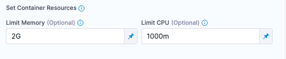
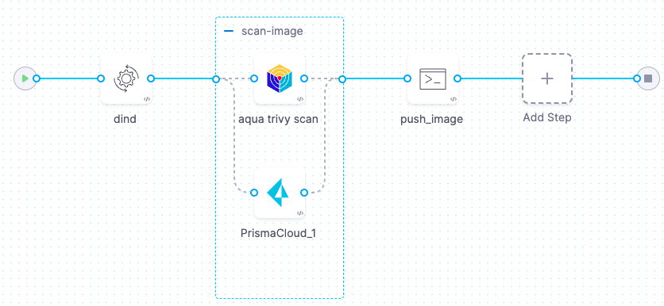
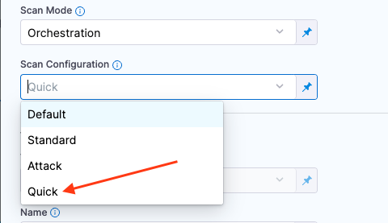
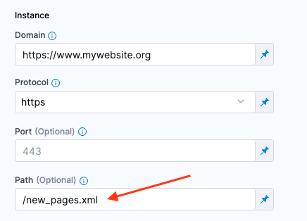

If your STO scans are failing or running slowly, try the following.

<!-- https://harness.atlassian.net/browse/STO-6673 -->

### Increase memory/CPU for the Scan step

If your scans are failing or running slowly, you might need to increase the [**memory and CPU resources**](/docs/continuous-integration/use-ci/manage-dependencies/background-step-settings/#set-container-resources) reserved for your scan step. Some scanners such as SonarQube and Veracode require a lot of memory: for these scanners, you should reserve 2GB+ of memory to scan a medium-sized codebase. Increasing the CPU capacity should also speed up your scans. 

The optimal CPU and memory resources to reserve are highly dependent on the specific scanner and the size and complexity of your target. You might find specific guidance in the external scanner documentation. 

You can also try an iterative approach: run a scan with 1GB memory and 800m CPU, compare the new vs. previous scan times, run the scan again with new values, and repeat until your scan times are acceptable.

To increase the resources reserved for a step, expand **Additional Configuration** and set the **Limit Memory** and a **Limit CPU** options. 

### Increase memory/CPU for the Docker-in-Docker background step

If your scanner requires a Docker-in-Docker background step, you might need to increase the resources for this step as well.

The DinD step needs enough memory to store all of the images to be scanned in the current stage. Thus if all your scanned images have a total size of 2GB, the DinD step requires _at least_ 2GB of memory.

Increasing the CPU will enable the DinD to pull images from the registry more quickly, which will also speed up your scans. 

### Run multiple scans of the same target in parallel

 If you're scanning the same target with multiple scanners, try running the scan steps in parallel rather than sequentially.

In this example, the stage scans an image target using Aqua Trivy and Prisma Cloud. The two steps run in parallel within a [step group](/docs/platform/pipelines/use-step-groups.md).

:::warning

[Parallelism and step groups impact resource consumption](/docs/platform/pipelines/use-step-groups.md#parallelism-impacts-resource-consumption). The stage must have enough memory and CPU to run all parallel steps at the same time. If the stage lacks resources, running the steps in parallel could cause your pipeline executions to fail.

:::

  

### Speed up DAST scans

If you're running DAST scans of a large website, and these scans are taking too long, you can create a sitemap file that includes only the pages that you want to include in your scans. Many website repos include a [`sitemap.xml`](https://www.sitemaps.org/protocol.html) that specifies all the pages in the site. If you're using ZAP to scan your website, for example, you can try the following:

1. Create a copy of the website's sitemap. 
2. Strip out all irrelevant pages from the sitemap copy and save it in the code repository of your website. 
    1. Go to your pipeline and open the ZAP scan step. 
    2. Set the [**Scan Configuration**](/docs/security-testing-orchestration/sto-techref-category/zap/zap-scanner-reference#scan-configuration) to **Quick**. With this mode enabled, the [Maximum depth to crawl](https://www.zaproxy.org/docs/desktop/addons/spider/options/#maximum-depth-to-crawl) is set to 1.

           
    
    3. Set the [**Path**](/docs/security-testing-orchestration/sto-techref-category/zap/zap-scanner-reference#path) to the location of the sitemap you added to the website.

       

### Configure the scanner using command-line arguments

Every scan step supports the option to pass command-line arguments via the `tool_args` setting. Your external scanner might support arguments that can speed up your scans. For details, go to the external scanner documentation.

### Disable Debug logging

Make sure that the **Log Level** setting in your scanner is not set to **Debug**. Debug mode can slow down scans considerably.

### Speed up scans in Self-Managed Platform

<!-- https://harness.atlassian.net/browse/STO-6171 -->

You might find that STO scans run slower than expected when you're running STO in Harness Self-Managed Platform. This issue has been observed when the Harness Delegate and Harness server are running in the same cluster with a load balancer that has `preserve client IP` enabled. In this case, consider disabling this option to speed up your scans. 
