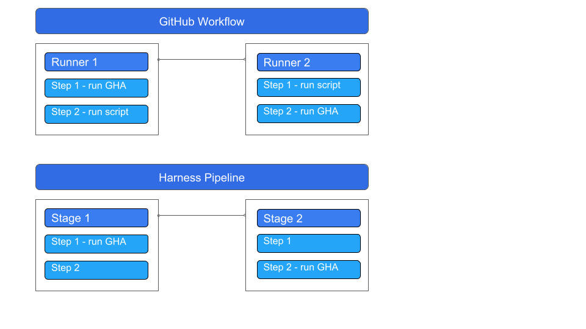

import Tabs from '@theme/Tabs';
import TabItem from '@theme/TabItem';


[GitHub Actions](https://docs.github.com/en/actions/learn-github-actions/understanding-github-actions) is a GitHub feature that enables you to automate various event-driven activities, such as security scanning, in GitHub. This topic describes how to run GitHub Action scans and ingest the results into your Harness pipelines.  

### Important notes for using GitHub Action and Drone Plugin steps in STO 

* You can run GitHub Action security scans in both STO-only pipelines and integrated CI/STO pipelines. 

* You can run scans using [GitHub Action steps](/docs/continuous-integration/use-ci/use-drone-plugins/ci-github-action-step) and [Plugin steps](/docs/continuous-integration/use-ci/use-drone-plugins/run-a-git-hub-action-in-cie). 

* The type of step to use depends on your build infrastructure. For Harness Cloud infrastructures, use Action steps. For Kubernetes infrastructures, you can use Action or Plugin steps.

* [GitHub](https://docs.github.com/en/actions/learn-github-actions/understanding-github-actions#the-components-of-github-actions) and [Harness](/docs/platform/get-started/key-concepts) use slightly different terminologies for similar concepts:

  * GitHub **workflow** = Harness **pipeline**
  * GitHub **job** = Harness **Stage**
  * GitHub **step** = Harness **step**

  

* Harness recommends that you output your scan results to a data file in [SARIF format](https://docs.github.com/en/code-security/code-scanning/integrating-with-code-scanning/sarif-support-for-code-scanning). You can then use a [Custom Ingestion step](/docs/security-testing-orchestration/custom-scanning/custom-ingest-reference) to ingest the results into your pipeline. 

  For a description of the end-to-end workflow, go to [Ingest SARIF scan results](/docs/security-testing-orchestration/custom-scanning/ingest-sarif-data).

* As described below, you need to translate settings from the GitHub Action YAML to the Harness pipeline YAML. It is good practice to configure these settings in the YAML editor.


### Example workflows for using GitHub Action and Drone Plugin steps in STO 


<Tabs>
  <TabItem value="GitHub Action setup">


<!-- action -->


1. Open the CI or STO pipeline where you want to run the action, then go to the Build or Security stage where you want to run the action.

2. Click **Add Step** and then add a **GitHub Action plugin** step. 

3. Use **Settings** to specify the Github Action you want to use and to pass variables and attributes required by the Action. 

   For information about the settings to set, go to the external scanner documentation.

   For a complete description of how to set up a GitHub Action step, go to [Use the GitHub Action step](/docs/continuous-integration/use-ci/use-drone-plugins/ci-github-action-step).


   <table>
    <tr>
        <th>Key</th>
        <th>Description</th>
        <th>Value format</th>
        <th>Value example</th>
    </tr>
    <tr>
        <td><code>uses</code></td>
        <td>Specify the Action's repo, along with a branch or tag.</td>
        <td><code>[repo]@[tag]</code></td>
        <td><code>ajinabraham/njsscan-action@master</code></td>
    </tr>
    <tr>
        <td><code>with</code></td>
        <td>Provide a map of key-value pairs representing settings required by the action itself. At a minimum, make sure you configure the action to publish results in SARIF format. </td>
        <td><code>key: value</code> </td>
        <td><code>args: . --sarif --output result.sarif || true</code> </td>
    </tr>
    <tr>
        <td><code>env</code></td>
        <td>Specify a map of environment variables to pass to the Action. For example, you might need to pass an access token to scan a private repository.</td>
        <td><code>key: value</code></td>
        <td><code>GITHUB_TOKEN: &lt;+secrets.getValue("github_pat")&gt;</code></td>
    </tr>
   </table>


4. Add a [**Custom Ingest**](/docs/security-testing-orchestration/custom-scanning/custom-ingest-reference) step and set it up to ingest the data file.

#### Example setup

<!-- action -->

This example uses the [njsscan action](https://github.com/ajinabraham/njsscan-action) to scan a container. As noted in the [Github Code Scanning SARIF upload](https://github.com/ajinabraham/njsscan-action) snippet, you can configure the  `args` value to output the scan results to a SARIF file:

```yaml
name: njsscan
on:
  push:
    branches: [ master ]
  pull_request:
    branches: [ master ]
jobs:
  njsscan:
    runs-on: ubuntu-latest
    name: njsscan code scanning
    steps:
    - name: Checkout the code
      uses: actions/checkout@v2
    - name: nodejsscan scan
      id: njsscan
      uses: ajinabraham/njsscan-action@master
      # ARGUMENTS THAT SPECIFY THE SARIF OUTPUT FILE
      with:
        args: '. --sarif --output results.sarif || true'
    - name: Upload njsscan report
      uses: github/codeql-action/upload-sarif@v2
      with:
        sarif_file: results.sarif
```
<!-- action -->

Given this, you would set up the Action step in your Harness pipeline like this. You can then set up a CustomIngest step to ingest the `trivy-results.sarif` file that gets generated.

```yaml
- step:
    type: Action
    name: njsscan
    identifier: njsscan
    spec:
      uses: ajinabraham/njsscan-action@master
      # ARGUMENTS THAT SPECIFY THE SARIF OUTPUT FILE
      with:
        args: . --sarif --output result.sarif || true
```
<!-- action -->

<details>
<summary>YAML pipeline example</summary>

If you copy this example, replace the placeholder values with appropriate values for your project, organization, and connector.

```yaml
pipeline:
  projectIdentifier: YOUR_PROJECT_ID
  orgIdentifier: YOUR_HARNESS_ORG_ID
  tags: {}
  identifier: nodejs_repo_scan
  name: nodejs_repo_scan
  properties:
    ci:
      codebase:
        connectorRef: YOUR_CODE_REPO_CONNECTOR_ID
        repoName: https://github.com/OWASP/NodeGoat
        build: <+input>
  stages:
    - stage:
        name: njsscan
        identifier: njsscan
        type: CI
        spec:
          cloneCodebase: true
          execution:
            steps:
              - step:
                  type: Action
                  name: njsscan
                  identifier: njsscan
                  spec:
                    uses: ajinabraham/njsscan-action@master
                    with:
                      args: . --sarif --output result.sarif || true
              - step:
                  type: CustomIngest
                  name: CustomIngest_1
                  identifier: CustomIngest_1
                  spec:
                    mode: ingestion
                    config: default
                    target:
                      name: nodegoat
                      type: repository
                      variant: develop
                    advanced:
                      log:
                        level: info
                    ingestion:
                      file: /harness/result.sarif
          platform:
            os: Linux
            arch: Amd64
          runtime:
            type: Cloud
            spec: {}
          sharedPaths:
            - /shared/scan_results/


```

</details>


</TabItem>
  <TabItem value="Drone Plugin setup">


<!-- plugin -->

1. Open the CI or STO pipeline where you want to run the action, then go to the Build or Security stage where you want to run the action.

2. Click **Add Step** and then add a **Plugin** step. 

4. For **Container Registry**, select a container registry connector that has Docker Hub access.

5. In the **Image** field, enter the name of the GitHub Actions Drone Plugin image: `plugins/github-actions`.

3. Use **Settings** to specify the Github Action you want to use and to pass variables and attributes required by the Action. 

   For information about how to set up the specific action, go to the external scanner documentation.

   For a complete description of how to set up a GitHub Action Plugin step, go to [Use the GitHub Actions Drone plugin](/docs/continuous-integration/use-ci/use-drone-plugins/run-a-git-hub-action-in-cie).


   <table>
    <tr>
        <th>Key</th>
        <th>Description</th>
        <th>Value format</th>
        <th>Value example</th>
    </tr>
    <tr>
        <td><code>uses</code></td>
        <td>Specify the Action's repo, along with a branch or tag.</td>
        <td><code>[repo]@[tag]</code></td>
        <td><code>ajinabraham/njsscan-action@master</code></td>
    </tr>
    <tr>
        <td><code>with</code></td>
        <td>Provide a map of key-value pairs representing settings required by the GitHub Action itself. This example configures the Action to output a data file in SARIF format. </td>
        <td><code>key: value</code> </td>
        <td><code>args: . --sarif --output result.sarif || true</code> </td>
    </tr>
    <tr>
        <td><code>env</code></td>
        <td>Specify a map of environment variables to pass to the Action. For example, you might need to pass an access token to scan a private repository.</td>
        <td><code>key: value</code></td>
        <td><code>GITHUB_TOKEN: &lt;+secrets.getValue("github_pat")&gt;</code></td>
    </tr>
   </table>


4. Add a [**Custom Ingest**](/docs/security-testing-orchestration/custom-scanning/custom-ingest-reference) step and set it up to ingest the data file.

#### Example setup

<!-- plugin -->

This example uses the [njsscan action](https://github.com/ajinabraham/njsscan-action) to scan a container. As noted in the [Github Code Scanning SARIF upload](https://github.com/ajinabraham/njsscan-action) snippet, you can configure the  `args` value to output the scan results to a SARIF file:

```yaml
name: njsscan
on:
  push:
    branches: [ master ]
  pull_request:
    branches: [ master ]
jobs:
  njsscan:
    runs-on: ubuntu-latest
    name: njsscan code scanning
    steps:
    - name: Checkout the code
      uses: actions/checkout@v2
    - name: nodejsscan scan
      id: njsscan
      uses: ajinabraham/njsscan-action@master
      # ARGUMENTS THAT SPECIFY THE SARIF OUTPUT FILE
      with:
        args: '. --sarif --output results.sarif || true'
    - name: Upload njsscan report
      uses: github/codeql-action/upload-sarif@v2
      with:
        sarif_file: results.sarif
```
Given this, you would set up the Action step in your Harness pipeline like this. You can then set up a CustomIngest step to ingest the `trivy-results.sarif` file that gets generated.

<!-- plugin -->

```yaml
            steps:
              - step:
                  type: Plugin
                  name: Plugin_1
                  identifier: Plugin_1
                  spec:
                    connectorRef: YOUR_CONTAINER_IMAGE_REGISTRY_CONNECTOR_ID
                    image: plugins/github-actions
                    privileged: true
                    settings:
                      uses: ajinabraham/njsscan-action@master
                      # ARGUMENTS THAT SPECIFY THE SARIF OUTPUT FILE
                      with:
                        args: . --sarif --output result.sarif || true
```

<!-- plugin -->

<details>
<summary>YAML pipeline example</summary>

If you copy this example, replace the placeholder values with appropriate values for your project, organization, and connectors.

```yaml

pipeline:
  projectIdentifier: YOUR_PROJECT_ID
  orgIdentifier: YOUR_HARNESS_ORG_ID
  tags: {}
  properties:
    ci:
      codebase:
        connectorRef: YOUR_CODE_REPO_CONNECTOR_ID
        repoName: https://github.com/OWASP/NodeGoat
        build: <+input>
  stages:
    - stage:
        name: njsscan
        identifier: checkmarxone
        type: CI
        spec:
          cloneCodebase: true
          execution:
            steps:
              - step:
                  type: Plugin
                  name: Plugin_1
                  identifier: Plugin_1
                  spec:
                    connectorRef: YOUR_CONTAINER_IMAGE_REGISTRY_CONNECTOR_ID
                    image: plugins/github-actions
                    privileged: true
                    settings:
                      uses: ajinabraham/njsscan-action@master
                      with:
                        args: . --sarif --output result.sarif || true
              - step:
                  type: CustomIngest
                  name: CustomIngest_plugin
                  identifier: CustomIngest_2
                  spec:
                    mode: ingestion
                    config: default
                    target:
                      name: nodegoat
                      type: repository
                      variant: develop
                    advanced:
                      log:
                        level: info
                    privileged: true
                    ingestion:
                      file: /harness/result.sarif
          sharedPaths:
            - /shared/scan_results/
          infrastructure:
            type: KubernetesDirect
            spec:
              connectorRef: YOUR_KUBERNETES_CLUSTER_CONNECTOR_ID
              namespace: YOUR_NAMESPACE
              automountServiceAccountToken: true
              nodeSelector: {}
              os: Linux
  identifier: njsscan_example
  name: njsscan_example


```

</details>


</TabItem>
</Tabs>

