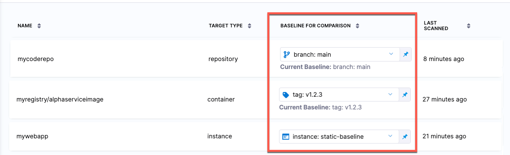

Every scanned target should have a _baseline_, which represents the root variant such as the `main` branch of a Git repository or the `latest` tag of a container image.  Baselines make it easy to identify issues in the baseline vs. issues in a downstream variant derived from that baseline. 

:::info key concepts: target baselines
- [Every scanned target needs a baseline](#every_target_needs_a_baseline) to enable the full suite of STO features.
- You can specify a baseline using a fixed value or a regular expression (RegEx).
  - If you always want to compare against a specific variant — such as the `main` branch of your git repository — use a [fixed value](#specify-a-fixed-baseline-for-an-individual-target).
  - You might find that the variant you want use as your baseline changes over time. Suppose your team creates a new `X.Y.Z` branch with each release. In this case you can use a [RegEx baseline](#advantages_of_regex_baselines) that updates automatically. 
- You can specify a [default RegEx baseline](#default-regular-expressions-for-target-baselines) for each target type. This RegEx will automatically be used as the baseline for any new targets.
- Repositories and images have predefined defaults. For repositories, the default is the `main` or `master` branch. For images, the default is `latest` or the most recently scanned Semantic Versioned release. 
:::

<!-- 

You can specify a default baseline for each target type: 
- Code repositories
- Container images
- Web/API instances
- Infrastructure configurations

You can specify default baselines at the account, organization, and project scope. You can also specify a static or RegEx baseline for an individual target. Code repositories and container images have [predefined default baselines](#predefined-default-regexes) as described below. 

-->

To view and edit the current baseline for a target, go to **Test Targets**:

 
 
 

Every target needs a baseline 

Every target needs a baseline to enable the full suite of STO features. Here's why:

  - For developers, it’s critical to distinguish between security issues in the baseline vs. issues in the variant you’re working on. You want to detect and resolve issues in your downstream branch (the variant) before merging, so you don’t introduce them into the main branch (the baseline). 

  - When your target has a baseline defined, the [Security Tests tab](/docs/security-testing-orchestration/dashboards/view-scan-results) divides your issues into two lists:

    - **Only in \<_target_>:\<_variant_>** Issues detected in the scanned variant only.

    - **Common to \<_target_>:\<_baseline_>** Issues also detected in the target baseline.

  - While the **Security Tests** tab highlights downstream issues, the [STO Overview](/docs/security-testing-orchestration/dashboards/sto-overview) and [Security Testing Dashboard](/docs/security-testing-orchestration/dashboards/security-testing-dashboard) only show baseline issues. These views enable security personnel and other non-developers to monitor, investigate, and address issues in production-ready targets and view vulnerability trends over time.  

  - In short, baselines make it easy for developers to drill down into “shift-left” issues in the variants they're currently working on, and security personnel to monitor the security posture of production targets.
  

Benefits of using regular expressions to define baselines

* RegEx baselines more accurately reflect the current "root" element in the context of a real-world software development life cycle. A typical sprint cycle might run like this:
  
  - Publish the current release — for example, `1.2.3` — and merge this branch into `main`. 
  - Create a "next-release" branch — for example, `1.2.4` — from `main`.
  - Create branches from `1.2.4` for different features, hotfixes, and so on. 
  - When the release is ready to publish, merge the various branches into `1.2.4`. 
  - Publish the release, merge `1.2.4` into `main`, create a new release branch such as `1.2.5`, and repeat the cycle.

  To support proper functioning of STO with this workflow, `1.2.4` more accurately reflects the baseline for the current sprint than `main`. Given a matching RegEx, the first scan after creating the branch establishes `1.2.4` as the current baseline. This remains the current baseline until `1.2.4` gets merged into `main` and `1.2.5` gets created and scanned.

* RegEx baselines make it easier to track the introduction and remediation of specific vulnerabilities. The lifecycle of a specific vulnerability might run like this:

   - A new release branch `1.2.3` is created. You scan this branch, which matches your RegEx, and it becomes the current baseline. 
   - The scan detects a new vulnerability, **vXYZ**, with a severity of MEDIUM.
   - A few sprints later, the vulnerability is remediated in a branch that gets merged into `1.2.7`.
   - `1.2.7` is scanned before getting merged into `main`, and **vXYZ** is no longer in the scan results. 

   

## Target baselines

You can specify baselines for individual targets. 
 
### Fixed target baselines

You can specify a fixed value if you know that the baseline for a target will not change. 

1. Scan the target with the baseline variant if you haven't yet done so.

2. Go to **Test Targets**.

3. In **Baseline for Comparison**, set the value type to **Fixed** and select the baseline from the menu of scanned variants. 

   <DocImage path={require('./static/baseline-fixed-individual-target.png')} width="100%" height="100%" title="Add shared path for scan results" /> 

### RegEx target baselines 

You can specify a RegEx baseline if the baseline changes over time and you can capture it using a regular expression. 

:::note
Harness recommends that you test your regular expression thoroughly before you apply it to a RegEx target. For more information, go to:
- [RegEx baselines: important notes](#regex-baselines-important-notes)
- [Regex baseline examples](#regex-baseline-examples)
:::

1. Go to **Test Targets**.
2. Set the value type for the target to **RegEx** and enter the regular expression. 

    <DocImage path={require('./static/baseline-regex-individual-target.png')} width="40%" height="40%" title="Add shared path for scan results" /> 

## Default baselines based on regular expressions

You can specify default baselines for specific target types: code repositories, container images, web/API instances, and infrastructure configurations. STO includes a set of predefined defaults for repository and container image targets.

- For repositories, the baseline is `master` or `main`.

- For container images, the baseline is `latest` or the most recently scanned Semantic Version number if it can be detected, such as
  - `1.2.3` 
  - `v1.15.4` 

- STO does not include predefined default RegEx baselines for application instances and configurations. 

:::note notes

- Harness recommends that you test your regular expression thoroughly before you apply it to Regex target default. For more information, go to:
  - [RegEx baselines: important notes](#regex-baselines-important-notes)
  - [Regex baseline examples](#regex-baseline-examples)
:::

To specify default RegExes:

1. Go to the **Default** settings page for the scope you want: 
   - Account settings — all targets in the account
   - Organization settings — overrides account defaults
   - Project settings — overrides organization defaults 

   <DocImage path={require('./static/baselines-00-select-scope.png')} width="70%" height="70%" title="Select scope" /> 

2. Go to **Default Settings** > **Security Testing Orchestration**. 

   <DocImage path={require('./static/baselines-01-edit-default-regexes.png')} width="100%" height="100%" title="Add shared path for scan results" /> 

3. Enter the regular expression you want in the **Value** field.

##  Regex baselines reference

<!-- 
### Specify RegEx baselines in STO

Suppose your organization publishes container images with a `latest` tag as well as two-dot versions such as:  `3.0.0` , `3.17`, `3.17.3`, `3.18.0`, `3.18.2`, ...

To support proper functioning of STO with this workflow, you can set a RegEx baseline that updates whenever you scan a new image with a matching tag. If you scan a new image target with the following tags, the baseline gets updated as follows:

<table>
    <tr>
        <th></th>
        <th>tag</th>
        <th>baseline before scan</th>
        <th>baseline after scan</th>
    </tr>
    <tr>
        <th>Scan 1</th>
        <td><code>scantest-DONOTUSE</code></td>
        <td>none</td>
        <td>none (no match)</td>
    </tr>
    <tr>
        <th>Scan 2</th>
        <td><code>3.2.0</code></td>
        <td>none</td>
        <td><code>3.2.0</code></td>
    </tr>
    <tr>
        <th>Scan 3</th>
        <td><code>3.3.0</code></td>
        <td><code>3.2.0</code></td>
        <td><code>3.3.0</code></td>
    </tr>
</table>

-->

### Regex baselines: important notes

* You must use a consistent naming scheme for your scanned variants. This is necessary to ensure that your regular expression captures your baselines consistently and predictably. 

* Carefully consider which targets you want to use for your baselines. In general, the baseline should be the root element for all your current variants. 

* When you specify a regular expression, the baseline is the *most recently scanned target* that matches the expression. 

* Use [re2 format](https://github.com/google/re2/wiki/Syntax) for your expressions. 

* Defining regular expressions is outside the scope of this documentation. Harness recommends that you test any regular expressions thoroughly to ensure that the expression matches any variant name that might be used for the scan target.

### RegEx baseline examples

The following table shows a few simple examples of expressions for specific use cases.

<table>
    <tr>
        <th>Variant names</th>
        <th>Regular expression</th>
        <th>Description</th>
    </tr>
    <tr>
        <td>main  master     </td>
        <td valign="top"><code>^(main|master)$</code></td>
        <td valign="top">
            <ul> 
                <li> If the scanned variant is <code>main</code> or <code>master</code> </li>, set the baseline.
                <li> Useful as the <a href="#default-regex-baselines-by-target-type">default baseline</a> for code repositories.   </li>
            </ul>
        </td>
    </tr>
        <tr>
        <td>latest  1.2.3   v2.3.4  </td>
        <td valign="top"><code>^(v?\d+\.\d+\.\d+([+-][a-zA-Z0-9\.+-]+)?|latest)$</code></td>
        <td valign="top">
            <ul> 
                <li> If the scanned variant is either <code>latest</code> or a Semantic Version release number, set the baseline.</li>
                <li> Useful as the <a href="#default-regex-baselines-by-target-type">default baseline</a> for container images.   </li>
            </ul>
        </td>
    </tr>
    <tr>
        <td>release-20230420  release-20230427   release-20230504   release-20230511    </td>
        <td valign="top"><code>^(release\-\d+)$</code></td>
        <td valign="top">
            <ul> 
                <li> Start with <code>release</code>, dash. </li>
                <li> Follow with one or more digits.   </li>
            </ul>
        </td>
    </tr>
    <tr>
        <td>code-v1.1   code-v1.2   code-v1.3   code-v2.1   code-v2.2   code-v20.31 </td>
        <td valign="top"><code>^(code\-v\d+\.\d*)$</code></td>
        <td valign="top">
            <ul>
                <li>Start with <code>code</code>, dash, <code>v</code>. </li>
                <li>Follow with one or more digits, dot, one or more digits.</li>
            </ul>
        </td>
    </tr>
    <tr>
        <td>1.14.6-linux-amd64  1.14.11-linux-amd64   1.15.4-linux-amd64 </td>
        <td valign="top"><code>^(\d*\.\d*\.\d*\-linux-amd64)$</code></td>
        <td valign="top">
            <ul>
                <li>Start with one or more digits, dot, one or more digits, dot, one or more digits.</li>
                <li>Follow with hyphen, <code>linux-amd64</code> </li>
            </ul>
        </td>
    </tr>
    <tr>
        <td>3   3.17   3.17.3   3.18   3.18.12   30.142.1   30 </td>
        <td valign="top"><code>^([\d.]+)$</code></td>
        <td valign="top">
            <ul>
                <li>Any combination of digits and dots. </li>
            </ul>
        </td>
    </tr>
    <tr>
        <td>2023-02-11, 17:59:12   2023-02-17, 11:17:23   2023-02-23, 08:36:47   </td>
        <td valign="top"><code>^(\d{4}\-\d{2}\-\d{2}\,\s\d{2}\:\d{2}\:\d{2}$)</code></td>
        <td valign="top">
           <ul>
           <li>This is the timestamp format used for scanned variants when [auto-detect for targets and variants](/docs/security-testing-orchestration/sto-techref-category/zap/zap-scanner-reference#target-and-variant-detection) is enabled for instance scanners such as ZAP.</li>
           </ul>
        </td>
    </tr>
    <tr>
        <td>2023-02-11   2023-02-17   2023-02-23  </td>
        <td valign="top"><code>^(\d{4}\-\d{2}\-\d{2})$</code></td>
        <td valign="top">
        <ul>
            <li>Simple date format.</li>
        </ul>
        </td>
    </tr>
</table>
