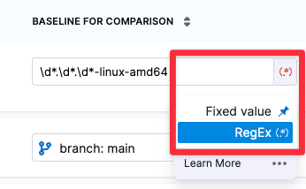

Every scanned target should have a _baseline_, which represents the root variant such as the `main` branch or the `latest` tag.  Baselines make it easy to identify issues in the baseline vs. issues in a downstream variant derived from that baseline. 

 Key concept: static and dynamic baselines

You can specify _static baselines_ using fixed strings or _dynamic baselines_ using regular expressions. A dynamic baseline updates automatically when you scan a variant whose name matches the regular expression. You should use dynamic baselines whenever possible. 

<!-- 

You can specify a default baseline for each target type: 
- Code repositories
- Container images
- Web/API instances
- Infrastructure configurations

You can specify default baselines at the account, organization, and project scope. You can also specify a static or dynamic baseline for an individual target. Code repositories and container images have [predefined default baselines](#predefined-default-regexes) as described below. 

-->

To see all targets in your project, and to view and specify the baseline for each target, go to **Test Targets**:

 

### Specify dynamic baselines using regular expressions

Suppose your organization publishes releases with names such as: 

* `3` , `3.17`, `3.17.3`, `3.18`, ...

* `1.14.6-linux-amd64`, `1.14.11-linux-amd64`, `1.15.4-linux-amd64`, ...

* `2023-02-29`, `2023-03-05`, `2023-03-12`, `2023-03-19`, ... 

With this cadence, you can create a dynamic baseline that updates whenever you create a new release branch and scan it. The dynamic baseline is a regular expression (regex) that captures the latest release name and updates the baseline when you scan a matching variant.
 

Advantages of using regular expressions to define baselines

Defining your baselines using regular expressions provides significant benefits over using  hard-coded strings such as `main` or `latest`. 

* Dynamic baselines more accurately reflect the current "root" element in the context of a real-world software development life cycle. A typical sprint cycle might run like this:
  
  - Publish the current release — for example, `1.2.3` — and merge this branch into `main`. 
  - Create a "next-release" branch — for example, `1.2.4` — from `main`.
  - Create branches from `1.2.4` for different features, hotfixes, and so on. 
  - When the release is ready to publish, merge the various branches into `1.2.4`. 
  - Publish the release, merge `1.2.4` into `main`, create a new release branch such as `1.2.5`, and repeat the cycle.

  Given this cadence, `1.2.4` more accurately reflects the baseline for the current sprint than  `main`. Given a matching regex, the first scan after creating the branch establishes `1.2.4` as the current baseline. This remains the current baseline until `1.2.4` gets merged into `main` and `1.2.5` gets created and scanned.

* Dynamic baselines make it easier to track the introduction and remediation of specific vulnerabilities. The lifecyle of a specific vulnerability might run like this:

   - A new release branch `1.2.3` is created. You scan this branch, which matches your regex, and it becomes the current baseline. 
   - The scan detects a new vulnerability, **vXYZ**, with a severity of MEDIUM.
   - A few sprints later, the vulnerability is remediated in a branch that gets merged into `1.2.7`.
   - `1.2.7` is scanned before getting merged into `main`, and **vXYZ** is no longer in the scan results. 

   

### How dynamic baselines work

You can specify a default baseline for each target type: code repository, container image, application instance, and configuration. The baseline for a target is the most recently scanned target that matches the default regex. 

For example, you might want a default regex for your container images that matches on `latest` or a two-dot version tag such as `v1.2.3` or `2.3.4`.

Suppose you scan a new image target, `jdoe/myimage`, with the following tags. The baseline gets updated as follows:

<!-- 
- Scan 1: tag = `scantest-DONOTUSE` => no match => no baseline
- Scan 2: tag = `v2.3.0`            => baseline = `v2.3.0`
- Scan 3: tag = `latest`            => baseline = `latest` 
-->

<table>
    <tr>
        <th></th>
        <th>tag</th>
        <th>baseline before scan</th>
        <th>baseline after scan</th>
    </tr>
    <tr>
        <th>Scan 1</th>
        <td><code>scantest-DONOTUSE</code></td>
        <td>none</td>
        <td>none (no match)</td>
    </tr>
    <tr>
        <th>Scan 2</th>
        <td><code>v2.3.0</code></td>
        <td>none</td>
        <td><code>v2.3.0</code></td>
    </tr>
    <tr>
        <th>Scan 3</th>
        <td><code>latest</code></td>
        <td><code>v2.3.0</code></td>
        <td><code>latest</code></td>
    </tr>
</table>

### Important notes for setting up dynamic baselines in STO

* You must use a consistent naming scheme for your scanned targets. This is necessary to ensure that your regular expression captures your baselines consistently and predictably. 

* Carefully consider which targets you want to use for your baselines. In general, the baseline should be the root element for all your current variants. 

* When you specify a regular expression, the baseline is the *most recently scanned target* that matches the expression. 

* Use [re2 format](https://github.com/google/re2/wiki/Syntax) for your expressions. 

* Defining regular expressions is outside the scope of this documentation. Harness recommends that you test any regular expressions thoroughly to ensure that the expression matches any variant name that might be used for the scan target.

### Default regular expressions for target baselines

:::note
Currently, this feature is behind the Feature Flag `STO_BASELINE_DEFAULTING`. Contact [Harness Support](mailto:support@harness.io) to enable the feature.
:::

You can specify default baselines for specific target types: code repositories, container images, application instances, and configurations. STO includes a set of predefined defaults for repository and container image targets:

- For repositories, the baseline is `master` or `main`.

- For container images, the baseline is `latest` or the most recent two-dot version number if it can be detected, such as
  - `1.2.3` 
  - `v1.15.4` 

- STO does not include default regexes for application instances and configurations. 

To specify default regexes at a specific scope:

1. Select the account, organization (overrides account defaults), or project (overrides organization defaults). 

   <DocImage path={require('./static/baselines-00-select-scope.png')} width="50%" height="50%" title="Select scope" /> 

2. Go to **Default Settings** > **Security Testing Orchestration**. 

   <DocImage path={require('./static/baselines-01-edit-default-regexes.png')} width="100%" height="100%" title="Add shared path for scan results" /> 

### Define the regex for an individual target

To override the default regex for an individual target, go to **Test Targets**. Then set the value type for the target to **RegEx** and enter the regex. 

### Regex examples

The following table shows a few simple examples of expressions for specific use cases.

<table>
    <tr>
        <th>Variant names</th>
        <th>Regular expression</th>
        <th>Description</th>
    </tr>
    <tr>
        <td>release-20230420  release-20230427   release-20230504   release-20230511    </td>
        <td valign="top"><code>release\-\d+</code></td>
        <td valign="top">
            <ul> 
                <li> Start with <code>release</code>, dash </li>
                <li> Follow with one or more digits   </li>
            </ul>
        </td>
    </tr>
    <tr>
        <td>code-v1.1   code-v1.2   code-v1.3   code-v2.1   code-v2.2   code-v20.31 </td>
        <td valign="top"><code>code\-v\d+\.\d*</code></td>
        <td valign="top">
            <ul>
                <li>Start with <code>code</code>, dash, <code>v</code> </li>
                <li>Follow with one or more digits, dot, one or more digits</li>
            </ul>
        </td>
    </tr>
    <tr>
        <td>1.14.6-linux-amd64  1.14.11-linux-amd64   1.15.4-linux-amd64 </td>
        <td valign="top"><code>\d*\.\d*\.\d*\-linux-amd64</code></td>
        <td valign="top">
            <ul>
                <li>Start with one or more digits, dot, one or more digits, dot, one or more digits</li>
                <li>Follow with hyphen, <code>linux-amd64</code> </li>
            </ul>
        </td>
    </tr>
    <tr>
        <td>3   3.17   3.17.3   3.18   3.18.12   30.142.1   30 </td>
        <td valign="top"><code>[\d.]+</code></td>
        <td valign="top">
            <ul>
                <li>Any combination of digits and dots </li>
            </ul>
        </td>
    </tr>
    <tr>
        <td>2023-02-11   2023-02-17   2023-02-23  </td>
        <td valign="top"><code>\d\d\d\d-\d\d\-\d\d</code></td>
        <td valign="top">
            <ul>
                 <li>
                    Four digits, dash, two digits, dash, two digits 
                </li>
            </ul>
        </td>
    </tr>
</table>

