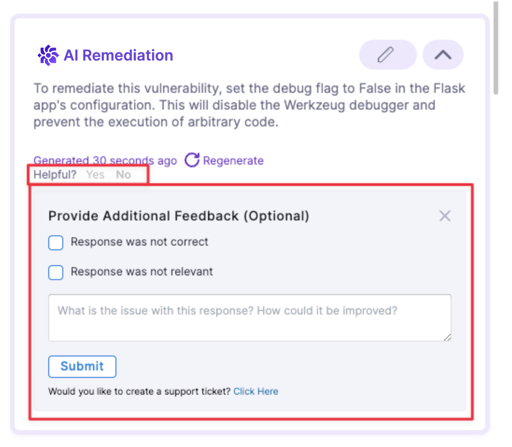

This procedure describes how to refine a suggestion by providing more information, such as additional context or code snippets, to Harness AI.

1. When you go to **Security Tests** and then select an issue, an initial **AI Remediation** appears in **Issue Details**. 

   This suggested remediation is based on public information about the CVE or CWE and the first detected occurrence (**Occurrence 1**) in the target. If the scanner captures the code snippet where the vulnerability is occurring, the query to Harness AI includes this snippet as well.  

    You can send feedback to Harness about a specific remediation. Under **Helpful?**, click **No**. Then enter in your feedback and choose **Submit**. 

    <!--  -->

    <DocImage path={require('./static/aida-remediation-feedback.png')} width="50%" height="50%" title="Click to view full size image" />
     

2. If you want to optimize the advice with additional information or context, do the following: 

   1. Select **Edit Input**. 

   2. Specify the occurrence, reference ID, and language (if you've scanned a codebase). 
   
     Harness AI can often auto-detect the language of a code snippet, but it's good practice to confirm that the language setting is correct. 

     Some scanners provide details on the location of the vulnerable code, such as the file name and line number, but may not offer the specific code snippet itself. With the **Edit Input** option, you can copy and paste the exact vulnerable code snippet. Harness AI will then use this information to recommend code changes, which can be used to [create a pull request](/docs/security-testing-orchestration/remediations/ai-based-remediations#create-pull-request-from-sto) or make a [code suggestion](/docs/security-testing-orchestration/remediations/ai-based-remediations#make-code-suggestion-from-sto).

   3. Add any additional context in the text pane. For example, you might want to include relevant code immediately before the snippet where the vulnerability was identified, in addition to the snippet itself. Then select **Generate**.  

      <DocImage path={require('./static/ai-remediation-issue-refine.png')} width="50%" height="50%" title="Click to view full size image" />
    
3. To generate remediations for another occurrence, do the following:

   1. In **Issue Details**, scroll down to the occurrence of interest and then select **Unsure how to remediate? Ask AI**. (You might need to wait a few seconds for the remediation to appear.)

      <DocImage path={require('./static/ai-remediation-occurrences.png')} width="50%" height="50%" title="Click to view full size image" />

   2. To further refine the suggested remediation with an additional code snippet, select **Edit Snippet** and then re-generate.

      <DocImage path={require('./static/ai-remediation-occurrence-3.png')} width="50%" height="50%" title="Click to view full size image" />
