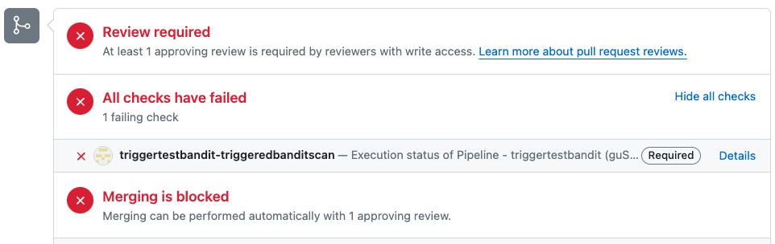

import Tabs from '@theme/Tabs';
import TabItem from '@theme/TabItem';


You can create GitHub event triggers to support a variety of STO workflows and use cases. This topic describes how to do the following:

- Trigger an STO pipeline that detects vulnerabilities and blocks merging when a pull request targets a protected branch and/or updates specific files in the repo.
- Include a keyword in a review comment to trigger a new scan if a previous pipeline execution failed.
- Set branch protection rules that block pull requests if the STO pipeline fails.


The following steps outline the basic workflow.

1. [Create a trigger](#create-the-harness-trigger) for your Harness pipeline.

   This should automatically register an outbound webhook in your Git repo.

2. [Set up the failure criteria](#set-up-the-failure-criteria) for your STO pipeline.

3. [Create a pull request](#test-the-outbound-webhook-and-trigger) to test the webhook and trigger.

4. [Add a branch protection rule](#add-a-branch-protection-rule-for-the-git-repo) to ensure that the pull request cannot be merged if the Harness pipeline fails.


## Before you begin

These workflows require the following:

- A [Harness connector](/docs/platform/connectors/code-repositories/ref-source-repo-provider/git-hub-connector-settings-reference) to your GitHub account
- A Harness pipeline with a code-repository scan step such as Semgrep
- The [Codebase](/docs/continuous-integration/use-ci/codebase-configuration/create-and-configure-a-codebase/) in your pipeline should point to the Git repo that you want to scan


## Create the Harness trigger

The following sections describe two triggers that can be very useful in the context of STO scanning:

- [Trigger on a changed file](#trigger-on-a-changed-file)
- [Trigger on a review comment](#trigger-on-a-pr-review-comment)

### Trigger on a changed file

You can specify a trigger that says: If a pull request updates any of these files, run the pipeline and scan the repo.

This type of trigger supports uses cases such as:

- If the pull request updates any file that matches the trigger filter, run a SAST scan and block the PR if the scan results meet the [failure criteria](#set-up-the-failure-criteria).

- If the pull request updates a specific file of interest, such as a `pom.xml` workspace file, run an SCA scan and block the PR if the scan results meet the [failure criteria](#set-up-the-failure-criteria).


#### Trigger setup
<!-- details>

<summary>Trigger setup</summary -->

1. Go to your STO pipeline, select **Triggers** (top right), and add a new trigger.

2. Set up the trigger as follows. 


#### [Configuration](/docs/platform/triggers/triggering-pipelines#configure-the-trigger)

1. [Connector](/docs/platform/connectors/code-repositories/ref-source-repo-provider/git-hub-connector-settings-reference) to your GitHub account

2. **Repository name**

3. [Event](/docs/platform/triggers/triggers-reference#event-and-actions) = **Pull Request**

4. [Actions](/docs/platform/triggers/triggers-reference#event-and-actions) to trigger the pipeline 


#### [Condition](/docs/platform/triggers/triggers-reference#conditions-settings)

 The following conditions are the most relevant to this workflow. You can add other conditions as needed. Triggers are complex filters in which all conditions are AND-ed together.

   1. **Target Branch** This should match your [target baseline](/docs/security-testing-orchestration/use-sto/set-up-sto-pipelines/set-up-baselines), such as `main`.

   2. [Changed Files](/docs/platform/triggers/triggers-reference#branch-and-changed-files-conditions) The files that trigger the STO pipeline if they have updates in the PR. You can specify multiple files using the [operators](/docs/platform/triggers/triggers-reference#operators) **In**, **Not In**, and **Regex**.

   Here's a simple example: trigger a build if a PR seeks to update a specific `pom.xml` in the `main` branch.

   <DocImage path={require('./static/trigger-to-block-prs/changed-file-condition-example-simple.png')} width="50%" height="50%" title="Trigger a pipeline execution when a PR updates a specific file in the main branch" />


#### [Pipeline input](/docs/platform/triggers/triggering-pipelines#set-pipeline-input)

   The pipeline input should be configured correctly, with **Build Type** set to **Git Pull Request**.


#### Test the trigger

After you create the trigger, proceed to [Set up the failure criteria](#set-up-the-failure-criteria).

<details>

<summary>YAML trigger example</summary>

```yaml

trigger:
  name: sast-test-trigger
  identifier: sasttesttrigger
  enabled: true
  encryptedWebhookSecretIdentifier: ""
  description: ""
  tags: {}
  orgIdentifier: default
  stagesToExecute: []
  projectIdentifier: default
  pipelineIdentifier: triggertestupdatepom
  source:
    type: Webhook
    spec:
      type: Github
      spec:
        type: PullRequest
        spec:
          connectorRef: my_github_connector
          autoAbortPreviousExecutions: false
          payloadConditions:
            - key: changedFiles
              operator: Equals
              value: /full/path/to/pom.xml
            - key: targetBranch
              operator: Equals
              value: main
          headerConditions: []
          repoName: dvpwa-djb
          actions:
            - Open
            - Reopen
  inputYaml: |
      pipeline:
         identifier: triggertestupdatepom
         properties:
           ci:
             codebase:
               build:
                 type: PR
                 spec:
                   number: <+trigger.prNumber>


```

</details>


<!-- /details -->


### Trigger on a PR review comment

You can specify a trigger that says: If a reviewer includes a specific keyword in a pull-request review comment, run the pipeline and scan the repo.

This type of trigger is useful when a pipeline execution fails for reasons other than the [failure criteria](#set-up-the-failure-criteria) you specified for the pipeline. If the STO scan doesn't finish in the original execution, a reviewer can add a review comment with a keyword such as `RERUN_STO_PIPELINE`. 

<!-- details>

<summary>Trigger setup</summary -->

#### Trigger setup

1. Go to your STO pipeline, select **Triggers** (top right), and add a new trigger.

2. Set up the trigger as follows. 

#### [Configuration](/docs/platform/triggers/triggering-pipelines#configure-the-trigger)

1. [Connector](/docs/platform/connectors/code-repositories/ref-source-repo-provider/git-hub-connector-settings-reference) to your GitHub account

2. **Repository name**

3. [Event](/docs/platform/triggers/triggers-reference#event-and-actions) = **Issue Comment**

4. [Actions](/docs/platform/triggers/triggers-reference#event-and-actions), such as **Create** and **Edit**, to trigger the scan. You can also select **All actions** to allow reviewers to trigger a scan at any time. 

#### [Condition](/docs/platform/triggers/triggers-reference#conditions-settings)

 The following conditions are the most relevant to this workflow. You can add other conditions as needed. Triggers are complex filters in which all conditions are AND-ed together. 

   1. **Target Branch** This should match your [target baseline](/docs/security-testing-orchestration/use-sto/set-up-sto-pipelines/set-up-baselines). 

   2. Enter the following [JEXL condition](/docs/platform/triggers/triggers-reference#jexl-conditions) with the keyword to trigger a new scan: 

      `<+trigger.payload.comment.body>.contains("RERUN_STO_SCAN")`

      <DocImage path={require('./static/trigger-to-block-prs/review-comment-condition-example-simple.png')} width="50%" height="50%" title="Trigger when a PR comment includes RERUN_STO_SCAN" /> 


#### [Pipeline input](/docs/platform/triggers/triggering-pipelines#set-pipeline-input)

The pipeline input should be configured correctly, with **Build Type** set to **Git Pull Request**.


#### Test the trigger

After you create the trigger, proceed to [Set up the failure criteria](#set-up-the-failure-criteria).

<details>

<summary>YAML trigger example</summary>

```yaml

trigger:
  name: dvpwa-issue-comment-KEYWORD
  identifier: dvpwaissuecommentKEYWORD
  enabled: false
  encryptedWebhookSecretIdentifier: ""
  description: ""
  tags: {}
  orgIdentifier: default
  stagesToExecute: []
  projectIdentifier: sto_tutorials
  pipelineIdentifier: prtest
  source:
    type: Webhook
    spec:
      type: Github
      spec:
        type: IssueComment
        spec:
          connectorRef: my_github_connector
          autoAbortPreviousExecutions: false
          payloadConditions:
            - key: targetBranch
              operator: In
              value: master, develop
          headerConditions: []
          jexlCondition: <+trigger.payload.comment.body>.contains("RERUN_STO_SCAN")
          repoName: dvpwa
          actions: []
  inputYaml: |
    pipeline:
      identifier: prtest
      properties:
        ci:
          codebase:
            build:
              type: PR
              spec:
                number: <+trigger.prNumber>


```

</details>


<!-- /details -->

## Set up the failure criteria

You can configure your Harness pipeline to fail if the scan finds vulnerabilities that match a specified set of criteria. You can use one of two methods:

- [Fail on Severity](/docs/security-testing-orchestration/exemptions/exemption-workflows)

  Every STO scan step has a `fail_on_severity` setting that fails the step if a scan detects issues with the specified severity or higher. You can also create exemptions ("Ignore rules") for specific issues to override this behavior.

- [Governance policies](/docs/security-testing-orchestration/policies/create-opa-policies)

   You can use Harness Policy as Code to write and enforce policies against your security tests, and to block your pipelines if a security test has any issues that violate those policies. STO includes a set of predefined templates for blocking pipelines based on issue severity, reference ID, CVE age, title, and number of occurrences.

## Test the outbound webhook and trigger

### Verify the webhook in GitHub

Once you add a trigger to your pipeline, your Git service provider should create a webhook for the trigger automatically. This is true for all non-custom webhooks and all Git providers supported by Harness.

1. Go to your GitHub account, and then select **Settings** > **Webhooks**.

   <DocImage path={require('./static/trigger-to-block-prs/gitlab-new-trigger.png')} width="50%" height="50%" title="GitHub webhook for new trigger" />

2. If you don't see a webhook, you can add one manually.

For more information, go to [Register the webhook in the Git provider](/docs/platform/triggers/triggering-pipelines/#register-the-webhook-in-the-git-provider).


### Test the webhook and trigger

To test your trigger, update your GitHub repo to verify that the trigger works as intended.

- To verify the [changed-file trigger](#trigger-on-a-changed-file) described above:

  - Go to the root branch you specified in the trigger.
  - Update the file you specified in the trigger. Then create a pull request in a new branch.

- To verify the [review-comment trigger](#trigger-on-a-pr-review-comment) described above, create a pull request and then add a review comment with the keyword you specified.

  - Go to the root branch you specified in the trigger.
  - Create a pull request in a new branch.
  - Add a review comment with the keyword you specified in the trigger.

You should now see the following:

1. In the GitHub repo, the request and response were successful.

   <DocImage path={require('./static/trigger-to-block-prs/test-trigger-01-req-response-successful.png')} width="50%" height="50%" title="GitHub: request and response were successful" /> 

2. In the **Pipeline Executions** page of your Harness pipeline, the trigger starts a new execution.  

    <DocImage path={require('./static/trigger-to-block-prs/test-trigger-02-new-pipeline-execution.png')} width="50%" height="50%" title="Harness: new pipeline execution" /> 

3. In the GitHub pull request, the pipeline execution appears as an automated check. 

    <DocImage path={require('./static/trigger-to-block-prs/test-trigger-03-check-running-in-pr.png')} width="50%" height="50%" title="GitHub: automated check (Harness STO pipeline)" /> 

If the trigger doesn't work as intended, go to [Troubleshoot Git event triggers](/docs/platform/triggers/triggering-pipelines/#troubleshoot-git-event-triggers).


## Add a branch protection rule for the Git repo

The final step is to ensure that a PR cannot be merged if the STO pipeline fails. To do this, you create a protection rule for your root branch.

The following steps describe a simple setup in GitHub. For more information, go to [Managing a branch protection rule](https://docs.github.com/en/repositories/configuring-branches-and-merges-in-your-repository/managing-protected-branches/managing-a-branch-protection-rule) in the GitHub documentation.

If you're using a different SCM, go to the SCM documentation and search for `branch protection`.

### Add the protection rule

1. Go to your GitHub repo and select **Settings** > **Branches** > **Add Rule**.

2. In **Branch name pattern**, add a string or regular expression for the branch or branches you want to protect. This should match your [target baseline](/docs/security-testing-orchestration/use-sto/set-up-sto-pipelines/set-up-baselines).

3. Select **Require a pull request before merging** and **Require Approvals**. This isn't required, but it's good practice.

4. Select **Require status checks to pass before merging**.

5. In the search field below, enter the first characters of the check name and then select the check.

   <DocImage path={require('./static/trigger-to-block-prs/add-check-to-branch-protection-rule.png')} width="50%" height="50%" title="Add shared path for scan results" />

6. Configure any other settings as appropriate.

7. Scroll to the bottom of the page and save your rule.

### Test the protection rule

Now that you've set up the rule, trigger another Harness pipeline execution and fail it to verify that the rule stops the pull request.

:::note

To verify the branch protection rule, you must ensure that your STO pipeline fails. To configure your pipeline to fail temporarily, you can do one of the following:

- Set [Fail on Severity](/docs/security-testing-orchestration/get-started/key-concepts/fail-pipelines-by-severity/) to **Low** in the scan step of your pipeline. Then scan a repo with known vulnerabilities.
- Add a temporary Run step to your pipeline with the command `exit(1)`.

:::

1. Trigger another pipeline execution.

   - For the [changed-file trigger](#trigger-on-a-changed-file) described above, make and push a change. Then create a pull request.

   - For the [review-comment trigger](#trigger-on-a-pr-review-comment) described above, add a review comment with the keyword you specified.

3. Now, merging is blocked if the Harness pipeline fails.

   


## For more information

- The Harness platform docs include [extensive information about triggers](/docs/category/triggers). The following topics are highly relevant to STO use cases:

  - [Trigger pipelines using Git events](/docs/platform/triggers/triggering-pipelines/)
  - [Webhook triggers reference](/docs/platform/triggers/triggers-reference/)

- For detailed information about outbound webhooks and branch protection rules, go to the docs for your source code management (SCM) provider. This topic describes a few simple GitHub workflows, but these topics are outside the scope of Harness documentation.


