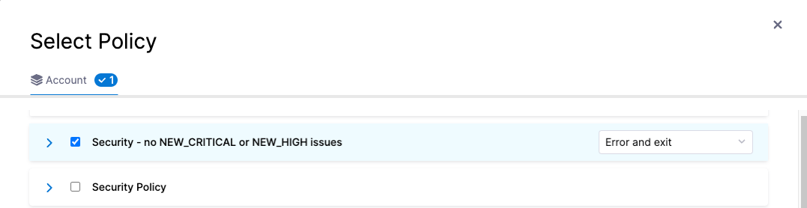
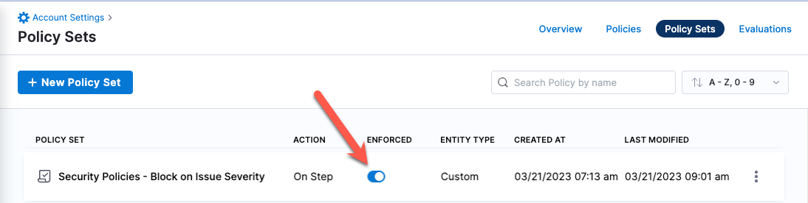
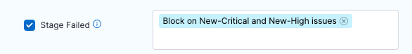

You can create governance policies to stop your pipelines based on specific scan results such as:

- No issues in a list of severities such as Critical or High.

- No issues for CVEs past a certain age, for example no critical-severity CVEs more then three years old.

- No issues in a list of titles such as `javascript.express.mongodb.*` or `javascript.express.security.audit.*`.

- No more than 75 occurrences of TAR-related issues (issue title matches regex `".*tar.*"`). 

- No issues in a list of reference IDs such as CWE-78 or CVE-2023-52138.

This topic describes the end-to-end workflow to create, test, and deploy a set of governance policies. 


## Important notes

This topic assumes that you have a basic knowledge of the following:

- Governance policies and how to implement them: 
  - [Harness Policy as Code overview](/docs/platform/governance/policy-as-code/harness-governance-overview)
  - [Harness Policy As Code quickstart](/docs/platform/governance/policy-as-code/harness-governance-quickstart)
  - [Open Policy Agent (OPA)](https://www.openpolicyagent.org/)
- [Severity scores and levels in STO](/docs/security-testing-orchestration/get-started/key-concepts/severities)

## Security Tests policy samples

The Harness Policy library includes the following [policy samples](/docs/platform/governance/policy-as-code/sample-policy-use-case) that make it easy to create governance policies for your STO scans. 

You can apply any Security Tests policy using the **On Step** event for a scan step.

### Exclude vulnerabilities by severity

Apply a policy to a scan step to warn or block on any vulnerabilities with the specified severity.   

```json

package securityTests

import future.keywords.in
import future.keywords.if

# Define a set of severities that are denied (Critical, High, Medium, Low, Info)
# The following example denies if the scan results include any issue with a severity of Critical or High.

deny_list := fill_defaults([
  {
    "severity": {"value": "Critical", "operator": "=="}
  },
  {
    "severity": {"value": "High", "operator": "=="}
  }
])

```

### Exclude vulnerabilities by reference ID

Apply a policy to a scan step to warn or block on any vulnerabilities in a specific list of CVEs or CWEs. 

```json

package securityTests

import future.keywords.in
import future.keywords.if

# Define a set of reference-identifiers that are denied
# The following policy denies if the scan results include any occurrence of 
#  - cwe-772
#  - cve-2019-14250
#  - CWE-772
#  - CVE-2019-14250

deny_list := fill_defaults([
  {
    "refId": {"value": "772", "operator": "=="},
    "refType": {"value": "cwe", "operator": "=="}
  },
     {
    "refId": {"value": "772", "operator": "=="},
    "refType": {"value": "CWE", "operator": "=="}
  },
  {
    "refId": {"value": "2019-14250", "operator": "=="},
    "refType": {"value": "cve", "operator": "=="}
  },
 {
    "refId": {"value": "2019-14250", "operator": "=="},
    "refType": {"value": "CVE", "operator": "=="}
  }
])

```

### Exclude vulnerabilities by title

Apply a policy to a scan step to warn or block on any vulnerabilities in a specific list of issue titles. 

You can use the `~` operator to find titles based on [Python regular expressions](https://docs.python.org/3/library/re.html). 

```json

package securityTests

import future.keywords.in
import future.keywords.if

# Define a set of titles that are denied
# The following example denies if the scan results include any Javascript Mongo or Javascript Security Audit issues

deny_list := fill_defaults([
  {
    "title": {"value": "tar@1.34", "operator": "~"}
  },
  {
    "title": {"value": "libsqlite3", "operator": "~"}
  }
])

```

### Exclude vulnerabilities by number of occurrences

Apply a policy to a scan step to warn or block vulnerabilities based on a set of titles and the maximum allowed number of occurrences for each vulnerability. 

You can use the `~` operator to find titles based on [Python regular expressions](https://docs.python.org/3/library/re.html).  

```json

package securityTests

import future.keywords.in
import future.keywords.if

# Define a set of titles and maximum occurrences that are denied
# The following example denies on scan results with more than 25 occurrences of TAR- or cURL-related issues

deny_list := fill_defaults([
  {
    "title": {"value": ".*tar.*", "operator": "~"},
    "maxOccurrences": {"value": 25, "operator": ">="},
  },
  {
    "title": {"value": ".*curl.*", "operator": "~"},
    "maxOccurrences": {"value": 25, "operator": ">="},
  }
])

```

### Exclude vulnerabilities by CVE age

Apply a policy to a scan step to warn or block vulnerabilities based on CVEs by severity and age. 

```json

package securityTests

import future.keywords.in
import future.keywords.if

# Define a set of CVE ages (as old/older than given year) and severities (equal/greater than) that are denied
# This example denies CVEs for any of the following filters:
#   - Old Critical severities (2021 or earlier)
#   - New Critical severities (2023 or later)
#   - Very old Medium severities (2015 or earlier)

deny_list := fill_defaults([
  {
    "year": {"value": 2020, "operator": "<="},
    "severity": {"value": "Critical", "operator": "=="}
  },
    {
    "year": {"value": 2023, "operator": ">="},
    "severity": {"value": "Critical", "operator": "=="}
  },
  {
    "year": {"value": 2020, "operator": "<="},
    "severity": {"value": "High", "operator": "=="}
  }
])

```


## Workflow description

### Create a new OPA policy

1. You can create policies at the account or the project scope.

   - For account-level policies, select your account (top left). 
   - For project-level policies, select **Project settings** (left).
   - Then go to **Security and Governance** > **Policies**.

2. Select **Policies** (top right) and then **New Policy**. 

3. Select a **Security Tests** policy from the [**Policy samples**](#security-tests-policy-samples) library. 

   <DocImage path={require('./static/opa-01-select-policy-sample.png')} width="50%" height="50%" title="Select policy sample" />

4. Select **Use this sample** (bottom). The policy sample appears in the edit pane (left).

   <DocImage path={require('./static/opa-02-use-this-sample.png')} width="50%" height="50%" title="Select policy sample" />

5. Configure the policy as needed. In this example, the policy excludes vulnerabilities with a severity of Critical. 

   <DocImage path={require('./static/opa-03-configure-policy.png')} width="100%" height="100%" title="Select policy sample" />

6. Test your policy to ensure that it works as intended.

   Each policy sample includes a set of test data that you can use. In the **Testing Terminal**, examine the test data and edit it as needed. Then click **Test** to verify the results.

   It is good practice to test both a Success and Failure case for your policy. The following example illustrates this workflow.

   In this example, the policy denies on reference ID CWE-1230. In this case, you would do the following:

   1. Search the test results for the string `1230`. In this case, the ID is not found. 

       <DocImage path={require('./static/opa-05-test-policy-search-for-id.png')} width="100%" height="100%" title="Select policy sample" />

   2. Click **Test**. The test succeeds.

       <DocImage path={require('./static/opa-06-test-policy-succeeded.png')} width="100%" height="100%" title="Select policy sample" />

   3. Search the test results for the string `cwe` and edit an entry so it matches the reference ID.

       <DocImage path={require('./static/opa-07-edit-test-data-for-matching-cwe.png')} width="100%" height="100%" title="Select policy sample" />

   4. Click **Test** again. The test fails because the data includes the specified CWE.

       <DocImage path={require('./static/opa-08-test-failed.png')} width="100%" height="100%" title="Select policy sample" />

7. Once you're satisfied that the policy works as intended, save it.


### Create a policy set

A [policy set](/docs/platform/governance/policy-as-code/harness-governance-overview#harness-policy-set) is a collection of one or more policies. You combine policies into a set and then include it in a scan step. 

1. Go to **Security and Governance** > **Policies**. Then click **Policy Sets** (top right) and then **New Policy Set**. 

2. Click **New Policy Set**. The Policy Set wizard appears.

3. Overview:

    1. Name — Enter a descriptive name such as **myorg/myimage policies**.

    2. Entity type this policy applies to = **Security Tests**

    3. On what event should the policy be set to = **On Step** 
   
       These settings allow you to apply the member policies to a specific step, which you'll define below. 

4. Policy evaluation criteria: 
 
   1. Click **Add Policy**.
    
   2. Select the policy you just created and set the pull-down to **Error and Exit**. This is the action to take if any policies in the set are violated. 

      <!--  -->

      <DocImage path={require('./static/opa-09-add-policy-to-policy-set.png')} width="80%" height="80%" title="Select policy sample" />

   3. Click **Apply** to add the policy to the set, then **Finish** to close the Policy Set wizard.

5. :exclamation: In the **Policy Sets** page, enable  **Enforced** for your new policy set.

     <!--  -->
   
      <DocImage path={require('./static/opa-10-enable-enforced.png')} width="80%" height="80%" title="Select policy sample" />


### Enforce the policy in your scan step

Now you can set up your scan step to stop builds automatically when the policy gets violated. 

1. Go to the scan step and click **Advanced**. 

2. Under **Policy Enforcement**, click **Add/Modify Policy Set** and add the policy set you just created.

3. Click **Apply Changes** and then save the updated pipeline. 

   <DocImage path={require('./static/opa-11-add-policy-set-to-scan-step.png')} width="80%" height="80%" title="Select policy sample" />


### Set up email notifications for pipeline failures

You have a Policy that fails the pipeline based on an OPA policy. Now you can configure the stage to send an email notification automatically whenever the pipeline fails. 


1. Click **Notifications** (right-side menu). The New Notification wizard appears.

2. Set up the notification as follows:

     1. Overview page —  Enter a notification name such as **Pipeline failed -- NEW_CRITICAL or NEW_HIGH issues detected**.

     2. Pipeline Events page  —  Select **Stage Failed** for the event that triggers the notification. Then select the stage that has the Policy step you just created.

        

     3. Notification Method page  — Specify **Email** for the method and specify the recipient emails. 

<!--

## YAML pipeline example

The following pipeline includes both of these notification workflows. For every successful scan, it sends an automated email like this:

```
"STO scan of sto-notify-test v3 found the following issues:
Critical : 1
New Critical : 0
High: 0
New High: 0
Medium: 0
New Medium: 0
See https://app.harness.io/ng/#/account/XXXXXXXXXXXXXXXXXXXXXX/sto/orgs/default/"
```


 If the scan finds any NEW_CRITICAL or NEW_HIGH issues, it stops the build and sends an email like this: 

 ```
 Stage Block_on_New_Critical_and_New_High_issues failed in pipeline notification_examples_pipeline
triggered by D*** B***
Started on Tue Mar 21 16:42:09 GMT 2023 and StageFailed on Tue Mar 21 16:42:11 GMT 2023
Execution URL  https://app.harness.io/ng/#/account/XXXXXXXXXXXXXXXXXXXXXX/sto/orgs/default/projects/myProject/pipelines/stonotifyexample_-_v3/executions/XXXXXXXXXXXXXXXXXXXXXX/pipeline
2s
 ```

Here's the full pipeline. Note that the policy and policy set are referenced, but not defined, in the pipeline itself.

```yaml
pipeline:
  name: sto-notify-example v3
  identifier: stonotifyexample_-_v3
  projectIdentifier: myProject
  orgIdentifier: myorg
  tags: {}
  properties:
    ci:
      codebase:
        connectorRef: YOUR_CODE_REPO_CONNECTOR_ID
        build: <+input>
  stages:
    - stage:
        name: banditScanStage
        identifier: banditScanStage
        description: ""
        type: SecurityTests
        spec:
          cloneCodebase: true
          execution:
            steps:
              - step:
                  type: Bandit
                  name: Bandit_1
                  identifier: Bandit_1
                  spec:
                    mode: orchestration
                    config: default
                    target:
                      name: dvpwaScanStep-v3
                      type: repository
                      variant: <+codebase.branch>
                    advanced:
                      log:
                        level: info
          infrastructure:
            type: KubernetesDirect
            spec:
              connectorRef: YOUR_KUBERNETES_CLUSTER_CONNECTOR_ID
              namespace: YOUR_NAMESPACE
              automountServiceAccountToken: true
              nodeSelector: {}
              os: Linux
    - stage:
        name: Block on New-Critical and New-High issues
        identifier: Block_on_New_Critical_and_New_High_issues
        description: ""
        type: Custom
        spec:
          execution:
            steps:
              - step:
                  type: Email
                  name: emailOnNotification
                  identifier: Email_1
                  spec:
                    to: john.smithh@myorg.org
                    cc: ""
                    subject: "STO ALERT: Issues found in <+pipeline.name>"
                    body: |-
                      "STO scan of <+pipeline.name> found the following issues: <br> 
                       Critical : <+pipeline.stages.banditScanStage.spec.execution.steps.Bandit_1.output.outputVariables.CRITICAL> <br>
                       New Critical : <+pipeline.stages.banditScanStage.spec.execution.steps.Bandit_1.output.outputVariables.NEW_CRITICAL> <br>
                       High: <+pipeline.stages.banditScanStage.spec.execution.steps.Bandit_1.output.outputVariables.HIGH> &#10; <br>
                       New High: <+pipeline.stages.banditScanStage.spec.execution.steps.Bandit_1.output.outputVariables.NEW_HIGH> <br>
                       Medium: <+pipeline.stages.banditScanStage.spec.execution.steps.Bandit_1.output.outputVariables.MEDIUM> <br>
                       New Medium: <+pipeline.stages.banditScanStage.spec.execution.steps.Bandit_1.output.outputVariables.NEW_MEDIUM>  <br>
                       See https://app.harness.io/ng/#/account/MY_ACCOUNT_ID/sto/orgs/default/"
                  timeout: 1d
              - step:
                  type: Policy
                  name: Policy_1
                  identifier: Policy_1
                  spec:
                    policySets:
                      - account.Security_Set_Block_on_Issue_Severity
                    type: Custom
                    policySpec:
                      payload: |-
                        {
                        "NEW_CRITICAL": <+pipeline.stages.banditScanStage.spec.execution.steps.Bandit_1.output.outputVariables.NEW_CRITICAL>, 
                        "NEW_HIGH": <+pipeline.stages.banditScanStage.spec.execution.steps.Bandit_1.output.outputVariables.NEW_HIGH>
                        }
                  timeout: 10m
                  failureStrategies: []
        tags: {}
  notificationRules:
    - name: example sto test
      identifier: example_sto_test
      pipelineEvents:
        - type: StageFailed
          forStages:
            - Block_on_Critical_and_High_issues
      notificationMethod:
        type: Email
        spec:
          userGroups: []
          recipients:
            - john.smithh@myorg.org
      enabled: true

```
-->