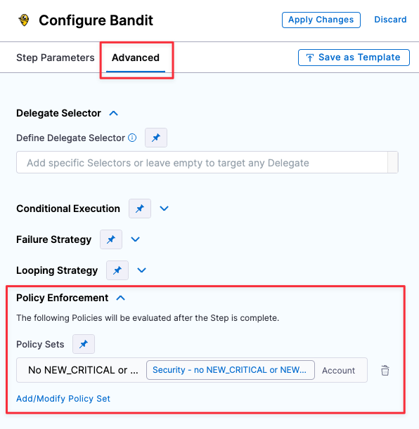

:::note
This workflow requires a basic knowledge of governance policies and how to implement them using [Harness Policy as Code](/docs/platform/Governance/Policy-as-code/harness-governance-overview) and [Open Policy Agent (OPA)](https://www.openpolicyagent.org/).
:::

Whenever you run a scan, Harness collects output variables that capture the number of issues detected at each severity. These variables also track "new" issues were found in the current scan but not in the baseline or in the previous scan. For more information, go to:

* [Output variables in STO](/docs/security-testing-orchestration/onboard-sto/key-concepts/output-variables)
* [Severity scores and levels in STO](/docs/security-testing-orchestration/onboard-sto/key-concepts/severities)

In this workflow, you create a simple OPA policy for the pipeline: If the scan detected any NEW_CRITICAL or NEW_HIGH severities, exit the build with an error and send an email. 


### Create the OPA policy

1. Go to **Account Settings** (left menu) &gt; **Policies**.

2. Click **Policies** (top right) and then **New Policy**. 

3. Name the policy **Security no NEW_CRITICAL or NEW_HIGH issues**. 

4. In the Edit Policy window, enter the following OPA code: 

   ```
    package pipeline_environment

   deny[sprintf("Scan can't contain any NEW_CRITICAL vulnerability '%s'", [input[_].outcome.outputVariables.NEW_CRITICAL])] {
       input[_].outcome.outputVariables.NEW_CRITICAL != "0"
   }

   deny[sprintf("Scan can't contain any high vulnerability '%s'", [input[_].outcome.outputVariables.NEW_HIGH])] {
       input[_].outcome.outputVariables.NEW_HIGH != "0"
   }
   ```

5. Click **Save**. 

### Create a policy set

A _policy set_ is a collection of one or more policies. You combine policies into a set and then include it in a Policy step. 

1. In the Policies Overview page, click **Policy Sets** (top right) and then **New Policiy Set**. 

2. Click **New Policy Set**. The Policy Set wizard appears.

3. Overview:

    1. Name = **Security Set - Block on Issue Severity**

    2. Entity type this policy applies to = **Custom**

    3. On what event should the policy be set to = **On Step**. 
   
       These settings allow you to apply the member policies to a specific step, which you'll define below. 

4. Policy evaluation criteria: 
 
   1. Click **Add Policy**.
    
   2. Select the policy you just created and set the pull-down to **Error and Exit**. This is the action to take if any policies in the set are violated. 

      

   3. Click **Apply** to add the policy to the set, then **Finish** to close the Policy Set wizard.

5. :exclamation: In the **Policy Sets** page, enable  **Enforced** for your new policy set.

    


### Enforce the policy in your scan step

Now you can set up your scan step to stop builds automatically when the policy gets violated. 

1. Go to the scan step and click **Advanced**. 

2. Under **Policy Enforcement**, click **Add/Modify Policy Set** and add the policy set you just created.

3. Click **Apply Changes** and then save the updated pipeline. 

   


### Set up email notifications for pipeline failures

You have a Policy that fails the pipeline based on an OPA policy. Now you can configure the stage to send an email notification automatically whenever the pipeline fails. 


1. Click **Notifications** (right-side menu). The New Notification wizard appears.

2. Set up the notification as follows:

     1. Overview page —  Enter a notifcation name such as **Pipeline failed -- NEW_CRITICAL or NEW_HIGH issues detected**.

     2. Pipeline Events page  —  Select **Stage Failed** for the event that triggers the notification. Then select the stage that has the Policy step you just created.

        

     3. Notification Method page  — Specify **Email** for the method and specify the recipient emails. 


## YAML pipeline example

The following pipeline includes both of these notification workflows. For every successful scan, it sends an automated email like this:

```
"STO scan of sto-notify-test v3 found the following issues:
Critical : 1
New Critical : 0
High: 0
New High: 0
Medium: 0
New Medium: 0
See https://app.harness.io/ng/#/account/XXXXXXXXXXXXXXXXXXXXXX/sto/orgs/default/"
```


 If the scan finds any NEW_CRITICAL or NEW_HIGH issues, it stops the build and sends an email like this: 

 ```
 Stage Block_on_New_Critical_and_New_High_issues failed in pipeline notification_examples_pipeline
triggered by D*** B***
Started on Tue Mar 21 16:42:09 GMT 2023 and StageFailed on Tue Mar 21 16:42:11 GMT 2023
Execution URL  https://app.harness.io/ng/#/account/XXXXXXXXXXXXXXXXXXXXXX/sto/orgs/default/projects/myProject/pipelines/stonotifyexample_-_v3/executions/XXXXXXXXXXXXXXXXXXXXXX/pipeline
2s
 ```

Here's the full pipeline. Note that the policy and policy set are referenced, but not defined, in the pipeline itself.

```yaml
pipeline:
  name: sto-notify-example v3
  identifier: stonotifyexample_-_v3
  projectIdentifier: myProject
  orgIdentifier: myorg
  tags: {}
  properties:
    ci:
      codebase:
        connectorRef: MY_GITHUB_CONNECTOR
        build: <+input>
  stages:
    - stage:
        name: banditScanStage
        identifier: banditScanStage
        description: ""
        type: SecurityTests
        spec:
          cloneCodebase: true
          execution:
            steps:
              - step:
                  type: Bandit
                  name: Bandit_1
                  identifier: Bandit_1
                  spec:
                    mode: orchestration
                    config: default
                    target:
                      name: dvpwaScanStep-v3
                      type: repository
                      variant: <+codebase.branch>
                    advanced:
                      log:
                        level: info
          infrastructure:
            type: KubernetesDirect
            spec:
              connectorRef: MY_DELEGATE_CONNECTOR
              namespace: sto-lab
              automountServiceAccountToken: true
              nodeSelector: {}
              os: Linux
    - stage:
        name: Block on New-Critical and New-High issues
        identifier: Block_on_New_Critical_and_New_High_issues
        description: ""
        type: Custom
        spec:
          execution:
            steps:
              - step:
                  type: Email
                  name: emailOnNotification
                  identifier: Email_1
                  spec:
                    to: john.smithh@myorg.org
                    cc: ""
                    subject: "STO ALERT: Issues found in <+pipeline.name>"
                    body: |-
                      "STO scan of <+pipeline.name> found the following issues: <br> 
                       Critical : <+pipeline.stages.banditScanStage.spec.execution.steps.Bandit_1.output.outputVariables.CRITICAL> <br>
                       New Critical : <+pipeline.stages.banditScanStage.spec.execution.steps.Bandit_1.output.outputVariables.NEW_CRITICAL> <br>
                       High: <+pipeline.stages.banditScanStage.spec.execution.steps.Bandit_1.output.outputVariables.HIGH> &#10; <br>
                       New High: <+pipeline.stages.banditScanStage.spec.execution.steps.Bandit_1.output.outputVariables.NEW_HIGH> <br>
                       Medium: <+pipeline.stages.banditScanStage.spec.execution.steps.Bandit_1.output.outputVariables.MEDIUM> <br>
                       New Medium: <+pipeline.stages.banditScanStage.spec.execution.steps.Bandit_1.output.outputVariables.NEW_MEDIUM>  <br>
                       See https://app.harness.io/ng/#/account/MY_ACCOUNT_ID/sto/orgs/default/"
                  timeout: 1d
              - step:
                  type: Policy
                  name: Policy_1
                  identifier: Policy_1
                  spec:
                    policySets:
                      - account.Security_Set_Block_on_Issue_Severity
                    type: Custom
                    policySpec:
                      payload: |-
                        {
                        "NEW_CRITICAL": <+pipeline.stages.banditScanStage.spec.execution.steps.Bandit_1.output.outputVariables.NEW_CRITICAL>, 
                        "NEW_HIGH": <+pipeline.stages.banditScanStage.spec.execution.steps.Bandit_1.output.outputVariables.NEW_HIGH>
                        }
                  timeout: 10m
                  failureStrategies: []
        tags: {}
  notificationRules:
    - name: example sto test
      identifier: example_sto_test
      pipelineEvents:
        - type: StageFailed
          forStages:
            - Block_on_Critical_and_High_issues
      notificationMethod:
        type: Email
        spec:
          userGroups: []
          recipients:
            - john.smithh@myorg.org
      enabled: true

```
