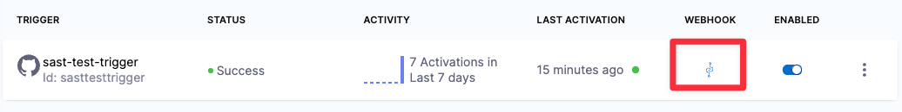
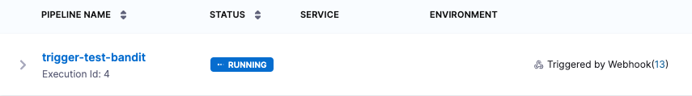

import Tabs from '@theme/Tabs';
import TabItem from '@theme/TabItem';

<!-- 
## Set up the pipeline

Do the following:

1. Fork the following repository into your GitHub account: https://github.com/GitHubGoneMad/dvpwa

2. In Harness, do the following:

   1. Select **Pipelines** > **Create a Pipeline**. Enter a name and click **Start**.

   2. Add a **Security Tests** stage and set it up as follows:

      1. Select **Third-party Git provider**.

      2. **Connector** = Your GitHub account connector.

      3. **Repository Name** = dvpwa

   3. In **Infrastructure**, select **Cloud** - **Linux** - **AMD**.

   4. In **Execution**, add a **Bandit** step. 

   5. Set **Fail on Severity** to **Medium**, apply your changes, and save the pipeline.   

-->

## Create the trigger (Harness)

The following sections describe two triggers that can be very useful in the context of STO scanning:

- [Trigger on a changed file](#trigger-on-a-changed-file)
- [Trigger on a review comment](#trigger-on-a-pr-review-comment)

### Trigger on a changed file 

You can specify a trigger that says: If a pull request updates any of these files, run the pipeline and scan the repo. 

This type of trigger supports uses cases such as:

- If the pull request updates any file that matches the trigger filter, run a SAST scan and block the PR if the scan results meet the [Fail on Severity](/docs/security-testing-orchestration/get-started/key-concepts/fail-pipelines-by-severity/) threshold.

- If the pull request updates a specific file of interest, such as a `pom.xml` workspace file, run an SCA scan and block the PR if the scan results meet the [Fail on Severity](/docs/security-testing-orchestration/get-started/key-concepts/fail-pipelines-by-severity/) threshold.


#### Create the trigger

1. Go to your STO pipeline, select **Triggers**, and add a new trigger for your Git provider.

2. Set up the trigger as follows. 

<Tabs>
  <TabItem value="file-change-config" label="Configuration" default>

     [Configure the trigger](/docs/platform/triggers/triggering-pipelines#configure-the-trigger):

		- The [**Connector**](/docs/category/code-repo-connectors/) to your Git service
      
      - **Repository Name**
      
      - [**Event**](/docs/platform/triggers/triggers-reference#event-and-actions) = **Pull Request** 
      
      - Set the **Actions**, such as **Open** and **Reopen**, to trigger the scan. 

     <DocImage path={require('./static/trigger-tutorial/changed-file-config-example-simple.png')} width="50%" height="50%" title="Add shared path for scan results" />

  </TabItem>

  <TabItem value="file-change-conditions" label="Conditions">
   
  [Set the condition](/docs/platform/triggers/triggers-reference#conditions-settings) to trigger the STO scan. 
   
   The following fields are the most relevant to this workflow:

   - **Target Branch** Useful if you want to scan PRs into the root branch only. This should match your [target baseline](/docs/security-testing-orchestration/use-sto/set-up-sto-pipelines/set-up-baselines). 
   - [**Changed Files**](/docs/platform/triggers/triggers-reference#branch-and-changed-files-conditions) The files that trigger the STO pipeline if they have updates in the PR. You can specify multiple files using the [operators](/docs/platform/triggers/triggers-reference#operators) **In**, **Not In**, and **Regex**.  

   Here's a simple example: trigger a build if a PR seeks to update a specific `pom.xml` in the `main` branch. Triggers are complex filters in which all conditions are AND-ed together. 

   <DocImage path={require('./static/trigger-tutorial/changed-file-condition-example-simple.png')} width="50%" height="50%" title="Add shared path for scan results" /> 

   </TabItem>

  <TabItem value="file-change-pipeline-input" label="Pipeline input">

   The [pipeline input](/docs/platform/triggers/triggering-pipelines#set-pipeline-input) should be preconfigured, with  **Build Type** should be set to **Git Pull Request**.

   Select **Update Trigger**.

      <DocImage path={require('./static/trigger-tutorial/changed-file-pipeline-input-example-simple.png')} width="50%" height="50%" title="Add shared path for scan results" /> 

   </TabItem>

   <!-- 
   <TabItem value="file-change-yaml" label="YAML example">

   Here's a YAML example of this trigger.

   ```yaml

      trigger:
         name: trigger_on_updated_file
         identifier: trigger_on_updated_file
         enabled: true
         encryptedWebhookSecretIdentifier: ""
         description: ""
         tags: {}
         orgIdentifier: default
         stagesToExecute: []
         projectIdentifier: sto_tutorials
         pipelineIdentifier: triggertestbandit
         source:
            type: Webhook
            spec:
               type: Github
               spec:
               type: PullRequest
               spec:
                  connectorRef: my_github_connector
                  autoAbortPreviousExecutions: false
                  payloadConditions:
                     - key: changedFiles
                     operator: Equals
                     value: /full/path/to/pom.xml
                     - key: targetBranch
                     operator: Equals
                     value: main
                  headerConditions: []
                  repoName: dvpwa-djb
                  actions:
                     - Open
                     - Reopen
         inputYaml: |
            pipeline:
               identifier: triggertestbandit
               properties:
               ci:
                  codebase:
                     build:
                     type: PR
                     spec:
                        number: <+trigger.prNumber>


   ```

  </TabItem -->

</Tabs>


### Trigger on a PR review comment

You can specify a trigger that says: If a reviewer includes a specific keyword in a pull-request review comment, run the pipeline and scan the repo.

This type of trigger is useful when a pipeline execution fails for reasons other than [Fail on Severity](/docs/security-testing-orchestration/get-started/key-concepts/fail-pipelines-by-severity/). If the STO scan doesn't finish in the  original execution, a reviewer can add a review comment with a keyword such as `RERUN_STO_PIPELINE`. 

#### Create the trigger

1. Go to your STO pipeline, Select **Triggers**, and add a new trigger for your Git provider.

2. Set up the trigger as follows. 

<Tabs>
  <TabItem value="review-comment-config" label="Configuration" default>

     [Configure the trigger](/docs/platform/triggers/triggering-pipelines#configure-the-trigger):

		- The [**Connector**](/docs/category/code-repo-connectors/) to your Git service
      
      - **Repository Name**
      
      - [**Event**](/docs/platform/triggers/triggers-reference#event-and-actions) = **Issue Comment** 
      
      - Set the **Actions**, such as **Create** and **Edit**, to trigger the scan. You can also select **All actions** so that any reviewer can trigger a new scan at any time.

      <DocImage path={require('./static/trigger-tutorial/review-comment-config-example-simple.png')} width="50%" height="50%" title="Add shared path for scan results" />

  </TabItem>

  <TabItem value="review-comment-conditions" label="Conditions">
   
   Enter the following [JEXL condition](/docs/platform/triggers/triggers-reference#jexl-conditions) with the keyword to trigger a new scan:

   `<+trigger.payload.comment.body>.contains("RUN_STO_SCAN")`

   <DocImage path={require('./static/trigger-tutorial/review-comment-condition-example-simple.png')} width="100%" height="100%" title="Add shared path for scan results" /> 

   </TabItem>

  <TabItem value="review-comment--pipeline-input" label="Pipeline input">

   The [pipeline input](/docs/platform/triggers/triggering-pipelines#set-pipeline-input) should be preconfigured, with  **Build Type** should be set to **Git Pull Request**.

   Select **Update Trigger**.

      <DocImage path={require('./static/trigger-tutorial/changed-file-pipeline-input-example-simple.png')} width="50%" height="50%" title="Add shared path for scan results" /> 

   </TabItem>
</Tabs>

## Test the trigger (Git)

### Verify the Git webhook

Once you add a trigger to your pipeline, your Git service provider should create a webhook for the trigger automatically. This is true for all non-custom webhooks and all Git providers supported by Harness. 

1. Go to your repo in your SCM provide, navigate to the repo's webhook settings, and verify that the webhook got registered. In GitHub, for example, select **Settings** > **Webhooks**.

   <DocImage path={require('./static/trigger-tutorial/github-new-trigger.png')} width="50%" height="50%" title="Add shared path for scan results" /> 

2. If you don't see a webhook, you can add one manually.

For more information, go to [Register the webhook in the Git provider](/docs/platform/triggers/triggering-pipelines/#register-the-webhook-in-the-git-provider).


### Test the trigger and webhook

To test your trigger, update your repo to verify that the trigger works as intended. 

- To verify the [changed-file trigger](#trigger-on-a-changed-file) described above, make and push a change. Then create a pull request.

- To verify the [review-comment trigger](#trigger-on-a-pr-review-comment) described above, create a pull request and then add a review comment with the keyword you specified. 

You should now see the following:

1. In the Git repo, the request and response were successful.

  <DocImage path={require('./static/trigger-tutorial/test-trigger-01-req-response-successful.png')} width="50%" height="50%" title="Add shared path for scan results" /> 

2. In the **Pipeline Executions** of the Harness pipeline, the trigger starts a new execution.  

    <DocImage path={require('./static/trigger-tutorial/test-trigger-02-new-pipeline-execution.png')} width="50%" height="50%" title="Add shared path for scan results" /> 

3. In the Git pull request, the pipeline execution appears as an automated check. 

    <DocImage path={require('./static/trigger-tutorial/test-trigger-03-check-running-in-pr.png')} width="50%" height="50%" title="Add shared path for scan results" /> 

If the trigger doesn't work as intended, go to [Troubleshoot Git event triggers](/docs/platform/triggers/triggering-pipelines/#troubleshoot-git-event-triggers).


## Add a branch protection rule for the repo (Git)

The final step is to ensure that a PR cannot be merged if the STO pipeline fails. To do this, you create a protection rule for your root branch.

The following steps describe the workflow in [GitHub](https://docs.github.com/en/repositories/configuring-branches-and-merges-in-your-repository/managing-protected-branches). If you're using a different SCM, go to the SCM documentation and search for `branch protection`. 

### Add the protection rule

1. Go to your Git repo and select **Settings** > **Branches** > **Add Rule**.

2. In **Branch name pattern**, add a string or regular expression for the branch or branches you want to protect. This should match your [target baseline](/docs/security-testing-orchestration/use-sto/set-up-sto-pipelines/set-up-baselines).

3. Select **Require a pull request before merging** and **Require Approvals**. This isn't required, but it's good practice.

4. Select **Require status checks to pass before merging**.

5. In the search field below, enter the first characters of the check name and then select the check. 

   <DocImage path={require('./static/trigger-tutorial/add-check-to-branch-protection-rule.png')} width="50%" height="50%" title="Add shared path for scan results" /> 

6. Configure any other settings as appropriate.

7. Scroll to the bottom of the page and select **Save Changes**.

### Test the protection rule

Now that you've set up the rule, trigger another pipeline execution to verify that the rule stops the pull requestion.

:::note

To verify the branch protection rule, you must ensure that your STO pipeline fails. To configure your pipeline to fail temporarily, you can do one of the following:

- Set [Fail on Severity](/docs/security-testing-orchestration/get-started/key-concepts/fail-pipelines-by-severity/) to **Low** in the scan step of your pipeline. Then scan a repo with known vulnerabilities. 
- Add a temporary Run step to your pipeline with the command `exit(1)`

::: 

1. Trigger another pipeline execution.

   - For the [changed-file trigger](#trigger-on-a-changed-file) described above, make and push a change. Then create a pull request.

   - For the [review-comment trigger](#trigger-on-a-pr-review-comment) described above, add a review comment with the keyword you specified. 

3. Now, merging is blocked if the Harness pipeline fails. 

   


<!-- 
## Add the Git webhook

This workflow 

1. Go to your repo and select **Settings** > **Webhooks** > **Add Webhook**.

2. Set up the webhook as follows:

   1. **Payload URL** Copy the webhook URL from the trigger in your Harness pipeline 
     
      

   2. **Cont type** = `application/json`

   3. **Which events would you like to trigger the webhook?**

     1. Select **Let me select individual events** and then select **Pull requests** and **Pull request review comments**. 
     
     2. Scroll down to the bottom of the page. Make sure **Active** is selected and then update the webhook.  

## Create a pull request and trigger the pipeline

In the GitHub repo, update the file that you specified in the trigger and create a pull request. You should now see a new trigger run in the **Pipeline Executions** page for your pipeline.



The pull request in GitHub now shows the pipeline run as a check for the pull request. Note the name of the status check that appears. You will select it in the following step. 

-->


