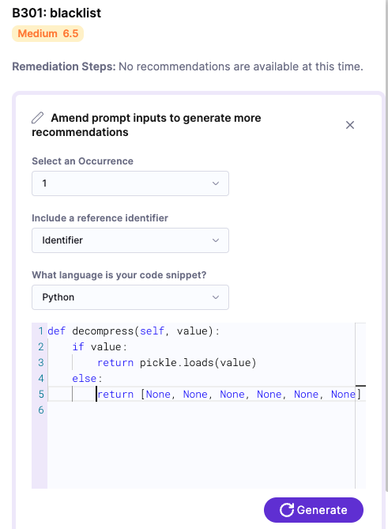

FEATURE_NAME uses an experimental AI engine to generate suggestions for fixing detected issues. This feature is especially useful when the external tool does not provide remediations for a specific issue. 

## Important notes
* Currently, this feature is behind the feature flag `FEATURE_FLAG`. Contact [Harness Support](mailto:support@harness.io) to enable the feature. 
* Harness STO uses the [Google Bard](https://bard.google.com/) AI engine to generate suggestions. For information about privacy and security safeguards in Bard, go to [Google privacy principles](https://safety.google/principles/).  
* STO queries to the Bard API include the CWE or CVE ID, the issue description, and information about where the issue was detected (such as code snippets or image layers).
* STO anonymizes all information it includes in a Bard query. The Bard engine deletes all query information immediately after it sends a response. 
* The accuracy, reliability, and completeness of a suggestion depends on the publicly-known information about the detected issue. An issue might have no known remediation, especially if it was recently discovered. An issue might have multiple suggested remediations that are contradictory, controversial, or applicable only to specific use cases.
* Before you implement an AI-generated suggestion, consider carefully the reliability and extent of the publicly-known information that that issue. Also consider the suggestion's applicability to your specific organization and use case.
* You can refine a suggestion by providing more information, such as additional context or code snippets, to the AI engine. For more information, go to [How it works](#how-it-works) below. 

## How it works: Issue remediations

1. When you go to **Security Tests** and then select an issue, an initial **AI enhanced remediation** appears in **Issue Details**. This suggested remediation is based on all occurrences of the issue in the target. 

   

2. If you want to refine this remediation with more information or context, click **Edit Inputs**. 

3. Specify the reference ID, occurrence, and language (if you've scanned a codebase). 

4. Add any additional context in the text pane. This might be a code snippet, a Dockerfile, or some other piece of information that's relevant to the specific target and issue. Then click **Generate**. 

   

You can repeat this process, providing more information to generate increasingly targeted suggestions. 

## How it works: occurrence remediations

You can also generate suggested remediations for specific occurrence within an issue. 

1. In **Issue details**, scroll down to the occurrence that you want to remediate. Then click **Unsure how to remediate? Ask AI**. 

   

2. To further refine the suggested remediation with an additional code snippet, click **Edit Snippet** and re-generate.

   
