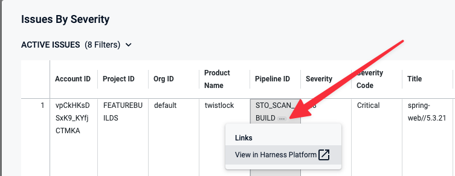

The Security Testing Dashboard enables you to view, navigate, discover and investigate detected vulnerabilities in your organization. This dashboard includes a set of filters for drilling down into specific issues by project, creation date, scanner, target, pipeline, severity, and so on. You can drill down to a set of relevant issues and then click on a pie slice, chart element, or other UI element to view details on the relevant issues.

To open the Security Testing Dashboard, select **Dashboards** (left menu) and then **Security Testing** (top checkbox).

:::note
- This dashboard requires an Enterprise account.
- This dashboard shows only results for targets that have baselines defined. You should define a baseline for every target in your project. For more information, go to [Targets, baselines, and variants in STO](/docs/security-testing-orchestration/onboard-sto/key-concepts/targets-and-baselines).
- You must click **Refresh** (top right) to apply the filter after you configure it.
- To view details for an issue from the search results, click the pipeline name or ID and choose **View in Harness Platform**. 

   

- The **Created Date** menu has several non-working options: `is null`, `is not null`, and `matches a user attribute`. This is a known issue that Harness is working to address.

:::

<figure>

<figcaption>Security Testing Dashboard -- filters and Refresh button</figcaption>
</figure>

