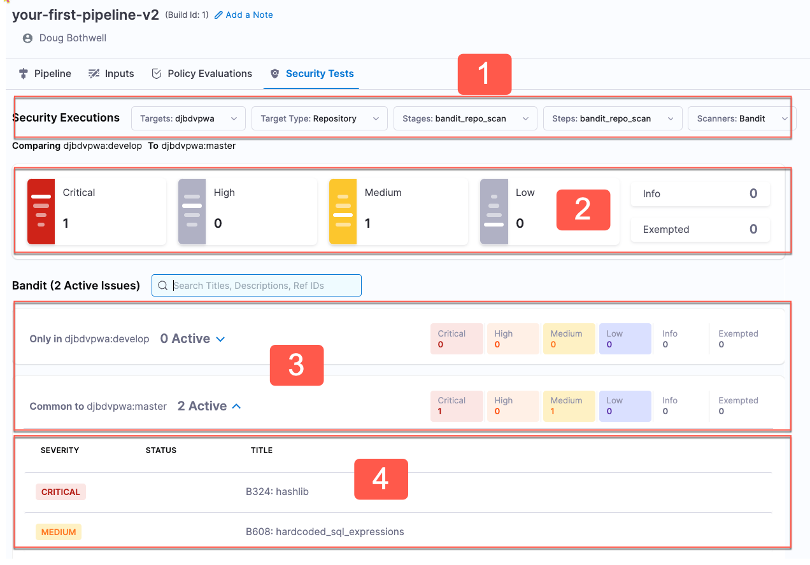

To view scan results from a pipeline execution, go to **Pipeline Executions**, select the execution, and then go to the **Security Tests** tab. 

The following steps describe the general workflow:

1. Click on the [severity](/docs/security-testing-orchestration/onboard-sto/key-concepts/severities) tiles to filter the list of known vulnerabilities. 

2. Drill down into the relevant issues list to view the issues found in the scan:

   - **Only in _variant_name_** &nbsp; Issues found in only the variant you specified when you ran the scan. 
   
     If you scanned the baseline, or if the target has no baseline defined, this list shows issues found in the current scan — but not the last scan  —  of the baseline. 

   - **Common to previous scan** &nbsp; Issues found in the target baseline as well as the baseline. 

   :::note

   For best results in STO, every target should have a baseline defined. For more information, go to [Targets, baselines, and variants in STO](/docs/security-testing-orchestration/onboard-sto/key-concepts/targets-and-baselines).

   :::

3. To investigate an issue in detail, click the issue in the list to open **Issue Details** (right). 

4. The **Issue Details** pane includes known details and remediation steps for the detected issue. Note that this pane shows details for all occurrences of the detected issue, so scan down to ensure that you see all occurrences. You can also do the following:

   - Request an [exemption](/docs/security-testing-orchestration/use-sto/stop-builds-based-on-scan-results/exemption-workflows) so that pipeline executions can proceed even if the issue is detected.

   - Fix the issue using [AI-enhanced remediation steps](/docs/security-testing-orchestration/use-sto/view-and-troubleshoot-vulnerabilities/ai-based-remediations) (currently in beta).