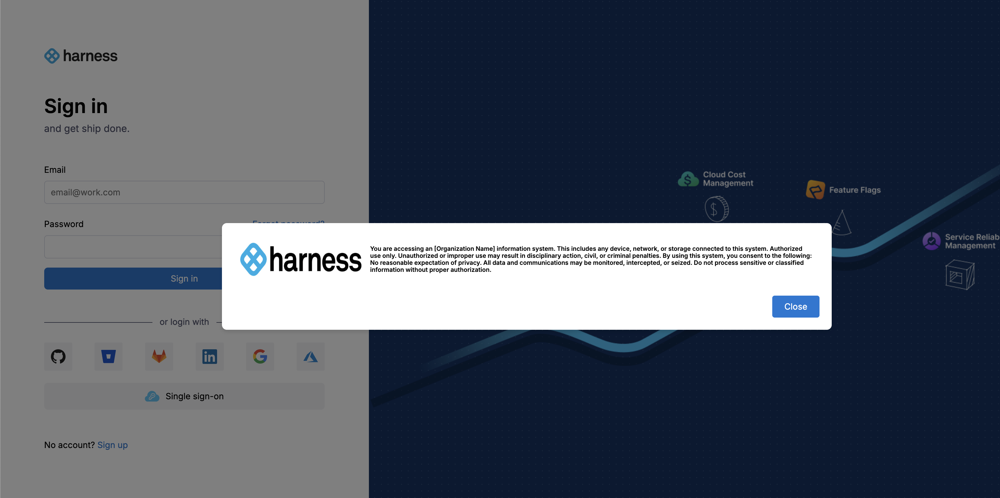

<!--Pre-requistics-->

:::important
    This feature is available starting from release harness-0.30.0. 
:::

<!--Introduction: what is customizable login message, why it is needed-->

Custom login prompt allows organizations to display security, legal, or compliance notices—such as U.S. Government consent banners— ensuring users see and acknowledge important information before accessing the platform.

Showing a login prompt to users can be important in the following use cases:

* **Regulatory compliance** that may require user consent or policy acknowledgement.
* **Legal protection** by showing terms of use, data usage policies, or disclaimers before granting access.
* **Security awareness** by reminding users of acceptable use policies, confidentiality requirements, or security best practices.

<!--configuration steps: how to enable this sign-in message-->

## Configuration Steps

Follow these steps to enable and configure the Custom Login Message:

1. Write the information you want to display in the prompt using valid HTML format. Ensure the content is properly sanitized to prevent XSS or injection risks.

    <details>
        <summary>HTML Example</summary>
        <p>
        ```html
        <!DOCTYPE html>
        <html>
        <head>
            <style>.container{display:flex;align-items:center;background-color:#fff;padding:10px}.logo{width:200px;height:59px;margin-right:13px}.us-gov-banner{font-weight:700;font-size:7.5pt}</style>
        </head>
        <body>
            <div class="container">
                
                <div class="us-gov-banner">You are accessing an [Organization Name] information system. This includes any device, network, or storage connected to this system.
                    Authorized use only. Unauthorized or improper use may result in disciplinary action, civil, or criminal penalties.
                    By using this system, you consent to the following:
                    No reasonable expectation of privacy. All data and communications may be monitored, intercepted, or seized.
                    Do not process sensitive or classified information without proper authorization.
                </div>
            </div>
        </body>
        </html>
        ```
        </p>
    </details>    
    

2. Encode the HTML content to Base64.

    - Use any standard tool or command. For example:

        ```bash
        cat your-message.html | base64
        ```
    - Once you have encoded your HTML, here’s an example of what the output will look like (truncated for readability):

        ```base64
        PCFET0NUWVBFIGh0bWw+CjwhLS0gc2F2ZWQgZnJvbSB1cmw9KDAwMjIpY2hyb21lOi8vbmV3LXRhYi1wYWdl...
        ```    

3. Configure the environment variable.

   Add the Base64-encoded string to your `values.yaml` file in the `ng-auth-ui` service, `config` → `CUSTOM_EULA_POLICY` as shown below:

    ```yaml
    ng-auth-ui:
      config:
        CUSTOM_EULA_POLICY: "<your-base64-encoded-html>"
    ```

    Example:

    ```yaml
    ng-auth-ui:
      config:
        CUSTOM_EULA_POLICY: "PCFET0NUWVBFIGh0bWw+CjwhLS0gc2F2ZWQgZnJvbSB1cmw9KDAwMjIpY2hyb21lOi8vbmV3LXRhYi1wYWdlLyAtLT4KPGh0bWwgZGlyPSJsdHIiIGxhbmc9ImVuIiBjbGFzcz0iIiBsYXp5LWxvYWRlZD0idHJ1ZSI+PGhlYWQ..."
    ```

4. Upgrade your Helm chart to apply the changes:

   ```bash
   helm upgrade -i <release-name> <path-to-directory> -n <namespace> -f values.yaml
   ```

<!--Working snapshot-->

    Once you have successfully upgraded your Helm chart, your custom login prompt will appear on the login screen, similar to the example shown below.

    

<!--Working snapshot-->

