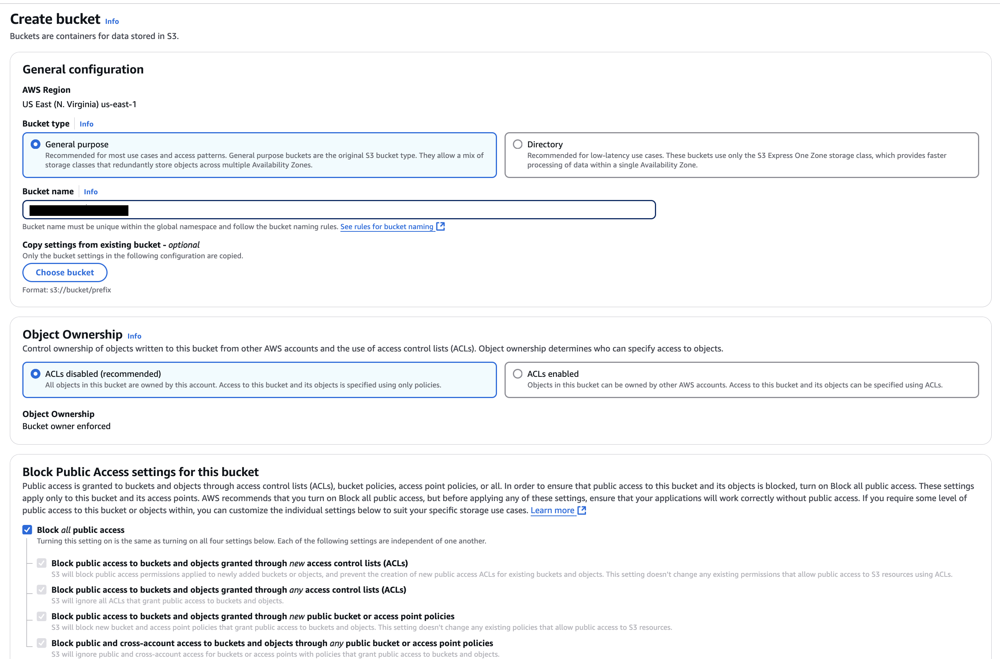
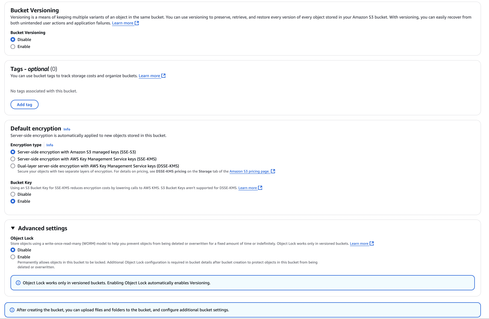
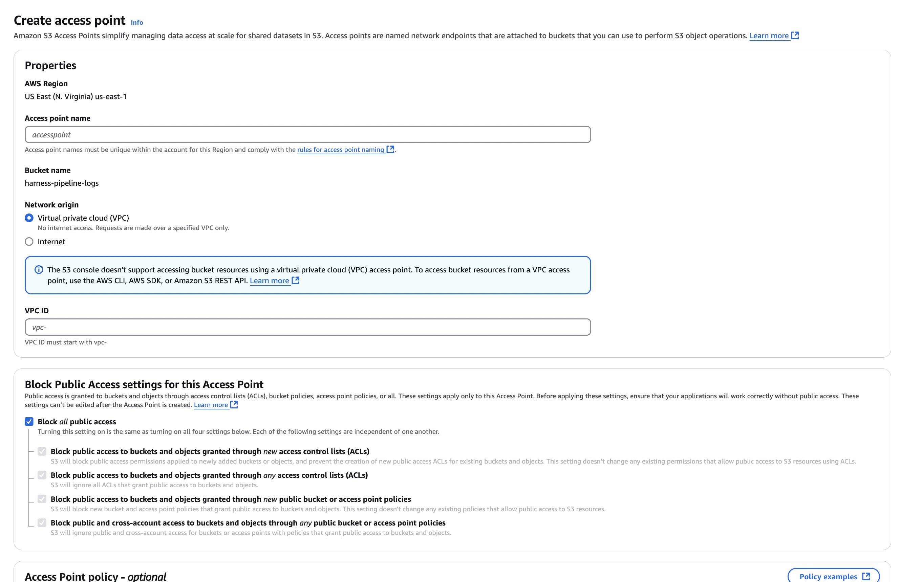
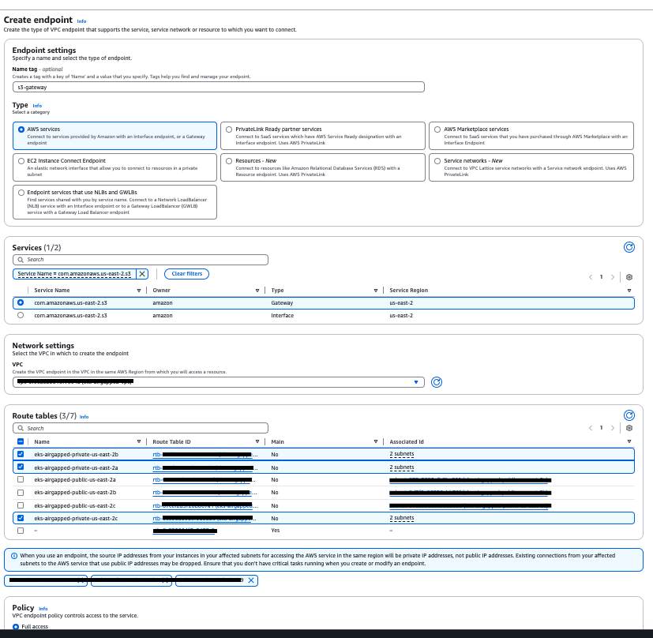

By default, Harness supports an embedded database for storing CI pipeline logs, suitable for evaluation or small-scale deployments. However, as deployments scale or demand grows, it’s critical to switch to a more scalable and reliable storage solution. Harness supports AWS S3 for storing CI pipeline logs, providing a secure, robust, and cost-effective way to manage large volumes of log data. 

To use AWS S3, you must configure it as an external storage solution, which involves setting up an S3 bucket and connecting it to Harness by specifying the required details like the bucket name, region, and access credentials. This ensures your pipeline logs are stored securely and are easily accessible for analysis.

### Create an S3 Bucket

1. Navigate to the **S3 API page** in the AWS Console.  
2. Create a **General Purpose Bucket** with your desired name and ensure **public access is disabled**. 

    

     

3. After the bucket is created, go to the **Access Points** tab for that bucket.  

    

4. Add a new access point and connect it to your VPC.

### Set up Access Key, Secret Key & Policy to access Bucket

To create an AWS Access Key ID and Secret Access Key with limited permissions for a specific S3 bucket, follow these steps:

1. **Create a New IAM User**:
   - Sign in to the AWS Management Console and go to the IAM console.
   - Select **Users** > **Add user**.
   - Enter a user name and click **Next: Set Permissions**.

2. **Attach Policy Directly or Add to Group**:
   - For direct policy attachment, choose **Attach existing policies directly** > **Create policy**.
   - Use the JSON editor to specify permissions for viewing and uploading to your bucket. Replace `YOUR_BUCKET_NAME` with your actual bucket name in the policy:

    ```json
    {
        "Version": "2012-10-17",
        "Statement": [
            {
                "Effect": "Allow",
                "Action": [
                    "s3:*",
                    "s3-object-lambda:*"
                ],
                "Resource": [
                    "arn:aws:s3:::YOUR_BUCKET_NAME",
                    "arn:aws:s3:::YOUR_BUCKET_NAME/*"
                ]
            }
        ]
    }
    ```

   Alternatively, you can add the user to a group that already has the required permissions.

3. **Review and Create User**:
   - After attaching the policy, proceed through **Next: Tags**, **Next: Review**, and click **Create user**.

4. **Access Key and Secret**:
   - Once the user is created, you'll see the **Access Key ID** and **Secret Access Key**. Be sure to save them securely.

### Create Gateway Endpoint to Connect with S3 from a Private Subnet

1. Go to the **Endpoints** section in the VPC page (e.g., [VPC Console](https://us-east-2.console.aws.amazon.com/vpcconsole/home?region=us-east-2#Endpoints)).

2. Click **Create New Endpoint** and provide the following details:

   - **Name**: `<some-name>`
   - **Type**: AWS Services
   - **Service**: `com.amazonaws.<region>.s3` (Select the Gateway type, and filter with "s3")
   - **VPC**: VPC ID of your EKS cluster
   - **Route Tables**: Select the route tables associated with the private subnets of your VPC/EKS cluster
   - **Allow Full Access**: Enable this option.

    

### Validate Connectivity from EKS to S3

1. **Exec into Minio Pod in your Harness Namespace**  
   Use the following command to access the Minio pod:  
   ```bash
   kubectl exec -it <minio-pod> -n <namespace> -- sh
   ```

2. **Set Alias for S3**  
   Set up the S3 alias with the following command:  
   ```bash
   mc alias set S3 https://<bucket>.s3.<region>.amazonaws.com/ access_key secret_key
   ```

3. **Create a Dummy File**  
   Create a test file with the following command:  
   ```bash
   echo 'test' > /tmp/example.txt
   ```

4. **Copy the File to S3**  
   Upload the dummy file to your S3 bucket:  
   ```bash
   mc put /tmp/example.txt S3/example.txt
   ```

5. **Verify the File Exists in Your Bucket**  
   Ensure the file was successfully uploaded by checking your S3 bucket.

### Create Kubernetes Secret to Store AccessKey and SecretKey  

:::info
The secrets are provided in plaintext here. If you choose to base64 encode them, use the `data` field instead of `stringData`. Both methods will convert the secrets into base64-encoded format on the server.
:::

Create a Kubernetes secret in your cluster so the application can refer to it. 

Use the following YAML format to store the `S3_ACCESS_KEY` and `S3_SECRET_ACCESS_KEY`:

```yaml
apiVersion: v1
kind: Secret
metadata:
  name: log-service-s3-secrets
  namespace: <enter Namespace>
type: Opaque
stringData:
  S3_ACCESS_KEY: ENTER_S3_ACCESS_KEY
  S3_SECRET_ACCESS_KEY: ENTER_S3_SECRET_ACCESS_KEY
```

### Configuring AWS S3 for Log Storage in Harness

Harness allows you to store logs in AWS S3 via the AWS S3 client. To set this up, you need the S3 Access Key, S3 Secret Key, Endpoint, Region, and Bucket Name. First, create a Kubernetes secret with your AWS access and secret keys for the bucket.


```yaml
platform:
  log-service:
    s3:
      # Ensure gcs.endpoint is not set when defining s3.endpoint.
      endpoint: "https://s3.<bucket-region>.amazonaws.com"
      # Disables Minio support and sets LOG_SERVICE_MINIO_ENABLED to false. Minio is not recommended for production.
      enableMinioSupport: false
      bucketName: "<bucket-name>"
      region: "<bucket-region>"
    secrets:
      kubernetesSecrets:
        - secretName: "log-service-s3-secrets" # The secret containing your AWS credentials
          keys:
            LOG_SERVICE_S3_ACCESS_KEY_ID: "S3_ACCESS_KEY" # Access key field in the secret
            LOG_SERVICE_S3_SECRET_ACCESS_KEY: "S3_SECRET_ACCESS_KEY" # Secret access key field in the secret
```

### Copying Data from Minio to AWS S3

:::warning NOTE
If a pipeline is running during the copy command, its logs will not be transferred to S3. As a result, the execution logs for those pipelines will be lost during the transition. To ensure accuracy, Harness recommends applying a freeze window during this transition.
:::

To transfer data from Minio to S3, execute the following commands inside the Minio pod:

```bash
mc alias set S3 https://<bucket>.s3.<region>.amazonaws.com/ access_key secret_key
mc cp --recursive local/logs/<harness-accountId> S3
```

Make sure to verify that the logs for existing pipelines appear correctly in the Harness UI, and that logs for new pipeline runs are stored properly.

Once confirmed, you can disable Minio by setting:

```yaml
global:
  database:
    minio:
      installed: false
```

Your setup for storing logs in AWS S3 is now complete.