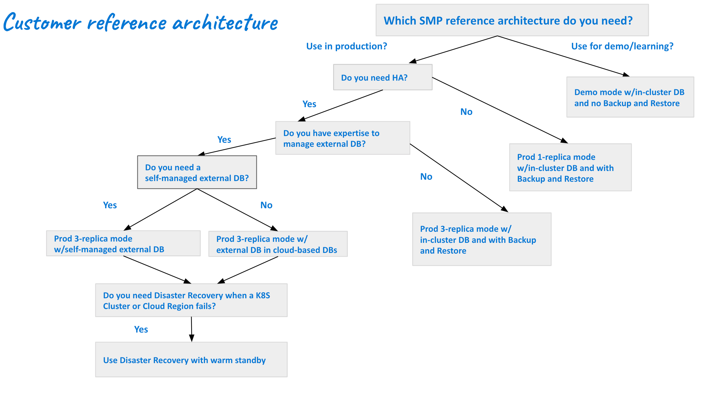

import Tabs from '@theme/Tabs';
import TabItem from '@theme/TabItem';

Harness Self-Managed Enterprise Edition brings a robust and flexible continuous delivery solution to organizations seeking control over their deployment infrastructure. This reference architecture serves as a guide, outlining the key components and best practices for implementing Harness Self-Managed Enterprise Edition. Organizations can optimize their continuous delivery pipelines with this architecture, ensuring reliability, scalability, and consistent software deployments.

### Scalability and performance

Harness Self-Managed Enterprise Edition is designed to scale with your organization's growing needs. This reference architecture details strategies to ensure optimal performance and scalability, allowing you to handle varying workloads and deploy applications efficiently.

### High availability and fault tolerance

Achieving high availability and fault tolerance is paramount for mission-critical applications. The reference architecture outlines deployment patterns and configurations to ensure continuous availability, even in the face of unexpected failures.

### Customization and extensibility

Recognizing that each organization has unique requirements, this reference architecture explores customization options and extensibility features. It empowers users to tailor the Harness platform to specific workflows and integrations, ensuring a personalized and efficient continuous delivery pipeline.

## Customer reference architectures

Reference architectures enables organizations to fully utilize Harness Self-Managed Enterprise Edition for a customized, secure, and scalable continuous delivery process.

<Tabs>

  <TabItem value="Demo mode" label="Demo mode">

The demo mode reference architecture is designed for demonstration and learning purposes and includes an in-cluster database, but doesn't include backup and restore.

</TabItem>
  <TabItem value="Prod 1 replica mode w/in-cluster DB and Backup and Restore" label="Prod 1 replica mode w/in-cluster DB and Backup and Restore">

Prod 1 replica mode w/in-cluster DB and Backup and Restore is designed for organizations that use Harness Self-Managed Enterprise Edition in production but do not require HA.

</TabItem>
  <TabItem value="Prod 3 replica mode w/in-cluster DB and Backup and Restore" label="Prod 3 replica mode w/in-cluster DB and Backup and Restore">

Prod 3 replica mode w/in-cluster DB and Backup and Restore is designed for organizations that:

- Use Harness Self-Managed Enterprise Edition in production
- Require HA
- Do not have the ability to manage external DBs

</TabItem>
  <TabItem value="Prod 3 replica mode w/self-managed external DB" label="Prod 3 replica mode w/self-managed external DB">

Prod 3 replica mode w/self-managed external DB is designed for organizations that:

- Use Harness Self-Managed Enterprise Edition in production
- Require HA
- Have the need and ability to manage external DBs

</TabItem>
  <TabItem value="Prod 3 replica mode w/external cloud-based DBs" label="Prod 3 replica mode w/external cloud-based DBs">

Prod 3 replica mode w/external cloud-based DBs is designed for organizations that:

- Use Harness Self-Managed Enterprise Edition in production
- Require HA
- don't need self-managed external DBs.

</TabItem>
  <TabItem value="Disaster recovery w/warm standby" label="Disaster recovery w/warm standby">

Disaster recovery w/warm standby is designed for organizations that:

- Use Harness Self-Managed Enterprise Edition in production
- Require HA
- Have the expertise to manage external DBs
- Require self-managed external DBs
- Require DR when a Kubernetes cluster or cloud region fails

</TabItem>
</Tabs>

## Benefits of the reference architectures

- **Best practices guidance:** Leverage industry standards and Harness's expertise to improve your workflows.

- **Optimized performance:** Implement configurations and optimizations that ensure optimal performance, enabling your organization to deploy applications quickly and reliably.

- **Ease of maintenance:** Set up a robust architecture that minimizes downtime and simplifies maintenance tasks, ensuring an efficient environment.
