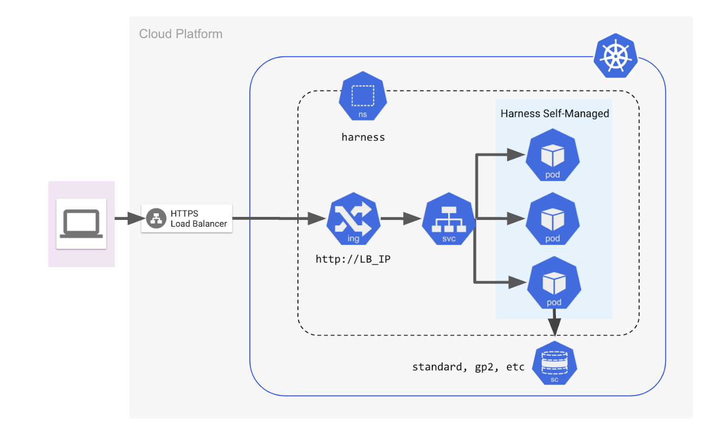

Production-level deployments of Harness Self-Managed Enterprise Edition require engagements with our Post-Sales Engineering to ensure we can assist in setting up and deploying the platform to meet your enterprise-grade objectives such as high availability, build speed, and data reliability.

For deployments intended for demonstration, non-production development, or capability assessment of Harness Self-Managed Enterprise Edition, tutorials help you get started quickly on various providers that are analogous to the methodologies utilized internally at Harness for deployment testing.

### Demo/non-production installation requirements

Regardless of the cloud or Kubernetes provider you use, validate the following before you install Harness Self-Managed Enterprise Edition:

- Your provider can meet the infrastructure requirements for our [development environment reference architecture](/docs/self-managed-enterprise-edition/self-managed-helm-based-install/harness-helm-chart/#development-environment-deployment-infrastructure).
- You utilize a [Supported Kubernetes version](/docs/self-managed-enterprise-edition/smp-supported-platforms/#supported-kubernetes-versions).
- You have a recent version of kubectl and a [supported Helm client](/docs/self-managed-enterprise-edition/self-managed-helm-based-install/install-harness-self-managed-enterprise-edition-using-helm-ga/#helm-client-version-compatibility).
- You have the ability to provision and use Persistent Volumes (this is often taken care of by various block storage drivers within your cloud platform, such as the [EBS CSI Driver](https://docs.aws.amazon.com/eks/latest/userguide/ebs-csi.html) for Amazon EKS).

### Quickstart architecture

Regardless of the cloud provider you use, our Quickstart process attempts to deploy an architecture that matches this reference:

### Quickstart Networking

Harness Self-Managed Enterprise Edition's Helm deployment has methods to configure connections to existing production ingress controllers and load balancers your operations might currently use.

Harness Helm charts also ship with configurations for both an out-of-the-box NGINX ingress controller and a load balancer. You can set up and deploy these configurations to simplify the deployment process and modify them later to fit your production-level requirements.

### Demo installation options

You can install Harness Self-Managed Enterprise Edition on the following cloud platforms:

- [AWS EKS](/docs/self-managed-enterprise-edition/demo-non-prod-install/install-in-aws-eks.md)
- [GCP](/docs/self-managed-enterprise-edition/demo-non-prod-install/install-in-gcp.md)
- [GKE](/docs/self-managed-enterprise-edition/demo-non-prod-install/install-in-gke.md)

