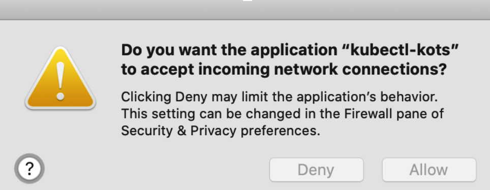
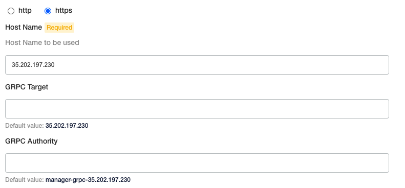
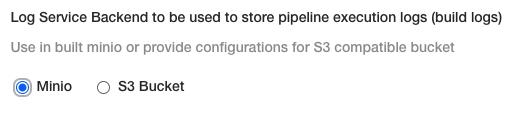
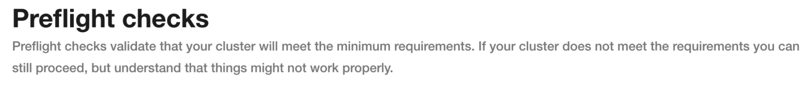
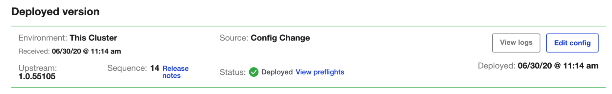
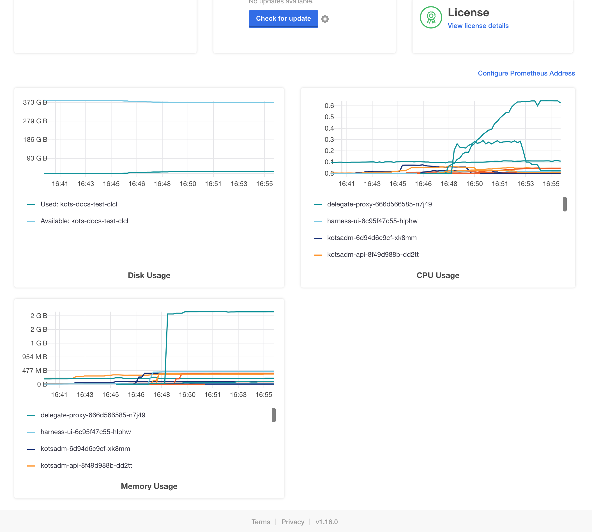
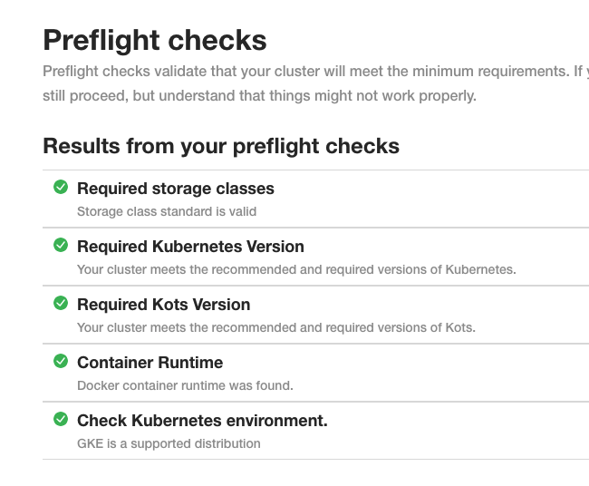
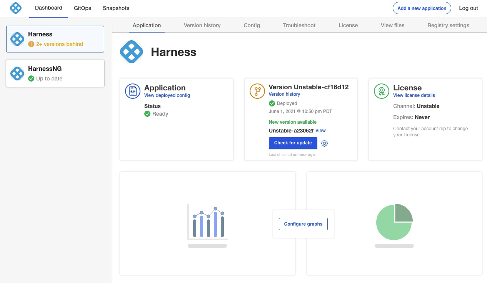

This topic covers installing Harness Self-Managed Enterprise Edition - Kubernetes Cluster **NextGen** in an existing Kubernetes cluster. Harness Self-Managed Enterprise Edition - Kubernetes Cluster **NextGen** uses the [KOTS kubectl plugin](https://kots.io/kots-cli/getting-started/) for installation.

To install Harness Self-Managed Enterprise Edition - Kubernetes Cluster **NextGen**, first you install Harness Self-Managed Enterprise Edition - Kubernetes Cluster **FirstGen**, and then you install NextGen as an application.

We assume that you are very familiar with Kubernetes, and can perform the standard Kubernetes and managing configurations using [Kustomize](https://kubernetes.io/docs/tasks/manage-kubernetes-objects/kustomization/) overlays.Installing Harness Self-Managed Enterprise Edition into an existing Kubernetes cluster is a simple process where you prepare your existing cluster and network, and use the KOTS admin tool and Kustomize to complete the installation and deploy Harness.

## Cluster requirements

Do not perform the steps in this topic until you have set up the requirements in the [Self-Managed Enterprise Edition - Kubernetes Cluster: Infrastructure Requirements](kubernetes-cluster-on-prem-infrastructure-requirements.md) topic.

## Summary

Installing Harness Self-Managed Enterprise Edition in an existing cluster is performed as a [KOTS Existing Cluster Online Install](https://kots.io/kotsadm/installing/installing-a-kots-app/#existing-cluster-or-embedded-kubernetes).

This simply means that you are using an existing Kubernetes cluster, as opposed to bare metal or VMs, and that your cluster can make outbound internet requests for an online installation.


## Harness Self-Managed Enterprise Edition NextGen installation options

How you install Harness Self-Managed Enterprise Edition NextGen will follow one of the use cases below:

### NextGen on existing FirstGen cluster

In this scenario, you have an existing Harness Self-Managed Enterprise Edition FirstGen cluster running and you want to add Harness Self-Managed Enterprise Edition NextGen to it.

You simply add Harness Self-Managed Enterprise Edition NextGen as a new application in your existing FirstGen installation.

1. Open the FirstGen KOTS admin tool.
2. Install NextGen as a new application on existing FirstGen cluster.
3. Upload the NextGen license file.
4. Use the exact same FirstGen configuration values for the NextGen configuration.

If you are using this option, skip to [Install NextGen on Existing FirstGen Cluster](kubernetes-cluster-on-prem-kubernetes-cluster-setup.md#install-next-gen-on-existing-first-gen-cluster).

### NextGen on new FirstGen cluster

In this scenario, you want to install FirstGen and NextGen on a new cluster.

1. Create a new Kubernetes cluster following the steps in the [Self-Managed Enterprise Edition - Kubernetes Cluster: Infrastructure Requirements](kubernetes-cluster-on-prem-infrastructure-requirements.md).
2. Install FirstGen.
3. Install NextGen as a new application on existing FirstGen cluster.
4. Upload the NextGen license file.
5. Use the exact same FirstGen configuration values for the NextGen configuration.

If you are using this option, do the following:

1. Follow all of the FirstGen installation instructions beginning with [Step 1: Set up Cluster Requirements](kubernetes-cluster-on-prem-kubernetes-cluster-setup.md#step-1-set-up-cluster-requirements).
2. Follow the NextGen installation instructions in [Install NextGen on Existing FirstGen Cluster](kubernetes-cluster-on-prem-kubernetes-cluster-setup.md#install-next-gen-on-existing-first-gen-cluster).

### Legacy FirstGen not using KOTS

In this scenario, you have a legacy FirstGen installation that is not a KOTS-based installation.

This process will involve migrating your legacy FirstGen data to a new KOTS-based FirstGen and then installing NextGen.

1. Create a new Kubernetes cluster following the steps in the [Self-Managed Enterprise Edition - Kubernetes Cluster: Infrastructure Requirements](kubernetes-cluster-on-prem-infrastructure-requirements.md).
2. Install FirstGen.
3. Migrate data to new FirstGen using a script from Harness Support.
4. Install NextGen as a new application on the new FirstGen cluster.
5. Upload the NextGen license file.
6. Use the exact same FirstGen configuration values for the NextGen configuration.

If you are using this option, do the following:

1. Follow all of the FirstGen installation instructions beginning with [Step 1: Set up Cluster Requirements](kubernetes-cluster-on-prem-kubernetes-cluster-setup.md#step-1-set-up-cluster-requirements).
2. Migrate data to new FirstGen using a script from Harness Support.
3. Follow the NextGen installation instructions in [Install NextGen on Existing FirstGen Cluster](kubernetes-cluster-on-prem-kubernetes-cluster-setup.md#install-next-gen-on-existing-first-gen-cluster).

## Step 1: Set up cluster requirements

As stated earlier, follow the steps in the [Self-Managed Enterprise Edition - Kubernetes Cluster: Infrastructure Requirements](kubernetes-cluster-on-prem-infrastructure-requirements.md) topic to ensure you have your cluster set up correctly.

These requirements also include RBAC settings that might require your IT administrator to assist you unless your user account is bound to the `cluster-admin` Cluster Role.

Specifically, you need to create a KOTS admin Role and bind it to the user that will install Harness. You also need to create a Harness ClusterRole.

## Step 2: Set up networking requirements

Perform the following steps to ensure that you have the load balancer set up for Harness Self-Managed Enterprise Edition.

Later, when you set up the kustomization for Harness Self-Managed Enterprise Edition, you will provide an IP address for the cluster load balancer settings.

Finally, when you configure the Harness Self-Managed Enterprise Edition application, you will provide the Load Balancer URL. This URL is what Harness Self-Managed Enterprise Edition users will use.

### Using NodePort?

If you are creating the load balancer's Service type using NodePort, create a load balancer that points to any port in range 30000-32767 on the node pool on which the Kubernetes cluster is running.

If you are using NodePort, you can skip to [Step 3: Configure Harness](#step-3-configure-harness).

### Set up a static, external IP address

You should have a static IP address reserved to expose Harness outside of the Kubernetes cluster.

For example, in the GCP console, click **VPC network**, and then click **External IP Addresses**.


For more information, see [Reserving a static external IP address](https://cloud.google.com/compute/docs/ip-addresses/reserve-static-external-ip-address).

For GCP, the External IP address must be [Premium Tier](https://cloud.google.com/network-tiers/docs/overview#premium-tier).

### Set up DNS

Set up DNS to resolve the domain name you want to use for Harness Self-Managed Enterprise Edition to the static IP address you reserved in the previous step.

For example, the domain name **harness.abc.com** would resolve to the static IP:


```
host harness.abc.com  
harness.abc.com has address 192.0.2.0
```

The above DNS setup can be tested by running `host <domain_name>`.

## Review: OpenShift clusters

If you will be using OpenShift Clusters, run the following commands after installing the KOTS plugin, but before installing Harness:


```
oc adm policy add-scc-to-user anyuid -z harness-serviceaccount -n harness
```

```
oc adm policy add-scc-to-user anyuid -z harness-default -n harness
```

```
oc adm policy add-scc-to-user anyuid -z default -n harness
```

Once you've installed Harness and you want to install a Harness Kubernetes Delegate, see [Delegates and OpenShift](#delegates-and-open-shift) below.

## Option 1: Disconnected installation (air gap)

The following steps will install KOTS from your private repository and the Harness Self-Managed Enterprise Edition license and air-gap file you obtain from Harness.

1. Download the latest KOTS (kotsadm.tar.gz) release from <https://github.com/replicatedhq/kots/releases>.
2. Push KOTS images to your private registry:  

   ```
   kubectl kots admin-console push-images ./kotsadm.tar.gz <private.registry.host>/harness \  
   --registry-username <rw-username> \  
   --registry-password <rw-password>
   ```

3. Obtain the Harness license file from your Harness Customer Success contact or email [support@harness.io](https://mail.google.com/mail/?view=cm&fs=1&tf=1&to=support@harness.io).
4. Obtain the Harness air-gap file from Harness.
5. Log into your cluster.
6. Install KOTS and Harness using the following instruction:

   ```
   kubectl kots install harness   
   --namespace harness  
   --shared-password <password>   
   --license-file <path to license.yaml>  
   --config-values <path to configvalues.yaml>  
   --airgap-bundle <path to harness-<version>.airgap>  
   --kotsadm-registry <private.registry.host>/harness   
   --kotsadm-namespace harness-kots  
   --registry-username <rw-username>   
   --registry-password <rw-password>
   ```


##### NOTE
* The `--namespace` parameter uses the namespace you created in [Self-Managed Enterprise Edition - Kubernetes Cluster: Infrastructure Requirements](kubernetes-cluster-on-prem-infrastructure-requirements.md). In this documentation, we use the namespace **harness****.**
* For the `--shared-password` parameter, enter a password for the KOTS admin console. Use this password to log into the KOTS admin tool.
* The `--config-values` parameter is required if you use `config-values` files, as described in [Config Values](https://kots.io/kotsadm/installing/automating/#config-values) from KOTS.

In the terminal, it looks like this:


```
  • Deploying Admin Console  
    • Creating namespace ✓    
    • Waiting for datastore to be ready ✓  
```

The KOTS admin tool URL is provided:

```
  • Waiting for Admin Console to be ready ✓    
  
  • Press Ctrl+C to exit  
  • Go to http://localhost:8800 to access the Admin Console
```
Use the URL provided in the output to open the KOTS admin console in a browser.

Enter the password you provided earlier, and click **Log In**.

You might be prompted to allow a port-forwarding connection into the cluster.



With KOTS and Harness installed, you can continue with the necessary configuration.

## Option 2: Connected installation

The following steps will install KOTS and Harness Self-Managed Enterprise Edition online. There is also an option to use a Harness Self-Managed Enterprise Edition air-gap installation file instead of downloading Harness Self-Managed Enterprise Edition.

### Install KOTS plugin

1. Log into your cluster.
2. Install the KOTS `kubectl` plugin using the following command:

   ```
   curl https://kots.io/install | bash
   ```

   The output of the command is similar to this:

   ```
   Installing replicatedhq/kots v1.16.1  
   (https://github.com/replicatedhq/kots/releases/download/v1.16.1/kots_darwin_amd64.tar.gz)...  
   ############################################# 100.0%#=#=-#  #  
   ############################################# 100.0%  
   Installed at /usr/local/bin/kubectl-kots
   ```

   To test the installation, run this command:

   ```
   kubectl kots --help
   ```

   If the installation was successful, KOTS Help is displayed. You can continue with the installation of Harness Self-Managed Enterprise Edition into your cluster.

### Install KOTS

To install the KOTS admin tool, enter the following command:

```
kubectl kots install harness
```

You are prompted to enter the namespace for the Harness installation. This is the namespace you created in [Self-Managed Enterprise Edition - Kubernetes Cluster: Infrastructure Requirements](kubernetes-cluster-on-prem-infrastructure-requirements.md).

In this documentation, we use the namespace `harness`.

In the terminal, it looks like this:

```
Enter the namespace to deploy to: harness  
  • Deploying Admin Console  
    • Creating namespace ✓    
    • Waiting for datastore to be ready ✓  
```
Enter a password for the KOTS admin console. You'll use this password to login to the KOTS admin tool.

The KOTS admin tool URL is provided:

```
Enter a new password to be used for the Admin Console: ••••••••  
  • Waiting for Admin Console to be ready ✓    
  
  • Press Ctrl+C to exit  
  • Go to http://localhost:8800 to access the Admin Console
```
Use the URL provided in the output to open the KOTS admin console in a browser.


Enter the password you provided earlier, and click **Log In**.

You might be prompted to allow a port-forward connection into the cluster.


### Upload your Harness license

After you login to the KOTS admin console, you can upload your Harness license.

Obtain the Harness license file from your Harness Customer Success contact or email [support@harness.io](mailto:support@harness.io).

Drag your license YAML file into the KOTS admin tool:


Next, upload the license file:


Click **Upload license**.

Now that license file is uploaded, you can install Harness.

### Download Harness over the internet

If you are installing Harness over the Internet, click the **download Harness from the Internet** link.


KOTS begins to install Harness into your cluster.


Next, you will configure Harness.

## Step 3: Configure Harness

Now that you have added your license you can configure the networking for the Harness installation.

If the KOTS Admin tool is not running, point `kubectl` to the cluster where Harness is deployed and run the following command: 

```
kubectl kots admin-console --namespace harness
```

In the KOTS admin tool, the **Configure Harness** settings appear.

Harness Self-Managed Enterprise Edition - Kubernetes Cluster requires that you provide a NodePort and Application URL.


### Mode

* Select **Demo** to run Harness Self-Managed Enterprise Edition in demo mode and experiment with it. If you're a new user, choose **Demo** and upgrade to Production HA later.
* Select **Production HA** to run a production version of Harness Self-Managed Enterprise Edition.

### Ingress service type

By default, nginx is used for ingress automatically. If you are deploying nginx separately, do the following:

1. Click **Advanced Configurations**.
2. Disable the **Install Nginx Ingress Controller** option.

### NodePort

Enter any port in the range of 30000 to 32767 on the node pool on which the Kubernetes cluster is running.

If you do not enter a port, Harness uses 32500 by default.

### External Loadbalancer

Enter the IP address of the load balancer.

### Application URL

Enter the URL users will enter to access Harness. This is the DNS domain name mapped to the load balancer IP address.

When you are done, click **Continue**.

### Storage class

You can also add a storage class. The name of the storage class depends on the provider that hosts your Kubernetes cluster. See [Storage Classes](https://kubernetes.io/docs/concepts/storage/storage-classes/#parameters) from Kubernetes.

If you don't provide a name, Harness uses `default`.

When your installation of Harness Self-Managed Enterprise Edition is complete, run the following command to list the storage classes that are available in the namespace, for example, the **harness** namespace:

```
kubectl get storageclass -n harness
```

Type the name of the storage class.

### Option: Advanced configurations

In the **Advanced Configurations** section, there are a number of advanced settings you can configure. If this is the first time you are setting up Harness Self-Managed Enterprise Edition, there's no reason to fine-tune the installation with these settings.

You can change the settings later in the KOTS admin console **Config** tab:


#### gRPC and load balancer settings

In **Scheme**, if you select HTTPS, the GRPC settings appear.

**If your load balancer does support HTTP2 over port 443**, enter the following:

* **GRPC Target:** enter the load balancer hostname (hostname from the load balancer URL)
* **GRPC Authority:** enter `manager-grpc-<hostname>`. For example: `manager-grpc-35.202.197.230`.

**If your load balancer does not support HTTP2 over port 443** you have two options:

* If your load balancer supports multiple ports for SSL then add port 9879 in the application load balancer and target port 9879 or node port 32510 on the Ingress controller.
	+ **GRPC Target:** enter the load balancer hostname
	+ **GRPC Authority:** enter the load balancer hostname
* If your load balancer does not support multiple ports for SSL then create a new load balancer and target port 9879 or node port 32510 on the Ingress controller:
	+ **GRPC Target:** enter the new load balancer hostname
	+ **GRPC Authority:** enter the new load balancer hostname

#### Log service backend



There are two options for **Log Service Backend**:

**Minio:** If you want to use the builtin [Minio](https://docs.min.io/docs/minio-quickstart-guide.html) log service then your load balancer needs to reach the Ingress controller on port 9000. Create a new load balancer and target port 9000 or node port 32507.

**Amazon S3 Bucket:** Enter the S3 bucket settings to use.

## Step 4: Perform preflight checks

Preflight checks run automatically and verify that your setup meets the minimum requirements.



You can skip these checks, but we recommend you let them run.

Fix any issues in the preflight steps. A common example is the message:

```
Your cluster meets the minimum version of Kubernetes, but we recommend you update to 1.15.0 or later.
```

You can update your cluster's version of Kubernetes if you like.

## Step 5: Deploy Harness

After you complete the preflight checks, click **Deploy and Continue**.


Harness is deployed in a few minutes.

In a new browser tab, go to the following URL, replacing `<LB_URL>` with the URL you entered in the **Application URL** setting in the KOTS admin console:

```
<LB_URL>/auth/#/signup
```

For example:

```
http://harness.mycompany.com/auth/#/signup
```

The Harness sign-up page appears.


Sign up with a new account and then sign in.


Your new account will be added to the Harness Account Administrators User Group.

See [Add and Manage User Groups](https://docs.harness.io/article/dfwuvmy33m-add-user-groups).

### Future versions

To set up future versions of Harness Self-Managed Enterprise Edition, in the KOTS admin console, in the **Version history** tab, click **Deploy**. The new version is displayed in Deployed version.



### Important next steps

**Important:** You cannot invite other users to Harness until a Harness Delegate is installed and a Harness SMTP Collaboration Provider is configured.

1. Install Harness Delegate: [Delegate Installation Overview](https://docs.harness.io/article/igftn7rrtg).

2. Set up an SMTP Collaboration Provider in Harness for email notifications from the Harness Manager.  
Ensure you open the correct port for your SMTP provider, such as [Office 365](https://support.office.com/en-us/article/server-settings-you-ll-need-from-your-email-provider-c82de912-adcc-4787-8283-45a1161f3cc3).

3. [Add a Secrets Manager](https://docs.harness.io/article/bo4qbrcggv-add-secrets-manager). By default, Harness Self-Managed Enterprise Edition installations use the local Harness MongoDB for the default Harness Secrets Manager. This is not recommended.  

After Harness Self-Managed Enterprise Edition installation, configure a new Secret Manager (Vault, AWS, etc). You will need to open your network for the Secret Manager connection.

### Delegates and OpenShift

If you are deploying the Harness Kubernetes Delegate into an OpenShift cluster, you need to edit the Harness Kubernetes Delegate YAML before installing the Delegate.

You simply need to point to the OpenShift image.

Here's the default YAML with `harness/delegate:latest`:

```
...  
apiVersion: apps/v1  
kind: StatefulSet  
...  
    spec:  
      containers:  
      - image: harness/delegate:latest
```

Change the `image` entry to `harness/delegate:non-root-openshift`:

```
...  
apiVersion: apps/v1  
kind: StatefulSet  
...  
    spec:  
      containers:  
      - image: harness/delegate:non-root-openshift
```

## Updating Harness FirstGen

**Do not upgrade Harness past 4 major releases.** Instead, upgrades each interim release until you upgrade to the latest release. A best practice is to upgrade Harness once a month.Please follow these steps to update your Harness Harness Self-Managed Enterprise Edition installation.

The steps are very similar to how you installed Harness initially.

For more information on updating KOTS and applications, see [Using CLI](https://kots.io/kotsadm/updating/updating-kots-apps/#using-cli) and [Updating the Admin Console](https://kots.io/kotsadm/updating/updating-admin-console/) from KOTS.

### Disconnected (air gap)

The following steps require a private registry, just like the initial installation of Harness.

#### Upgrade Harness

1. Download the latest release from Harness.

2. Run the following command on the cluster hosting Harness, replacing the placeholders:

   ```
   kubectl kots upstream upgrade harness \   
   --airgap-bundle <path to harness-<version>.airgap> \  
   --kotsadm-namespace harness-kots \  
   --kotsadm-registry <private.registry.host>/harness \  
   --registry-username <username> \  
   --registry-password <password> \  
   --deploy \  
   -n harness
   ```
   
#### Upgrade KOTS admin tool

To upgrade the KOTS admin tool, first you will push images to your private Docker registry.

1. Run the following command to push the images, replacing the placeholders:

   ```
   kubectl kots admin-console push-images ./<new-kotsadm>.tar.gz \  
   <private.registry.host>/harness \  
   --registry-username rw-username \  
   --registry-password rw-password
   ```

2. Next, run the following command on the cluster hosting Harness, replacing the placeholders:

   ```
   kubectl kots admin-console upgrade \   
   --kotsadm-registry <private.registry.host>/harness \  
   --registry-username rw-username \  
   --registry-password rw-password \  
   -n harness
   ```

### Connected

The following steps require a secure connection to the Internet, just like the initial installation of Harness.

#### Upgrade Harness

* Run the following command on the cluster hosting Harness:


  ```
  kubectl kots upstream upgrade harness --deploy -n harness
  ```
#### Upgrade KOTS admin tool

* Run the following command on the cluster hosting Harness:

   ```
   kubectl kots admin-console upgrade -n harness
   ```

## Monitoring Harness

Harness monitoring is performed using the built in monitoring tools.



For steps on using the monitoring tools, see [Prometheus](https://kots.io/kotsadm/monitoring/prometheus/) from KOTS.

## License expired

If your license has expired, you will see something like the following:


Contact your Harness Customer Success representative or [support@harness.io](mailto:support@harness.io).

## Bring down Harness cluster for planned downtime

If you need to bring down the Harness cluster for any reason, you simply scale down the Harness Manager and Verification Service deployments to zero replicas. That is sufficient to stop background tasks and remove connections to the database.

Next, optionally, you can scale everything else down if needed, but it is not necessary.

To bring Harness back up, first ensure the Harness MongoDB is scaled up to 3 instances and Redis is scaled up also. Next, scale up the Harness Manager and Verification Service.

## Logging

For Harness Self-Managed Enterprise Edition - Kubernetes Cluster, logs are available as standard output.

Use `kubectl get logs` on any pod to see the logs.

## Notes

Harness Self-Managed Enterprise Edition installations do not currently support the Harness Helm Delegate.

### Note: Remove previous kustomization for ingress controller

**This option is only needed if you have installed Harness Self-Managed Enterprise Edition previously.** If this is a fresh install, you can go directly to [Configure Harness](#step-4-configure-harness).

If you have installed Harness Harness Self-Managed Enterprise Edition previously, you updated Harness manifests using kustomize for the ingress controller. This is no longer required.

Do the following to remove the kustomization as follows:

1. If you are using a single terminal, close the KOTS admin tool (Ctrl+C).

2. Ensure `kubectl` is pointing to the cluster.

3. Run the following command:

   ```
   kubectl kots download --namespace harness --slug harness
   ```

   This example assumes we are installing Harness in a namespace named **harness**. Please change the namespace according to your configuration. This command downloads a folder named **harness** in your current directory.

4. In the **harness** folder, open the file **kustomization.yaml**:

   ```
   vi harness/overlays/midstream/kustomization.yaml 
   ```

5. In `patchesStrategicMerge` **remove** `nginx-service.yaml`.

6. Save the file.

7. Remove the nginx-service.yaml file:

   ```
   rm -rf harness/overlays/midstream/nginx-service.yaml
   ```

8. Upload Harness:

   ```
   kubectl kots upload --namespace harness --slug harness ./harness
   ```

9. Open the KOTS admin tool, and then deploy the uploaded version of Harness.

### Install NextGen on existing FirstGen cluster

This section assumes you have a Harness Self-Managed Enterprise Edition FirstGen installation set up and running following the step earlier in this guide (beginning with [Step 1: Set up Cluster Requirements](kubernetes-cluster-on-prem-kubernetes-cluster-setup.md#step-1-set-up-cluster-requirements)).

Now you can add Harness Self-Managed Enterprise Edition NextGen as a new application to your Harness Self-Managed Enterprise Edition FirstGen installation.

1. Log into your Harness Self-Managed Enterprise Edition FirstGen KOTS admin tool.

2. Click **Config**.

3. Record all of the FirstGen settings. You will need to use these exact same settings when setting up Harness Self-Managed Enterprise Edition NextGen.  

   If you want to change settings, change them and then record them so you can use them during the Harness Self-Managed Enterprise Edition NextGen installation.

4. Click **Add a new application**.


5. Add the Harness Self-Managed Enterprise Edition NextGen license file you received from Harness Support, and then click **Upload license**.


6. Depending on whether your Harness Self-Managed Enterprise Edition FirstGen installation is disconnected or connected, follow the installation steps described here:

   * [Option 1: Disconnected Installation (Airgap)](kubernetes-cluster-on-prem-kubernetes-cluster-setup.md#option-1-disconnected-installation-airgap)
   * [Option 2: Connected Installation](kubernetes-cluster-on-prem-kubernetes-cluster-setup.md#option-2-connected-installation)
   
   When you are done, you'll be on the **Configure HarnessNG** page. This is the standard configuration page you followed when you set up Harness Self-Managed Enterprise Edition FirstGen in [Step 3: Configure Harness](kubernetes-cluster-on-prem-kubernetes-cluster-setup.md#step-3-configure-harness).

7. Enter the exact same configuration options as your Harness Self-Managed Enterprise Edition FirstGen installation. 

   Make sure you include your **Advanced Configuration**, including any **Ingress Controller Configurations** settings.  

   Make sure you use the exact same **Scheme** you used in Harness Self-Managed Enterprise Edition FirstGen (HTTP or HTTPS).

   The **Load Balancer IP Address** setting does not appear because Harness Self-Managed Enterprise Edition NextGen is simply a new application added onto FirstGen. Harness Self-Managed Enterprise Edition NextGen will use the exact same **Load Balancer IP Address** setting by default.

8. Click **Continue** at the bottom of the page. 

   Harness will perform pre-flight checks.
   
   

9. Click **Continue**.  

   Harness is deployed in a few minutes. If autoscaling is required, then it can take more time.  

   When Harness Self-Managed Enterprise Edition NextGen is ready, you will see it listed as **Ready**.
   
   

10. In a new browser tab, go to the following URL, replacing `<LB_URL>` with the URL you entered in the **Application URL** setting in the KOTS admin console:

   `<LB_URL>/auth/#/signup`

   For example:

   `http://harness.mycompany.com/auth/#/signup`

   The Harness sign-up page appears.

   

   Sign up with a new account and then sign in.

   

   If you are familiar with Harness, you can skip [Learn Harness' Key Concepts](../../getting-started/learn-harness-key-concepts.md).

   Try the [Quickstarts](../../getting-started/quickstarts.md).

## Updating Harness NextGen

**Do not upgrade Harness past 4 major releases.** Instead, upgrades each interim release until you upgrade to the latest release. A best practice is to upgrade Harness once a month. Use the following steps to update your Harness Self-Managed Enterprise Edition installation.

The steps are very similar to how you installed Harness initially.

For more information on updating KOTS and applications, see [Using CLI](https://kots.io/kotsadm/updating/updating-kots-apps/#using-cli) and [Updating the Admin Console](https://kots.io/kotsadm/updating/updating-admin-console/) from KOTS.

### Disconnected (air gap)

The following steps require a private registry, just like the initial installation of Harness.

#### Upgrade Harness NextGen

1. Download the latest release from Harness.

2. Run the following command on the cluster hosting Harness, replacing the placeholders:

   ```
   kubectl kots upstream upgrade harnesss-ng \   
   --airgap-bundle <path to harness-<version>.airgap> \  
   --kotsadm-namespace harness-kots \  
   --kotsadm-registry <private.registry.host>/harness \  
   --registry-username <username> \  
   --registry-password <password> \  
   --deploy \  
   -n harness
   ```

#### Upgrade KOTS admin tool

To upgrade the KOTS admin tool, first you will push images to your private Docker registry.

1. Run the following command to push the images, replacing the placeholders:

   ```
   kubectl kots admin-console push-images ./<new-kotsadm>.tar.gz \  
   <private.registry.host>/harness \  
   --registry-username rw-username \  
   --registry-password rw-password
   ```

2. Next, run the following command on the cluster hosting Harness, replacing the placeholders:

   ```
   kubectl kots admin-console upgrade \   
   --kotsadm-registry <private.registry.host>/harness \  
   --registry-username rw-username \  
   --registry-password rw-password \  
   -n harness
   ```

### Connected

The following steps require a secure connection to the Internet, just like the initial installation of Harness.

#### Upgrade Harness

* Run the following command on the cluster hosting Harness:

  ```
  kubectl kots upstream upgrade harnesss-ng --deploy -n harness
  ```
#### Upgrade KOTS admin tool

* Run the following command on the cluster hosting Harness:

  ```
  kubectl kots admin-console upgrade -n harness
  ```
