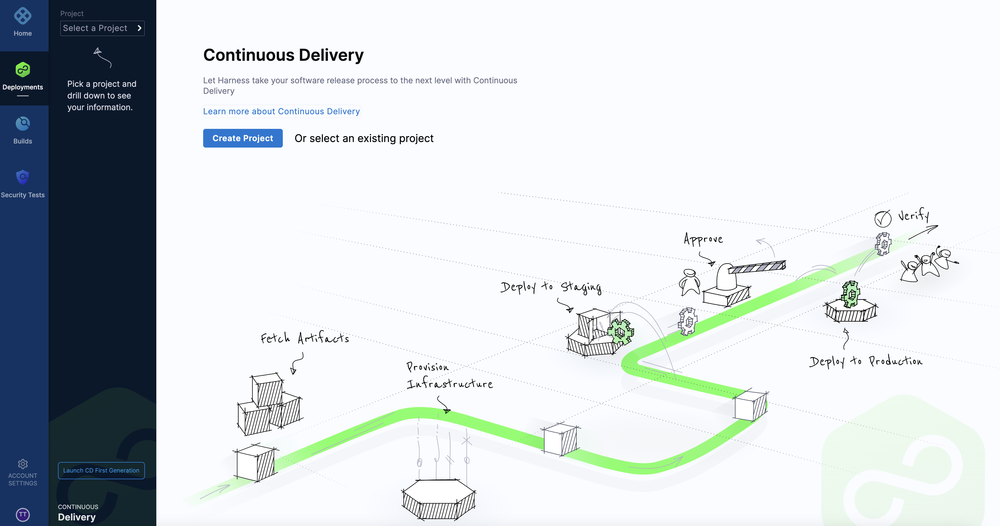
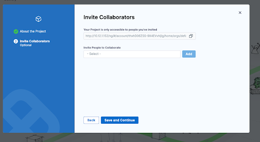

Once you’ve completed the basic setup or installed the Self-Managed Enterprise Edition, the next step is to create your first account. This process begins by setting up the admin account, which will serve as the primary point of access and control for your system. 

## Create your Harness account

You create your Harness account the first time you use Harness Self-Managed Enterprise Edition. You are automatically assigned the Harness user role, **Account Admin**.

To create your Harness account, do the following:

1. On the Harness **Sign up** page, enter your email address and a secure password.

2. Select **Sign up**.

   After your account is created, you arrive at the **Continuous Delivery** start page.

   

## Create your first project

To create a project, do the following:

1. From the **Continuous Delivery** start page, select **Create Project**.

   

2. In **Invite Collaborators**, type of the names of the collaborators you want to invite.

    

3. Enter the project name, and optionally enter a description and tags for your project.

   

4. Select **Setup Later**.

### Next steps

To get started with Harness Self-Managed Enterprise Edition, go to the following Harness module topics:

* Harness CCM: [Cloud Cost Management (CCM) overview](/docs/cloud-cost-management/get-started/overview).
* Harness CI: [Continuous Integration (CI) overview](/docs/continuous-integration/get-started/overview).
* Harness CD: [Continuous Delivery (CD) key concepts](../../continuous-delivery/get-started/key-concepts.md).
* Harness FF: [Feature Flag (FF) onboarding guide](/docs/feature-flags/get-started/onboarding-guide).
* Harness STO: [Security Testing Orchestration (STO) overview](../../security-testing-orchestration/get-started/overview.md).
* Harness Chaos Engineering: [Get started with Harness Chaos Engineering (CE)](/docs/chaos-engineering/concepts/chaos101).

### Self-Managed Enterprise Edition Release cadence
Harness releases Self-Managed Enterprise Edition on a monthly basis. Additionally, periodic hot-fixes are released as needed.
