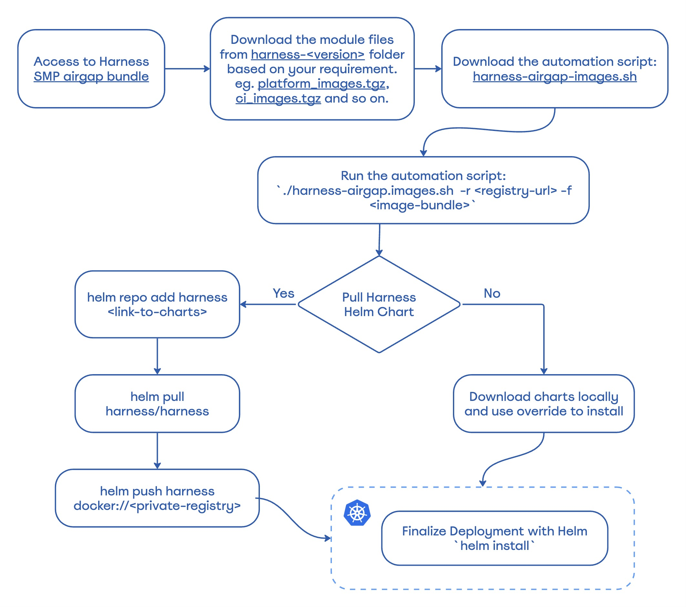
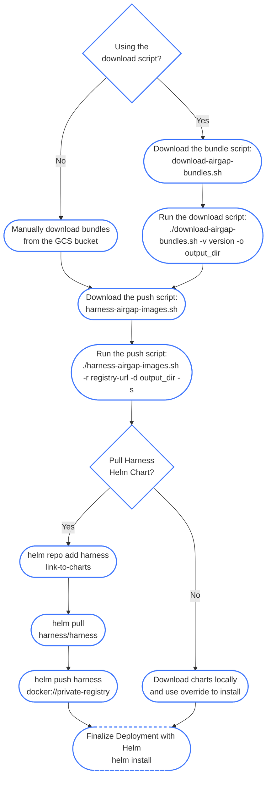

import Tabs from '@theme/Tabs';
import TabItem from '@theme/TabItem';

<DocsTag  backgroundColor= "#4279fd" text="Harness Paid Plan Feature"  textColor="#ffffff"/>

This topic explains how to use Helm to install the Harness Self-Managed Enterprise Edition in an air-gapped environment and how to obtain and transfer Docker images to a private registry with secure access. The steps include pulling Docker images, saving images as .tgz files, uploading to Google Cloud storage, downloading Helm charts, and pushing charts to your private repositories. This process ensures secure and seamless deployment of the Harness Self-Managed Enterprise Edition in restricted, offline environments.

Air-gapped environments are characterized by a lack of direct access to the internet, which provides an added layer of security for sensitive data and systems. This isolation poses unique challenges to deploy and update software applications, as standard methods of accessing resources, such as Docker images, are not possible.

Harness Self-Managed Enterprise Edition is designed to cater to various deployment scenarios, including an air-gapped environment. To facilitate this, the platform provides a secure and efficient method for obtaining and transferring Docker images to a private registry. This ensures that you can access, download, and push the required resources within your restricted network.

## Workstation requirements

- A minimum of 150GB of free disk space to download and extract the Harness airgap bundle

- ECR/GCR/private registry details to tag and push images

- Kubernetes cluster

- Latest version of Helm

- Access to Helm charts or [download locally](https://github.com/harness/helm-charts/releases)

- Access to [the Harness airgap bundle on GCP](https://console.cloud.google.com/storage/browser/smp-airgap-bundles;tab=objects?pageState=(%22StorageObjectListTable%22:(%22f%22:%22%255B%255D%22))&prefix=&forceOnObjectsSortingFiltering=false&pli=1)

- [Kubernetes Version](/docs/self-managed-enterprise-edition/smp-supported-platforms#supported-kubernetes-versions) Compatible with Harness SMP.

## Required images

If your cluster is in an air-gapped environment, your deployment requires the [latest container images](https://github.com/harness/helm-charts/releases).

<Tabs defaultValue="0.38">
  <TabItem value="0.37" label="Version 0.37.x and earlier">

## Installation workflow

The flowchart below shows the air-gapped environment installation workflow steps.



## Download required files

To begin your installation, download the following files:
- [Harness air gap image bundle](https://console.cloud.google.com/storage/browser/smp-airgap-bundles)

   With each Self-Managed Enterprise Edition release, Harness adds individual module image files to the air gap image bundle. You can download module `*.tgz` files for the modules you want to deploy. For example, if you only want to deploy Harness Platform, download the `platform-images.tgz` file. Available image files are:

     - Chaos Engineering: `ce_images.tgz`
     - Cloud Cost Management: `ccm_images.tgz`
     - Continuous Delivery & GitOps NextGen: `cdng_images.tgz`
     - Continuous Integration: `ci_images.tgz`
     - Feature Flags: `ff_images.tgz`
     - Harness Platform: `platform_images.tgz`
     - Security Testing Orchestration: `sto_images.tgz`
     - Software Supply Chain Assurance: `ssca_images.tgz`


   :::note 
   The `platform-images.tgz` file includes NextGen dashboards and policy management enabled by default. The `cdng-images.tgz` file includes GitOps by default.
   :::

- Harness airgap images [harness-airgap-images.sh](https://storage.googleapis.com/smp-airgap-bundles/harness-airgap-images.sh)

## Set Docker architecture

Air-gapped environment installation requires Docker build architecture amd64.

Run the following command before you save Docker images to your private registry.

 ```
 export DOCKER_DEFAULT_PLATFORM=linux/amd64
```

## Save Docker images to your private registry

To save Docker images, do the following:

1. Sign in to your private registry.
    ```
    #Authenticate with Docker for Docker Registry
    docker login <registry-url>

    #Authenticate with Google Cloud Platform for GCR
    gcloud auth login

    #Authenticate with AWS for ECR
    aws ecr get-login-password --region <region> | docker login --username AWS --password-
    ```
    All Docker files required to deploy Harness are stored in the [Harness Airgap bundles](https://console.cloud.google.com/storage/browser/smp-airgap-bundles).
2. Add the `*.tgz` for each module you want to deploy to your air-gapped network. You can now push your images locally.
3. Run `harness-airgap-images.sh`.
    ```
    ./harness-airgap-images.sh -r REGISTRY.YOURDOMAIN.COM:PORT -f <moduleName-images.tgz>
    ````

  </TabItem>
  <TabItem value="0.38" label="Version 0.38.x and later">

This guide outlines the workflow for downloading Harness Self-Managed Platform (SMP) airgap bundles and pushing them to your private container registry. This process is essential for installing Harness in environments without direct internet access.

## Installation workflow

The flowchart below shows the updated air-gapped environment installation workflow steps for version 0.38.x and later.



## 1. Airgap Bundle Structure

The Harness airgap bundles have been restructured to provide more flexibility and granular control over downloads. The components are categorized into **Control Plane** (Modules) and **Execution Plane** (Plugins/Agents).

### Modules (Control Plane)
Modules contain the core services required to run the Harness platform.
*   **Description**: All images for a module are packaged in a single `.tgz` file.
*   **Examples**: `platform`, `ci`, `sto`, `cdng`.
*   **Dependency**: Some modules depend on others (e.g., `ci` requires `platform`). The download tool automatically resolves these dependencies.

### Plugins (Execution Plane)
These are optional add-ons required for specific execution capabilities.
*   **Description**: All images for a module's plugin set are packaged in a single `.tgz` file.
*   **Examples**: `ci-plugins` (contains all CI plugins like drone-git, kaniko).
*   **Usage**: You must explicitly select these if you need the functionality they provide.

### Agents (Execution Plane)
Standalone components that run in your infrastructure to execute tasks.
*   **Description**: Each agent image is packaged in its own `.tgz` file.
*   **Examples**: `delegate`, `upgrader`.
*   **Note**: CD Agents are packaged in the `cdng-agents` in a single `.tgz` file.
*   **Variants**: Agents often have variants like `delegate-fips` or `delegate.minimal`. You can select exactly the variant you need.

### STO Scanners (Execution Plane)
Security scanners used by the STO module.
*   **Description**: Each scanner image is packaged in its own `.tgz` file.
*   **Examples**: `grype-job-runner`, `trivy-job-runner`.
*   **Usage**: Select only the scanners you intend to use.

---

## 2. The `images.txt` File

The `images.txt` file (found in the release) is now structured with Markdown-style headers to help you identify which images belong to which module.

**Example Format:**
```text
## Core Platform Services
docker.io/harness/platform-service-signed:1.107.0
...

### Platform Agents
docker.io/harness/delegate:26.02.88404
...

## Continuous Integration
docker.io/harness/ci-manager-signed:1.120.5
...

### CI Build Plugins
plugins/kaniko:1.13.3
...
```
This structure mirrors the bundle organization, making it easy to verify the contents of each module.

---

## 3. Downloading Bundles

Use the `download-airgap-bundles.sh` utility to download the required components.

### Available Flags

*   `-v, --version`: Specify the Harness version (e.g., `0.38.0`).
*   `-o, --output`: Directory to save the downloaded bundles.
*   `-b, --bundles`: Comma-separated list of specific bundles to download.
*   `-l, --list`: List all available modules, plugins, agents, and scanners for a specific version.
*   `-g, --generate`: Generate a configuration file with your selections.
*   `-s, --selection`: Use a previously generated configuration file.
*   `-n, --non-interactive`: Run in non-interactive mode without prompts.

### Usage Modes

#### List Available Bundles
You can list all available modules, plugins, agents, scanners for a specific version:

```bash
./download-airgap-bundles.sh -v <VERSION> --list
```

#### Interactive Mode (Recommended for first time)
Run the script without the `-b` / `--bundles` flag to enter the interactive menu.

```bash
./download-airgap-bundles.sh -v 0.38.0 -o ./airgap-bundles
```

**Workflow:**
1.  **Select Modules**: Choose the core modules (e.g., `platform`, `ci`). Dependencies are auto-selected.
2.  **Select Plugins/Agents/Scanners**: Choose optional components (e.g., `ci-plugins`, `delegate`, `grype-job-runner`).

:::note
In interactive mode, the menus for Plugins/Agents are filtered based on the Modules you selected in Step 1. You cannot interactively download *only* a plugin or agent without selecting its parent module. Use Non-Interactive mode for that.
:::

#### Non-Interactive Mode (Automation)
Use the `-b` / `--bundles` flag to specify a comma-separated list of any components you want.

:::info Key Benefit
You can download *any* component directly, including just agents or plugins, without downloading the full platform module.
:::

**Examples:**

*   **Download CI module, CI plugins, and Delegate:**
    ```bash
    ./download-airgap-bundles.sh -v 0.38.0 -o ./bundles -b ci,ci-plugins,delegate -n
    ```

*   **Download ONLY the Delegate (Standalone):**
    ```bash
    ./download-airgap-bundles.sh -v 0.38.0 -o ./bundles -b delegate -n
    ```

#### Selection File
You can generate a configuration file to save your selection for future use.

1.  **Generate**: Run the interactive UI but save to a file instead of downloading.
    ```bash
    ./download-airgap-bundles.sh -v 0.38.0 -g my-selection.conf
    ```
2.  **Use**: Feed the file back to the script.
    ```bash
    ./download-airgap-bundles.sh -v 0.38.0 -o ./bundles -s my-selection.conf
    ```

#### Manual Download (Advanced)

If you cannot use the download script, you can manually download the bundles from the GCS bucket.

**Bucket URL**: `https://storage.googleapis.com/smp-airgap-bundles/harness-<VERSION>/<PATH>`

*   **Modules**: `<module>/<module>_images.tgz`
    *   Example: `https://storage.googleapis.com/smp-airgap-bundles/harness-0.38.0/platform/platform_images.tgz`
*   **Plugins**: `<module>/plugins/<plugin-bundle>_images.tgz`
    *   Example: `https://storage.googleapis.com/smp-airgap-bundles/harness-0.38.0/ci/plugins/ci-plugins_images.tgz`
*   **Agents**: `<module>/agents/<agent>.tgz`
    *   Example: `https://storage.googleapis.com/smp-airgap-bundles/harness-0.38.0/platform/agents/delegate.tgz`
*   **Scanners**: `sto/scanners/<scanner>.tgz`
    *   Example: `https://storage.googleapis.com/smp-airgap-bundles/harness-0.38.0/sto/scanners/grype-job-runner.tgz`

---

## 4. Directory Structure

The download script organizes files hierarchically based on the module structure. This makes manual navigation intuitive.

**Example Structure:**
```text
airgap-bundles/
├── platform/
│   └── platform_images.tgz          # Core Platform Module
├── platform/agents/
│   ├── delegate.tgz                 # Delegate Agent
│   └── upgrader.tgz                 # Upgrader Agent
├── ci/
│   └── ci_images.tgz                # CI Module
├── ci/plugins/
│   └── ci-plugins_images.tgz        # CI Plugins
├── sto/
│   └── sto_images.tgz               # STO Module
├── sto/scanners/
│   ├── grype-job-runner.tgz         # Grype Scanner
│   └── ...
└── ...
```

---

## 5. Pushing Images to Registry

Use the `harness-airgap-images.sh` script to push the downloaded bundles to your private registry.

### New Feature: Skopeo Support (Faster Pushes)
The script now supports `skopeo`, a tool that copies images between registries without requiring a Docker daemon.

:::info Benefit
We have observed up to a **40% reduction** in push time compared to `docker load` + `docker push`.
:::

*   **Requirements**: `skopeo` and `jq` must be installed on your machine.
*   **Usage**: Add the `-s` flag.

### Usage
```bash
./harness-airgap-images.sh -r <REGISTRY_URL> [-f <FILE> | -d <DIRECTORY>] [OPTIONS]
```

*   `-r`: Target registry (e.g., `my-registry.com/harness`).
*   `-d`: Directory to process recursively (recommended).
*   `-s`: **Use Skopeo mode** (falls back to Docker if unavailable).
*   `-c`: Cleanup local docker images after pushing (Docker mode only).
*   `-n`: Non-interactive mode (skips optional prompts like Looker).

### Examples

**Push all bundles using Skopeo (Recommended):**
```bash
./harness-airgap-images.sh -r my-registry.com/harness -d ./airgap-bundles -s
```

**Push using Docker (Legacy/Fallback):**
```bash
./harness-airgap-images.sh -r my-registry.com/harness -d ./airgap-bundles -c
```

### Optional: Looker (ng-dashboard)
The script may prompt you to download the `ng-dashboard` (Looker) image. This image is **not** in the bundles and is pulled directly from DockerHub.
*   **Interactive**: You will be prompted for DockerHub credentials.
*   **Non-Interactive (`-n`)**: This step is skipped automatically.

:::note
Contact Harness Support if you need DockerHub credentials for the Looker image.
:::

  </TabItem>
</Tabs>

## Download and push Helm charts
After you save Docker images to your private registry, you must download the Helm charts and push them to your repository.

To download and push Helm charts:

You can use Helm to pull the chart and push it to your private repository or download the chart directly.

-
    ```
    helm repo add harness https://harness.github.io/helm-charts
    helm pull harness/harness
    helm push harness docker://private-repo
    ```

To download the Helm chart:

 - Download the chart from the [Harness repository](https://github.com/harness/helm-charts/releases).

## Install via Helm
Next, you are ready to install via Helm by updating your `override.yaml` file with your private registry information.

To install via Helm, do the following:

1. Update the `override.yaml` file with your private registry information.

    ```yaml
    global:
      airgap: true
      imageRegistry: "private-123.com"
    ```
2. Run the Helm install command.

    ```
    helm install my-release harness/harness -n <namespace> -f override.yaml
    ```
