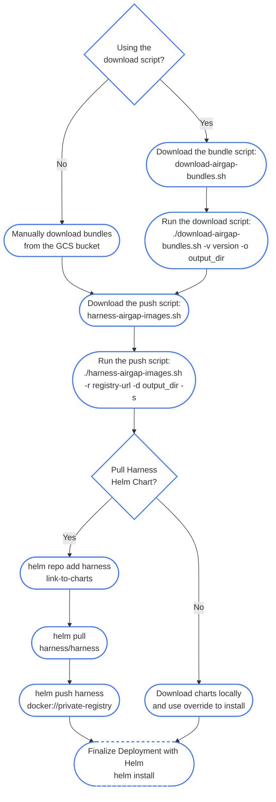

import Tabs from '@theme/Tabs';
import TabItem from '@theme/TabItem';

<DocsTag  backgroundColor= "#4279fd" text="Harness Paid Plan Feature"  textColor="#ffffff"/>

This topic explains how to use Helm to install the Harness Self-Managed Enterprise Edition in an air-gapped environment and how to obtain and transfer Docker images to a private registry with secure access. The steps include pulling Docker images, saving images as .tgz files, uploading to Google Cloud storage, downloading Helm charts, and pushing charts to your private repositories. This process ensures secure and seamless deployment of the Harness Self-Managed Enterprise Edition in restricted, offline environments.

Air-gapped environments are characterized by a lack of direct access to the internet, which provides an added layer of security for sensitive data and systems. This isolation poses unique challenges to deploy and update software applications, as standard methods of accessing resources, such as Docker images, are not possible.

Harness Self-Managed Enterprise Edition is designed to cater to various deployment scenarios, including an air-gapped environment. To facilitate this, the platform provides a secure and efficient method for obtaining and transferring Docker images to a private registry. This ensures that you can access, download, and push the required resources within your restricted network.

## Workstation requirements

- A minimum of 150GB of free disk space to download and extract the Harness airgap bundle

- ECR/GCR/private registry details to tag and push images

- Kubernetes cluster

- Latest version of Helm

- Access to Helm charts or [download locally](https://github.com/harness/helm-charts/releases)

- Access to [the Harness airgap bundle on GCP](https://console.cloud.google.com/storage/browser/smp-airgap-bundles;tab=objects?pageState=(%22StorageObjectListTable%22:(%22f%22:%22%255B%255D%22))&prefix=&forceOnObjectsSortingFiltering=false&pli=1)

- [Kubernetes Version](/docs/self-managed-enterprise-edition/smp-supported-platforms#supported-kubernetes-versions) Compatible with Harness SMP.

## Required images

If your cluster is in an air-gapped environment, your deployment requires the [latest container images](https://github.com/harness/helm-charts/releases).

<Tabs defaultValue="0.38">
  <TabItem value="0.37" label="Version 0.37.x and earlier">

## Installation workflow

The flowchart below shows the air-gapped environment installation workflow steps.


## Download required files

To begin your installation, download the following files:
- [Harness air gap image bundle](https://console.cloud.google.com/storage/browser/smp-airgap-bundles)

   With each Self-Managed Enterprise Edition release, Harness adds individual module image files to the air gap image bundle. You can download module `*.tgz` files for the modules you want to deploy. For example, if you only want to deploy Harness Platform, download the `platform-images.tgz` file. Available image files are:

     - Chaos Engineering: `ce_images.tgz`
     - Cloud Cost Management: `ccm_images.tgz`
     - Continuous Delivery & GitOps NextGen: `cdng_images.tgz`
     - Continuous Integration: `ci_images.tgz`
     - Feature Flags: `ff_images.tgz`
     - Harness Platform: `platform_images.tgz`
     - Security Testing Orchestration: `sto_images.tgz`
     - Software Supply Chain Assurance: `ssca_images.tgz`


   :::note 
   The `platform-images.tgz` file includes NextGen dashboards and policy management enabled by default. The `cdng-images.tgz` file includes GitOps by default.
   :::

- Harness airgap images [harness-airgap-images.sh](https://storage.googleapis.com/smp-airgap-bundles/harness-airgap-images.sh)

## Set Docker architecture

Air-gapped environment installation requires Docker build architecture amd64.

Run the following command before you save Docker images to your private registry.

 ```
 export DOCKER_DEFAULT_PLATFORM=linux/amd64
```

## Save Docker images to your private registry

To save Docker images, do the following:

1. Sign in to your private registry.
    ```
    #Authenticate with Docker for Docker Registry
    docker login <registry-url>

    #Authenticate with Google Cloud Platform for GCR
    gcloud auth login

    #Authenticate with AWS for ECR
    aws ecr get-login-password --region <region> | docker login --username AWS --password-
    ```
    All Docker files required to deploy Harness are stored in the [Harness Airgap bundles](https://console.cloud.google.com/storage/browser/smp-airgap-bundles).
2. Add the `*.tgz` for each module you want to deploy to your air-gapped network. You can now push your images locally.
3. Run `harness-airgap-images.sh`.
    ```
    ./harness-airgap-images.sh -r REGISTRY.YOURDOMAIN.COM:PORT -f <moduleName-images.tgz>
    ````

  </TabItem>
  <TabItem value="0.38" label="Version 0.38.x and later">

This guide walks you through downloading Harness Self-Managed Enterprise Edition airgap bundles and pushing them to your private container registry. You'll need to do this if your installation environment lacks direct internet access.

## Download the scripts

Before starting the installation workflow, download the required scripts:

```bash
# Download the download-airgap-bundles.sh and harness-airgap-images.sh scripts
curl -f -s -L -o download-airgap-bundles.sh https://raw.githubusercontent.com/harness/helm-charts/refs/heads/main/src/airgap/download-airgap-bundles.sh
curl -f -s -L -o harness-airgap-images.sh https://raw.githubusercontent.com/harness/helm-charts/refs/heads/main/src/airgap/harness-airgap-images.sh

# Make the scripts executable
chmod +x download-airgap-bundles.sh
chmod +x harness-airgap-images.sh
```

## Installation workflow

The flowchart below shows the air-gapped environment installation workflow for version 0.38.x and later.



## Step 1: Download the airgap bundles

Harness groups airgap components into core modules (like the platform itself) and execution components (like delegates and plugins). This lets you download exactly what you need.

*   **Modules:** Core platform services (like `platform`, `ci`, `sto`). Packaged as single `.tgz` files. The download tool automatically resolves dependencies between them.
*   **Plugins:** Optional add-ons for specific tasks (like `ci-plugins`).
*   **Agents:** Standalone execution components (like `delegate` or `upgrader`).
*   **Scanners:** Security scanners for the STO module (like `grype-job-runner`).

Use the `download-airgap-bundles.sh` script to fetch these components. You can run it interactively, pass flags for automation, or download files manually.

### Interactive mode (Recommended)

If this is your first time, run the script without specifying any bundles to use the interactive menu.

```bash
./download-airgap-bundles.sh -v 0.38.0 -o ./airgap-bundles
```

1.  **Select modules:** Choose the modules you need (such as `cd` or `ci`). The script automatically selects any required dependencies.
2.  **Select plugins, agents, and scanners:** Choose the optional components you want to include. The menu only shows options relevant to the modules you selected in the previous step.

:::tip
Want to save your selections for later or use them in automated workflows? Run the script with the `-g` flag to generate a configuration file:
`./download-airgap-bundles.sh -v 0.38.0 -g my-selection.conf`

You can then use this file in the future (or in your automation scripts) with the `-s` flag:
`./download-airgap-bundles.sh -v 0.38.0 -o ./bundles -s my-selection.conf`
:::

### Non-interactive mode (Automation)

For automated setups, use the `-b` (or `--bundles`) flag to pass a comma-separated list of the exact components you want. This is useful if you only need to update a specific agent or plugin without downloading the entire platform.

**Example: Download the CI module, CI plugins, and delegate**
```bash
./download-airgap-bundles.sh -v 0.38.0 -o ./bundles -b ci,ci-plugins,delegate -n
```

**Example: Download only the delegate**
```bash
./download-airgap-bundles.sh -v 0.38.0 -o ./bundles -b delegate -n
```

### Manual download

If you can't use the download script, you can manually download the bundles using `gsutil` or `curl`. You can explore the bundles directly in the [Harness airgap bundle directory](https://console.cloud.google.com/storage/browser/smp-airgap-bundles).

**Bundle URL Structure**: `https://app.harness.io/public/harness-airgap-bundle/harness-<VERSION>/<PATH>/<MODULE>/[<PLUGIN>|<AGENT>|<SCANNERS>]/<bundle-name>_images.tgz`

*   **Modules:** `<MODULE>/<bundle-name>_images.tgz`
    *   Example: `https://app.harness.io/public/harness-airgap-bundle/harness-0.38.0/platform/platform_images.tgz`
*   **Plugins:** `<module>/plugins/<plugin-bundle>_images.tgz`
    *   Example: `https://app.harness.io/public/harness-airgap-bundle/harness-0.38.0/ci/plugins/ci-plugins_images.tgz`
*   **Agents:** `<module>/agents/<agent>.tgz`
    *   Example: `https://app.harness.io/public/harness-airgap-bundle/harness-0.38.0/platform/agents/delegate.tgz`
*   **Scanners:** `sto/scanners/<scanner>.tgz`
    *   Example: `https://app.harness.io/public/harness-airgap-bundle/harness-0.38.0/sto/scanners/grype-job-runner.tgz`

<details>
  <summary>Option 1: Using `gsutil`</summary>
    <p>
      For `gsutil` installation instructions, go to [Install gsutil](https://cloud.google.com/storage/docs/gsutil_install) in the Google Cloud documentation.
      ```bash
      gsutil -m cp \
        "gs://smp-airgap-bundles/harness-0.38.0/platform/platform_images.tgz" \
        "gs://smp-airgap-bundles/harness-0.38.0/ci/plugins/ci-plugins_images.tgz" \
        "gs://smp-airgap-bundles/harness-0.38.0/platform/agents/delegate.tgz" \
        "gs://smp-airgap-bundles/harness-0.38.0/sto/scanners/grype-job-runner.tgz" \
        .
      ```
    </p>
</details>

<details>
  <summary>Option 2: Using `curl`</summary>
    <p>
        You can also download the images directly using curl:
        ```bash
        curl -f -s -L -o smp-airgap-bundles/platform_images.tgz https://app.harness.io/public/harness-airgap-bundle/harness-0.38.0/platform/platform_images.tgz
        curl -f -s -L -o smp-airgap-bundles/ci-plugins_images.tgz https://app.harness.io/public/harness-airgap-bundle/harness-0.38.0/ci/plugins/ci-plugins_images.tgz
        curl -f -s -L -o smp-airgap-bundles/delegate.tgz https://app.harness.io/public/harness-airgap-bundle/harness-0.38.0/platform/agents/delegate.tgz
        curl -f -s -L -o smp-airgap-bundles/grype-job-runner.tgz https://app.harness.io/public/harness-airgap-bundle/harness-0.38.0/sto/scanners/grype-job-runner.tgz
      ```
    </p>
</details>

### Available bundles reference

Below is a reference list of the available bundle paths (`bucket_path`) for the different modules and components. When constructing your manual download URLs, replace `<bundle-name>` with the bundle key (e.g. `platform`, `cdng`).

| Bundle | Type | Full Path |
| :--- | :--- | :--- |
| **Platform** | Module | `harness-<VERSION>/platform/platform_images.tgz` |
| **Platform Agents** | Agent | `harness-<VERSION>/platform/agents/`[`<agent>.tgz`](#available-single-bundles) |
| **Dashboard** | Module | `harness-<VERSION>/dashboard/dashboard_images.tgz` |
| **Continuous Deployment (cdng)** | Module | `harness-<VERSION>/cdng/cdng_images.tgz` |
| **CD Agents** | Agent | `harness-<VERSION>/cdng/agents/cdng-agents_images.tgz` |
| **Continuous Integration (ci)** | Module | `harness-<VERSION>/ci/ci_images.tgz` |
| **CI Plugins** | Plugin | `harness-<VERSION>/ci/plugins/ci-plugins_images.tgz` |
| **Security Testing Orchestration (sto)** | Module | `harness-<VERSION>/sto/sto_images.tgz` |
| **STO Scanners** | Scanner | `harness-<VERSION>/sto/scanners/`[`<scanner>.tgz`](#available-single-bundles) |
| **Feature Flags (ff)** | Module | `harness-<VERSION>/ff/ff_images.tgz` |
| **Cloud Cost Management (ccm)** | Module | `harness-<VERSION>/ccm/ccm_images.tgz` |
| **Chaos Engineering (ce)** | Module | `harness-<VERSION>/ce/ce_images.tgz` |
| **Chaos Plugins** | Plugin | `harness-<VERSION>/ce/plugins/ce-plugins_images.tgz` |
| **Supply Chain Security (ssca)** | Module | `harness-<VERSION>/ssca/ssca_images.tgz` |
| **SCS Plugins** | Plugin | `harness-<VERSION>/ssca/plugins/ssca-plugins_images.tgz` |
| **Database DevOps (dbdevops)** | Module | `harness-<VERSION>/dbdevops/dbdevops_images.tgz` |
| **Code Repository (code)** | Module | `harness-<VERSION>/code/code_images.tgz` |
| **Infrastructure as Code Management (iacm)** | Module | `harness-<VERSION>/iacm/iacm_images.tgz` |
| **IACM Plugins** | Plugin | `harness-<VERSION>/iacm/plugins/iacm-plugins_images.tgz` |
| **Internal Developer Portal (idp)** | Module | `harness-<VERSION>/idp/idp_images.tgz` |
| **IDP Plugins** | Plugin | `harness-<VERSION>/idp/plugins/idp-plugins_images.tgz` |

#### Available single bundles

The following components are packaged as individual single bundles (`.tgz`), rather than a combined bundle:

**Platform Agents:**
*   `delegate.tgz`
*   `upgrader.tgz`

**STO Scanners:**
*   `anchore-job-runner.tgz`
*   `aqua-security-job-runner.tgz`
*   `aqua-trivy-job-runner.tgz`
*   `aws-ecr-job-runner.tgz`
*   `aws-security-hub-job-runner.tgz`
*   `bandit-job-runner.tgz`
*   `blackduckhub-job-runner.tgz`
*   `brakeman-job-runner.tgz`
*   `burp-job-runner.tgz`
*   `checkmarx-job-runner.tgz`
*   `checkov-job-runner.tgz`
*   `docker-content-trust-job-runner.tgz`
*   `fossa-job-runner.tgz`
*   `github-advanced-security-job-runner.tgz`
*   `gitleaks-job-runner.tgz`
*   `grype-job-runner.tgz`
*   `modelscan-job-runner.tgz`
*   `nexusiq-job-runner.tgz`
*   `nikto-job-runner.tgz`
*   `nmap-job-runner.tgz`
*   `osv-job-runner.tgz`
*   `owasp-dependency-check-job-runner.tgz`
*   `prowler-job-runner.tgz`
*   `semgrep-job-runner.tgz`
*   `shiftleft-job-runner.tgz`
*   `snyk-job-runner.tgz`
*   `sonarqube-agent-job-runner.tgz`
*   `sysdig-job-runner.tgz`
*   `traceable-job-runner.tgz`
*   `twistlock-job-runner.tgz`
*   `veracode-agent-job-runner.tgz`
*   `whitesource-agent-job-runner.tgz`
*   `wiz-job-runner.tgz`
*   `zap-job-runner.tgz`

:::info Note
Ensure that the `smp-airgap-bundles/` directory exists before running the command.
:::

## Step 2: Verify your downloads (Optional)

The download script automatically organizes your files into a clear folder hierarchy based on the module structure.

**Example directory structure:**
```text
airgap-bundles/
├── platform/
│   └── platform_images.tgz          # Core Platform Module
├── platform/agents/
│   ├── delegate.tgz                 # Delegate Agent
│   └── upgrader.tgz                 # Upgrader Agent
├── ci/
│   └── ci_images.tgz                # CI Module
├── ci/plugins/
│   └── ci-plugins_images.tgz        # CI Plugins
├── sto/
│   └── sto_images.tgz               # STO Module
├── sto/scanners/
│   ├── grype-job-runner.tgz         # Grype Scanner
│   └── ...
└── ...
```

If you need to verify the exact images contained within each module, refer to the `images.txt` file included in the Harness release notes. It uses headers to group images by their corresponding module, matching the bundle structure above.

## Step 3: Push images to your registry

Now that you have the bundles locally, use the `harness-airgap-images.sh` script to push them to your private container registry.

We highly recommend using the script's Skopeo mode for this step. Skopeo copies images directly between registries without requiring a Docker daemon, which can reduce push times by up to 50%%.

### Push using Skopeo mode (Recommended)

**Prerequisites:** You must have `skopeo` and `jq` installed on your machine.

Add the `-s` flag to enable Skopeo mode. Point the script to your target registry and the directory containing your downloaded bundles.

```bash
./harness-airgap-images.sh -r my-registry.com/harness -d ./airgap-bundles -s
```

### Push using Docker (Fallback)

If Skopeo isn't an option for your environment, you can run the script without the `-s` flag. It will default to using standard Docker commands (`docker load` and `docker push`). We recommend adding the `-c` flag to automatically clean up local Docker images after they are pushed, which helps save disk space.

```bash
./harness-airgap-images.sh -r my-registry.com/harness -d ./airgap-bundles -c
```

### Handling the Looker image

During the push process, the script might prompt you to download the `ng-dashboard` (Looker) image. This specific image isn't included in the standard airgap bundles and must be pulled directly from DockerHub.

*   **Interactive mode:** The script pauses and asks for your DockerHub credentials.
*   **Non-interactive mode:** If you run the script with the `-n` flag, it automatically skips this step.

:::note
If you need DockerHub credentials for the Looker image, please contact Harness Support.
:::

## Script reference

### download-airgap-bundles.sh

Use this script to fetch airgap bundles.

| Flag | Description |
| :--- | :--- |
| `-v` | Harness version to download (e.g., `0.38.0`). |
| `-o` | Output directory for the downloaded bundles. |
| `-b` / `--bundles` | Comma-separated list of bundles to download (e.g., `ci,delegate`). |
| `-g` | Generate a configuration file with your interactive selections. |
| `-s` | Use a previously generated configuration file. |
| `-n` | Run in non-interactive mode. |

### harness-airgap-images.sh

Use this script to push downloaded bundles to your private container registry.

| Flag | Description |
| :--- | :--- |
| `-r` | Target private container registry URL. |
| `-d` | Directory containing the downloaded bundles. |
| `-s` | Enable Skopeo mode for faster transfers without a Docker daemon. |
| `-c` | Automatically clean up local Docker images after pushing (used when Skopeo is not enabled). |
| `-n` | Run in non-interactive mode. |

  </TabItem>
</Tabs>

## Download and push Helm charts
After you save Docker images to your private registry, you must download the Helm charts and push them to your repository.

To download and push Helm charts:

You can use Helm to pull the chart and push it to your private repository or download the chart directly.

-
    ```
    helm repo add harness https://harness.github.io/helm-charts
    helm pull harness/harness
    helm push harness docker://private-repo
    ```

To download the Helm chart:

 - Download the chart from the [Harness repository](https://github.com/harness/helm-charts/releases).

## Install via Helm
Next, you are ready to install via Helm by updating your `override.yaml` file with your private registry information.

To install via Helm, do the following:

1. Update the `override.yaml` file with your private registry information.

    ```yaml
    global:
      airgap: true
      imageRegistry: "private-123.com"
    ```
2. Run the Helm install command.

    ```
    helm install my-release harness/harness -n <namespace> -f override.yaml
    ```
