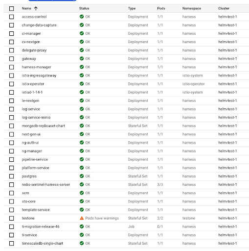

import Tabs from '@theme/Tabs';
import TabItem from '@theme/TabItem';

<DocsTag  backgroundColor= "#4279fd" text="Harness Paid Plan Feature"  textColor="#ffffff"/>

This document explains how to use Helm to install, upgrade, or uninstall Harness Self-Managed Enterprise Edition. This document describes an installation on Google Kubernetes Engine (GKE). The same installation process, however, applies to installations on Kubernetes versions 1.*x* and later.

Helm package manager provides a declarative approach to Kubernetes application management in which software packages are specified as "charts." For more information, go to the [Helm documentation](https://helm.sh/docs/).

## Helm client version compatibility

Harness validates Helm client compatibility against the following versions:

- 3.9.4
- 3.10.3
- 3.11.3
- 3.12.3
- 3.13.3
- 3.14.2

:::info note
You can also install Harness Self-Managed Enterprise Edition in an air-gapped environment. For more information, go to [Install in air-gapped environment](/docs/self-managed-enterprise-edition/install/install-in-an-air-gapped-environment).
:::

## Role requirements

The account you use to install Harness Self-Managed Enterprise Edition must have the Account Admin role to create service accounts. For more information on role-based permissions, go to [RBAC in Harness](/docs/platform/role-based-access-control/rbac-in-harness).

## Download the Harness Helm chart

To download the Harness Helm chart for the installation of Self-Managed Enterprise Edition, go to the [Harness Helm chart repo](https://github.com/harness/helm-charts/releases).

Harness Helm charts are available for demonstration and production environments.

## Update the override.yaml file

Helm chart values, default value definitions, and field descriptions are available in the [Harness Helm chart repo](https://github.com/harness/helm-charts#values).

Depending on your target environment, you'll need to update the `override.yaml` file to specify a load balancer or to specify the Harness modules to be deployed.

### Add a load balancer

You can use either Istio or Nginx as your ingress controller based on your specific technical requirements. Harness Self-Managed Enterprise Edition integrates with your chosen solution, providing enhanced traffic management, security, and streamlined DevOps workflows.

Use the following procedure to add a load balancer.

<Tabs>
<TabItem value="NLB" label="NLB" default>

To add the URL for a load balancer, do the following:

1. In the `values.yaml` file, set the `global.loadbalancerURL` field to the URL of your load balancer. This is the URL you use for Harness.

   ```
   global:
    # -- Harness Application URL
    loadbalancerURL: http://<load-balancer-IP-address>
   ```

2. Set the `host_name` field to the IP address of the load balancer.

3. Save the file.

</TabItem>

<!---
<TabItem value="ELB" label="ELB">

</TabItem>

--->

<TabItem value="Ingress ALB" label="Ingress ALB">

To an ingress ALB, do the following:

1. Copy the following YAML, then save it to an `ingress-alb.yaml` file.

   ```yaml
   apiVersion: networking.k8s.io/v1
   kind: Ingress
   metadata:
     annotations:
       alb.ingress.kubernetes.io/backend-protocol: HTTP
       alb.ingress.kubernetes.io/inbound-cidrs: 10.0.0.0/8
       alb.ingress.kubernetes.io/listen-ports: '[{"HTTP":80}]'
       alb.ingress.kubernetes.io/load-balancer-attributes: deletion_protection.enabled=false
       alb.ingress.kubernetes.io/scheme: internal
       alb.ingress.kubernetes.io/ssl-policy: ELBSecurityPolicy-TLS-1-2-Ext-2018-06
       alb.ingress.kubernetes.io/subnets: <subnets>
       alb.ingress.kubernetes.io/target-group-attributes: stickiness.enabled=true,stickiness.lb_cookie.duration_seconds=300
       alb.ingress.kubernetes.io/target-type: ip
       ingress.kubernetes.io/tls-minimum-version: "1.2"
     name: harness-public-ingress
     namespace: harness
   spec:
     ingressClassName: alb
     rules:
     - host: <YOUR_HOST_URL>
       http:
         paths:
         - backend:
             service:
               name: harness-ingress-controller
               port:
                 number: 80
           path: /
           pathType: Prefix
   ```
2. Replace `<YOU_HOST_URL>` with your load balancer's URL.

3. Replace `<YOUR_SUBNETS>` with your subnets.

   This sets traffic to internal only `alb.ingress.kubernetes.io/scheme: internal`.

4. Run the following command.

   ```
   kubectl apply -f ingress-alb.yaml -n <namespace>
   ```

</TabItem>
</Tabs>

### Optional: Configure a vanity URL based on your load balancer

You can use the script provided below to configure a vanity URL based on your load balancer. The script is available in the [Harness Helm chart](https://github.com/harness/helm-charts/blob/main/src/harness/configure-vality-url.sh) and also accessible at the following path within your Helm manifest: `harness/configure-vanity-url.sh`.

#### Prerequisites

Before using this script, ensure the following prerequisites are met:

- You must have a subdomain URL mapped to your load balancer's static IP. The subdomain URL must adhere to one of the following example formats:
  - `http://mysubdomain.mysite.com`
  - `https://mysubdomain.mysite.com`

#### Execution

Execute this script within your cluster environment, providing three argument inputs:

1. Namespace
2. Account ID
3. Subdomain URL

```
if [ "$#" -ne 3 ]; then
    echo "Usage: $0 <namespace> <accountId> <subdomainUrl>"
    exit 1
fi

# Assign the first argument to namespace
namespace="$1"

# Assign the second argument to accountId
accountId="$2"

# Assign the second argument to subdomainUrl
subdomainUrl="$3"

MONGO_PASS=$(kubectl get secret -n $namespace mongodb-replicaset-chart -o jsonpath={.data.mongodb-root-password} | base64 --decode)
kubectl exec -it mongodb-replicaset-chart-0 -n $namespace -- mongo <<EOF
use admin
db.auth('admin', '${MONGO_PASS}')
use gateway
db.account_refs.update({"uuid":"${accountId}"},{\$set:{"subdomainUrl": "${subdomainUrl}"}})
db.account_refs.find()
use harness
db.accounts.update({"_id":"${accountId}"},{\$set:{"subdomainUrl": "${subdomainUrl}"}})
db.accounts.find()
EOF
kubectl patch configmap ng-auth-ui -n $namespace --type merge -p '{"data":{"EXPECTED_HOSTNAME":"app.harness.io"}}'
kubectl rollout restart -n $namespace deployment -l "app.kubernetes.io/name=ng-auth-ui"
```

##### Example command

The example command below executes the `configure-vanity-url.sh` script file for the `mynamespace` namespace, `abc123` account ID, and `http://smp.harnessurl.com` subdomain URL.

```
./configure-vanity-url.sh mynamespace abc123 http://smp.harnessurl.com
```

### Deploy Harness modules

Harness Helm chart includes Harness Platform components. You can add modules by editing the `override.yaml` file.

The Platform component and the module below is enabled by default:

* Harness Continuous Deployment (CD) - Next Generation

The Harness modules below can be enabled or disabled conditionally:

* Harness Chaos Engineering (CE)
* Harness Cloud Cost Management (CCM)
* Harness Continuous Integration (CI)
* Harness Security Testing Orchestration (STO)
* Harness Service Reliability Management (SRM)
* Harness Feature Flags (FF)
* Harness Supply Chain Security (SCS)

You can conditionally disable or enable the modules by specifying a boolean value in the `enabled` field of the YAML:

#### Deploy the CI module

```
ci:
# -- Enable to deploy CI to your cluster
enabled: true
```

#### Deploy the SRM module

```
srm:
# -- Enable to deploy SRM to your cluster
enabled: true
```

#### Deploy the FF module

```
ff:
# -- Enable to deploy FF to your cluster
enabled: true
```

#### Deploy the STO module

```
sto:
# -- Enable to deploy STO to your cluster
enabled: true
```

#### Deploy the CCM module

```
ccm:
# -- Enable to deploy Cloud Cost Management (CCM) to your cluster
enabled: true
```

#### Deploy the CE module

```
chaos:
# -- Enable to deploy Chaos Engineering (CE) to your cluster
enabled: true
```

#### Deploy the SCS module

```
ssca:
# -- Enable to deploy SSCA to your cluster
enabled: true
```

### Add a Harness license

Harness Self-Managed Enterprise Edition needs a license to be provisioned for the Harness NextGen platform. Contact [Harness Support](mailto:support@harness.io) to procure the license and add it to the `override.yaml` file.
```
  license:
    # -- Insert NG License String to enable NG license
    ng: ''
```

## Install the Helm chart

To use the charts, you must install Helm. To get started with Helm, go to the [Helm documentation](https://helm.sh/docs/). After you install Helm, follow the instructions below.

To install the Helm chart, do the following:

1. Add the repository.

   ```
   helm repo add harness https://harness.github.io/helm-charts
   ```

2. Create a namespace for your installation.

   ```
   kubectl create namespace <namespace>
   ```

3. Modify the `override.yaml` file with your environment settings.

4. Install the Helm chart.

   ```
   helm install my-release harness/harness -n <namespace> -f override.yaml
   ```

## Verify the installation

After the installation completes, the services that were installed are enumerated with their status.



The services that appear depend on the modules that were installed.

To verify installation, do the following:

1. Review the list of services.
2. In your browser, type the following instruction:

   ```
   http://localhost/auth/#/signup
   ```

   If the installation was successful, the Harness **Sign up** page appears.

## Helm chart values

For details about the chart values, explanations of the default values, and descriptions of the fields, go to [https://github.com/harness/helm-charts#values](https://github.com/harness/helm-charts#values).

<!-- PR-1000 -->

## Use self-signed certificates with Helm-based installations

There are additional steps for self-signed certificates:

1. [Install delegates with custom certificates](/docs/platform/delegates/secure-delegates/install-delegates-with-custom-certs/)
2. [Configure a Kubernetes build farm to use self-signed certificates](/docs/continuous-integration/use-ci/set-up-build-infrastructure/k8s-build-infrastructure/configure-a-kubernetes-build-farm-to-use-self-signed-certificates/)
3. [Configure GitOps Agent with self-signed certificates](/docs/continuous-delivery/gitops/use-gitops/harness-git-ops-agent-with-self-signed-certificates/)

## Next steps

After installation is complete, you should create the initial Harness account, and then [create organizations and projects](../../platform/organizations-and-projects/create-an-organization.md).

To get started with the modules, review the following topics:

* For Harness Continuous Integration, go to the [CI key concepts](../../continuous-integration/get-started/key-concepts.md).
* For Harness Continuous Delivery & GitOps, go to the [CD key concepts](/docs/continuous-delivery/get-started/key-concepts.md).
* For Harness Security Testing Orchestration, go to the [STO overview](../../security-testing-orchestration/get-started/overview.md).
* For Harness Chaos Engineering, go to [Get started with Harness Chaos Engineering](/docs/chaos-engineering/concepts/chaos101).
* For Harness Cloud Cost Management, go to [Manage cloud costs by using Harness Self-Managed Enterprise Edition](/docs/category/ccm-on-harness-self-managed-enterprise-edition).
