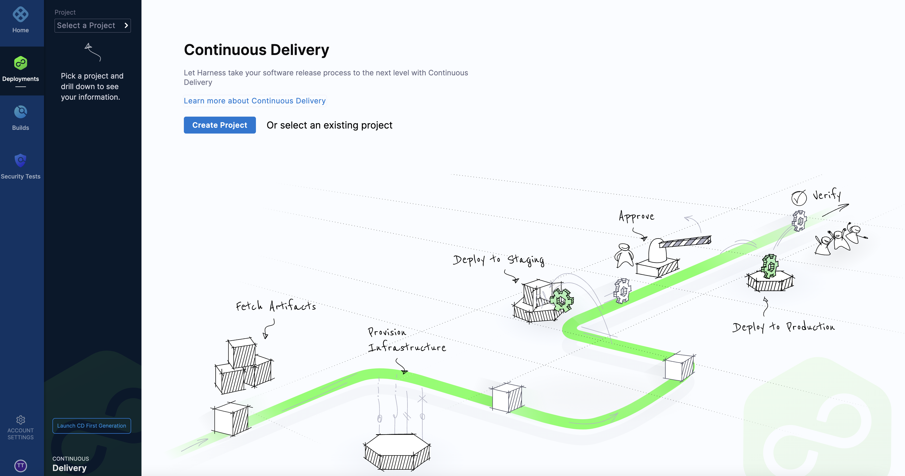

This document provides the basics on how to create a Harness account and first project. These are the first tasks that come after installing Self-Managed Enterprise Edition.

For links to information about using CI and CD pipelines, as well as the basics on Security Testing Orchestration (STO), see the last section of this documentation.

### Create your Harness account

You create your Harness account the first time you use Harness Self-Managed Enterprise Edition. You are automatically assigned the Harness user role, **Account Admin**.

**To create your Harness account**

1. On the Harness **Sign up** page, enter your email address and a secure password.

2. Click **Sign up**.

   After your account is created, you arrive at the **Continuous Delivery** start page.
   
   

### Create your first project

It takes time to learn how to create complex CI/CD pipelines. You can start with opening a project and inviting collaborators. 

**To create a project**

1. From the **Continuous Delivery** start page, click **Create Project**.

   

2. In **Invite Collaborators**, type of the names of the collaborators you want to invite.

    

3. Enter the project name, and optionally enter a description and tags for your project.

   

4. Click **Setup Later**.

### Next steps

To get started with creating pipelines and Helm-based installs in Harness Self-Managed Enterprise Edition, see [Harness Docs](https://docs.harness.io/):

* For Harness CI, see [CI Pipeline Quickstart](../../continuous-integration/ci-quickstarts/ci-pipeline-quickstart.md).
* For Harness CD, see [CD Pipeline Basics](https://docs.harness.io/article/cqgeblt4uh-cd-pipeline-basics).
* For Harness STO, see [Security Testing Orchestration Basics (Public Preview)](../../security-testing-orchestration/onboard-sto/10-security-testing-orchestration-basics.md).

