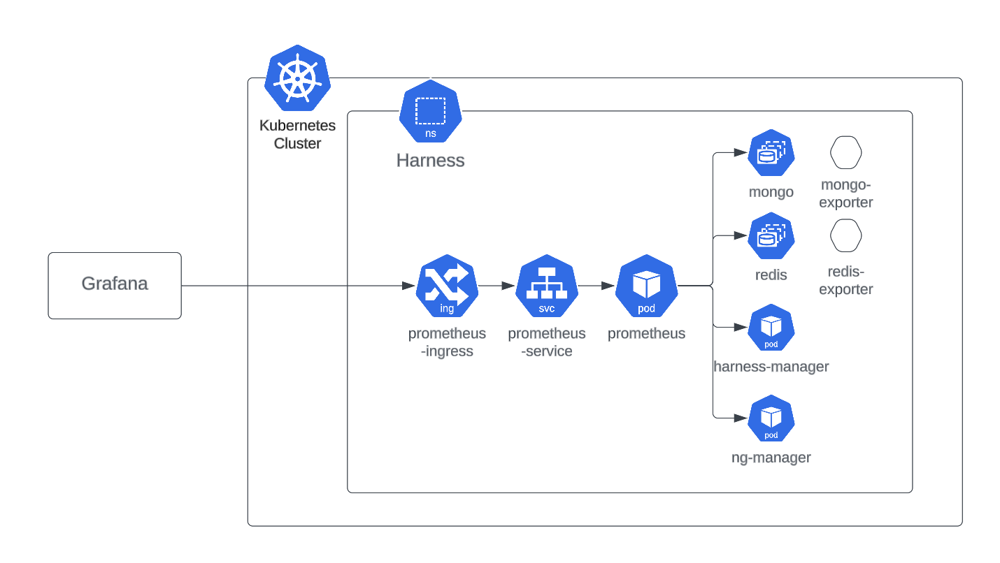
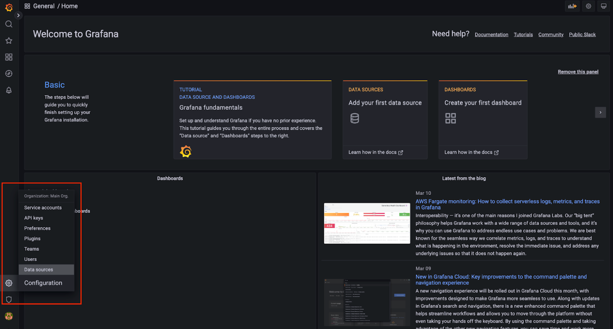

```mdx-code-block
import Tabs from '@theme/Tabs';
import TabItem from '@theme/TabItem';
```

You can monitor the infrastructure components of your Harness Self-Managed Enterprise Edition installation by bringing your own open-source monitoring system, such as Prometheus, and integrating with observability tools, such as Grafana.

Harness Self-Managed Enterprise Edition monitoring options enable you to view metrics and dashboards and set up an alerting system for your specific configuration. To demonstrate how you can monitor database applications, like MongoDB, Postgres, or Redis, for the Harness Self-Managed Enterprise Edition, this topic describes how you can use a Prometheus server installed in the same cluster as your Harness services.

## Requirements

This example setup requires:

- An endpoint in your microservice from which Prometheus can scrape metrics, for example `ng-manager:8889/metrics`.

- A Prometheus installation in the same cluster as your Harness Self-Managed Enterprise Edition installation.

- An external Prometheus configuration or a Grafana configuration using a Prometheus endpoint exposed by an ingress rule.

<figure>



<figcaption>Figure 1: Example monitoring setup server inside Harness services.</figcaption>

</figure>

## Set up Prometheus in-cluster

To set up Prometheus in-cluster, do the following:

1. Install your Prometheus server using a Prometheus operator in the same cluster as your Harness services and databases.

2. Set up the environment so that prometheus is able to scrape all these endpoints within the cluster.

3. Use the Bitnami chart with following override file.

   ```yaml
     prometheus:
      additionalScrapeConfigs:
       enabled: true
       type: internal
       internal:
         jobList:
         - job_name: 'kubernetes-pods'
           scrape_interval: 30s
           kubernetes_sd_configs:
           - role: pod
           relabel_configs:
           - source_labels: [__meta_kubernetes_pod_annotation_prometheus_io_scrape]
             action: keep
             regex: true
           - source_labels: [__meta_kubernetes_pod_annotation_prometheus_io_path]
             action: replace
             target_label: __metrics_path__
             regex: (.+)
           - source_labels: [__address__, __meta_kubernetes_pod_annotation_prometheus_io_port]
             action: replace
             regex: ([^:]+)(?::\d+)?;(\d+)
             replacement: $1:$2
             target_label: __address__
           - action: labelmap
             regex: __meta_kubernetes_pod_label_(.+)
           - source_labels: [__meta_kubernetes_namespace]
             action: replace
             target_label: kubernetes_namespace
           - source_labels: [__meta_kubernetes_pod_name]
             action: replace
             target_label: kubernetes_pod_name
   ```

   :::info note
   Providing these configurations in the `config.yaml` file of a Prometheus server enables Prometheus to scrape all available endpoints.
   :::

4. Run the following to install the Prometheus chart.

   ```
   helm install prometheus oci://registry-1.docker.io/bitnamicharts/kube-prometheus -f override.yaml
   ```

## Grafana setup options

In a production environment, you can use a central Grafana setup to visualize metrics from multiple Prometheus endpoints. Depending on your requirements, you may want to monitor multiple projects or environments. For example, you may have your production environment in one cluster and your development environment in a second cluster, and you want to monitor both environments.

To expose in-cluster Prometheus metrics to an external instance of Grafana, set up your ingress or VirtualService.

```mdx-code-block
<Tabs>
  <TabItem value="nginx ingress controller" default>
```

To use an nginx ingress controller, create an ingress rule for Prometheus.

   ```yaml
      apiVersion: networking.k8s.io/v1
         kind: Ingress
         metadata:
           name: prometheus
           namespace: <Namespace>
         spec:
           ingressClassName: harness
           rules:
            - http:
               paths:
                - path: /prometheus(/|$)(.*)
                  pathType: ImplementationSpecific
                  backend:
                    service:
                      name: <prometheus-service-name>
                      port:
                        number: 9090
   ```

```mdx-code-block
  </TabItem>
  <TabItem value="Istio">
```

To use Istio, create a VirtualService for Prometheus.

   ```yaml
      apiVersion: networking.istio.io/v1alpha3
      kind: VirtualService
      metadata:
        name: prometheus-virtualservice
        namespace: harness
      spec:
        gateways:
          - istio-test/public
        hosts:
          - istio.test.com
        http:
          - match:
             - uri:
                prefix: /prometheus/
             - uri:
                prefix: /prometheus
            name: prometheus
            rewrite:
              uri: /
            route:
              - destination:
                  host: <prometheus-service-name>
                  port:
                    number: 9090
   ```

```mdx-code-block
  </TabItem>
</Tabs>
```

## Required overrides

Use the following overrides when you install or upgrade your Harness Helm charts. You can add the `monitoring.yaml` file from the Helm charts repo to enable the metrics of all databases and Harness services, or you can enable metrics for each service.

:::info note
For this example, we use the Prometheus operator packaged by Bitnami as an external Prometheus setup.
:::

```yaml
platform:
  mongodb:
    metrics:
      enabled: true
    podAnnotations:
      prometheus.io/path: /metrics
      prometheus.io/port: '9216'
      prometheus.io/scrape: 'true'
  redis:
    metrics:
      enabled: true
    podAnnotations:
      prometheus.io/path: /metrics
      prometheus.io/port: '9121'
      prometheus.io/scrape: 'true'
  timescaledb:
    prometheus:
      enabled: true
    podAnnotations:
      prometheus.io/path: /metrics
      prometheus.io/port: '9187'
      prometheus.io/scrape: 'true'
infra:
  postgresql:
    metrics:
      enabled: true
    podAnnotations:
      prometheus.io/path: /metrics
      prometheus.io/port: '9187'
      prometheus.io/scrape: 'true'
global:
  monitoring:
    enabled: true
    port: 8889
    path: /metrics
```

## View metrics on the Grafana dashboard

To visualize metrics from various sources, you can import Grafana dashboards.

Follow the below steps on your Kubernetes cluster to deploy Grafana:

1.  Install Grafana using the Helm chart.

  ```
  helm repo add grafana https://grafana.github.io/helm-charts
  helm repo update
  helm install grafana grafana/grafana -n <Namespace>
  ```

2. Install a Bitnami packaged Grafana operator. For instructions, go to [Install the Operator](https://grafana.com/docs/agent/latest/operator/getting-started/) in the Grafana documentation.

## Open the Grafana dashboard

1. Decode the secret. The login username is `admin` by default.
2. Execute the port-forward command to host Grafana locally on port 3000.

  ```
  kubectl get secret --namespace <Namespace> grafana -o jsonpath="{.data.admin-password}" | base64 --decode ; echo

  export POD_NAME=$(kubectl get pods --namespace <Namespace> -l "app.kubernetes.io/name=grafana,app.kubernetes.io/instance=grafana" -o jsonpath="{.items[0].metadata.name}")

  kubectl --namespace default port-forward $POD_NAME 3000
  ```

3. Sign in to the Grafana dashboard home page.

4. Set Prometheus as the datasource:
  
  Go to settings, select **Data sources**. Then, select **Add data source**. Select **Prometheus**.

  
 
5. Configure the URL settings to connect to your locally-hosted Prometheus setup, with the locally-hosted Grafana instance. 

6. Deploy prometheus and grafana on the same cluster, and use kubeDNS resolution. For example, if you want to connect pod A to pod B, on pod A, the hostname of B should be:

  `http://serviceNameOfPodB.<namespaceOfPodB>.svc.cluster.local:<port>`

  This requires the following information: 

    - Service name of where prometheus is hosted. 
    - Namespace in which prometheus is hosted. 
    - Port at  which prometheus is hosted.

  This makes our present URL look like: 

  `http://my-release-kube-prometheus-prometheus.default.svc.cluster.local:9090/`

  :::caution
  The final URL should be similar to the above URL, according to your system specifications. Any extra space or character in the URL field causes the data source testing to fail. 
  :::

7. Configure the **Prometheus type** and **Prometheus version** fields.

8. Select **Save & test**. A confirmation that the data source is working displays. 

### Add a Grafana dashboard

Now you can add a dashboard to view metrics via query.

- To add a dashboard, go to Go to **Dashboards** and then select **New Dashboard** and **Add a new panel**. 

Here are some sample open source dashboards:

- [MongoDB](https://github.com/dcu/mongodb_exporter/blob/master/grafana_dashboards/dashboard.json)

- [Redis](https://github.com/oliver006/redis_exporter/blob/master/contrib/grafana_prometheus_redis_dashboard.json)

- [Timescale/Postgres](https://github.com/prometheus-community/postgres_exporter/blob/master/postgres_mixin/dashboards/postgres-overview.json)

## Use a server installed in the same cluster as Harness services

In this example, the Prometheus server is installed in the same cluster as your Harness services. You can monitor your services with Grafana installed in the same cluster or outside the cluster, with Prometheus configured as the data source. 
